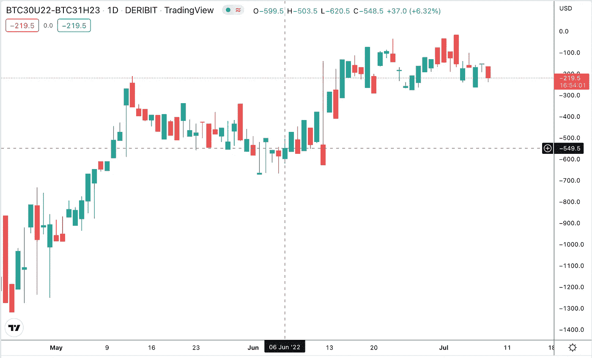
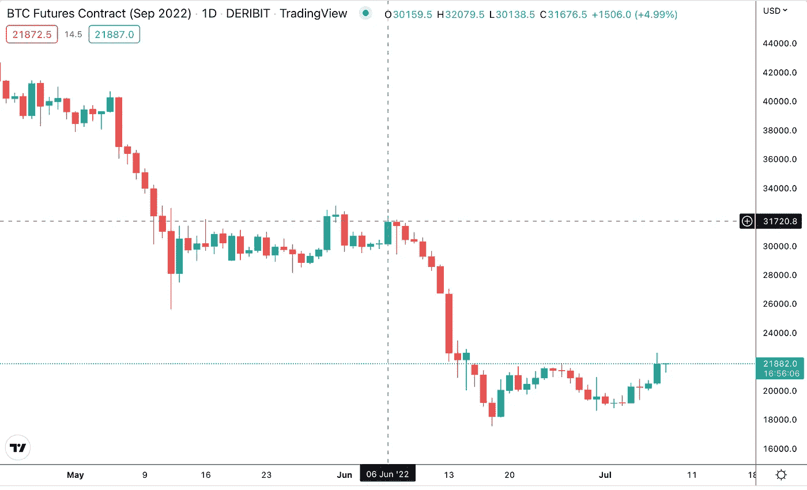
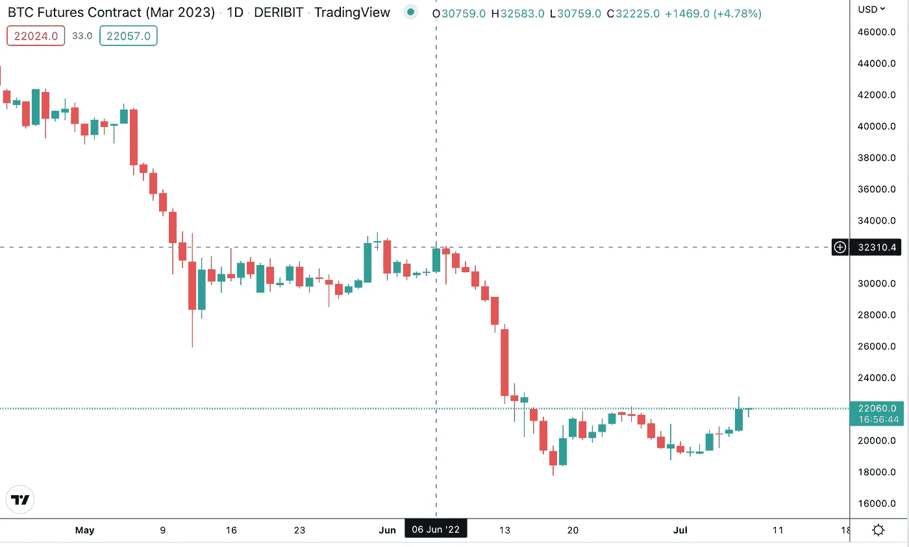
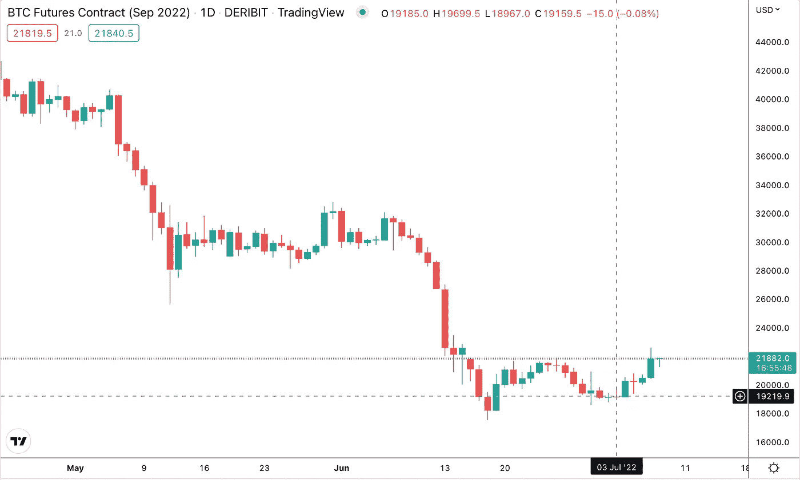
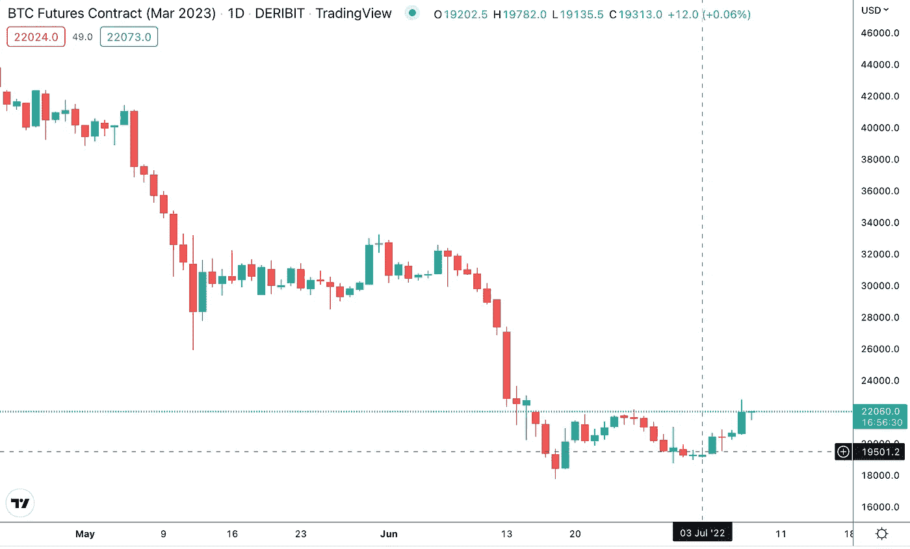

# 期货差价交易

> 原文：<https://medium.com/coinmonks/futures-spread-trading-e3aeabda52ff?source=collection_archive---------7----------------------->

# 那么什么是期货价差交易呢？

Cryptoccurrency 期货价差交易是一种市场中性策略，投资者寻求从价格差异的变化中获利，这种价格差异是指两个头寸——空头和多头——在不同交割日期的同一资产的两个期货合约，或在相同交割日期价格相关的不同资产的两个期货合约之间的**价差**价格。

# 什么是传播？

价差是两个期货合约之间的价格差**。这种差异不是恒定的，它取决于几个因素(我们稍后将回到这些因素)**

期货合约的价格等于现货价格加上在期货合约到期日之前持有资产的成本。持有成本是指持有资产直到期货合约到期的成本。

每个期货合同的价格由市场基于市场参与者对到期日资产的未来价格的预期/计算以及持有资产直到到期日的估计成本来形成。由于每份期货合约在不同的市场上交易，流动性不同，每份合约的价格波动可能不同，导致合约价格之间的差异发生变化。

An example of the spread price changing through the time

# 差价交易周期

在现货价格交易中，当我们希望资产价格上涨时，我们买入资产，当价格上涨时，我们卖出资产。如果我们认为资产价格会下跌，我们会卖出，并在价格下跌时回购。差价交易也是一样——当差价价格低时，我们买入差价，当差价价格高时，我们卖出差价。或者，如果我们认为当前价差很高，而且我们认为它将会下跌，我们卖出价差，并在价格下跌时买回价差。

# 价差的类型

价差可分为**市场内**价差和**市场间**价差。

**场内价差**，也称为**日历价差**，涉及买入交割日期在一个月内的期货合约，同时卖出交割日期在不同月份的同一标的资产的合约。

**市场间价差**涉及购买资产 A 的期货合约和出售另一资产 B 的期货合约，交割日期相同，假设资产 A 和资产 B 的价格相关。

# 日历跨页

日历差价交易者主要关注两个合约月之间关系的变化。这一战略的目标是利用这些变化。在大多数情况下，价差的一部分会亏损，但另一部分会盈利。如果日历差价成功，盈利部分的收益将超过亏损部分的损失。

# 期货合约交付日期

交割日，也称为结算日或起息日，是指投资合同必须完成——结算的具体日期。大多数加密货币交易所遵循“传统金融”世界中已知的模式——它们提供基于交付日期频率的季度期货合约——3 月、6 月、9 月和 12 月，然而一些交易所提供更多的交付日期(即德里比特)

## 示例 1

## 让我们以比特币期货的日历价差为例。我们有两份直接合同

*   BTC-美元-30 sep 23-比特币期货合约，交割日期为 2022 年 9 月 30 日
*   BTC-美元-6 月 30 日 23-比特币期货合约，交割日期为 2022 年 6 月 30 日

**购买日历差价**:2012 年 9 月 30 日 BTC-美元-BTC-美元-6 月 30 日-意味着 2012 年 9 月 22 日在 BTC-美元-30 日建立多头头寸，2013 年 6 月 30 日在 BTC-美元建立空头头寸

**卖出日历差价**:2012 年 9 月 30 日 BTC-美元-BTC-美元-6 月 30 日-意味着在 2012 年 9 月 22 日做空 BTC-美元-30 日，在 2013 年 6 月 30 日做多 BTC-美元

# 将风险降至最低

通过在 2012 年 9 月 22 日 BTC 对美元的多头头寸和 2013 年 6 月 30 日 BTC 对美元的空头头寸，我们受到比特币价格波动的影响要小得多！人们可以说——我们不受比特币价格波动的影响，尽管这并不完全正确。万一比特币价格上涨，两个合约都会跟着上涨。我们的 BTC-美元-30SEP22 多头将增长到足以弥补我们 6 月 23 日的 BTC-美元-30 空头的损失。反方向也一样——万一比特币下跌——我们空头头寸的利润会补偿我们多头头寸的损失。

在美元保证金期货的情况下，你根本不需要持有比特币——你没有风险，你只是把你的美元放在你的保证金账户上！

# 杠杆和保证金

期货合约通常是杠杆化的，加密货币交易所的杠杆从 20 到甚至 100 不等。杠杆等于 100，比特币价格 20000 美元，你只需要 200 美元就可以买入或卖空一个比特币。即使单个差价交易周期(买入差价和卖出差价)提供的利润比直接交易者预期的要少，但是有了杠杆，你可以将它放大很多倍。

如果价差的两个部分在同一个交易所，一些交易所会检测到日历价差并进一步降低保证金要求——这将进一步提高你的**资本效率**。

# 交易费用

执行差价交易有两种方法:用**市价单**和用**限价单**。

用**市价单**执行价差交易:执行单笔价差交易时——即。购买差价，我们实际上是在交易所进行两笔交易——两笔市价单。单笔市价单的平均手续费为成交金额的 0.05%。如果我们交易 1 个价值 20000 美元的比特币，开立一个市价单的直接合约的费用是 10 美元。购买差价的费用是 20 美元。沿着这条街往前走——出售差价要再花 20 美元。全价差交易周期的总费用为 40 美元。人们很容易发现，为了使差价交易周期有利可图，差价价格的变化必须高于 40 美元。

用**限价单**执行价差交易:这种方法要复杂得多，值得另文讨论。在整个周期中，我们执行两个限价单和两个市价单。限价订单的费用通常为 0。这使得全价差交易周期的总费用降至 20 美元。

## 示例 2 —正利润差价交易

在本例中，我们将分析日历价差的理论交易:BTC-美元-30 sep 22-BTC-美元-31MAR23。我们将分析单个直接合约的价格以及价差的价格。这种差价交易的完整周期将接近 30 天，从 2022 年 6 月 6 日开始，到 2022 年 7 月 3 日结束。对于这两天，我们将假设价格为每日蜡烛线的收盘价。同样的想法可以在更短的时间内实现。让我们来看看我们的直接合约的价格

**BTC-美元-2022 年 6 月 6 日 22 月 30 日:**

**BTC-USD-30SEP22 on 6th June 2022**

**2022 年 6 月 6 日 BTC-美元-31 马克 3:**

**BTC-USD-31MAR3 on 6th June 2022**

总而言之，6 月 6 日我们有:

*   BTC-美元-30SEP22，价格 31676 美元
*   BTC-美元-31 月 23 日，价格为 32225 美元

6 月 6 日 BTC-美元-30 sep 22-BTC-美元-31MAR23 的价差为 **-549** 美元。不要担心负数——这是价差的正常现象。重要的是——它需要成长；).

让我们稍微深入一下细节——我们需要开立两个头寸，并且我们需要为开立每个头寸支付一笔费用。在这种情况下，我们将使用市场订单来开始和结束直接合约。假设**费用等于市价订单的 0.05%**。让我们算一下。我们将开设两个头寸，每个头寸的规模为 **1 比特币**

*   **买断 1(Long):+1 BTC-美元-30SEP22** :价格 31676 美元- >由此产生的费用:15.83 美元
*   直接 2(短):-1 BTC-美元-31 马克 23 :价格 32225 美元- >由此产生的费用:16.11 美元

让我们检查一下我们的保证金要求——假设杠杆率为 50 倍，我们每个头寸大约需要 640 美元。我们总共需要 1280 美元的保证金。

现在让我们把时间稍微移至 7 月 3 日。

【2022 年 7 月 3 日 2022 BTC-USD-30 sep 22:

**2022BTC-USD-30SEP22 on 3rd July 2022**

**BTC-美元-2022 年 7 月 3 日 31 月 3 日:**

**BTC-USD-31MAR3 on 3rd July 2022**

总而言之，7 月 3 日我们有:

*   BTC-美元-22 年 9 月 30 日，价格为 19159 美元
*   BTC-美元-3 月 23 日，价格为 19313 美元

6 月 6 日 BTC-美元-30 sep 22-BTC-美元-31MAR23 的价差为 **-154** 美元

假设我们已经在 7 月 3 日平仓，让我们看看费用是多少:

*   **买断 1(短):-1 BTC-美元-30SEP22** :价格 19159 美元- >由此产生的费用:9.57 美元
*   **买断 2(长型):+1 BTC-美元-31 马克 23** :价格 19313 美元- >由此产生的费用:9.65 美元

现在让我们来计算我们的 PnL(利润和损失)。让我们来看看我们在个人直接合约上的个人头寸发生了什么变化:

*   **+1 BTC-美元-30SEP22** ，开盘价 31676 美元，收盘价 19159 美元- >结果 PnL: -12517 美元
*   **-1 BTC-美元-31MAR23** ，报价 32225 美元，收盘价 19313 美元- >结果 PnL: +12912 美元

PnL 等于 395 美元。总费用为 51.16 美元。扣除费用后，净 PnL 为 343.84 美元。如果我们想要计算我们的 ROI(投资回报)，我们需要将我们的 PnL 除以投入的资金，让我们开始吧:

**PnL = 343.84 美元，投入资金= 1280 美元，投资回报率= 26.86%**—如果我们考虑到我们没有暴露于比特币价格风险，这还不算太坏。

**注意事项**1。在这个分析中，隐藏的陷阱是保证金——由于直接合约价格变化如此之大，如果你在两个不同的交易所开仓，你必须有更大的保证金来弥补你的 BTC-美元-30SEP22 多头合约的价格变化。

2.我使用的图表来自拥有比特币保证金期货的 Deribit 这意味着保证金必须以比特币持有，并且在保证金规模(最初为 1280 美元)以内，我们将面临拥有比特币的基本风险。但是这个例子也可以在任何其他有美元保证金期货的交易所执行。币安)

# bit spreader——首个加密期货差价交易平台

【http://www.bitspreader.com】

如果你对这个交易策略感兴趣，我鼓励你去看看 BitSpreader.com。BitSpreader.com[为用户提供高效期货差价交易所需的所有工具。从 BitSpreader 交易终端，您将能够毫无延迟地执行跨交易所差价交易，BitSpreader 将为您提供对您的头寸、敞口和 PnL 的跟踪。](http://www.bitspreader.com)

> 交易新手？试试[密码交易机器人](/coinmonks/crypto-trading-bot-c2ffce8acb2a)或[复制交易](/coinmonks/top-10-crypto-copy-trading-platforms-for-beginners-d0c37c7d698c)