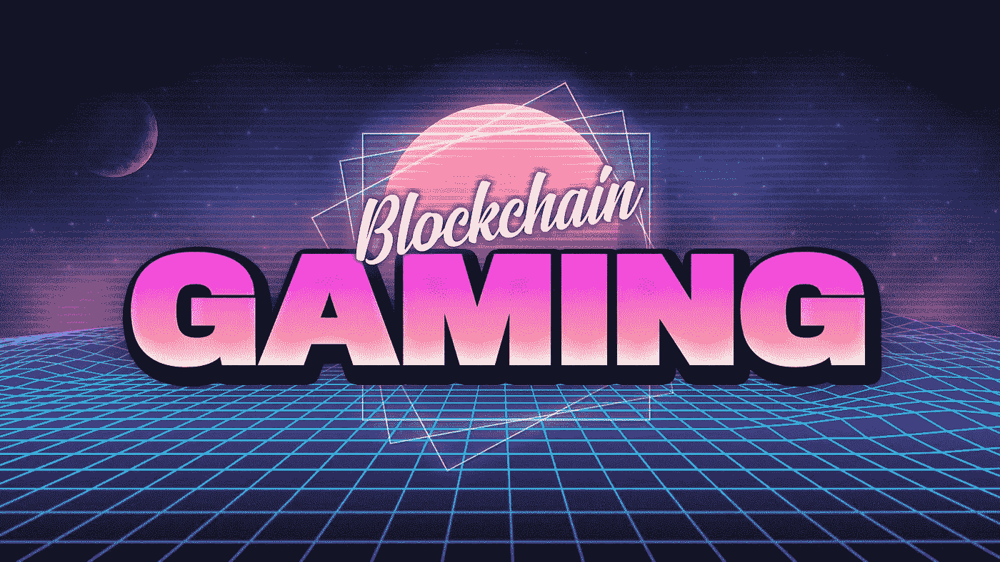
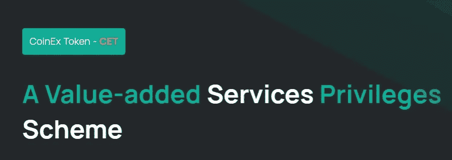
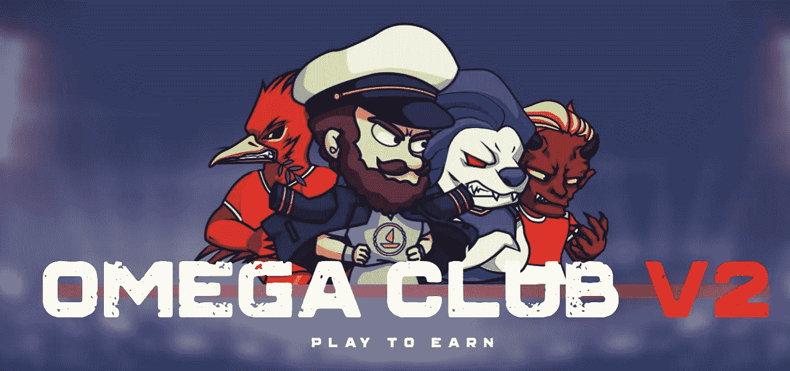
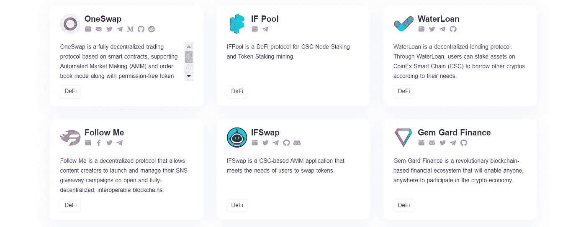
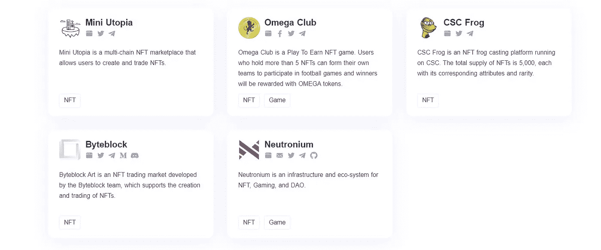

# 未来派游戏

> 原文：<https://medium.com/coinmonks/futuristic-gaming-7fd85ff70395?source=collection_archive---------58----------------------->

# 游戏的未来:CSC 上的其他 DApps

游戏是一个受欢迎的领域，拥有大量的粉丝。这是一个世界中的世界。你可以感受到这里全新的环境和氛围。喜欢游戏的人总是寻找新的方法来使他们的游戏体验更加真实。嗯，我们都知道游戏是一个广阔的领域，人们在虚拟世界中互动，相互竞争或一起玩。为了使整个过程安全可靠，必须有一个系统来确保这一点。嗯，这里区块链可能会进入画面。让我们分析一下区块链游戏将如何改变游戏世界。

1.  **平行游戏世界**——区块链使游戏玩家能够创建他们的角色，并在不同的游戏中使用他们，这些游戏具有相互交织的环境。在这些信息的帮助下，我们可以找出游戏玩家的偏好，并创造更多定制的体验。

**2。增加游戏物品的价值**——在增加虚拟游戏的价值方面，区块链可以在以下几个方面提供帮助:

*   你可以在游戏内外使用虚拟产品。它进一步提高了虚拟产品的价值。
*   在区块链的帮助下，我们可以建立一个平台，允许玩家将这些产品兑换成美元等法定货币。
*   它将创建一个网络，促进虚拟物品的共享、交易和赠送，从而提高社会价值。

**3。安全存储-** 由于区块链的所有交易或数据在该功能与游戏合并时都使用加密技术进行加密，因此它将确保游戏产品的安全存储。密码术确保信息或数据是不可改变的，不可更改的，并且不能被黑客攻击，使得一切都不可渗透。简而言之，这意味着虚拟物品的信息对用户来说是安全的。

**4。节省支付处理费用–**我们都知道，分散支付网关允许用户在最短的时间内进行支付，并且只收取用户使用信用卡支付的一小部分处理费用。对于开发者来说，他们可以节省商家订阅费和支付网关。

使用 CoinEx 智能链分散式应用进行游戏——这是一场远远超出新图形和游戏机制的革命。

这是开发者和玩家之间基本关系的一次革命。

**DAPP 游戏的诞生**

《英雄之城》是一款大型多人在线角色扮演游戏，由 Cryptic Studios 开发，于 2004 年推出，并于 2012 年关闭，当时该游戏的发行商终止了其开发团队。

因为 Cryptic 不允许用户内容——无论是获得的还是生成的——存在于游戏生态系统之外，当游戏关闭时，玩家就无法访问他们花费数小时培养的英雄和物品。

由于 DApp 游戏存在于一个去中心化的对等网络上，任何游戏中的物品都直接归玩家所有，而非开发者。

DApp 游戏开发商发布他们的应用程序，并将其更新推送到 CSC 区块链，但他们并不像 Cryptic Studios 拥有《英雄之城》那样拥有应用程序或其资产。

## **DAPPS 开发商和玩家的根本关系**

分散式应用是技术领域的新生事物，它们已经对我们的生活方式产生了影响。**像比特币和 CET 这样的加密货币可以为整个经济提供动力:据估计，2017 年，有 290 万到 580 万独立用户拥有加密货币钱包**。

从大生意到日常交易，区块链 dApps 准备改变我们与技术互动的方式，世界已经开始整合这些变化。

DApps 也有可能颠覆另一个市场——游戏和 CoinEx 智能链处于前线。

有史以来第一次，玩家可以真正拥有他们的游戏世界。DApps 让玩家代理他们投入时间和精力赚取的游戏内物品，而不是将完全控制权交给游戏开发商和发行商。

这是一种进化，我们可以看到玩家和消费者对数字商品所有权的看法发生了根本性的变化。

当传统游戏的各个方面与 DApp 游戏相结合时，结果是游戏性和经济性融合在一起的独特混合体。

游戏逻辑，图形，甚至玩家互动都可以被移出链外，而库存，市场和工艺系统仍然在区块链上。这通过允许游戏开发者和玩家之间的共生关系，在区块链和中央服务器之间创建了协同作用。

*   **CoinEx 智能链— CSC**

CSC 是一个新时代的高度分散的高效公共链，基于 PoS 共识协议 CSC 为开发者提供了一个高效、低成本的链上环境来运行分散的智能合约应用(DApps)和存储数字资产。换句话说，CSC 使构建您自己的分散式应用程序变得容易。

*   **CET**

作为 CoinEx 智能链循环和充当 gas 的内置令牌，CET 基于 POS 共识协议，去中心化且节能，可以轻松构建自己的去中心化应用。

CSC 上的 CET 运行方式与 ETH 在以太坊上的运行方式相同，其主要功能有:

1.  作为对验证者的奖励。

2.向 CSC 支付传输和合同调用的天然气费用

3.支付在 CSC 上部署智能合同的交易费用

4.委托给选定的验证者

## **在 COINEX 智能链(CSC)上玩游戏**

*   **欧米茄俱乐部**

欧米茄俱乐部是一种风格类似斯诺克的游戏。该游戏有 18 个关卡，目标是将球尽可能多地移入对手的球门。玩家将根据他们的表现获得欧米茄代币奖励。这个游戏也利用了 NFTs。有 20 种玩家卡(NFT)，每一种都有不同的属性和能力，用户可以购买玩家卡来获得更好的技能。

**开发者更新**

Dapp 游戏还处于起步阶段。就像 Web 2.0 的出现一样，dApps 的潜力已经展现给开发者一个巨大的机会。

如果我们从像《守望先锋》这样的游戏中打开战利品盒、农场中生长茂盛的庄稼、魔兽世界中获得的武器中获得乐趣，并将玩家所有权加入其中，会怎么样？

dApp games 不会将这些数字物品借给玩家，直到游戏最终消失，而是将所有权和代理权交给玩家，让他们可以用他们支付的物品做他们喜欢的事情。

dApp 游戏如此年轻的事实为开发者和玩家提供了一个新的实验平台和像 CoinEx Smart Chain 这样的公共链。CoinEx 链生态系统正在快速成长。在 CoinEx 基金会的帮助下，未来我们将与更多开发者进行深度合作，旨在共同打造更加多元化、更加实用的应用。

## 探索 CSC 上的其他 DApps

不仅仅是游戏，CSC 的生态系统中还有各种其他 DApps，在 web3.0 中有广泛的使用范围

*   DeFi — DeFi(或“分散金融”)是区块链公共金融服务的总称，如 CSC。有了 DeFi，你可以做银行支持的大部分事情——赚取利息、借款、贷款、购买保险、交易衍生品、交易资产等等——但它更快，不需要文书工作或第三方。与一般的加密一样，DeFi 是全球性的、点对点的(意味着直接在两个人之间进行，而不是通过一个中央系统进行路由)，匿名的，并且对所有人开放。

CSC 在其生态系统中有各种基于 DeFi 的 DApps。这些 DApps 如果使用得当，可以给用户带来有利的好处。

*   **NFT——不可替代的代币**是一种数字资产，代表现实世界中的物品，如艺术、音乐、游戏中的物品和视频。它们经常与加密货币一起在网上买卖，并且它们通常用与许多加密货币相同的底层软件进行编码。

通过 CSC 上的高级 DApps，用户可以轻松铸造、交易和安全存储他们的 NFT。CSC 的区块链技术和 NFTs 为艺术家和内容创作者提供了一个独特的机会来赚钱。

*   工具——区块链是平台上发展最快的技能，区块链技术是一个鼓舞人心的空间，具有巨大的创新潜力。然而，在区块链领域找到一份工作并不容易。你必须首先获得正确的技能，最重要的是，学会使用区块链开发所需的不同区块链工具。

CSC 上的区块链工具不仅简化了区块链开发的过程，而且有助于加强您的领域知识。CSC 提供不同的 DApps 和工具，轻松支持开发人员进行开发，并帮助轻松浏览区块链生态系统。

区块链平台相对较新，因此，如果你一直好奇尝试新工具并获得新的区块链技能，你肯定会在区块链领域有一个有前途的职业生涯。

CSC 不仅支持在 **CSC 的开发，还保证为优质项目提供资金、技术、营销和其他资源的多维度支持。公链为元宇宙生态设立了数百万美元支持计划和 500 万美元专项资金支持**。除了为其生态系统中的优秀项目提供资金支持，CSC 还为项目团队提供技术支持和营销资源。例如，有前途的 CSC 项目可以优先获得 CoinEx 上的令牌列表。

如果你对从头开始构建区块链应用程序感兴趣，构建智能合同和链码，[点击这里查看 CSC。](https://www.coinex.org/?lang=en_US)

要获得更多资源，

*   加入 CSC 的[电报组](https://t.me/CoinExChain)。
*   关注 CSC 的 [Twitter](https://twitter.com/CoinEx_CSC) 账号。
*   加入 CSC 的[不和](https://discord.gg/5uBGRW9qSp)群。

关注我的 [Twitter](https://twitter.com/kryptmystro) 获取更多更新。

> [Learn 分发的内容。Block6.tech](https://learn.block6.tech)
> 
> 👉[电报](https://t.me/block6_tech) —新鲜的想法
> 
> 👉[推特](https://twitter.com/block6_tech) —最新文章
> 
> 👉 [LinkTr.ee](https://linktr.ee/block6)
> 
> 交易新手？试试[加密交易机器人](/coinmonks/crypto-trading-bot-c2ffce8acb2a)或者[复制交易](/coinmonks/top-10-crypto-copy-trading-platforms-for-beginners-d0c37c7d698c)