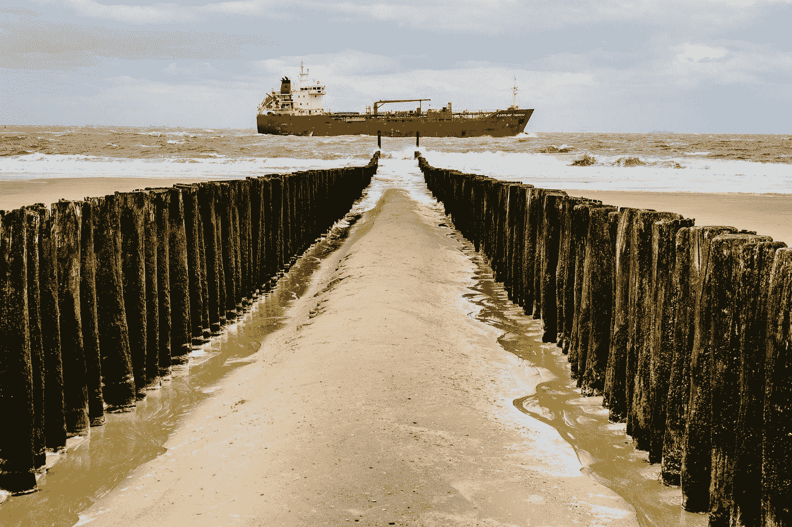

# G7 和俄罗斯:全球液化天然气供应和油价正处于边缘

> 原文：<https://medium.com/coinmonks/g7-russia-global-lng-supplies-and-oil-prices-are-on-the-brink-23f72586c816?source=collection_archive---------11----------------------->

Photo by [Alexander Schimmeck](https://unsplash.com/@alschim?utm_source=medium&utm_medium=referral) on [Unsplash](https://unsplash.com?utm_source=medium&utm_medium=referral)

**液化天然气成为 2022 年七国集团(G7)峰会能源议题的焦点。**

1.  **G7[T5 拒绝了俄罗斯要求各国用俄罗斯卢布支付天然气出口的要求，此前俄罗斯总统弗拉基米尔·普京宣布“不友好”的国家今后应该尊重俄罗斯的银行法规。通过威胁将天然气合同转换为卢布，欧洲公用事业公司对 2022 年冬季到来之前出现的能源紧急情况感到厌倦。](https://www.pbs.org/newshour/world/g7-rejects-russias-demand-to-pay-for-natural-gas-exports-in-rubles)**
2.  **七国集团不仅同意对俄罗斯石油进口设置价格上限的计划，七国集团还制定了联合声明，以反映气候变化政策和当前对全球能源危机的担忧。值得注意的是，联合声明呼吁增加液化天然气和核能的生产，同时坚持到 2035 年实现“完全或主要脱碳”的全球经济。尽管 G7 继续抨击煤炭生产，但他们指出，液化天然气需要投资来满足全球能源需求。**

> **交易新手？尝试[加密交易机器人](/coinmonks/crypto-trading-bot-c2ffce8acb2a)或[复制交易](/coinmonks/top-10-crypto-copy-trading-platforms-for-beginners-d0c37c7d698c)**

**然而，分析人士认为，欧盟在应对这些挑战方面做得还不够。为*油价* [**撰写的文章伊琳娜·斯拉夫**](https://oilprice.com/Energy/Energy-General/Natural-Gas-Prices-To-Rally-As-G7-Changes-Its-Tune-On-LNG-Investment.html) 指出，法国和德国的工业在制定液化天然气发展计划和生产能力(如接收站)方面已经为时过晚，而环境法规也可能会阻碍加拿大即将开展的液化天然气项目。**

**此外，****油价可能会因俄罗斯入侵乌克兰以及对俄罗斯能源部门的持续制裁而恢复在较高水平。******

******如果欧佩克+就生产和供应目标达成协议，在整体价格上做出改变可能为时已晚，因为美国人和欧洲人将继续为更高的价格买单。******

******这是很多人容易忽略的一课。******

******俄罗斯接管库页岛 2 号项目 的消息，对液化天然气生产的影响将对全球供应产生影响；因此，俄罗斯再次大规模中断能源供应——俄罗斯已经中断了哈萨克斯坦 [**里海管道财团**](/@44jmonroe91/how-russia-disrupted-the-caspian-pipeline-consortium-cpc-and-global-supplies-in-2022-9fc1799eca6e) 的石油供应。******

****事实上，俄罗斯以不可想象的方式扰乱了能源和大宗商品，从而将 [**全球粮食安全**](/@44jmonroe91/while-g7-tackles-global-food-security-putin-flexes-at-st-petersburg-d09b4ea50c65) 的讨论带到了 G7 峰会。****

****由于俄乌冲突，能源和商品是全球经济最大的担忧，除其他因素外，德国正在准备更多的**，美国正在准备更多的采矿项目，如亚利桑那州的 [**铜世界综合体**](https://www.mining.com/hudbay-minerals-needs-1-3bn-for-copper-world-project-in-arizona/) ，法国总统马克龙正在与罗马尼亚谈判，以恢复从奥德萨到多瑙河的旧铁路运输路线，以增加 [**粮食出口**](https://whbl.com/2022/06/17/frances-macron-sceptical-on-russia-odesa-grain-deal-sees-romania-option/)******

****所有这些经济活动都是在美国和欧洲制裁俄罗斯关键液化天然气行业的背景下发生的，例如 Novatek 的 [**北极液化天然气 2 项目**](https://www.upstreamonline.com/politics/sanctions-hit-russian-manufacturers-struggle-to-advance-countrys-lng-ambitions/2-1-1242028?utm_term=upstream) **。******

****必须指出的是，即使最大的公司都在努力在全球范围内成功实现能源转型，但随着时间的推移，通过液化天然气生产和出口天然气的承诺将继续增长。****

****随着 [**全球大宗商品超级周期**](/coinmonks/goldman-sachs-bull-market-for-battery-metals-is-over-ab3a41e29d48) 继续推动对 [**原油和**](/coinmonks/crude-oil-iron-ore-are-signaling-a-reboot-in-the-global-commodity-supercycle-2e87325a8a05) 铁矿石以及其他大宗商品的需求，人们将更加关注俄罗斯如何扩展其 [**政治议程**](/coinmonks/russia-is-flexing-its-muscles-in-south-america-and-central-asia-d9f32e63d5e6) 。****

****俄乌冲突 告诉我们，国际前景不再像以前那样不确定。七国集团团结一致，谴责俄罗斯的侵略并以策略制胜，而发展中国家则寻求与俄罗斯这个更加以能源和大宗商品为导向的经济大国进一步合作。****

****至于宏观经济，在全球大宗商品超级周期的关键时刻，弗拉基米尔·普京是否增强了杠杆作用？这将是未来全球油价和液化天然气供应的终极问题。****

********

****Photo by [Greg Rosenke](https://unsplash.com/@greg_rosenke?utm_source=medium&utm_medium=referral) on [Unsplash](https://unsplash.com?utm_source=medium&utm_medium=referral)****