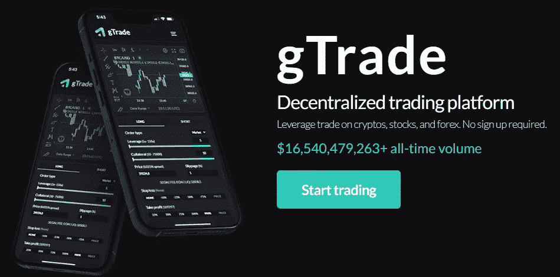

# 利得网络，杠杆交易巨兽

> 原文：<https://medium.com/coinmonks/gains-network-the-leveraged-trading-beast-6339102b035c?source=collection_archive---------0----------------------->

非常好的加密读者，在这篇文章中，我们将谈论对我来说是什么，是专注于分散杠杆交易的项目，可以主导该行业，并给其他更成熟的平台一个大惊喜。并且具有更大的体积。 [Gains Network](https://gainsnetwork.io/) 拥有实现这一目标的所有动力，正如我们将在下面看到的，它具有一些独特的功能，因此让我们深入了解一下吧！

> **什么是增益网络？**

Gains Network 是 gTrade 背后的公司，g trade 是一个建立在 Polygon(不久将在 Arbitrum)上的杠杆交易平台。
Gains 提供多种多样的可交易资产。除了主要的加密货币，该平台还支持大型美国股票，包括 AMZN、AAPL、AMD 等热门科技公司。该平台还支持主要货币对的交易。该平台支持 150 倍的加密和股票杠杆，以及高达 1000 倍的外汇杠杆。

> **是什么让增益网络与众不同？**

gTrade 的特殊之处在于，它的结构允许它在广泛的资产范围内提供大量杠杆。它通过使用合成资产系统来实现这一点，在该系统中，整个交易平台在 DAI 上运行，并获得网络的本机令牌 GNS。这意味着用户可以交易任何与 gTrade oracles 兼容的资产。此外，不需要贷款费用，因为实际上没有借入任何资产。

> **神谕如何运作**

杠杆是一种工具，它允许你用比你账户里更多的钱来交易。这是有帮助的，因为它让你从交易中赚更多的钱。然而，它也带来了更多的风险，因为价格的微小变化会让你损失很多钱。gTrade 结合使用 Chainlink 价格馈送和定制的分散式 Oracle (DON)网络，以确保协议安全性和用户安全性的可靠定价。契约从不同的 Chainlink 节点获取价格，这些节点为每个交易订单生成一个平均价格。它正在比较价格，看它们是否正确，然后一旦它有了最小数量的可接受价格，它将把它发送回 gTrade 以执行交易。

> **GNS 令牌**

In this image we can see the current metrics, which refer to both the Market Cap and the circulating supply.

gTrade 在 GNS/DAI 池中运行，除此之外，他们目前还有阿呆金库为交易提供所需的流动性，还有一个 GNS 池用于标记赌注。

these are the current APY’s at the time of writing this article

提供流动性的用户从平台收取的费用中赚取一部分。这一点很重要，因为流动性提供者赚取的回报仅来自费用，而不是来自提供流动性的平台给出的奖励。GNS 令牌为其用户积累价值的方式是当交易者失去交易时燃烧令牌，或者当交易者赢得交易时铸造令牌。

**这背后的机制如下:**

1.  为了执行交易，交易者首先将 DAI 存入 DAI 金库。然后他执行交易，例如，他以 10 倍的杠杆做多 BTC。
2.  让我们想象一下，交易正在亏损，交易者被清算。
    由于交易人已被清算，戴金库保管交易人存入的金额。
3.  这样，金库里的戴量就增加了。一旦超过特定阈值，超出的 DAI 将用于回购 GNS(从 GNS/DAI 池中)，这些令牌将被销毁。
4.  相反地，如果交易者做了一笔成功的交易，利润从戴金库中支付。

因此，GNS 的赌注是，从长远来看，交易者失去的交易将多于他们赢得的交易(如果我们看看盈利交易者与不盈利交易者的数量统计，这应该是正确的)。这将最终使 GNS 成为通货紧缩的象征。

As we can see in this DUNE panel, the trend of traders in the markets tends to be negative.

> **NFT**

该平台托管 OpenSea 上提供的一系列 NFT，为您提供一些奖励，如增加流动性基金的收益率或减少交易时的价差。

> **防鲸保护**

gTrade 有一些限制，以防止一系列大额和高利润交易轻易减少 DAI 金库中的 DAI 数量。除了对未平仓交易的数量和每项资产的未平仓权益的限制之外，还对基于金库中 DAI 数量的交易规模进行了限制。目前，没有一个单一的交易可以吸收超过 1%的总额戴在金库。目前戴金库有 1200 万，这意味着没有人能开超过 12 万的交易。

不利的一面是，这可能会限制一些交易者，如 whales，这可能会降低对 gTrade 平台的兴趣，并影响其长期增长。

> 总之，增益网络是一个采用独特模式专注于杠杆和永久交易的平台。这种方式使其能够提供比竞争对手更高的杠杆，同时收费也更低。虽然它有一些局限性，但我认为 Gains Network 是一个值得关注的项目，可以与 GMX 和 dYdX 这样的行业巨头较量。

> 交易新手？尝试[加密交易机器人](/coinmonks/crypto-trading-bot-c2ffce8acb2a)或[复制交易](/coinmonks/top-10-crypto-copy-trading-platforms-for-beginners-d0c37c7d698c)