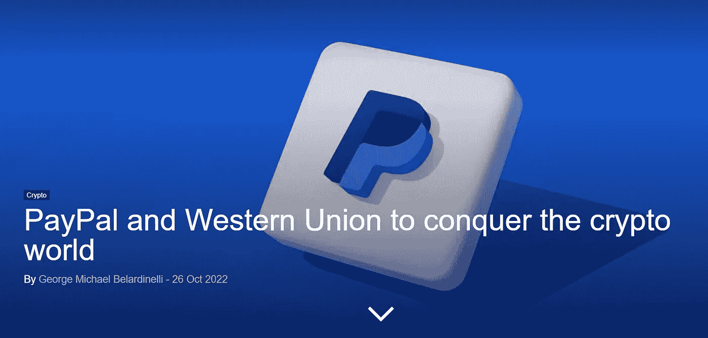

# 美国游戏改变周，DOGE +70%和 Paypal 进入加密空间

> 原文：<https://medium.com/coinmonks/game-changer-week-in-usa-doge-70-and-paypal-entering-the-crypto-space-1a6e16c5ffc2?source=collection_archive---------10----------------------->

充满重要新闻的一周！
读书快乐！

 [## Dogecoin 价格预测——马斯克收购 Twitter 能让 DOGE 涨到 1 美元吗？

### 在埃隆马斯克引发的反弹中，Dogecoin 价格继续回报投资者。据周五报道，最大的迷因…

cryptonews.com](https://cryptonews.com/news/dogecoin-price-prediction-can-musk-twitter-takeover-pump-doge-to-100.htm) 

DOGE pumping 比之前的底价高出 70%。这是事实。但是，DOGE 真的是一枚有价值的硬币吗，或者它只是从密码狂人埃隆·马斯克发布的消息中上下浮动？嗯，这仍然不清楚，但从总督我喜欢一件事:这是一个没有管理船员的船，到海里。也就是说，它可以成为另一个去中心化的例子。

 [## FTX 的山姆·班克曼·弗里德宣布计划推出稳定币

### FTX 首席执行官 Sam Bankman-Fried 证实，该加密平台正致力于推出自己的 stablecoin。

cryptonews.com](https://cryptonews.com/news/sam-bankman-fried-of-ftx-announces-plans-to-launch-stablecoin.htm) 

FTX 很快就要发行稳定币了。我们不是要去马厩吗？或者有没有尝试停止并创造 CBD 的替代品？

[https://en . crypto nomist . ch/2022/10/26/paypal-conquer-crypto-world/](https://en.cryptonomist.ch/2022/10/26/paypal-conquer-crypto-world/)

Paypal 和西联汇款已经准备好进入加密领域。他们都提交了三份与加密空间相关的专利和品牌申请。
就像布莱恩·梅(Brian May)曾经(或多或少)唱过的那样:“大规模收养即将到来”。

 [## Web3 每小时发现 15 个新的诈骗智能合同- Solidus Labs

### 随着区块链……的出现，Web3 和加密货币领域出现了大量智能合约诈骗

cointelegraph.com](https://cointelegraph.com/news/web3-sees-15-new-scam-smart-contracts-an-hour-solidus-labs) 

Web3 中每个季度都会创建 15 种不同的智能诈骗合同。在做任何决定或考虑把你的钱投入一个项目之前，你的朋友建议你在互联网上寻找信息。在被他们将要告诉你的庞大数字逗乐之前。

Source: [https://www.filastrocche.it/contenuti/il-pifferaio-magico/](https://www.filastrocche.it/contenuti/il-pifferaio-magico/)

即将到来的消息，我会非常关注:
**11 月 2 日**(明天):美联储将传达新的利率。我们预计 75 个基点，但这个传言仍需证实。

11 月 8 日:美国半委任选举。如果拜登可能迷失方向，我预计市场会立即做出糟糕的反应，但如果特朗普将再次成为领导联盟的领导人，我预计市场和金融态度会有所不同。

11 月 10 日:新的美国通胀数据

即将到来的一周充满了潜在的惊喜，所以做好准备吧！

> 交易新手？尝试[加密交易机器人](/coinmonks/crypto-trading-bot-c2ffce8acb2a)或[复制交易](/coinmonks/top-10-crypto-copy-trading-platforms-for-beginners-d0c37c7d698c)