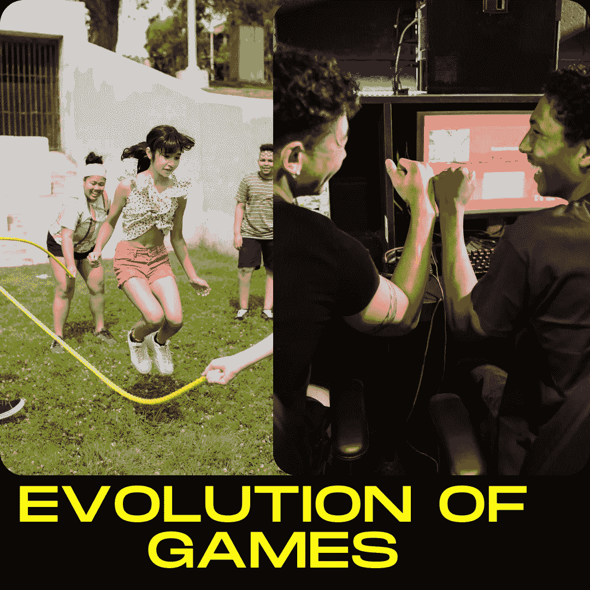
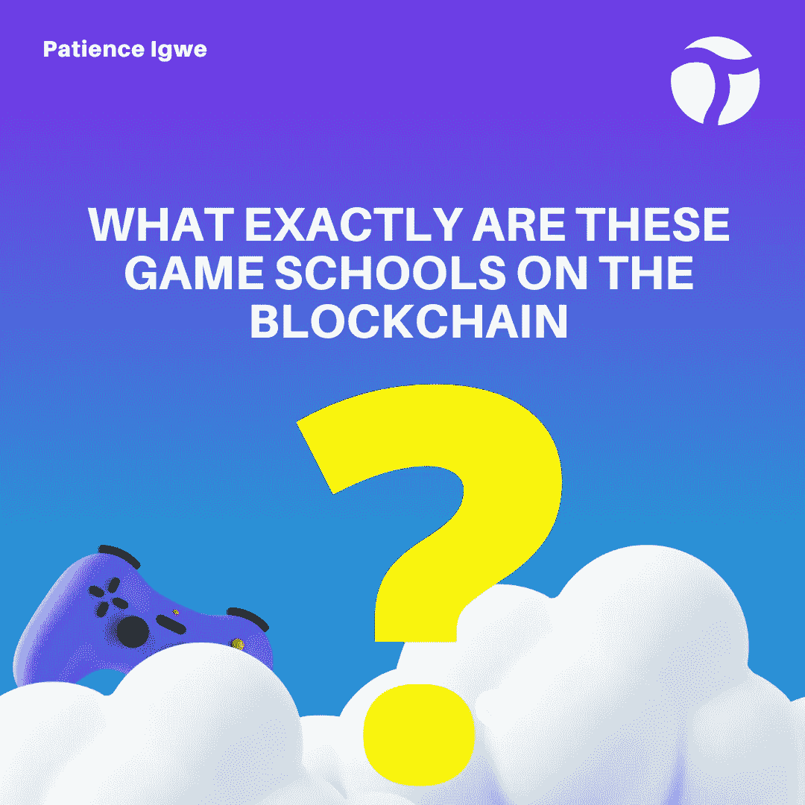

# 区块链的游戏学校

> 原文：<https://medium.com/coinmonks/game-schools-on-the-blockchain-92c4b24778b7?source=collection_archive---------14----------------------->

# 介绍

想象一下去大学学习如何玩各种游戏。这可能就像一个三年的课程，在课程结束时，你将获得一个在某个特定游戏中有专长的结业证书。好笑吧？是的，我知道。不幸的是，随着越来越多的区块链采用率和玩赚取游戏的高成本和难度，需要这样的程序。值得庆幸的是，一些人已经采取措施确保这些漏洞不会成为区块链适应性的限制因素，因此，他们为每个对 gamefi 行业感兴趣的人提供了各种机会，让他们加入游戏玩家社区，也就是所谓的游戏公会。

# 游戏的演变

游戏几乎和人类一样古老，尽管它们不断进化，就像我们通过科技突破不断进化和进步一样。如果我们试图想象游戏的演变，我们会同意游戏是从一对一的把戏(模拟)开始的，然后进入视频游戏(数字)，再到我们今天的位置(元宇宙)。最初，游戏完全是为了娱乐，但今天，游戏的概念已经超越了娱乐，现在已经到了一个人可以通过玩有趣的游戏来谋生的阶段。这是乐趣和回报，从而诞生了 GameFi 行业，也称为区块链游戏，这是游戏和金融的结合。这些游戏为玩家提供了赚取大量数字资产的奢侈，这些资产可以货币化或用于升级他们的资产。然而，对于打算在区块链游戏中入门的新手来说，这通常是困难的。除了这种复杂性，大多数加密游戏公司需要大量的资金投入才能启动。这些因素通常足以阻止潜在的区块链游戏玩家。为了消除这些障碍，游戏学校应运而生。

# 区块链上有哪些游戏学校？

区块链游戏学校，也称为游戏公会，是一个为那些自己可能负担不起的玩家提供培训、工具、资金和其他必要帮助的协会。玩家赚的时候，收入由各方(公会和玩家)分享。很长一段时间以来，玩家公会一直存在。例如，电子竞技是近年来游戏公会越来越受欢迎的原因之一。其他一些著名的传统游戏公会有 Clan、FaZe、Team Liquid 和 Cloud9。

加密游戏行会和已知的传统游戏行会彼此不同。传统游戏公会的兴衰与他们参与的游戏的成功密切相关，不像加密游戏公会那样作为欢迎新玩家的场所，并通过提供开始玩游戏所需的资源来提供支持。即使一款游戏不再受欢迎，加密游戏公会的成员也可以玩其他受欢迎的游戏，从而带来更多收入。

# 为什么游戏公会很重要

众所周知，已知的传统游戏公会现在已经扩展到玩到赚的游戏模式。在这种新模式下，公会为那些想玩游戏和赚钱但没有足够资源起步的人，或者那些觉得起步成本太高甚至不想尝试的人提供了机会。如前所述，加密游戏公会的出现是为了解决这些游戏的准入门槛问题。

# 游戏公会的出现

Axie Infinity 游戏显著地促进了游戏公会的出现。要开始玩这个游戏，玩家必须至少有三个轴。这些轴花费了相当大的一笔钱。那时，组建一个像样的 Axie 团队肯定要花费 12，000 美元。

对于许多潜在玩家来说，12000 美元是一笔巨款。消除这种恐惧的努力导致了游戏公会的出现。第一个著名的游戏公会是由 Gabby Dizon 创建的，他是 Yield Guild Games 的创始人之一。在看到 Axie Infinity 的火爆连同高昂的入局费用后。他开始借出他的轴，这被称为轴奖学金。收入由学者、社区管理者和行会分享。

不久，其他人接受了这个想法，并开始创建他们自己的密码游戏公会。

# 加密游戏公会是如何运作的？

游戏赞助是潜在玩家可以从加密游戏公会获得的东西。被接受的玩家可以从已经拥有 NFT 的公会成员那里借用或租借 NFT。将获得 NFT 的游戏玩家将使用这些数字资产在加密游戏中游戏和赚钱。这有助于他们，直到他们有能力拥有自己的数字资产。

一些著名的加密游戏公会有:

*   功绩圈
*   屈服公会游戏
*   吉尔菲
*   UniX 游戏
*   好游戏公会

既然已经勾勒出了几个公会，那就有必要一个接一个的说了。

*   **功绩圈**

作为最大的公会代币(MC)市值，Merit Circle 是一个分散的自治组织(DAO)，自 2021 年 9 月以来一直支持区块链博彩参与。Merit Circle 向其玩家提供 70/30 的游戏利润分成以及慷慨的赌注系统。

功德圈由 Bitscale Capital、Mechanism Capital 和数字货币集团等支持，玩家可以通过功德圈平台玩的一些游戏有:

1.  无限轴
2.  精灵王国
3.  Sidus 英雄
4.  火神宇宙
5.  冲积层等。

*   **屈服公会游戏**

屈服公会游戏(YGG)由加贝·迪松组建。这是迄今为止最成功的 NFT 博彩行业协会之一。该公会于 2018 年在菲律宾成立，当时联合创始人 Gabby Dizon 开始将他的 Axies 借给其他负担不起的 Axie Infinity 玩家。自从 2018 年推出 Axies 以来，Yield Guild Games 现在为许多游戏提供了实惠的切入点。玩家可以通过 Yield Guild 游戏平台玩的游戏包括:

1.  守护者协会
2.  淀积层
3.  夹板岛
4.  星图
5.  Zed Run 等。

*   **吉尔菲艾斯**

GuildFi 在 2021 年推出了 MVP，此后一直在强劲增长。他们还有一个赌注系统，已经锁定了超过 1500 万美元。

GuildFi 得到了 web3 中一些大牌的支持。它认为 Animoca Brands、Dapper Labs、比特币基地风险投资公司和潘迪拉都是它的财务赞助商。这个平台仍在不断发展，玩家可以通过 GuildFi 玩的一些游戏包括:

1.  上升者
2.  秘密袭击者
3.  德弗塞
4.  硝基联盟
5.  Pegaxy 等。

*   **UniX 游戏**

UniX Gaming 是一个在其社区 Discord 上拥有超过 200，000 名成员的平台。该协会通过奖学金、育种者、研发、主持人和教师提供收入。教育是 Unix 使命不可分割的一部分。它的计划是通过其本土的学习和收入平台，每周免费教育很多人。

它的令牌 UniX 构建在以太坊区块链之上，同时充当治理和实用工具。玩家可以通过挑战和社区贡献来获得这个令牌。玩家可以通过 Unix 游戏玩的一些游戏有:

1.  西弗
2.  星图
3.  分散土地
4.  夹板地
5.  沙盒等等。

*   **好游戏公会**

好游戏公会(GGG)在这个行业中有点新。然而，它在这段时间里显示出了巨大的潜力，现在无疑是一股不可忽视的力量。玩家可以通过 Unix 游戏玩的一些游戏有

1.  无限轴
2.  泰坦猎人
3.  荒废的土地等。

# 结论

很明显，游戏产业经历了一系列的蜕变，从原始的人对人游戏到视频游戏，再到现在的区块链游戏。我们也看到了这些游戏是如何从一个纯粹的娱乐工具演变成一个既能娱乐又能谋生的工具，通常被称为游戏赚钱。然而，加密游戏有着普通玩家难以应付的合理复杂程度。除了这种复杂性之外，在这些平台上入门通常需要一定程度的财务投资，这是大多数潜在游戏玩家无法负担的。即使是少数真正能够负担得起的人，也可能不愿意投入这么大一笔资金，因为无法保证他们可能获得的回报。这些关注催生了游戏公会，并且到今天为止，游戏公会已经成长为区块链世界不可或缺的一部分。

那么，你还在等什么开始玩区块链游戏呢？你属于任何公会吗？请在评论区留下他们的名字。

谢谢

> 交易新手？试试[加密交易机器人](/coinmonks/crypto-trading-bot-c2ffce8acb2a)或者[复制交易](/coinmonks/top-10-crypto-copy-trading-platforms-for-beginners-d0c37c7d698c)