# GameFi

> 原文：<https://medium.com/coinmonks/gamefi-bc7bbbd35275?source=collection_archive---------3----------------------->

## 深入了解数字资产的世界

> 由 [Sixte C](https://www.linkedin.com/in/sixte-c-a72b47173/) 撰写的文章。由 [Lesia M](https://twitter.com/LesiaMrch) 编辑。

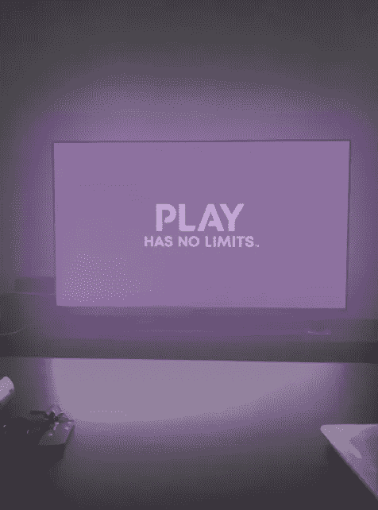

# **概述**

博彩业的大牌已经迈出了去中心化游戏的第一步。移动游戏开发商 Zynga、游戏巨头育碧(Ubisoft)和世嘉(Sega)都表达了打造(或已经打造)区块链游戏或区块链游戏的雄心。2021 年是对元宇宙和区块链博彩的强烈和持久炒作的开始。GameFi 迅速提高了风险投资家和游戏开发者的意识。但是游戏玩家呢？全球 27 亿游戏玩家会转向基于资产所有权、游戏内令牌学和去中心化治理的游戏体验吗？潜在的增长是巨大的，但是我们还不知道底层的区块链技术如何能彻底改变游戏产业。例如，2004 年发行的游戏《魔兽世界》就已经有了游戏内经济和类似道的社区系统。通过分析 GameFi 生态系统，我们将展示一个新的加密层和 web 3 是如何激励采用的。

被当前的加密冬天冻结的 GameFi 热潮已经平息。根据 ChainPlay 的数据，62%接受调查的 GameFi 投资者损失了超过 50%的利润，他们参与 GameFi 的平均时间减少了 43%。在 [DappRadar 八月报告](https://dappradar.com/blog/dappradar-blockchain-industry-report-august-2022)中，我们可以看到 GameFi 占了连接到 Dapps 的唯一活跃钱包(UAW)的一半以上。但实际上，根据 web 3 反机器人平台 Jigger 的数据，平均 40%的 GameFi 玩家是机器人。GameFi 现在已经远离了媒体的关注，开发者们正在默默地创造新的价值。我们研究的目标是确定 GameFi 生态系统的主要参与者，以及它们之间如何相互作用。我们也将试图理解 GameFi 的局限性，以及什么会阻碍它成为主流。

# **什么是 GameFi？**

在深入 GameFi 空间的核心结构之前，让我们先澄清一下它的主要特性。GameFi 是游戏和金融的简称。游戏的金融化主要指 3 个核心组成部分:游戏赚取机制、通过 NFTs 的资产所有权和游戏中的加密货币代币经济学(即代币经济学)。

## **玩赚**

由游戏“Crypto Kitties”开创的“玩赚”机制是区块链驱动的游戏所固有的。这需要给继续玩游戏的玩家经济上的激励。收入可以通过两种不同的方式收集。首先，游戏玩家可以玩游戏并获得游戏内代币。根据游戏的性质(即时战略、基于浏览器的游戏、手机游戏、MMORG、MOBA……)玩家将以不同的方式获得代币。然后，游戏玩家可以用这些代币兑换法定货币或其他加密货币，并赚取收入。游戏玩家可以获得回报的第二种方式是在专门的市场上以高于最初购买或创建时的价格赚取或交易游戏中的 NFT。这些 NFT 可能具有装饰价值和/或还可以包括游戏中的效用。

## **资产所有权**

历史上，游戏玩家只能在中央控制的市场上交易游戏中的资产。比如前面提到的游戏《魔兽世界》，就创造了一个完整的基于‘黄金’的游戏内经济。玩家可以用黄金向其他玩家买卖 WoW 物品。理论上，黄金只能通过高度监管的集中 WoW 代币服务获得，这种服务需要几个小时来处理交易。在实践中，黄金/菲亚特交易也可以在不受监管的网站上进行，这些网站不受游戏开发商暴雪(blizzard)的支持，可能会导致双方被禁。然而，WoW 被认为是传统游戏中最先进的游戏经济之一。这里画出的图片是，非区块链游戏中的资产所有权是过时的，并且有一个故障点，在这个例子中是暴雪的中心实体。在一个玩家账号丢失、被封禁或失效的情况下，所有‘拥有’的资产都将丢失。基于区块链的游戏通过不可替代令牌(NFT)实现真正的资产所有权，为这个问题提供了答案。这种游戏允许玩家通过将他们在玩游戏时获得的游戏内资产令牌化来对他们的努力和注意力进行奖励。然后，游戏玩家可以通过在二级市场上交易他们的 NFT 来轻松交换价值，跨链移动或转移到其他游戏，同时保留其价值。

## **令牌组学**

游戏的金融化需要游戏币，允许玩家交换价值。他们的价值源于他们的用例，激励玩家积累游戏中的代币。在大多数游戏中，原生令牌有 3 个用例:治理、赌注和支付给玩家。

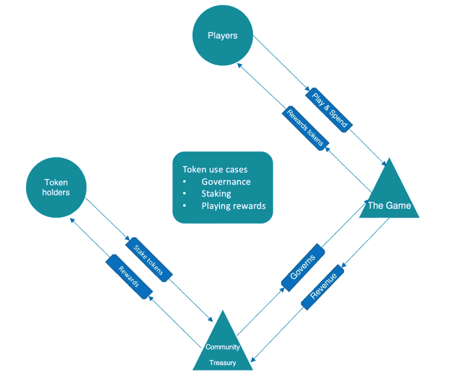

代币持有人在关键治理问题上的投票权与他们的所有权份额成正比，这意味着游戏玩家持有的代币越多，他的意见就越有影响力。治理投票定期举行，让持有者对如何使用国库有发言权。第二个用例是下注:玩家可以下注他们的代币来获得定期奖励。最后，游戏中的代币用于通过“玩即赚”机制奖励游戏玩家。然而，为了减少通货膨胀对治理效率的影响，游戏通常会有另一个奖励玩家的令牌。这种代币是为了随着更多玩家加入游戏而增加供应量而特意设计的。因此，它需要一个强有力的通货紧缩战略来保障游戏玩家收入的价值。

# **深入了解 GameFi 生态系统的主要项目**

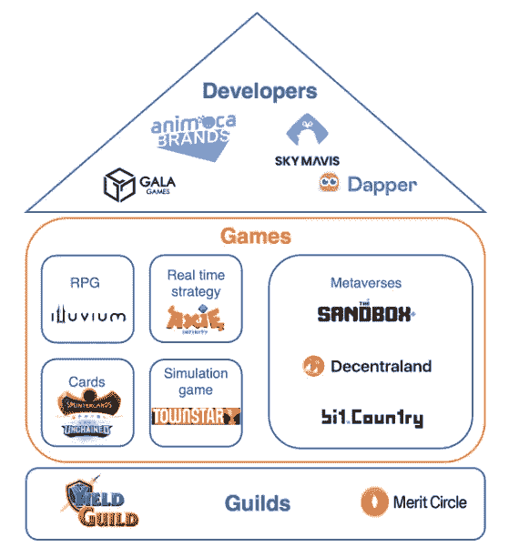

GameFi 生态系统基本上由**开发工作室**组成，他们开发**游戏**，由**公会**玩。当然，公会只代表了所有 GameFi 玩家的一小部分，但他们的设计值得关注，因为他们与传统的公会有很大的不同，在这个领域有着重要的作用。像传统游戏一样，基于区块链的游戏可以分为具有独特功能的不同类型。由于区块链游戏处于早期阶段，相当一部分游戏是纸牌游戏。它们很容易开发，对收集的卡片的真正所有权的需求也很简单。

随着 GameFi 的崛起，一种新的分类登上了顶峰:metaverses。“元宇宙”在加密领域成为一个包罗万象的术语，但在这里我们将它定义为一个区块链促成的虚拟世界，参与者既是游戏玩家也是游戏开发者。其独特的功能使玩家能够在游戏中创建自己的游戏，这使他们成为 GameFi 生态系统中一个值得关注的角色。最后，区块链游戏工作室与传统游戏开发商没有太大区别。唯一的区别是区块链游戏所隐含的附加层。事实上，除了软件工程师、艺术设计师和营销团队，GameFi 开发工作室必须有可靠的区块链程序员和熟练的经济学家来设计游戏的令牌组学。平衡所有这些领域的能力不是天生的，尤其是 GameFi 还很年轻。因此，建立这种游戏工作室所需的复杂性催生了不同优先事项和运营策略的公司。

## **游戏开发商**

**Animoca 品牌**

我们将把重点放在那些只制作基于区块链的游戏并且已经发布了至少一款的游戏工作室上。估值最高的公司是 Animoca brands。价值 55 亿美元的 Animoca 是 GameFi 领域的头号玩家。该公司由连续科技企业家萧逸(Yat Siu)和大卫·金(David Kim)于 2014 年创立，目前旗下所有子公司共有约 700 名员工。时至今日，邵逸夫仍是担任董事总经理的主要人物。自 2021 年 10 月以来担任总裁的埃文·奥扬(Evan Auyang)比创始人更有金融背景。除了强大的管理团队，Animoca 还受益于其在区块链游戏公司出现之前的手机游戏开发经验。其向区块链游戏的机会主义转型使该公司成为 GameFi 生态系统的先驱。Animoca 的成功还归功于其游戏中的大量许可，包括元宇宙探听犬、迪士尼和 WWE。他们通过将 Animoca 标记为概念许可领域的主要参与者，获得了强大的竞争优势。Animoca 开发了包括沙盒和疯狂防御英雄在内的原创游戏。开发的视频游戏类型似乎没有遵循一种模式，因为它的范围从防御塔到赛车游戏，包括开放的虚拟世界。Animoca 可能会测试所有视频游戏类型，而不遵循严格的创意 DNA 来吸引尽可能多的新玩家。

Animoca 的特殊性在于其活动不仅限于游戏开发，还延伸到风险资本投资。事实上，它已经投资了我们名单中的第二家游戏开发商:Sky Mavis。

天空专家

与 Animoca 品牌不同，Sky Mavis 非常年轻。它成立于 2019 年，团队规模几乎是 Animoca 的 10 倍。Sky Mavis 的管理团队依靠 5 名联合创始人。Nguyễn、何和正宗负责越南的运营，越南是大部分员工的大本营。增长主管杰弗里·齐林(Jeffrey Zirlin)负责社区赋权，首席运营官亚历山大·拉森(Aleksander Larsen)负责投资者关系。担任首席执行官的 Trung Nguyen 被 CoinDesk 选为 2021 年最具影响力的演员之一。2021 年 10 月，在 a16z 牵头的 B 轮融资(包括 FTX 加密交易所)之后，Sky Mavis 的估值为 30 亿美元。它最近的一轮融资是 C 轮融资，额外筹集了 1.5 亿美元。不过，按估值计算，Sky Mavis 并不是最大的开发商，但按玩家人数计算，它开发了最受欢迎的 P2E 游戏。事实上，Sky Mavis 的旗舰产品 Axie Infinity 游戏自推出以来注册了超过 1000 万名玩家。如前所述，开发工作室之间的运营策略差异很大。Sky Mavis 没有像 Animoca 那样使其产品多样化，而是专注于开发一种主要产品，将质量置于数量之上。例如，该公司发布了一款新游戏，名为 Axie: Infinity Origin，发生在与 Axie Infinity 相同的宇宙中。这一策略旨在为 Sky Mavis 的创造性身份提供一致性，以促进玩家参与。Axie Infinity Origin 的特殊性在于，它不是特意为 P2E 而造的，它唯一明显的用途是向非加密玩家介绍最初的 Axie Infinity。就像 Animoca 使用许可证来获得更多不熟悉加密的游戏玩家，Sky Mavis 正在建立更低准入门槛的游戏，以获得更多主流采用。Sky Mavis 可能高度专注于游戏开发，但该工作室也建立了一个游戏发射台和一个交易游戏内资产的市场。他们在 Axie Infinity 上促进交易的努力最终导致了一个名为 Ronin 的以太坊侧链的创建，以降低费用和增加吞吐量。

总之，我们可以看到这两个 GameFi 巨头没有相同的运营策略，因此没有直接竞争。人们甚至可以说，他们通过增加对区块链游戏的采用来互相帮助。一方面，通过 Axie Infinity，Sky Mavis 向普通玩家展示了游戏的潜力。另一方面，Animoca 在幕后工作，用他们的财力和专业知识投资每一个重要的 GameFi 项目。

## **游戏**

**Axie Infinity**

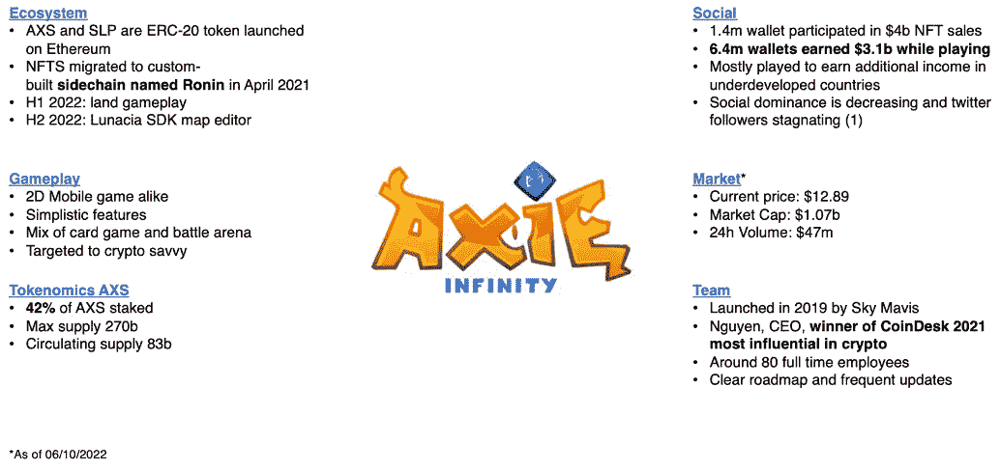

Axie Infinity 是游戏开发商 Sky Mavis 的旗舰产品。它实现了让 1000 万游戏玩家积极地玩他们的游戏，同时提供了一种全新的游戏体验。然而，我们不应该被误导，它惊人的成功主要是由于赚取功能，而不是一个革命性的游戏。Axie Infinity 的冒险模式的进程很像《糖果粉碎》这样的手机游戏。游戏，混合了战场和卡牌游戏的特点，非常简单，所有公众都可以使用。它不复杂可能是吸引尽可能多的新玩家的优势，但也会削弱玩家的忠诚度。

Axie Infinity 的生态系统依赖于两个令牌，AXS 和 SLP。虽然用于治理和赌注的 AXS 有固定的供应，但用于奖励玩家的 SLP 没有任何硬性上限。因此，在活跃玩家人数大量增加的情况下，SLP 币会受到不受控制的通货膨胀的影响。2021 年 5 月-11 月，阿谢上每月新钱包超过 60%。开始玩它需要拥有 3 个轴，这是用来战斗的小怪物的 NFT。玩家可以用 AXS 和 SLP 来繁殖他们的 Axies。考虑到 2021 年 11 月组建一支球队的中值成本约为 862 美元，玩家的收入在很大程度上取决于新加入者的增长。然而，在 12 月下旬，随着加密市场的崩溃，玩家的增长下降了 75%，导致了接下来几个月整体游戏令牌组学的崩溃。为了奖励玩家，新 SLP 的发行量不得不大幅增加，这导致了积极的供应冲击。由于需求增长赶不上供应压力，自 2021 年 11 月以来，SLP 的价值损失了 96%。游戏玩家玩游戏是为了赚取持续贬值的 SLP。由于大多数玩家都是来自不发达国家寻求额外收入的低收入个人，他们对游戏的兴趣也下降了。这种情况最终导致了恶性循环，推动 Axie Infinity 管理团队积极致力于修复通货膨胀问题。尽管在 2021 年 2 月，SLP 的日供应量减少了 56%，但通胀在不久后又开始飙升。据迈萨里称，自 2021 年 12 月以来，SLP 供应量增长了 12 倍以上。

由于 Axie Infinity 游戏玩家保持率过于依赖收入，而收入与增长成正比，新进入者的长期停滞会导致游戏内经济收缩。开发商 Sky Mavis 非常清楚 P2E 的健康依赖于增长。为了重新获得关注，Axie Infinity 推出了一个强大的路线图，其中包括地图编辑器 Lunacia SDK 的发布，这与分散土地和沙盒提供的功能非常相似。Axie infinity 也希望通过在 2022 年在 iOS 和 Android 上发布 Axie Infinity 来获得更多主流采用。最后，到今年年底，陆地游戏将分三个阶段推出。然而，鉴于我们正在进入 2022 年的最后三个月，Axie infinity 甚至还没有发布第一阶段，人们可能会怀疑 Axie Infinity 开发商及时交付陆地游戏的能力。

**冲积层**

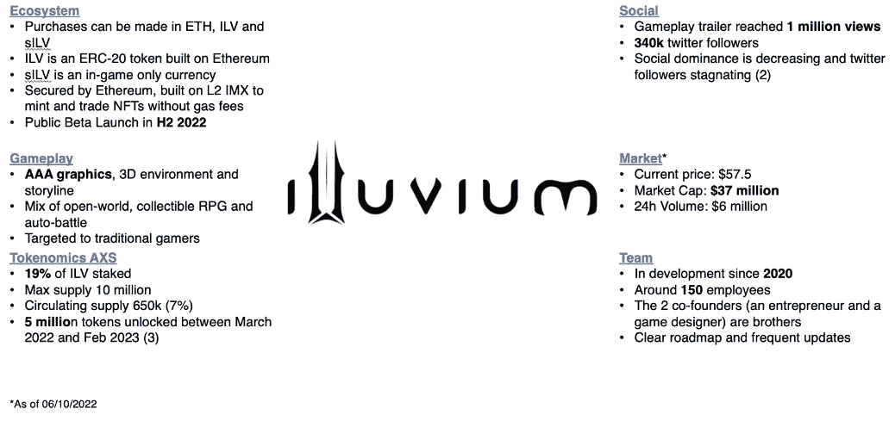

现在我们将分析一个 GameFi 项目，它有很多 Axie Infinity 所缺乏的新特性。Illuvium 是一款冒险开放世界游戏，混合了自动对战和收藏品所有权。游戏开发始于 2020 年，如今该团队约有 150 名员工。虽然它是由以太坊保护的，但游戏中的 NFT(用于战斗的生物)是在不可变的 X (IMX)第二层解决方案上铸造和交易的。出于同样的原因，Sky Mavis 建立了 Ronin sidechain 以扩大规模并降低游戏的汽油费，Illuvium 选择了 IMX。

Illuvium 的卖点在于它自称是第一款基于以太坊打造的 AAA 级游戏。AAA 是一个游戏类别，由于有大量的营销和开发预算，它提供了先进的图形和高度引人入胜的游戏性。与 Axie Infinity 相比，Illuvium 更有可能吸引传统方面的游戏玩家，因为它比 Axie Infinity 更专注于提供有趣的游戏体验。此外，Illuvium 是一个分散的协议，IVL 令牌持有者将对游戏的未来拥有治理权。此外，NFT 将在一个名为 IlluviDex 的分散式交易所以不信任的方式进行交易。相比之下，虽然许多人认为 Axie Infinity 是一个真正的区块链游戏，但 Sky Mavis 完全控制了游戏。以下是 Axie Infinity 与区块链博彩风气不一致的部分权利:

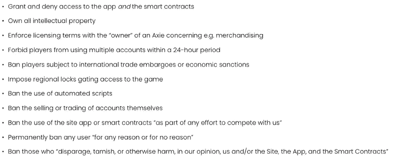

Source: [Naavik](https://naavik.co/business-breakdowns/axie-infinity/#axie-decon=)

Sky Mavis 的集中化问题在 3 月份的 Lazarus hack 事件中达到高潮。Ronin 网络仅由 9 个私钥保护，其中 5 个被泄露，黑客因此损失了 6 . 24 亿美元。

今天，Axie Infinity 市值的二十分之一，可以认为 Illuvium 有很大的上升潜力。然而，我们不应该忘记公测还没有出来。代币持有者理论上只是猜测，因为游戏不对公众开放，治理投票还没有开始。令牌目前没有用例，除了桩。此外，到 2023 年 3 月，总供应量将 100%解锁。总供应量的 25%由目前坐拥 24x 的投资者拥有，总供应量的 8.3%由初始投资乘以 73 的投资者拥有。如果游戏发布不能像 Axie infinity 一样促进增长，Illuvium 可能会见证其经济的彻底崩溃。

总之，Axie infinity 成功地向不发达国家精通密码的投资者和低收入游戏玩家展示了游戏背后的价值。然而，Illuvium 有一个更雄心勃勃的使命。该项目试图让 27 亿传统游戏玩家相信，基于区块链的游戏无缝整合到定性游戏中，可以彻底改变他们的游戏体验。Illuvium 和其他 AAA 级加密游戏如 Mavia 的 Heroes 一样，仍处于初级阶段。它仍然需要向游戏社区证明，为了赚钱而玩可以等同于为了娱乐而玩。Axie Infinity 的练习显然失败了，因为我们目睹了收入下降后出现的大量外流，这证明玩家寻求的是收入而不是愉快的游戏体验。

## **元经文:分散土地 vs 沙盒**

分散土地和沙盒是两个最突出的元宇宙项目。了解它们的区别将有助于我们把握它们各自对 GameFi 生态系统的贡献。Metaverses 鼓励他们的参与者在 3D 数字环境中体验、构建和货币化他们的创作和应用。这两款游戏都允许用户在生态系统中创建自己的游戏。尽管如此，值得注意的是，沙盒更专注于繁荣一个真正的小说游戏社区，尽管 P2E 和区块链的功能，而分散土地在其创作范围内更灵活，在其元宇宙推广任何类型的内容。

虽然沙盒要年轻得多，但它在许多方面显示出更强的基础。沙盒 alpha 版本仅在 2021 年 12 月发布，但它的合作伙伴关系比分散土地更重要。事实上，汇丰银行、著名说唱歌手 Snoop Dogg、华纳音乐甚至《南华早报》都在其元宇宙购买了土地。两个平台都提供了非常有限的游戏性。然而，沙盒的优势是建立在 2010 年创建的现有游戏上。它有一个真实的创意 DNA，并提供更令人愉快的图形。就可访问性而言，沙盒更加用户友好，因为你可以使用社交媒体帐户、电子邮件或钱包创建帐户，而分散土地只提供钱包便利的连接。最后，沙盒由 GameFi 领导者 Animoca Brands 所有。他们强有力的领导，在区块链博彩的持久经验和不断增加的资金实力是沙盒繁荣的有利条件。

然而，沙盒本身仍处于起步阶段，因为只有游戏的阿尔法可供玩家使用。另一方面，分散土地的开发始于 2017 年，于 2020 年启动。作为一个真正的元宇宙先锋，分散的土地，是第一个项目提供一个概念的工作证明。沙盒土地的底价略低，以及其交易量。有人可能会认为，SAND 较低的市值可能意味着较高的增长潜力，然而，虽然 84%的 MANAs 总量正在流通，但只有 50%的 SAND 固定供应量已经释放。这意味着沙盒完全稀释后的市值是分散公司当前市值的两倍多。

总之，主要为游戏设计的沙盒有机会从现有的传统游戏玩家社区中获得牵引力，而分散土地可能会因其提供的有争议的不一致性而被阻止成为主流。可以肯定的是，这两个基于以太坊的项目都将面临可扩展性问题。为了建立替代的数字现实，metaverses 的交易吞吐量都需要跟上他们在用户数量方面的惊人雄心。就目前而言，我们还没有看到主要的 metaverses 建立在更具可扩展性的区块链之上。

## **屈服公会游戏(YGG) vs 功绩圈(MC)，市值最大的两个公会**

随着 MMORPGs(大型多人在线角色扮演游戏)上在线游戏的诞生，公会在 90 年代首次出现。起初，他们只是由少数孤立的玩家组成，这些玩家希望协调他们的目标，以分享任务奖励。随着游戏变得更加多样化，公会组织的复杂性也增加了。最终，行会进入了区块链博彩行业。随着 P2E 生态系统越来越受欢迎，创建玩家社区，将他们的收入集中起来的需求变得显而易见。总而言之，GameFi 公会可以被定义为一群人聚在一起，互相帮助，在基于区块链的游戏中获得最大回报。实际的过程稍微复杂一些，因为它是基于去中心化的治理。事实上，YGG 和 MC 都由一个 DAO(去中心化自治组织)管理。这意味着所有决策不是由中央实体做出，而是由令牌持有者自己做出。代币发行解决了传统公会经常存在的集中化问题，即社区领袖推广某些游戏以换取金钱。公会的 DAO 共享围绕以下 3 个组件设计的相同架构:

*   管理行会资产的财政部。它的目标是最大化 DAO 资产回报，购买新的有价值的 NFT，如土地或游戏内角色，并通过其游戏内令牌投资于有前途的区块链游戏。为了寻求象征性的增值，公会也投资游戏来连接他们的社区和扩大他们的生态系统。
*   子刀，每个代表不同的游戏或地理区域，但仍然有助于主要公会刀。它们提高了治理效率，产生了更高的回报。
*   代币持有者可以下注代币的金库。YGG 持有者可以选择在许多金库中下注他们的代币，而不是在一个协议或池中下注固定利率。每个金库都从公会生态系统中的不同活动中获得收入。例如，在 YGG 公会中，可以在收入仅来自 NFT 租金的金库中下注代币。因此，在此金库中投入代币的钱包将仅获得与 NFT 租赁总收入成比例的收益。

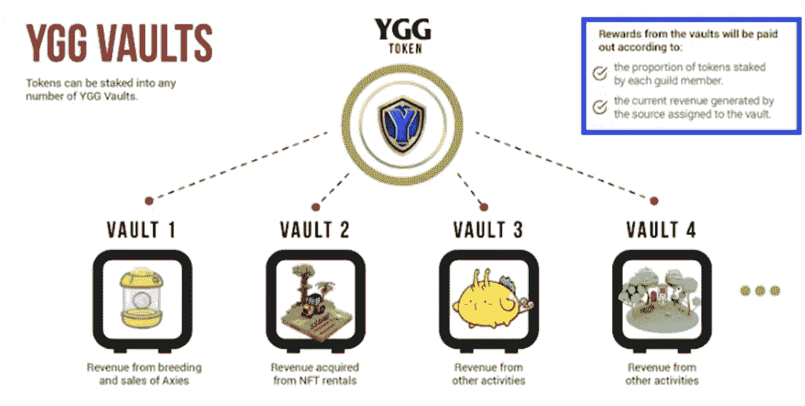

总体而言，同业公会的主要活动将是 NFT 交易、借贷。他们在 GameFi 生态系统中的投入就是资本。事实上，通过将 NFT 借给玩家(学者)以换取他们收入的一部分，公会大大降低了进入门槛，这对于像 Axie Infinity 这样的顶级区块链游戏来说可能特别高。

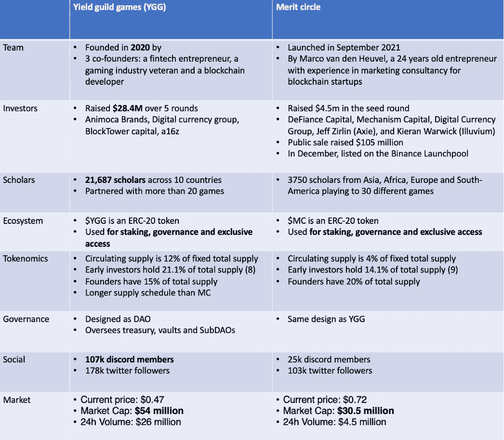

YGG 和 MC 治理设计几乎完全相同。绝大多数新建的行会采用和 YGG 一样的方法，因为这是一个可行的概念证明。尽管 MC 公会还很年轻，但它已经在密码公会领域树立了新的里程碑，证明了自己的价值。首先，它是第一个将活动扩展到游戏开发的公会。事实上，在 2 月份，MC 宣布推出一款名为 Edenhorde 的内部世界建筑游戏。其次，旨在让社区参与具体决策，MC 成为第一个通过投票雇用员工的部门 DAO。然而，尽管 MC 的 DAO 看起来很有创新性，但它却受到高度集权化的困扰。在最近的 5 个治理提案中，超过 50%的投票集中在 5 个钱包中。就象征经济学而言，YGG 似乎更强大，因为它的供应时间更长，流通供应量更大。就像分散土地的沙盒一样，人们可能会认为，由于 MC marketcap 几乎是 YGG 的一半，增长更有可能。然而，由于只有 4%的 MC 总供应量在流通，而 YGG 为 12%，MC 的完全稀释市值比 YGG 高出 54%。考虑到 YGG 正处于一个更先进的发展阶段，马克可能被高估了。YGG 的学者数量几乎是麻省理工学院的 6 倍。

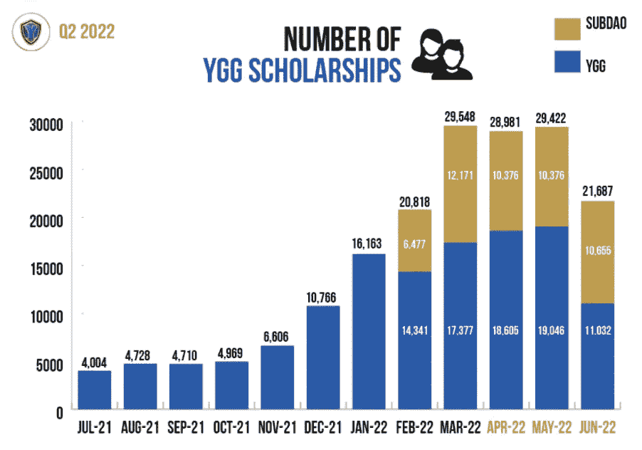

Source: [YGG Community update](https://storage.googleapis.com/external_communication/YGG-2022Q2-CommunityUpdate.pdf)

纵观两个项目团队，YGG 似乎更有把握。创始团队由一名金融科技企业家、一名游戏行业资深人士和一名区块链开发商组成。另一方面，11 个月前，一位 24 岁的年轻人创办了 MC，他曾在区块链初创企业担任过两年的自营营销顾问。尽管如此，值得注意的是，Merit circle 得到了数字货币集团(Digital Currency Group)和 Axie Infinity 联合创始人之一杰夫·齐林(Jeff Zirlin)等加密和 GameFi 巨头的支持。

总之，密码公会生态系统有如此大的机会，以至于有足够的空间容纳多个参与者。MC 和 YGG 在过去就已经是合作伙伴了，他们甚至可以通过创建共同资助的奖学金或共同开发游戏来战略性地促进密码公会的发展。总而言之，对于规避风险的投资者来说，将钱投入加密公会是一种安全的方式，可以在 GameFi 生态系统中获得风险，而不必承担投资一个可能会随着时间的推移而消失的游戏的风险。

# 为什么游戏玩家可能不会采用 GameFi？

区块链游戏是一个巨大的未开发市场，具有巨大的增长潜力。如果现在价值超过 3000 亿美元的传统游戏行业向 GameFi 生态系统过渡，我们可以见证一个全新的游戏格局。这将催生具有去中心化治理的游戏，玩家在他们玩的游戏中拥有发言权，授予真正的资产所有权，并让玩家在娱乐的同时赚取加密货币。那么，为什么 27 亿活跃的游戏玩家还没有接受区块链游戏呢？

第一个主要原因是，传统游戏玩家在玩游戏时更重视乐趣而不是回报。因此，一款将游戏内经济置于游戏性之前的游戏很难被主流接受。目前，GameFi 领域的玩家大多是密码爱好者，他们被 DeFi 的功能吸引到游戏中来，比如产量农业，而不是吸引人的真正有趣的游戏体验。这一趋势将传统游戏玩家推得更远:他们最终认为 GameFi 和 NFTs 与游戏的整合只是增加股东收益的一种方式。Yong Yea 对育碧 NFT 公司将其整合到最新游戏中的反应很好地描述了传统游戏领域对非功能游戏的普遍厌恶:“非功能游戏旨在彻底改变的唯一事情是公司和高管中饱私囊的能力。”

其次，游戏玩家对进入区块链游戏的复杂性望而却步。以下是玩 Axie Infinity 和《我的世界》的步骤对比:

来自[的 Axie infinity 指南区块研究](https://www.tbstat.com/wp/uploads/2021/10/20211013_GamingNFTs_TheBlockResarch.pdf):

1.  设置以太坊钱包，如 Metamask，并安全地存储种子短语(备份密码)
2.  在中央交易所用传统货币购买 ETH，并将其发送给 Metamask，Metamask 会收取费用，或者根据用户所在的国家，通过 meta mask 的信用卡解决方案购买 ETH
3.  在游戏的定制链或第 2 层缩放解决方案上创建钱包，并再次安全地存储种子短语
4.  使用钱包在游戏网站上创建一个帐户
5.  将电子邮件 ID 链接到游戏帐户
6.  将 ETH 或游戏令牌发送到游戏的钱包，这将产生交易费
7.  如有必要，下载游戏
8.  购买必要的游戏内物品

《我的世界》指南:

1.  购买游戏
2.  安装游戏
3.  使用 Microsoft 帐户注册

第三，为了接触大众，区块链游戏迫切需要主流垂直分销渠道。然而，在 PC 上，最大的发行商 Steam 禁止了所有的加密游戏。在手机上，高度集中的分销平台苹果商店和安卓很可能会避开促进点对点交易的游戏。最重要的是，苹果对其平台上的每笔交易收取 30%的费用，这也将对游戏内经济的可持续性构成巨大障碍。

第四，加密空间已经发展成为拥有各自网络的区块链联盟。竞争可能会推动创新，但它也与数字资产的自由流动背道而驰，因为它们往往被绑定到一个区块链。因此，非常需要区块链的互操作性，尤其是在被想象为无限世界的元世界中，想象力应该是唯一的限制。然而，跨链自由移动资产或建立在 100%可互操作的区块链上目前是不可能的。我们再一次得出结论，区块链游戏的用户体验并不是最佳的，还需要更多的努力。

最后，在亚洲，我们发现了最大的游戏玩家群体，监管机构可能会完全扼杀 GameFi 行业。在韩国，游戏如此重要，以至于有自己的监管法规，用游戏中的货币兑换法币是被禁止的。日本尚未禁止区块链博彩，但它的未来受到了极大的影响。[法律专家报告](https://innovationlaw.jp/en/play-to-earn-under-japanese-laws/)指出，Axie infinity 将被视为非法赌博，或者将受到 IPMR 消费者事务署《不当溢价和误导性陈述法案》的严格监管。最后，在中国，对密码行业的全面打击可能也会阻碍区块链博彩业的发展。

# **雄霸天下**

只要游戏玩家被不可持续的代币游戏而不是吸引人的游戏刺激去玩区块链游戏，GameFi 生态系统就不会从其基础上崛起。第一款吸引传统玩家注意力的区块链游戏将会以这样一种方式构建，玩家甚至不会知道他们正在使用区块链上制造的 NFT。要做到这一点，除了提供引人入胜的游戏，开发者还必须构建一个透明的前端，无缝整合 NFTs。

区块链游戏应该混合玩赚，免费玩，玩得开心，不要花钱赢。有人会问，这怎么可能？简而言之，游戏玩家不创造价值，因为他们的注意力没有额外的收入。他们只是为了赚钱而玩，而他们唯一的投入是他们的初始投资。我们可以看到这将走向何方。就像任何庞氏骗局一样，如果大多数玩家兑现他们的收入，或者如果增长放缓，游戏内的经济将会崩溃。对开发者来说，唯一的解决办法是打造一款足够有趣和令人愉快的游戏，让大多数玩家热衷于投入比收入更多的钱，就像传统游戏一样。

建立一个连贯、健康、值得成长的 GameFi 生态系统的最后一块石头是真正的去中心化。为实现这一目标，应勾选 3 个方框。首先，游戏应该建立在区块链的基础上，使用公平的共识机制，避免将网络的大部分份额交给一个或多个中央实体。Ronin 使用权威共识机制证明来保护 Axie Infinity 就是一个完美的反例。第二，区块链游戏应该尊重所有权，这意味着开发者不应该拒绝用户访问网络的智能合约或拥有知识产权。最后，游戏必须由玩家控制。开发者应该建立一个去中心化的治理框架，随着游戏的发展，让玩家决定游戏的未来。

纵观传统游戏市场，永无止境的续作标志着持久的创造力短缺。随着这个领域的发展，提供创新游戏越来越成为一种无法弥补的财务风险。就像 2000 年代的主机大战培养了吸引所有这些新玩家的创造力一样，GameFi 可能是今天游戏非常需要的新生命。

# **附录**

1.  无限社会轴

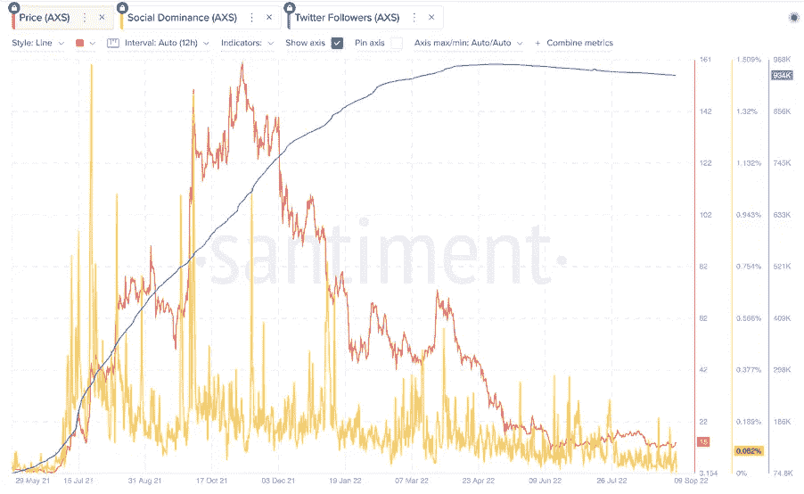

2.社会沉积层

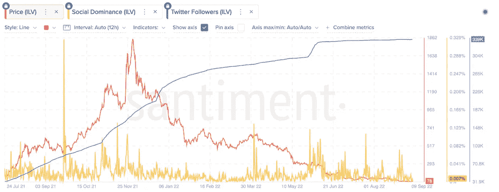

3.ILV 代币归属时间表

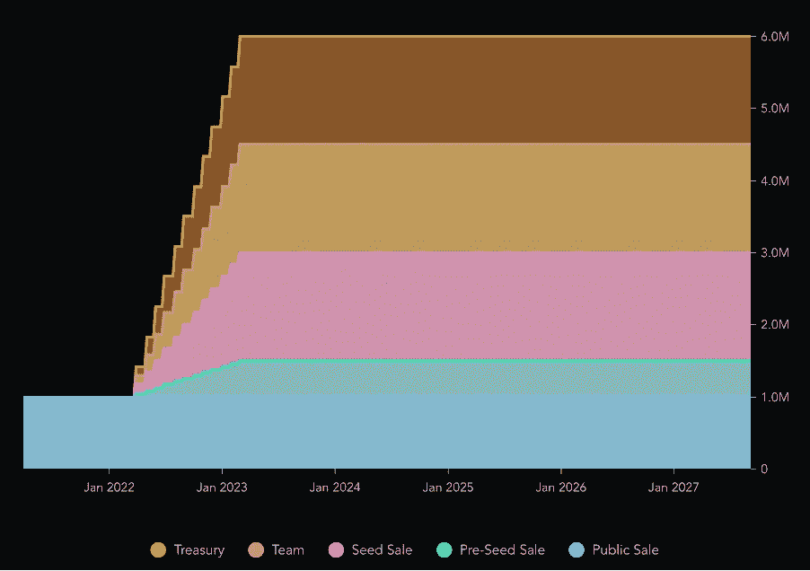

**Source:** [**Messari**](https://messari.io/asset/illuvium/profile/supply-schedule)

4.法力令牌分配

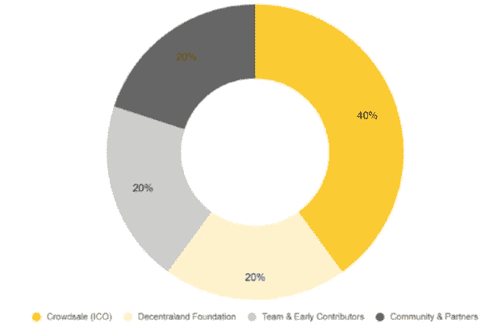

Source: [**Coin 98 insights**](https://coin98insights.com/what-is-decentraland-mana)

5.法力令牌释放时间表

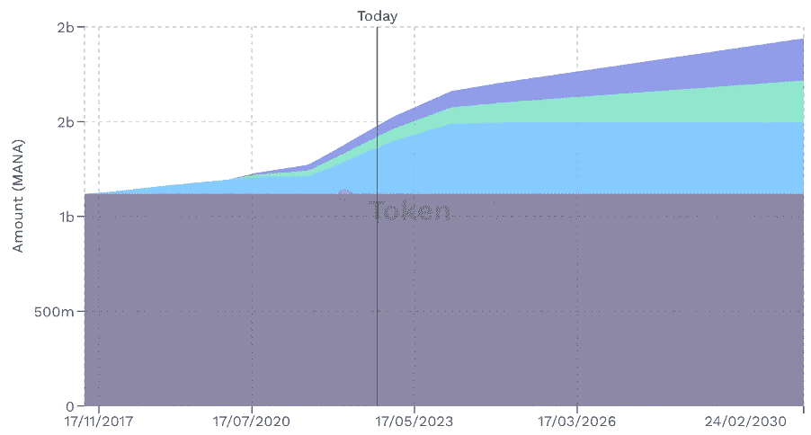

Source: [**Token Unlocks**](https://token.unlocks.app/decentraland)

6.SAND token 供应分配

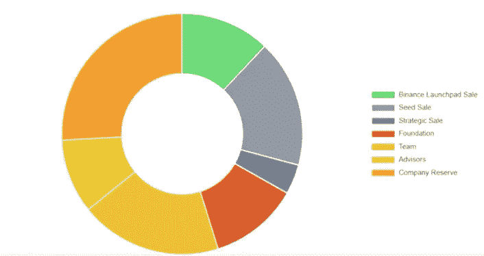

Source**:** [**Binance research**](https://research.binance.com/en/projects/the-sandbox)

7.SAND token 发布时间表

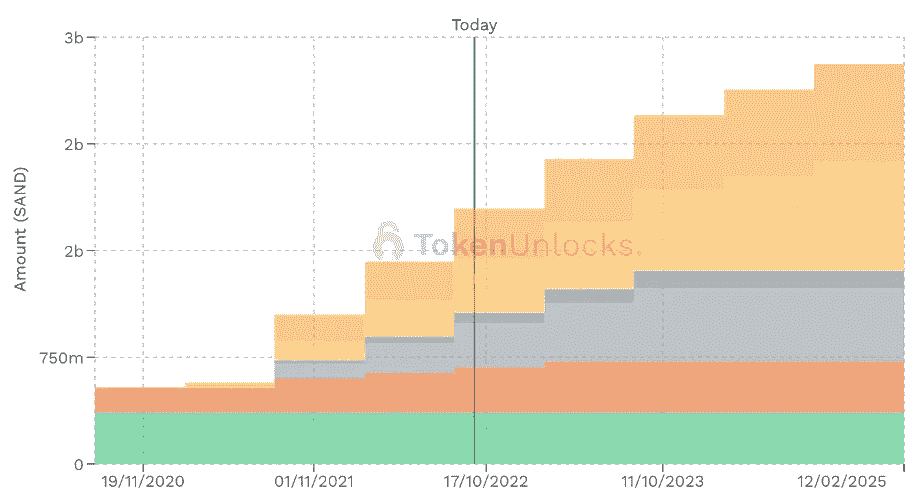

Source**:** [**Token Unlocks**](https://token.unlocks.app/the-sandbox)

8.奖励圈令牌授予计划

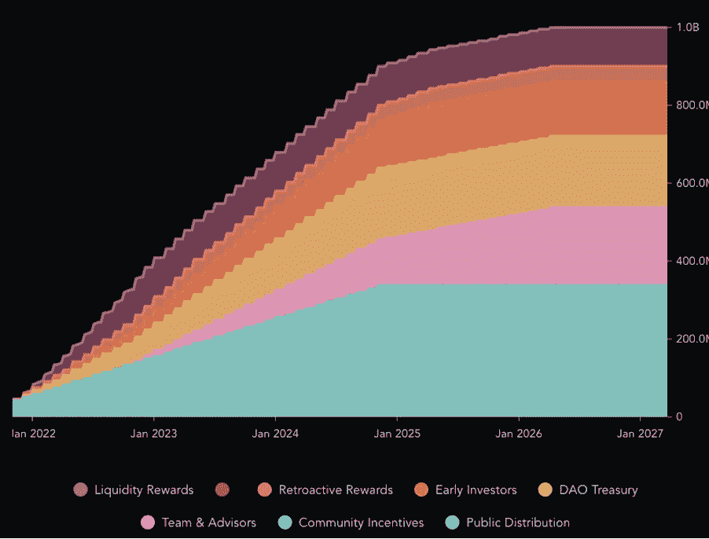

Source: [Messari](https://messari.io/asset/merit-circle/profile/supply-schedule)

9.YGG 代币归属时间表

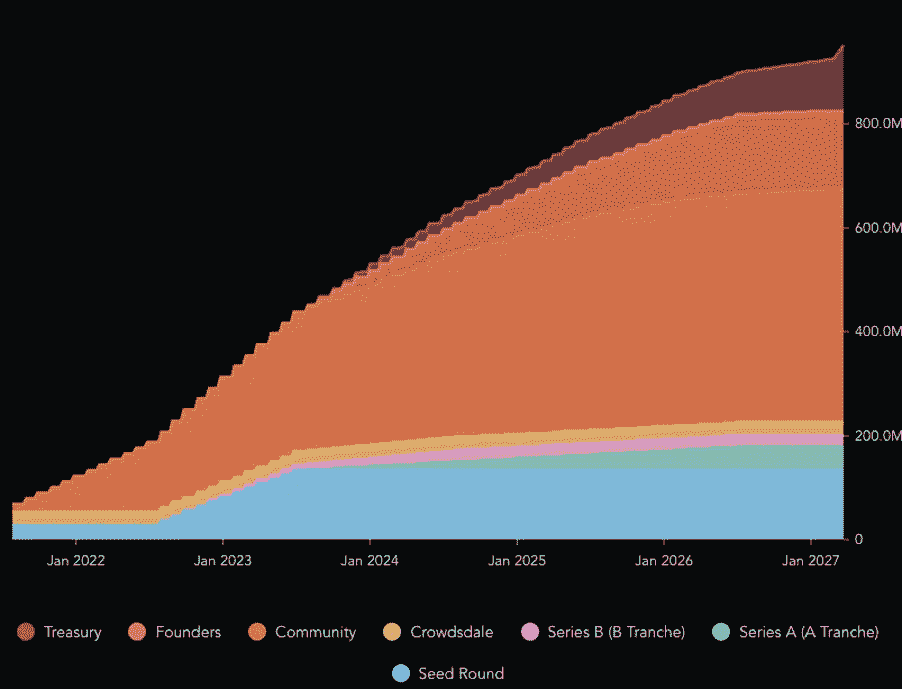

Source: [Messari](https://messari.io/asset/yield-guild-games/profile/supply-schedule)

## 放弃

*本材料严格保密，仅供专业投资者(根据开曼群岛金融管理局不时的定义)使用。未经 JKL Digital Capital Limited(“JKL”)的书面同意，不得出于任何目的复制、重新分发、传递给任何其他人或出版全部或部分内容。虽然本材料中包含的信息是从据信可靠的来源汇编的，但 JKL 不代表或保证本材料中包含的信息的准确性、完整性或可靠性。*

*本材料的内容未经任何监管机构审核。建议您对本材料的内容保持谨慎。如果您对本材料的任何内容有任何疑问，您应该获得独立的专业意见。JKL 或其任何关联公司，或其任何或其各自的董事、高级职员、员工和代表都不会对因使用或依赖本材料中包含的任何信息而导致的任何直接、间接或后果性损失承担任何责任或义务。本材料不构成认购或购买任何金融产品的要约或邀请。其目的不是提供任何信贷或其他评估的基础，也不应被视为购买任何金融产品的建议。*

> 交易新手？试试[加密交易机器人](/coinmonks/crypto-trading-bot-c2ffce8acb2a)或者[复制交易](/coinmonks/top-10-crypto-copy-trading-platforms-for-beginners-d0c37c7d698c)