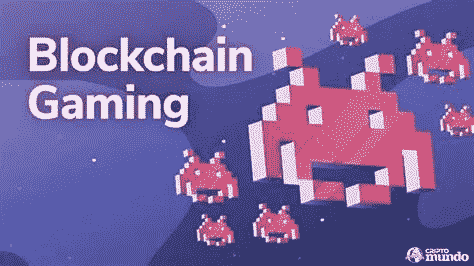

# “GameFi 或区块链游戏”，在 cryptoverse

> 原文：<https://medium.com/coinmonks/gamefi-or-blockchain-gaming-in-the-cryptoverse-fa467192b2f0?source=collection_archive---------45----------------------->

yahoo images

博彩业、元宇宙和区块链都交织在一起。在线游戏与 cryptoverse 没有什么关系，除非你加入 Web3，这是新兴的下一代互联网。

“我们的目标是将 Web 2.0 的传统游戏大众带到 web3，”总部位于索拉纳的区块链游戏工作室 Faraway 的联合创始人亚历克斯·佩利(Alex Paley)说。