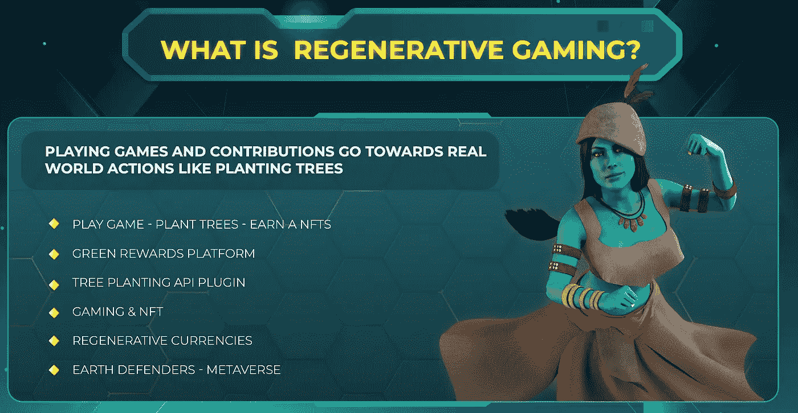

# 游戏化和再生金融(ReFi)

> 原文：<https://medium.com/coinmonks/gamification-and-regenerative-finance-refi-7dfbb2f2e1a0?source=collection_archive---------11----------------------->

24 日周六，当我骑着山地车，听着我最喜欢的播客之一(帝国)时，我当然会担心这一集的不祥主题“[为什么 2023 年将是加密初创公司的血战](https://podcasts.google.com/feed/aHR0cHM6Ly9mZWVkcy5tZWdhcGhvbmUuZm0vZW1waXJl/episode/ODQ5NzNiNmUtODI3My0xMWVkLTg0NjEtZWI5ZGJkNDI5NWMw?hl=en-ES&ved=2ahUKEwiv8KaOmJf8AhWXUaQEHRpABiEQjrkEegQICRAF&ep=6)”然而，Santiago Santos 提出 2023 年将会看到区块链在游戏/GameFi 领域的最广泛应用，这至少让我有些振奋。

> 从顶级交易者那里复制交易机器人。免费试用。

作为一名专注于 ReFi 和加速采用绿色交通的创始人，你可能想知道为什么 Santi 的预测让我振奋。

就在上周，我在 coin desk[发表了我的月度专栏，这次是关于为什么我认为 2023 年将是 ReFi](https://www.coindesk.com/consensus-magazine/2022/12/20/refi-goes-mainstream-crypto-2023/) (即再生金融)起飞的一年。当 ReFi 和 gaming 相交时会发生什么？其中一个方法是 WheelCoin，这是一个奖励用户环保行动的 Move2Earn 应用程序。

在这次熊市期间，我们决定开发 WheelCoin，通过 WheelCoin 奖励令牌(WHL)将此类决策游戏化，从而进一步加快绿色交通的采用。自 10 月 1 日推出第一个测试版以来，WheelCoin 已经在日本、印度尼西亚、印度、西班牙、美国和英国等国家注册了超过 400，000 次用户旅行，并发放了超过 30，000 个 WheelCoin 奖励代币！

我肯定 Santi 指的是更经典的游戏定义，但是我和他一样热衷于游戏可以帮助区块链成为主流，加速用户的接受。

我们如何用 WheelCoin 拥抱游戏化？

1.  用户可以近乎实时地看到他们的移动选择产生或节省了多少排放
2.  你移动得越环保，你赢得的 WHL 就越多，在 2023 年，我们将包括背景不同的头像，这些头像基于前一时期绿色用户的移动情况而变化。从一月份开始，WHL 将会有公共事业，包括:[绿色移动服务的折扣和焚烧 WHL 的数字收藏品](/@boydcohen/bringing-utility-to-wheelcoin-discounts-for-green-mobility-d73c1f20c866)。
3.  在测试期间推出 WHL 工具之前，对我们的用户进行的一项民意调查发现，近 20%的用户表示他们已经因为 WheelCoin 而改变了他们的移动选择。
4.  我们将在 2023 年推出排行榜，首先是我们的第一个月度“绿色交通冠军”挑战赛，不仅有 WHL，还有其他“现金价值奖励”，包括获胜者的免费滑板车和第二名和第三名获胜者所在城市的公交通行证

我们还在开发 Move2Earn 游戏公会(P.E.S.T .)，以进一步开发我们的游戏和 NFT 机制，增加绿色移动的游戏元素和游戏化。[我们当前的白皮书可在此处访问](https://wheelcoin.gitbook.io/wheelcoin-white-paper-v1.0/)。

我知道我们并不是唯一一个探索用加密轨道加速低碳经济的游戏途径的人。我最近从无极游戏的创始人斯蒂芬·卡特那里了解到了无极游戏，他说:

> 我们有我们的再生 NFT 奖励引擎，可以使任何交易种植树木和薄荷 NFT，并使用自然资本会计原则跟踪数据。我们还有两个重生游戏，分别是地球卫士和大麻之地

What “Regenerative Gaming” means for Wuji Games

此外，一些基于地球的 metaverses，如 Next Earth 和 Earth2，对可持续发展做出了坚定的承诺，旨在将一致的游戏带到他们的元宇宙平台上。

也许有其他公司在 ReFi 和博彩的交叉点上建立，有一天我们将成立一个 **ReFi 博彩联盟**，分享专业知识、网络甚至协议，共同扩大我们在扩大规模时所能产生的影响？

**结论**

我相信，2023 年将是 ReFi 作为加密空间中令人兴奋和不断增长的一部分而爆发的一年，它提供了加密建立包容性和可持续经济模式的力量的切实证据。我也赞同 Santi 的热情，即游戏将在 2023 年继续超过 crypto 的其他部分。将 ReFi 和游戏结合起来，可以让我们变得更有趣、更有回报，从而加速我们对未来的行为改变。

要了解更多关于 WheelCoin 的信息，请访问我们的[网站](http://wheelco.in)，加入我们的 [discord](https://discord.gg/wheelcoin) 或关注我们的 [Twitter](https://twitter.com/WheelCoin) 。

> 加入 Coinmonks [电报频道](https://t.me/coincodecap)和 [Youtube 频道](https://www.youtube.com/c/coinmonks/videos)了解加密交易和投资

# 另外，阅读

*   [OKEx vs KuCoin](https://coincodecap.com/okex-kucoin) | [摄氏替代度](https://coincodecap.com/celsius-alternatives) | [如何购买 VeChain](https://coincodecap.com/buy-vechain)
*   [ProfitFarmers 回顾](https://coincodecap.com/profitfarmers-review) | [如何使用 Cornix 交易机器人](https://coincodecap.com/cornix-trading-bot)
*   [如何匿名购买比特币](https://coincodecap.com/buy-bitcoin-anonymously) | [比特币现金钱包](https://coincodecap.com/bitcoin-cash-wallets)
*   [瓦济里克斯 NFT 评论](https://coincodecap.com/wazirx-nft-review)|[Bitsgap vs Pionex](https://coincodecap.com/bitsgap-vs-pionex)|[Tangem 评论](https://coincodecap.com/tangem-wallet-review)
*   如何使用 Solidity 在以太坊上创建 DApp？