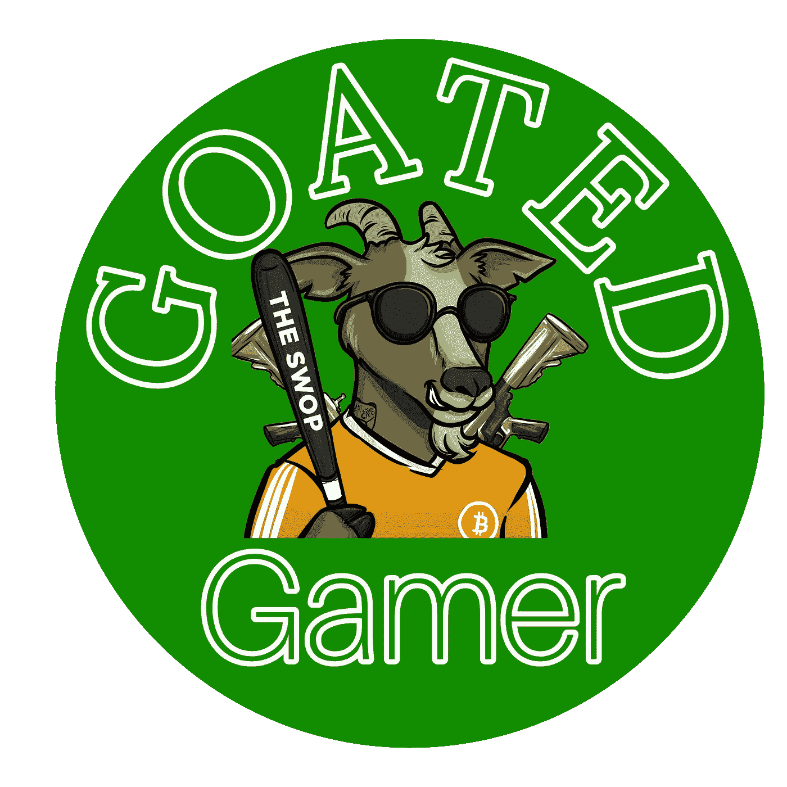

# 游戏和加密

> 原文：<https://medium.com/coinmonks/gaming-crypto-9fa346ffe0c6?source=collection_archive---------48----------------------->

游戏和加密货币早已交织在一起，近年来这两个行业的交集日益突出。虽然游戏传统上是一种娱乐形式，但加密货币的引入为货币化和购买游戏内物品和虚拟货币开辟了新的可能性。

在游戏中使用加密货币的第一个例子是 2009 年在线游戏《第二人生》中引入的比特币。林登实验室创建的虚拟世界 Second Life 允许用户使用加密货币买卖虚拟商品。这标志着一种趋势的开始，这种趋势最终将在游戏行业广泛采用加密货币。

自那以后，加密货币在游戏中的使用呈爆炸式增长，许多游戏和平台现在都接受加密货币作为一种支付形式。这方面最著名的例子是流行的在线皇家战役游戏堡垒之夜，它允许玩家使用加密货币购买游戏中的物品。

> 交易新手？在[最佳密码交易所](/coinmonks/crypto-exchange-dd2f9d6f3769)上尝试[密码交易机器人](/coinmonks/crypto-trading-bot-c2ffce8acb2a)或[复制交易](/coinmonks/top-10-crypto-copy-trading-platforms-for-beginners-d0c37c7d698c)

但游戏和加密货币之间的关系不仅仅是购买虚拟商品的能力。区块链技术的兴起也导致了分散式游戏平台的产生，这些平台使用加密货币和区块链来促进游戏中物品的创造和交易。

一个这样的平台是基于以太坊的游戏 CryptoKitties，它允许玩家使用以太坊购买、出售和繁殖虚拟猫。这款游戏于 2017 年推出，迅速获得了大量粉丝，并有助于推广分散游戏的概念。

分散式游戏的另一个例子是在线游戏 Axie Infinity，它使用以太坊区块链来促进游戏内资产的创建和交易。玩家可以使用加密货币买卖名为 Axies 的虚拟生物，这款游戏已经成为加密货币爱好者的热门目的地。

分散式游戏有可能彻底改变游戏创作和游戏的方式。通过使用区块链技术，开发者可以创建分散的游戏，并在分散的网络上运行。这使得游戏行业更加透明和公平，因为玩家可以确保他们在游戏中的资产是安全的。

除了分散式游戏，加密货币在游戏行业的使用也导致了所谓的“皮肤市场”的产生，这允许玩家使用加密货币买卖虚拟物品。这些虚拟物品被称为皮肤，可以用来定制玩家的游戏角色或武器，受到收藏家的热烈追捧。

最受欢迎的皮肤市场之一是 Steam Marketplace，它由视频游戏公司 Valve Corporation 所有。Steam Marketplace 允许玩家使用加密货币比特币买卖虚拟物品，已经成为寻求交易虚拟物品的游戏玩家的热门目的地。

游戏和加密货币的交叉也导致了电子竞技的产生，这是一种竞争性的视频游戏比赛，经常向获胜者提供大笔现金奖励。许多电子竞技比赛现在接受加密货币作为支付和奖金的一种形式，加密货币在电子竞技中的使用有助于提高这项运动的受欢迎程度。

总之，游戏和加密货币之间的关系是复杂且不断发展的。从比特币在《第二人生》中的早期应用，到去中心化游戏的兴起和皮肤市场的创建，这两个行业的交叉对游戏的玩法和盈利方式产生了重大影响。随着加密货币在游戏中的使用不断增长，我们很可能会看到该行业更多的创新和颠覆。

山羊游戏玩家的文章

*山羊玩家刀是由 Swop 形成的刀

我们的 Twitter 页面👇
[https://twitter.com/GoatedGamerDAO](https://twitter.com/GoatedGamerDAO)

游戏社区👇https://dscvr.one/p/gaming-portal