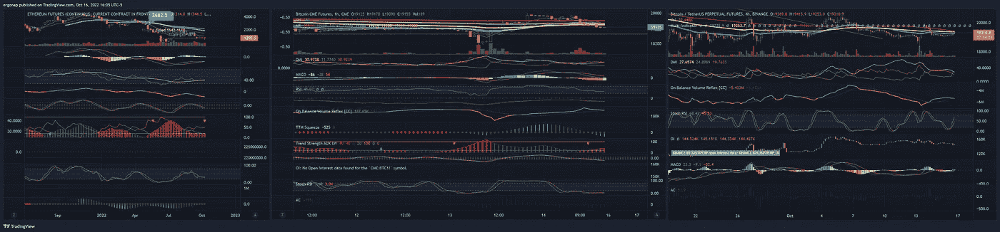
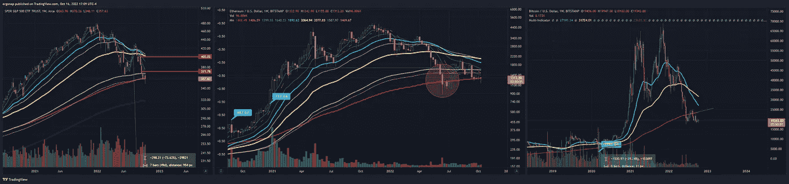
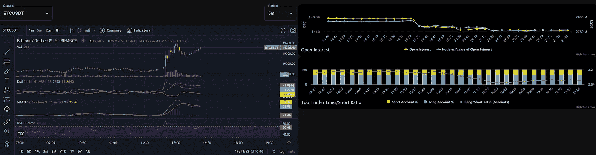
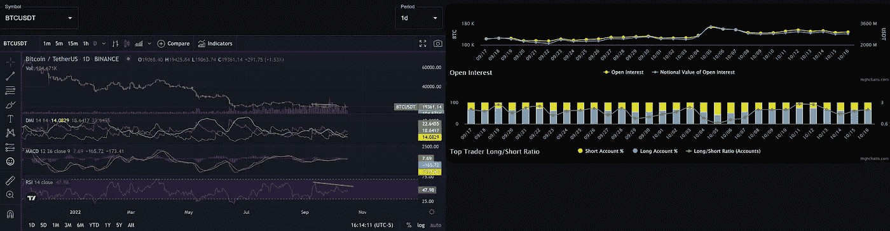

# 差距正在缩小

> 原文：<https://medium.com/coinmonks/gap-down-in-progress-959dcc883ecc?source=collection_archive---------27----------------------->

## 加密货币分析 9/16

再过几个小时，我就要公布很快可能发生的事情，要么 BTC 缩小差距，要么 BTC 缩小差距。可能在我发布这个的时候。注意 BTC 价格 vs BTC1！不出所料，Eth 的处境相同，目前比差距定价高出约 10-15 美元。但总的来说，这并不重要。这是同一个熊市，人们愿意相信反弹会发生。

[https://www.tradingview.com/x/EInvsVqj/](https://www.tradingview.com/x/EInvsVqj/)

this is how the average retail person is right now, don’t ask for my sympathy

然而，现实对那些愿意四处看看的人并不友好。我们有什么？在周线图上:SPY 收盘勉强低于 200 毫安，ETH 勉强在上面，BTC 在下面。记住，瑞士联邦理工学院在现实中基本上是没有前途的，而 BTC 的情况甚至更糟。

[https://www.tradingview.com/x/HvxcTWcL/](https://www.tradingview.com/x/HvxcTWcL/)

密码能成为未来吗？在某种程度上绝对是。那意味着今天存在的任何部分吗？哈哈，不会。总有一天会有反弹，但是在接下来的两个星期？它不太可能是加密的。

[https://imgur.com/a/4hPXrL3](https://imgur.com/a/4hPXrL3)

现在多头的杠杆率非常高，除非他们运气好，我们上涨，但这不太可能。我们有一个直接看跌 BTC 美元的背离。：

[https://imgur.com/sAKI8GN](https://imgur.com/sAKI8GN)

再见。保护钱包的人们，现在不是购买的最佳时机。

> 交易新手？试试[加密交易机器人](/coinmonks/crypto-trading-bot-c2ffce8acb2a)或者[复制交易](/coinmonks/top-10-crypto-copy-trading-platforms-for-beginners-d0c37c7d698c)