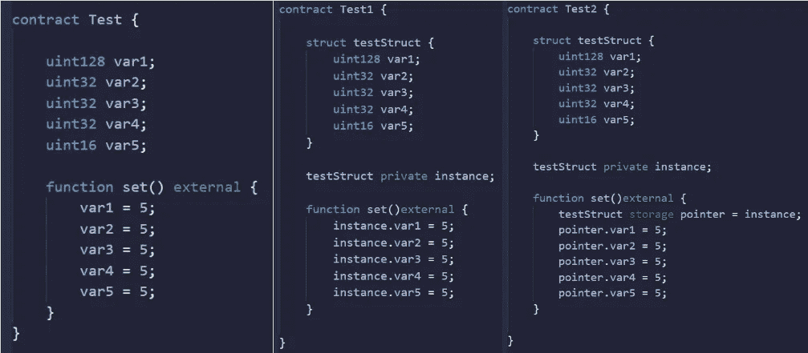
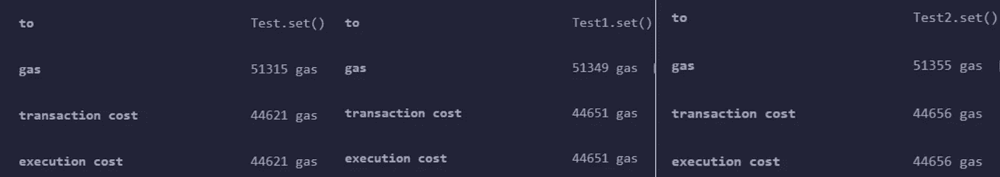
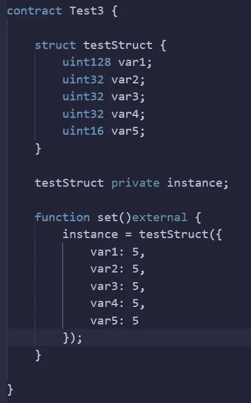
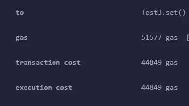

# 可靠性—测试假设第 1 集

> 原文：<https://medium.com/coinmonks/gas-optimization-testing-assumptions-episode-1-c6f40bff4c3b?source=collection_archive---------17----------------------->

第一个假设—如果所有变量都可以作为一个结构存储在单个内存槽(32 字节/256 位)中，则存储变量的成本会更低。

预期

Test(左)—应该是成本最高的，因为每个存储变量都被直接访问
Test1(中间)—应该比 Test(左)便宜，因为所有变量都被存储在一个结构中
Test2(右)—应该比 Test1(中间)便宜，因为已经检索了该结构的存储指针

这不是我所期望的…也许我错过了什么。

好吧，这个怎么样？

我们将一次给所有变量赋值，而不是分别设置结构中的每个变量。让我们查一下它值多少钱。

不，这个更贵。

好了，我们知道了，出于某种原因，将变量存储为变量比存储为结构更便宜。尽管出于可读性的考虑，我还是会使用结构体。

觉得这个有趣吗？
看看这个！[https://medium.com/p/a069b267c6e0](/p/a069b267c6e0)

想多学点扎实？
加入学习小组！[https://discord.gg/KzbcGmrnfN](https://discord.gg/KzbcGmrnfN)

下次见！

你喜欢这篇文章吗？想请我喝杯咖啡吗？
Polygon/Eth/Bsc—0x4a 581 E0 EAF 6b 71d 05905 e8e 6014 DC 0277 a1 b 10 ad

> *交易新手？试试* [*加密交易机器人*](/coinmonks/crypto-trading-bot-c2ffce8acb2a) *或* [*复制交易*](/coinmonks/top-10-crypto-copy-trading-platforms-for-beginners-d0c37c7d698c) *上* [*最好的加密交易*](/coinmonks/crypto-exchange-dd2f9d6f3769)

> 加入 Coinmonks [电报频道](https://t.me/coincodecap)和 [Youtube 频道](https://www.youtube.com/c/coinmonks/videos)获取每日[加密新闻](http://coincodecap.com/)

# 另外，阅读

*   [免费加密信号](/coinmonks/free-crypto-signals-48b25e61a8da) | [加密交易机器人](/coinmonks/crypto-trading-bot-c2ffce8acb2a)
*   [杠杆代币的终极指南](/coinmonks/leveraged-token-3f5257808b22)
*   [16 款最佳折叠电动自行车](/coinmonks/top-17-folding-electric-bikes-5e296f0918cb)
*   [28 款最佳电动自行车点评](/coinmonks/the-28-best-electric-bikes-review-and-buying-guide-in-2023-7bb3146cb403)
*   前三名[币安期货交易机器人](/coinmonks/top-3-binance-futures-trading-bots-e6031f84b3f9)