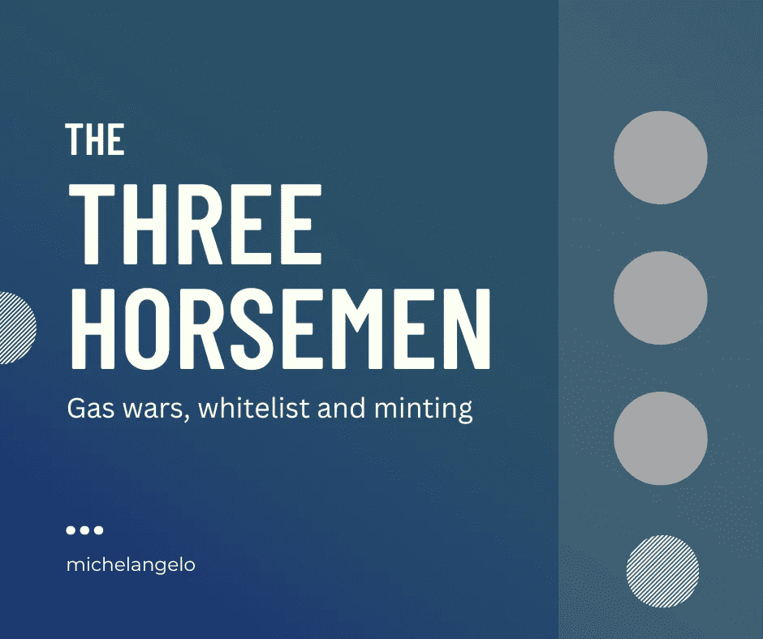

# 天然气战争、白名单和造币；NFT 三骑士

> 原文：<https://medium.com/coinmonks/gas-wars-whitelisting-and-minting-the-three-horsemen-of-nft-cd8f5dddf2b1?source=collection_archive---------35----------------------->

一份为铸造特定 NFT 而写的智能合同存放在区块链。一切都是从区块链诞生开始的。

汽油是你为了处理一个特定的交易而支付的费用；就像它的名字一样，是油钱…

…用于验证器。这些人设置他们的设备来批准你我在区块链上进行的交易。

所有区块链上都有验证器(比特币、以太坊、索拉纳、多边形、卡尔达诺、Near 等等)。

由于 NFTs 智能合约是建立在区块链的基础上的，它们受到验证者和天然气费用的限制。

**什么是汽油费？**

它们是为批准区块链上的某项交易而支付的交易费。它们是那个平台硬币的几个部分。

然而，由于试图一次铸造一个特定项目的人的数量，铸造的需求超过了验证者批准交易的能力。

导致了我们所说的气体战争。这仅仅是提供一个更高的价格给验证者，以便在下一个人之前造币。竞争推动价格上涨，导致战争！

这对项目来说是一个很大的问题，因为在一个时间点，燃气费高于一个项目的底价。

开发人员必须找到一种方法来解决这个问题，因为它阻止了人们铸造。想象一下，以 30 美元的底价支付 500 美元的汽油！可笑。

所以他们想出了白名单。

**什么是白名单？**

这是比公共造币厂更早批准一些人/钱包造币的过程。大多数时候，在公共铸币之前 24 到 48 小时，有一个私人铸币厂，在那里预先批准的钱包铸币，没有气体战争。

如何加入白名单？

有很多方法可以获得白名单。大多数项目都制定了如何赢得白名单的规则。

1.  他们不和谐页面的活跃成员
2.  关注社交媒体页面
3.  为项目创建内容或艺术
4.  邀请成员加入不和谐。

这些标准因项目而异。

但是一旦你被列入白名单，你就可以像真正的精英一样避免天然气战争和造币。

好吧，你有 WL，但还有什么？

WL 不是终点。除非你完成了这个项目，否则 WL 是没有用的！

**什么是铸币？**

铸造是从尘土中创造东西的艺术！就 NFT 而言，它正在区块链创造新的东西。它可能是一个令牌或 NFT。

铸造类型:

1.  公平发行造币厂:NFT 收藏以商定的价格和时间向公众出售。这通常会导致大量的天然气战争，因为许多人都试图一次铸造。
2.  粘合曲线铸币:在这里，铸币的价格从低价开始，然后随着时间的推移而增加。一个项目可以在第一个小时从 0.5 开始铸造，然后增加到 0.6，以此类推。
3.  荷兰动作铸造:这是绑定曲线铸造的反转。在这里，铸造从最高价开始，然后开始下降，直到合同规定了价格。
4.  秘密发射:虽然这本身不是一种铸造类型，但它是一种在尽可能接近发射时间的时候展示铸造地址的模型。这是用来防止人们 botting 发射。

Botting:这是指一些交易者将多个钱包连接到一个机器人上，以便铸造一个项目的多个部分。它被用于交易者使用的扫地出门战术。

他们扫地是为了在二级市场出售。

这些是 NFT 交易前的骑手。请继续关注更多关于 NFT、web3 和 DAOs 的文章。

> 交易新手？试试[加密交易机器人](/coinmonks/crypto-trading-bot-c2ffce8acb2a)或者[复制交易](/coinmonks/top-10-crypto-copy-trading-platforms-for-beginners-d0c37c7d698c)