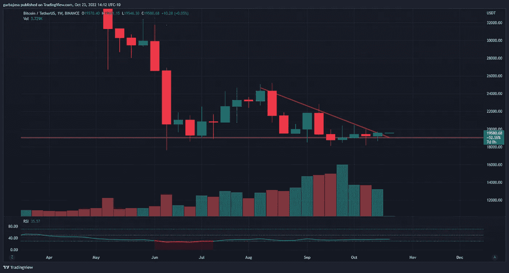
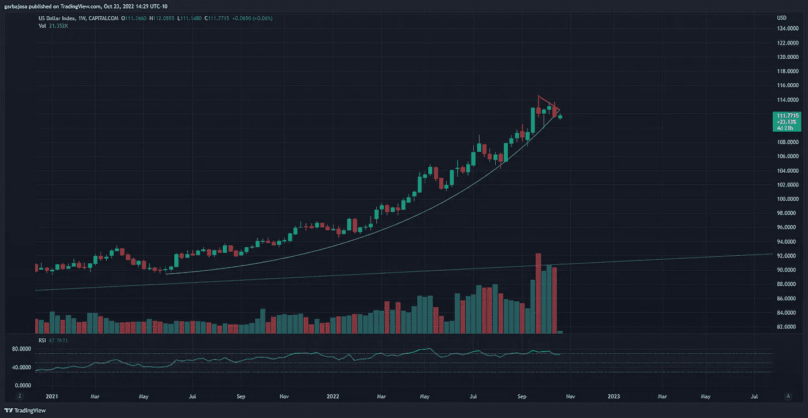
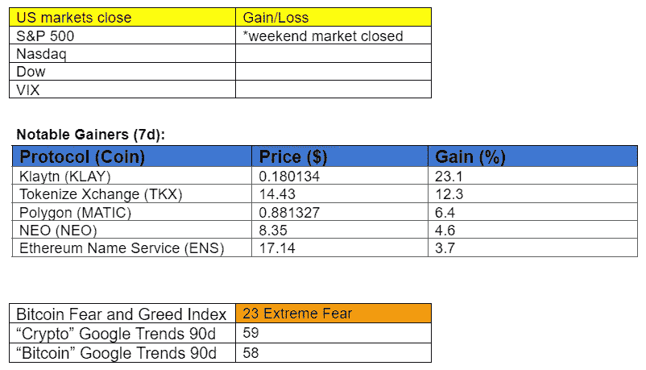

# 加文·伍德辞职。这对波尔卡多特意味着什么？

> 原文：<https://medium.com/coinmonks/gavin-wood-resigns-what-it-means-for-polkadot-c4ae4973272b?source=collection_archive---------2----------------------->

## 每日征服#110

最好的每日新闻、见解和阿尔法信息来源。

Photo by [Traxer](https://unsplash.com/@traxer?utm_source=medium&utm_medium=referral) on [Unsplash](https://unsplash.com?utm_source=medium&utm_medium=referral)

*密码市场是一个狂野、奇妙而令人生畏的地方；不要一个人跋涉！订阅加密征服者，让我们成为您的向导。*

订阅这份每日时事通讯，永不错过任何一期。

**概述**

*   加文伍德辞去首席执行官一职。
*   日本央行干预后市场看起来看涨。
*   SBF 澄清 DCCPA 法案。
*   发起用户名市场的电报。
*   梅西与比特杰特组队。

早上好，家人，

周末在波尔卡多特前线有重大新闻！

Polkadot 和以太坊的联合创始人 Gavin Wood 博士将辞去 Polkadot 生态系统背后的开发公司 Parity Technologies 的首席执行官一职。他保留了“首席架构师”的角色，并将注意力转移到项目建设上。联合创始人 bjrn Wagner 将担任新的首席执行官。

当被要求解释他的决定时，伍德说:

“任何和我一起工作过的人都知道我的心在哪里。我是一名思想家、程序员、设计师和建筑师。像许多这样的人一样，我最好异步工作[……]一个好的首席执行官需要在更持续的基础上为他人服务。他们需要享受在公司内外代表公司的乐趣。他们不需要被会议和电话占用的大量时间所困扰，因为日历上有太多五颜六色的方框。”

最终，这个消息对波尔卡多特生态系统是有利的。伍德的才华在于开发和设计，他将有更多的时间来建立 Polkadot 网络，而瓦格纳可以专注于运行奇偶校验技术。

# 市场更新🌍

**BTC/USDT 1W**

对于比特币来说，这又是平静的一周。波动性仍然很低，因为价格仍然依赖于 19k 美元的支撑位。一个好的消息是，价格爬出了当地的下降趋势阻力，表明 BTC 可能会继续波动。在日本央行干预美元兑日元的推动下，未来一周前景看好，BTC 可能开始向 21.8 美元阻力位进发。BTC 完成周蜡烛上涨 1.60%，至 19，570 美元。

*高清* [***图表***](https://www.tradingview.com/x/dulmmx0v/)

**美元/日元 1D**

虽然日本银行(BoJ)继续干预并捍卫日元(JPY)对美元的汇率，但股票和加密市场将从中受益。本周早些时候，投资者将密切关注美元兑日元，尤其是 1.50 美元兑日元(橙色)，这似乎是日本央行的底线。

*高清* [***图表***](https://www.tradingview.com/x/WbI9vBQH/)

**美元指数(DXY) 1W**

会不会是？自 2021 年 5 月 DXY 抛物线(绿色)开始以来，价格似乎首次成功突破了任意阻力。虽然现在判断上升趋势是否结束还为时过早，但最近的举动显示出一些希望，即日本央行的货币干预是结束美元抛物线周期的催化剂。DXY 指数本周下跌 1.22%，至 111.70 点。

*高分辨率* [***图表***](https://www.tradingview.com/x/BMyPY5Vc/)

如果你喜欢这份报告，并且认为它值 20 分(0.01 美分)，请按下面的鼓掌按钮来支持我的写作。(最多 50 次！)谢谢！

# 新闻观察📰

电报用户名市场即将推出。社交媒体消息应用 Telegram 背后的团队开发了一个拍卖独特用户名的新市场。该市场将使用其本土的区块链开放网络(TON)来分发用户名。Telegram 在全球拥有 5.5 亿用户。

**Gate.io Twitter Hack** 。黑客控制了 crypto-exchange Gate.io 的官方推特，宣传如果用户将他们的加密钱包连接到一个欺诈网站，就可以获得 50 万 USDT 的赠品。Gate.io 的 Twitter 拥有超过 100 万的订阅用户；不知道有多少人受到影响。所以一定要交叉参考网站！

SBF 驱散了空气。 FTX 首席执行官山姆·班克曼-弗里德(SBF) [在推特上发布](https://twitter.com/SBF_FTX/status/1584095445185622016?s=20&t=cDTeWS0h_u2ArCStyBlJJA)关于泄露的数字商品消费者法案引起的所有骚动。他感谢 DeFi 群体的所有建设性意见，并解释了该法案如何以监管集中交易所为中心。上周晚些时候，一个早期的法案版本泄露，激起了对 DeFi 潜在影响的争议。

**新闻花絮:**

*   西班牙超越萨尔瓦多成为第三大加密 ATM 中心[。](https://cointelegraph.com/news/spain-overtakes-el-salvador-to-become-third-largest-crypto-atm-hub)
*   外汇经纪商 Oanda [在美国推出](https://cointelegraph.com/news/new-york-based-forex-broker-oanda-launches-crypto-trading-services-in-the-us)加密交易服务。
*   阿根廷[突袭](https://www.coindesk.com/business/2022/10/21/argentina-dismantles-illegal-crypto-mining-operation-apprehends-40/)非法加密矿工。40 人被捕。
*   奥林巴斯道[剥削](https://decrypt.co/112627/hacker-300k-olympus-dao)30 万美元；黑客几个小时后就归还了。
*   研究: [Aptos vs. Sui。](https://research.thetie.io/aptos-vs-sui/)

**NFT &元宇宙更新🐵**

*   Bitget [与莱昂内尔·梅西](https://bitget.zendesk.com/hc/en-us/articles/11688898613017)合作“探索网络 3、加密货币和足球领域”

我的五分钱…

美元的主导地位正迫使全球各国政府做出反应，以保护其市场和货币免受美元升值的冲击。考虑到这一点，如果日本央行继续捍卫 150 美元/日元的话，本周市场有上行的潜力。

许多有相关催化剂的替代硬币表现优于 BTC，并为上涨打开了交易机会。本周，一些需要关注的主要替代货币有:EVMOS、AAVE、MATIC、LIDO 和 OP，它们都在美元走软的第一个迹象出现时跳涨。

***加百列***

*关注我* [*推特*](https://twitter.com/web3_gabri) *每日更新！*

> 交易新手？尝试[加密交易机器人](/coinmonks/crypto-trading-bot-c2ffce8acb2a)或[复制交易](/coinmonks/top-10-crypto-copy-trading-platforms-for-beginners-d0c37c7d698c)