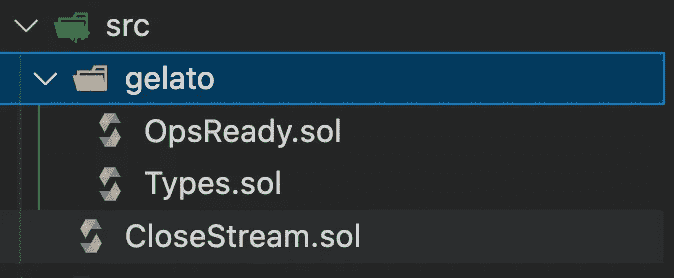
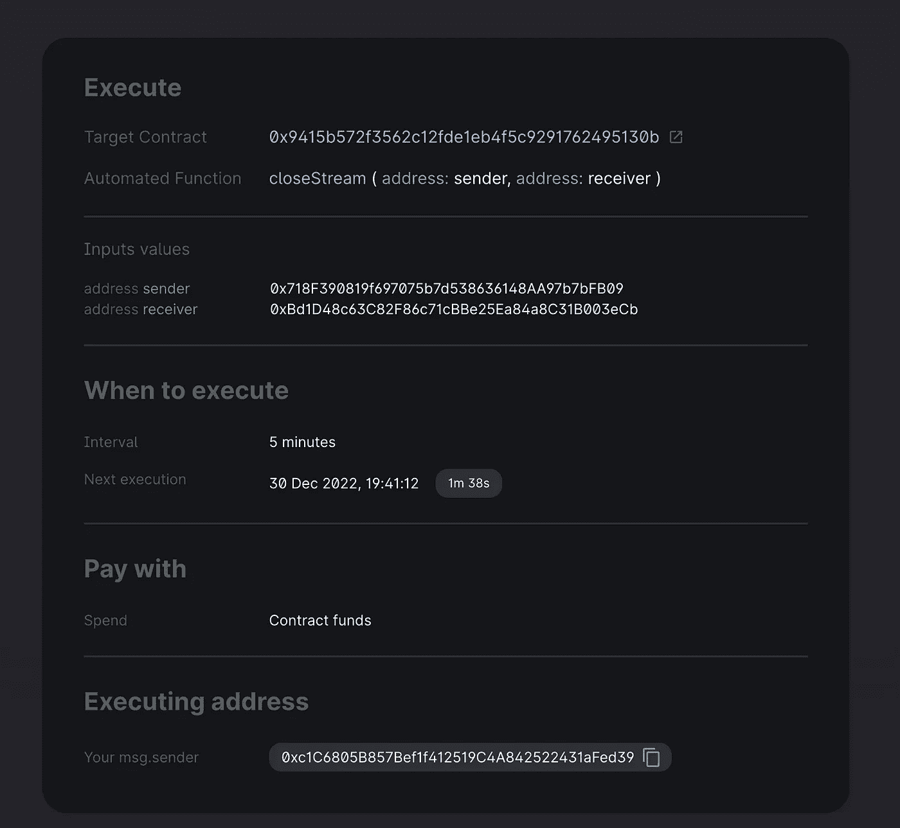

# 意式冰淇淋·V2 &超流体

> 原文：<https://medium.com/coinmonks/gelato-v2-superfluid-eb13166ac414?source=collection_archive---------5----------------------->

到 2023 年，让您的流自动化变得更加容易！！


Gelato Automate

意式冰淇淋网络在过去几个月发布了新版本。在这里，您可以找到变化，并准备好自动化您的流。

新的**意式冰淇淋版本 V2 遵循模块化的方法，允许更多的灵活性。**

我们将从超流 [#dev-support](https://discord.com/channels/752490247643725875/752493348169711696) discord 频道中最常见的问题之一开始:“如何安排停止一个流？”，尽管该功能是在 Superfluid dashboard 中实现的，但了解如何以编程方式实现它是值得的。

在这里你可以找到一个演练视频。

由于我们要四处转转，所以让我介绍/更新一下让意式冰淇淋启动并运行的 3x3 步骤:

1.  **有线意式冰淇淋基础设施**:我们的合同更新，允许与意式冰淇淋的通信自动化
2.  **融资策略:**有两种可供选择的交易支付方式；从意式冰淇淋平衡或每笔交易支付本身。我们选择每笔交易都要自己买单。我们必须别忘了为合同提供资金。更多关于付款的信息可以在这里看到。
3.  **意式冰淇淋自定义逻辑:**包括任务创建、检查器条件、待执行任务。
    -任务创建可以从合同/SDK 或通过意式冰淇淋自动化 UI 动态完成
    -在我们的例子中，检查条件很简单，因为我们只需检查关闭流的时间。
    -可执行函数也很简单，就好像我们已经创建了一个流，我们知道如何关闭它。我们应该记住，执行关闭功能的 EOA/契约必须得到流所有者的授权才能关闭流

# 亲自动手

回购示例可在以下位置找到:

[](https://github.com/donoso-eth/superfluid-gelato-automation) [## GitHub-donoso-eth/超流体-凝胶-自动化

### 一个超级简单的铸造/安全帽混合项目，利用超流体的 CFA 访问控制列表功能和意式冰淇淋…

github.com](https://github.com/donoso-eth/superfluid-gelato-automation) 

对于如何开始一个流，我们有不同的选择:使用 superfluid dashboard、SDK 或合同中的 cfaLibrary。

让我们考虑如何关闭流，我们必须记住，意式冰淇淋操作合同将调用可执行函数，意式冰淇淋操作合同将调用可执行函数，在超流中，只有流的发送者或接收者可以关闭/停止流。

在[超流 ACL(访问控制列表](https://docs.superfluid.finance/superfluid/developers/constant-flow-agreement-cfa/cfa-access-control-list-acl) t)的帮助下，我们可以授权一个智能合约来停止流。这将使我们的生活更容易，因为从合同中我们可以

## 意式冰淇淋

如果我们遵循上述步骤，我们必须:

1.  有线意式冰淇淋基础设施:
    我们将把 Gelato 文件夹复制到我们的合同文件夹。我们可以在这里找到文件。文件夹结构应该如下所示



Gelato Helper Contracts

继承 OpsReady 合同

```
contract CloseStream is OpsReady {

    constructor( address _ops ) 
     OpsReady(_ops, address(this)){

    }
```

2.融资策略，我们将为每笔交易支付的目标合同。我们必须为我们的合同提供资金，并确保费用通过执行转移到意式冰淇淋

3.意式冰淇淋自定义逻辑
我们将从契约中动态创建任务。让我们看看我们将用来创建任务的代码。

```
 taskId = ops.createTask(execAddress, execData, moduleData, ETH);
```

执行任务的合同地址

`exexData()`任务将要执行的代码

```
 bytes memory execData = 
abi.encodeWithSelector(this.closeStream.selector, sender,receiver);
// closeStream is the executable function
```

`moduleData`就是我们如何配置我们的任务。有四个配置模块:
- **解析器**:当我们需要自定义逻辑来检查功能是否必须执行时。
- **时间**:当执行将在特定的时间点发生
- **代理**:当我们需要一个专用的消息发送者
- **Single_exec** :当我们只需要一次执行

`ETH`支付交易的代币

在我们的用例中，我们将设置 **TimeModule 和 SingleExec** 模块，确保可执行函数在要求的时间戳运行，并且只运行一次(我们只关闭流一次)。我们像这样构建我们的模块数据:

```
 bytes memory timeArgs = 
    abi.encode(uint128(block.timestamp + duration), duration);

    Module[] memory modules = new Module[](2);

    modules[0] = Module.TIME;
    modules[1] = Module.SINGLE_EXEC;

    bytes[] memory args = new bytes[](1);

    args[0] = timeArgs;

    ModuleData memory moduleData = ModuleData(modules, args);
```

关于模块的更多信息可以在找到

我们不需要 checker 条件。

可执行函数最终将是:

```
 function closeStream(address sender, address receiver) external onlyOps {

       (uint256 fee, address feeToken) = ops.getFeeDetails();
       _transfer(fee, feeToken); // fee transferred

       _cfaLib.deleteFlow(sender, receiver, superToken);

       taskId = bytes32(0);

    }
```

## 合同

我们的合同:

到目前为止，我们有一个合同准备关闭流。我们必须只创建一个流，授权我们的契约来停止该流，并创建任务来关闭该流。

## 剧本

合同部署:

```
yarn deploy goerli
```

控制台将记录如下内容:

```
Close Stream deployed succsessfully 
at: 0xCC7FA88DB7df720EA72872ad7C19fd85026047d9
```

我们将把部署的地址复制到`./scripts/Helpers.ts`中，以便以后可以使用。

```
export const CloseStreamAddress = "0xCC7FA88DB7df720EA72872ad7C19fd85026047d9";
```

我们将验证我们的合同，以便稍后与 etherscan 进行交互

```
yarn verify goerli // in scripts/verify.ts
```

我们现在将开始一个流。我们可以使用 SDK 或直接从[超流仪表板](https://app.superfluid.finance/)中完成。借助 SDK:

```
yarn startStream goerli // in scripts/startStream.ts
```

授权我们的智能合同来阻止水流

```
yarn authorizeControl goerli // in scripts/authorizeControl.ts
```

创建意式冰淇淋任务来关闭流

```
yarn createTaskStopStream goerli // in scripts/createTaskStopStream.ts
```

如果我们查看 gelato 应用程序，我们可以看到我们的任务已经在运行了



## 瞧

如果我们等待几分钟，我们将看到任务执行，我们的流将被关闭！

# 结论

将 gelato 网络接入我们的智能合约**并**释放自动化的全部潜力**相对简单。做这件事有几种方法。我们选择了最常用的一个。**

> 花些时间从直升机上了解超流体和意式冰淇淋是如何工作的是值得的

意式冰淇淋 V2 引入了模块的概念，这给了开发人员更多的灵活性来选择如何配置任务。在第一次之后，编码/解码是简单的。

这篇文章**可以帮助其他开发者快速启动并运行**gelato，并将其应用于超流体流。

敬请关注一月份，在意式冰淇淋[链外解析器](https://docs.gelato.network/developer-services/automate/guides/writing-a-resolver/off-chain-resolver)的帮助下，我们将回答 0xFran.eth/lens 的推特！！

你可以在推特上联系我 [@donoso_eth](https://twitter.com/donoso_eth?ref=hackernoon.com)

# 资源

## 意式冰淇淋

[意式冰淇淋网](https://www.gelato.network/)
[意式冰淇淋自动化 app](https://app.gelato.network/?ref=gelato.network)
[意式冰淇淋文档](https://docs.gelato.network/introduction/what-is-gelato)

## 超流体

[超流金融](https://www.superfluid.finance/)
[超流仪表盘](https://app.superfluid.finance/)
[超流文档](https://docs.superfluid.finance/superfluid/)

**意式冰淇淋 V1 &超流体超级应用篇**

[](/@javier_donoso/superfluid-gelato-for-stream-scheduling-7c32ed975f04) [## 超流和意式冰淇淋用于流调度

### 🚀了解如何在超级应用中自动启动/停止超流流

medium.com](/@javier_donoso/superfluid-gelato-for-stream-scheduling-7c32ed975f04)