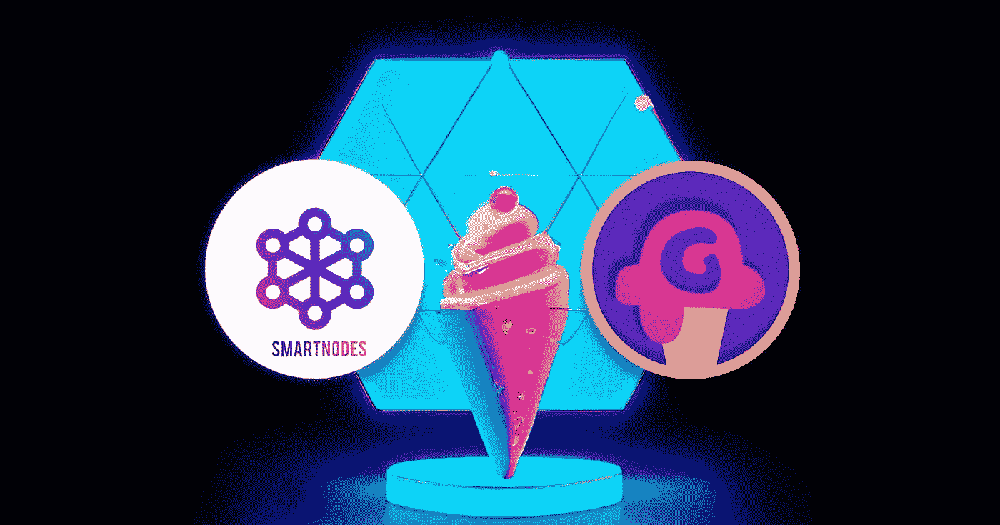

# Gelotto 与 SmartNodes 合作，为 IBC 资产推出 Gelotto 验证器

> 原文：<https://medium.com/coinmonks/gelotto-partners-with-smartnodes-to-launch-gelotto-validators-for-ibc-assets-5e70c8eeac3b?source=collection_archive---------8----------------------->

Smartnodes partners with Gelotto

# 什么是 Gelotto:

Gelotto 是一个基于运气的游戏平台——一个建立在 Juno 网络上的分散式赌场。Gelotto 将于 2022 年第三季度推出，最初将为各种 IBC 资产提供彩票游戏。未来的扩展将包括其他游戏的机会，如 21 点，插槽，等等。

除了标准的彩票游戏，Gelotto 还将提供每周一次的超级大奖游戏和每年一次的大奖游戏，这些游戏的资金来自标准游戏中每个奖池的一部分，以及其他收入，如 NFT 销售额和赌注证明验证器佣金。

[链接:Gelotto 白皮书](https://blog.gelotto.io/gelotto-cryptocurrency-based-games-of-chance-governed-by-smart-contracts)

# 什么是智能节点:

SmartNodes 是一家基础设施提供商，提供证据区块链和分散式项目。SmartNodes 使用企业级服务器，遍布全球最先进的环保数据中心。

Smartnodes 的基础设施通过多层安全功能进行保护，这些功能使用私有连接和公共哨兵节点来减少网络攻击，并混合使用软件和硬件密钥管理解决方案。Smartnodes 保持持续的备份和故障保护措施、24/7 监控和经验丰富的内部协议，以最大限度地提高正常运行时间和安全性。

[链接:SmartNodes 网站](https://smartnodes.one/)

# Gelotto 将于 2022 年第三季度推出由 SmartNodes 技术支持的验证器

作为其路线图的一部分，Gelotto 打算首先在 JUNO、OSMO 和 STARS 网络上推出验证器，并在未来可能在其他网络上推出。

[链接:Gelotto 第一年路线图](https://blog.gelotto.io/gelotto-a-roadmap-for-year-1)

Gelotto 与 IBC 生态系统中的各种实体建立了合作伙伴关系，并选择在该生态系统中推出其平台，因为该社区非常活跃且相互关联。Gelotto 希望其平台能够吸引投资和对 IBC 生态系统的兴趣，并成为 IBC 社区的积极成员。

因此，Gelotto 打算通过赌注协助保护多个 IBC 网络，并参与这些网络的治理。通过验证器收到的佣金可用于资助 Gelotto 平台的各个方面，包括激励各种奖池。

SmartNodes 也深深扎根于宇宙/IBC 社区，活跃于多个网络，并将其专业知识和经验提供给整个 IBC 生态系统。Smartnodes 致力于为其所在的生态系统和社区做出贡献和回馈。

SmartNodes 团队包括在信息技术、金融、营销和法律领域拥有专业知识的不同个人，他们共同努力，与 IBC 社区一起构建 web3 的未来。SmartNodes 致力于建立强大的社区和合作伙伴关系，同时在 IBC 验证领域提供高质量的基础设施和丰富的经验。

在 SmartNodes 团队专业知识的支持下，Gelotto 将于 2022 年第三季度末在 Juno 网络上推出其第一个验证器，并随后推出其他验证器。为了鼓励参与 JUNO 网络和 Gelotto 平台，Gelotto 将向至少持有 50 个 Juno 的授权者分发一部分二级 GKEY 令牌。

Gelotto 和 SmartNodes 都非常期待这种合作关系能够生根发芽，并为 IBC 社区提供更多高质量、一流的验证程序选项。

**Socials**| |[**Reddit**](https://www.reddit.com/user/Smart_nodes/)**|**[**Twitter**](https://mobile.twitter.com/nodes_smart)**|**[**网站**](https://smartnodes.one/) **|** [**电报**](https://t.me/smartnodesvalidators)**|**[**insta gram**](https://www.instagram.com/smartnodes_validator/?igshid=YmMyMTA2M2Y=)**|**[**不和**](https://discord.com/invite/TA3UVPwn6D)

> 加入 Coinmonks [电报频道](https://t.me/coincodecap)和 [Youtube 频道](https://www.youtube.com/c/coinmonks/videos)了解加密交易和投资

# 另外，阅读

*   [8 大加密附属计划](https://coincodecap.com/crypto-affiliate-programs) | [eToro vs 比特币基地](https://coincodecap.com/etoro-vs-coinbase)
*   [最佳以太坊钱包](https://coincodecap.com/best-ethereum-wallets) | [电报上的加密货币机器人](https://coincodecap.com/telegram-crypto-bots)
*   [交易杠杆代币的最佳交易所](https://coincodecap.com/leveraged-token-exchanges) | [购买弗洛基](https://coincodecap.com/buy-floki-inu-token)
*   [3 commas vs Pionex vs Cryptohopper](https://coincodecap.com/3commas-vs-pionex-vs-cryptohopper)|[Bingbon Review](https://coincodecap.com/bingbon-review)
*   [加密复制交易平台](/coinmonks/top-10-crypto-copy-trading-platforms-for-beginners-d0c37c7d698c) | [如何在 WazirX 上购买比特币](/coinmonks/buy-bitcoin-on-wazirx-2d12b7989af1)