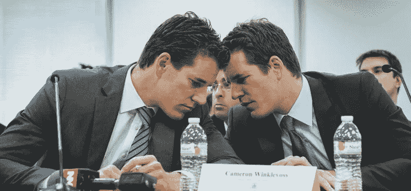

# 双子星交易所被起诉

> 原文：<https://medium.com/coinmonks/gemini-exchange-sued-dbae7d7621da?source=collection_archive---------28----------------------->

投资者起诉 Gemini Trust Co .及其创始人泰勒和卡梅隆·文克莱沃斯，称加密资产交易所出售其未注册为证券的计息账户。

投资者在周二向曼哈顿联邦法院提交的集体诉讼中指控该公司及其创始人欺诈和违反交易法。

> 交易新手？在[最佳密码交易所](/coinmonks/crypto-exchange-dd2f9d6f3769)上尝试[密码交易机器人](/coinmonks/crypto-trading-bot-c2ffce8acb2a)或[复制交易](/coinmonks/top-10-crypto-copy-trading-platforms-for-beginners-d0c37c7d698c)

该诉讼称，Gemini Trust Earn 的产品吸引了投资者，这些投资者有可能获得高达 8%的资产收益率。然而，在 11 月中旬，泰勒和卡梅隆·文克莱沃斯在主要合作伙伴创世纪环球陷入财务困境后突然暂停了产品。

> “双子座拒绝支付任何进一步的款项，实际上消灭了所有仍在该计划中拥有资产的投资者，”诉状写道。

投资者表示，如果这些产品已经注册，他们就会收到信息，从而能够更好地评估风险。

Gemini 没有回应该出版物的置评请求。然而，在 12 月 23 日网站上的一篇文章中，该公司表示，它正在“一天 24 小时和公共假日”工作，以解决 Genesis 的流动性问题。

由于 Genesis 的财务困难，Gemini 已停止从其 Gemini Earn 贷款部门撤出加密货币。由于 FTX 加密货币交易所的崩溃，Genesis 还停止了客户资产的提取。该公司打算吸引投资以克服流动性危机。

现在，这家加密货币经纪商及其母公司数字货币集团(DCG)欠 Gemini 客户约 9 亿美元。DCG 还欠创世纪公司 17 亿美元的未偿债务。此外，由于对冲三箭资本基金(hedge Three Arrows Capital fund)破产，加密经纪商在夏季损失了 11 亿美元。

📰 ***订阅*** [***斐波那契***](/@unclefibonacci) ***我来保持最新***

> 加入 Coinmonks [电报频道](https://t.me/coincodecap)和 [Youtube 频道](https://www.youtube.com/c/coinmonks/videos)了解加密交易和投资

# 另外，阅读

*   [Pionex 双重投资](https://coincodecap.com/pionex-dual-investment) | [AdvCash 审核](https://coincodecap.com/advcash-review)
*   [面向开发者的 8 个最佳加密货币 APIs】](https://coincodecap.com/best-cryptocurrency-apis)
*   [密码交易机器人](/coinmonks/crypto-trading-bot-c2ffce8acb2a) | [维护审查](https://coincodecap.com/uphold-review)
*   [十大最佳加密货币博客](https://coincodecap.com/best-cryptocurrency-blogs) | [YouHodler 评论](https://coincodecap.com/youhodler-review)
*   [my constant Review](https://coincodecap.com/myconstant-review)|[8 款最佳摇摆交易机器人](https://coincodecap.com/best-swing-trading-bots)