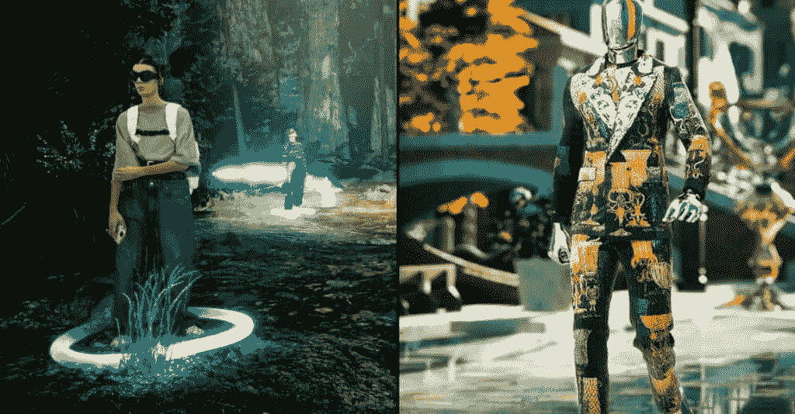

# Gen Zers 从他们的元宇宙头像中获得现实生活中服装选择的灵感

> 原文：<https://medium.com/coinmonks/gen-zers-are-getting-ideas-for-clothing-choices-in-real-life-from-their-metaverse-avatars-d50d6d30f17?source=collection_archive---------42----------------------->

# 元宇宙头像

[https://koop 360 . com/blog/clothing-idea-in-real-life-from-元宇宙-avatars/](https://koop360.com/blog/clothing-idea-in-real-life-from-metaverse-avatars/)

> *虚拟形象时尚产业的演变，涉及的品牌，以及这预示着消费者对数字时尚的需求。该电子商务平台发布了一项新的研究，为寻求在快速发展的虚拟世界中占有一席之地的公司提供了见解。*

[Roblox](https://www.roblox.com/) 调查了 1000 名 Z 世代成员的时尚偏好。五分之二的人希望他们的头像比自己更时尚。据摩根士丹利称，到 2030 年，数字时尚市场可能达到 500 亿美元。

# 热门移动趋势

40%的 Z 世代用户已经为头像购买了服装和配饰，这使得元宇宙成为推动社区增长的又一个机会。这款**“Lola”**绗缝手袋由[博柏利](https://in.burberry.com/)制造，这是一个以其独特的格子图案而闻名的英国奢侈品牌，零售价超过 2500 美元。

> 从顶级交易者那里复制交易机器人。免费试用。

然而，在游戏网站 Roblox 上，用户可以花不到 10 美元购买一个 Lola 手袋来装饰他们的数字化身。他们还可以花 2.10 美元买一个粉色的古驰·马蒙特手袋，花 1.25 美元买一顶拉夫·劳伦的帽子。

# 为什么头像造型是品牌的下一个时尚前沿？

2006 年发布的 Roblox 声明的代表和超过 5000 万的每日用户。该网站现在是“[元宇宙](https://koop360.com/blog/how-metaverse-is-transforming-industries/)”访问量最大的门户网站之一，“T13”是一个用来描述另类数字世界的术语。

对于一些时尚人士来说，在元宇宙展示自己的时尚比在现实世界中更为重要。

Roblox 与帕森斯设计学院合作，调查了 1000 名 14 至 24 岁的美国 Z 世代成员的时尚偏好。

根据调查结果，五分之二的 Z 世代成员更关心通过他们在数字世界中佩戴的配饰和服装来表达自己，而不是在现实世界中。

四分之三的受访者渴望进行数字化投资，四分之一的人承认在一件特定的物品上花了 20-100 美元。

数字设计的价格通常只是现实生活中价格的一小部分。这有助于年轻用户更容易看到大胆的高端时尚，除非古驰·狄俄尼索斯的包在市场上多卖了 800 美元。

# 接触下一代

Roblox 的一名女发言人表示，游戏中的货币名为**“Robux”**，100 Robux 的价格为 1 美元。

由于用户的虚拟形象可以从他们的物理存在中出现、穿着和拥有独特的个性，数字时尚正在演变成一种更具包容性的自我表达形式。

Roblox 全球品牌合作伙伴副总裁克里斯蒂娜·伍顿(Christina Wootton)表示，“在现实世界中，你可能会对探索不同体型的不同服装感到不太舒服。所以，这个空间给了人们一个做自己、尝试新事物、找到自己的人的地方。”

伍顿向 Insider 表示，70%的受访者声称他们从自己的虚拟形象中获得了现实生活中的时尚创意，这是调查中最让她吃惊的部分。她预计，随着数字时尚的发展，这个数字还会上升。

摩根士丹利预测，到 2030 年，数字时尚产业将价值 500 亿美元。

**新的收入机会**

在过去的几年里，一些著名的时尚品牌已经开始探索元宇宙。在流行的在线游戏平台 Roblox 上，古驰已经通过主持一个被称为**“古驰镇”的虚拟社区走在了潮流的前面在沙盒平台上，该公司于 10 月推出了古驰金库。**

拉夫·劳伦、卡罗琳娜·海莱拉和汤米·席尔菲格是使用互联网的知名设计师。对于设计师来说，在将想法投入现实世界之前，尝试这些想法是一种低风险的方式。

伍顿声称，超过 100 家企业专门为 Roblox 设计了钱包、鞋类和其他服装。

同时，也引进了新的设计师。根据 Roblox 进行的一项民意调查，自 2022 年开始以来，该平台上已经开发了超过 6200 万件衣服和配饰。这个数字代表了超过 1150 万创作者的作品。

伍顿认为“成为你想成为的任何人，而不会收到他人的负面回应”对大多数人来说是一个主要的吸引力。

**结论**

如果一个时尚品牌想进入元宇宙，它需要一个从现实世界到网络 3 的桥梁。这种体验不能简单化，也不能强求。Roblox 询问了 1000 名 Gen Zers 关于他们的时尚偏好，五分之二的人声称他们更关心他们的数字自我。伍顿声称，超过 100 家公司专门为 Roblox 设计了配件和服装。

***Roblox 的调查发现，自 2022 年以来，1150 万用户开发了超过 6200 万件服装和配饰。***

> 交易新手？试试[加密交易机器人](/coinmonks/crypto-trading-bot-c2ffce8acb2a)或者[复制交易](/coinmonks/top-10-crypto-copy-trading-platforms-for-beginners-d0c37c7d698c)

*   [我的密码交易经历](/coinmonks/my-experience-with-crypto-copy-trading-d6feb2ce3ac5) | [《比特币基地评论》](/coinmonks/coinbase-review-6ef4e0f56064)
*   [CoinFLEX 评论](https://coincodecap.com/coinflex-review) | [AEX 交易所评论](https://coincodecap.com/aex-exchange-review) | [UPbit 评论](https://coincodecap.com/upbit-review)
*   [AscendEx 保证金交易](https://coincodecap.com/ascendex-margin-trading) | [Bitfinex 赌注](https://coincodecap.com/bitfinex-staking) | [bitFlyer 审核](https://coincodecap.com/bitflyer-review)
*   [麻雀交换评论](https://coincodecap.com/sparrow-exchange-review) | [纳什交换评论](https://coincodecap.com/nash-exchange-review)
*   [支持卡审核](https://coincodecap.com/uphold-card-review) | [信任钱包 vs 元掩码](https://coincodecap.com/trust-wallet-vs-metamask)