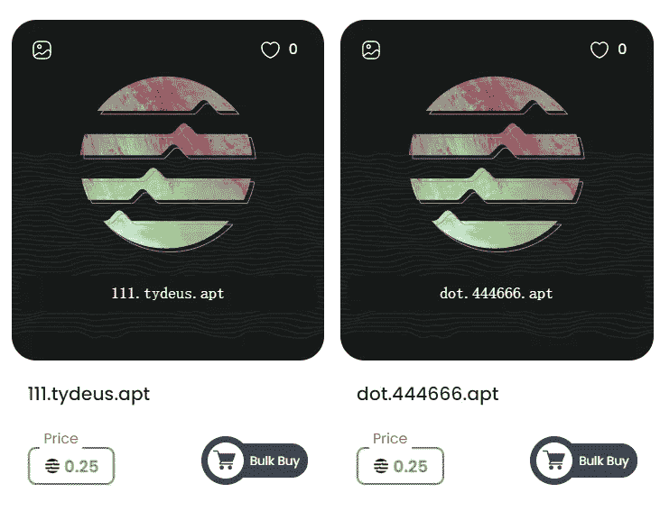
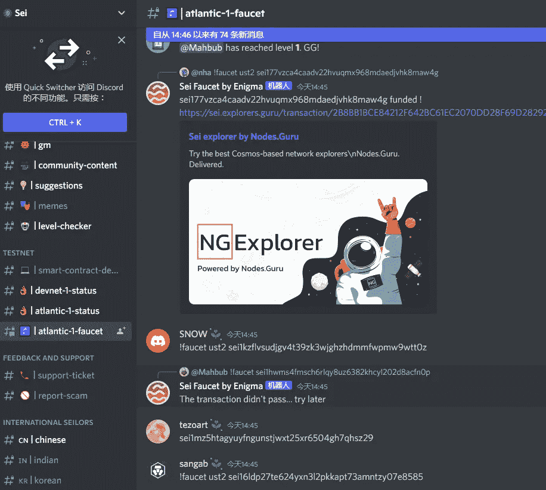

# APTOS 链上的 Genesis NFT 阿尔法羊在 15 分钟内飙升 85 倍

> 原文：<https://medium.com/coinmonks/genesis-nft-alpha-sheep-on-the-aptos-chain-soared-85-times-in-15-minutes-24659db6d6cc?source=collection_archive---------7----------------------->

APTOS mainnet 前两天上线，APT 空投。价格从 1 到 100 后，暂时稳定在 7usdt，没有大涨大跌，流动性也不多。

APTOS 上线后，其生态项目开始受到更多关注。不同的应用包括交易互换、defi 业务、跨链运营、域名、钱包、DAO、NFT 等都有布局。

当整个生态系统爆炸的时候，APT 也会有更大的赋能。熊市布局公链，是看整个生态发展状态是否更有保障，技术体验是否更好，项目是否更丰富。

比如 ETH 链上已经有丰富的应用，每天都有新的项目推出，但是链上的煤气费高，交易拥堵，时有窃电的情况，市场需要更优化的网络环境。

APTOS public chain

在目前的市场环境下，最受欢迎的新公共链是 NFT 项目。APT 链上的 NFT 平台 bluemove 推出了创世纪 NFT 阿尔法羊。

这只羊昨天上线，起拍价 1APT，总数 1000 只，1 秒售罄；15 分钟后，楼面价涨到 85APT，涨幅 85 倍。

目前楼面价已经回到 18APT，成交 2 万多 APT，15 万美金。

有热度就有炒作。虽然这款阿尔法羊前期预热不多，但作为 APTOS 链上的第一款 NFT，秒上线依然火爆。

但在熊市中，市场的热情无法持续高涨，楼面价快速下跌，成交量也受到限制。

NFT Alpha Sheep on the APTOS chain

APTOS mainnet 突然宣布发射、空投公告等一系列操作，让玩家感觉很仓促，好像项目还没准备好，就草草开始了。

比如 Bluemove 交易平台也很粗糙。目前平台只有阿尔法羊和。apt 域名。首页相关媒体链接无法打开，无法查看 NFT 交易详情。

其中，web3 域名。apt，目前楼面价 0.23ATP，总成交量 384APT，注册只有 15k 多。

最近推出了太多各种后缀的 web3 域名，炒作概念更多。玩家已经累了，或者真的没有多余的流动性。

web3 domain name .apt floor price is less than $2

随着 APT 空投的推出，前期批量互动的玩家受益匪浅，这两天空投教程的需求持续上升。但是空投并不容易。即使有教程跟着操作，也要花费大量的时间和精力，还要解决过程中可能出现的问题。有时候一个步骤卡住了，很难继续。

空投过程中，看到别人的轻松富裕和自由，其实是他们日以继夜付出了多少互动的结果。

an operation step of an interaction

目前 APTOS 刚刚上线，还有一定热度，但后期生态发展还要看市场反馈。

对于新的生态项目，能参与进来的就参与进来，高价接手的就不理了，因为不知道什么时候市场会暴跌。

如果阿尔法羊是在 85APT 接手的，现在只剩下 18APT，几个小时就跌了 78%。如果没有足够的 APT，或者如果他们跑得很快，没有抓住 1 只羊，等待下一次。

比如这款 APTOS 猴子即将推出。不知道会不会是新的机会。有兴趣可以搜索关注一下。

AptosMonkeys Project

在密码市场，哪里受欢迎，哪里就有短期机会；而人气高的项目，如果没有持续的叙事能力和完善的项目经验，就会跌得很快。

如果不喜欢玩短线，不如只看，不操作，在余额有限的低迷和熊市中等待机会。

以上只是我个人观点，没有投资建议。我是楚小莲，我正在关注元宇宙和 web3。

> 交易新手？试试[加密交易机器人](/coinmonks/crypto-trading-bot-c2ffce8acb2a)或者[复制交易](/coinmonks/top-10-crypto-copy-trading-platforms-for-beginners-d0c37c7d698c)