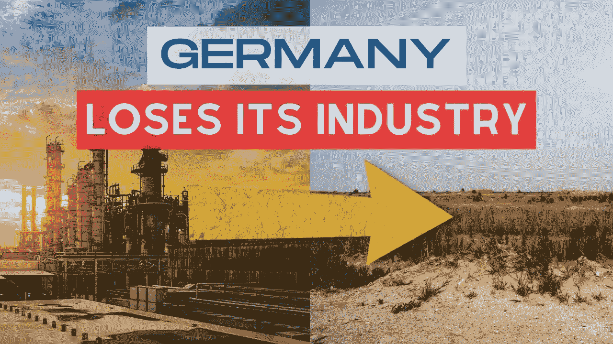

# 德国去工业化——欧盟的终结？

> 原文：<https://medium.com/coinmonks/german-de-industrialization-the-end-of-europe-as-we-know-it-7df1a5295d31?source=collection_archive---------5----------------------->

“我们离成为世界上最大的工业国家之一的工业博物馆只有一小步之遥。”这些是德国化学工业协会(VCI)总经理的话。

他知道德国有大麻烦了。但是有出路吗？

## 2022 年:德国商业模式已死