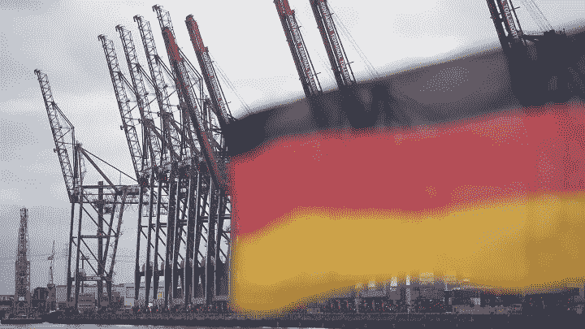

# 德国处于警戒状态:经济部长宣布经济衰退

> 原文：<https://medium.com/coinmonks/germany-on-alert-economy-minister-announces-recession-cfa3bddc6d06?source=collection_archive---------21----------------------->

德国经济部长周三(2022 年 10 月 12 日)的声明预测，2023 年德国 GDP 将下降 0.4%。如果这个消息对世界第四大经济强国来说是坏消息，考虑到后 Covid 时代的欧洲经济状况、欧洲央行收紧货币政策以及俄罗斯和西方在能源问题上的地缘政治紧张局势，这是可以预见的。我们在这篇文章中做了总结。

