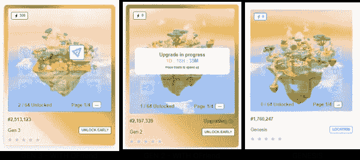
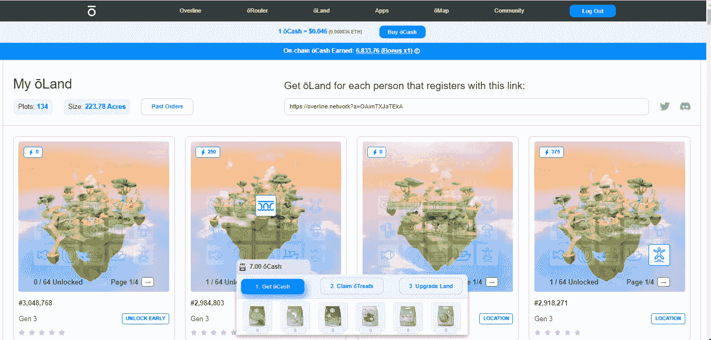
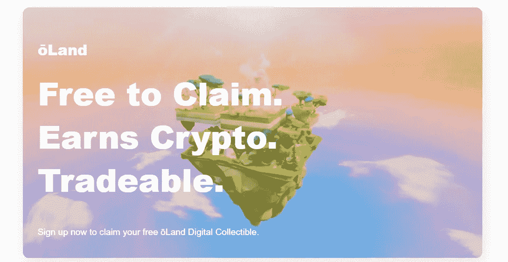

# 获得免费的 NFT 岛

> 原文：<https://medium.com/coinmonks/get-a-free-%C5%8Dland-nft-31378f9a42ef?source=collection_archive---------8----------------------->

路由器、土地、现金、款待和朋友。

> NFT 称之为六步之地的土地象征着 Overline 无线元宇宙内的数字房地产和现实世界中 1.67 英亩的土地。在 Overline 的无线网络中，“土地”代表一种所有权。1.67 英亩土地的所有者从无线活动中获得加密货币激励，这些无线活动通过在这些土地上运行的路由器设备流动。

## 如何到达你的 NFT 岛？

1.  访问[跨线空投页面](https://overline.network?a=OAimTXJaTEkA)。
2.  输入您的信息进行注册。
3.  第三步是检查你的邮件。
4.  你将获得一个[免费的 NFT 土地](https://overline.network?a=OAimTXJaTEkA)
5.  此外，每条建议都可以获得 NFT 奖。

# 让我们来谈谈“路由器”、“土地”、“现金”、“款待”和“朋友”。

许多人在各种论坛上请求对什么是 [Overline](https://overline.network?a=OAimTXJaTEkA) 网络、它如何工作以及路由器、土地、现金、款待和朋友到底是什么进行高层次的概述。

下面的总结应该会有所帮助。

**Overline networks**(“Overline”)正在推出一个分散式无线网络。在没有手机覆盖或互联网的情况下，该网络使用多链协议在区块链之间进行无线交易。一个跨线购买的路由器网络，位于所有者希望的任何地方，提供无线连接。

与此同时，Overline 开发了一个名为“**Lands**的虚拟叠加图，由遍布全球的 1.67 英亩土地组成。任何人都可以申请一块免费的土地，但房产的位置不会马上公开。通过说服更多的人使用你的推荐链接注册，你可以为自己获得更多的土地。

> 到目前为止，已经有三个不同版本的《土地》:创世纪(也称为第一代)、第二代和第三代。

如果一个 [**路由器**](https://overline.network?a=OAimTXJaTEkA) 实际存在于你的土地位置附近，该土地将根据通过该路由器的流量百分比获得加密货币奖励。

> 您每天登录 Overline Network 门户网站，Overline 都会给您 1 个单位的现金(注意，这些是单位，不是代币)。此外，在一周中有两个快乐时光(美国东部时间周二上午 9 点和周五晚上 9 点)，奖励的现金数量将增加 600%。

试着找一个**的朋友，他会给你的**土地**提供额外的加密奖励，因为这是增加你的土地价值的另一种方法。为了找到一个朋友，你必须在你的地块周围散布一种或多种**糖果**。要获得一个**请客**，必须先兑换 10 现金；如果需要，可以在线购买额外的现金。**

**当你有好吃的，你可以把它们放在你的土地上。你放的食物越多，你的朋友就会越快被发现。如果你幸运地获得了一个“朋友”，恭喜你，但是如果没有，你仍然可以获得 64 件物品，或者如果你完全没有成功，你将获得 10 英镑现金的退款。**

**许多“**朋友**”启示中的每一个都有一个蓝色能量分数，除了别的以外，它增加了土地的收入潜力。**

**最后要提到的是，地可以集合在一起形成一个最大的区域，称为 128 级(最多 128 块地)。**

**未来在用户之间转移**土地**和神器应该是可能的，但是具体细节还没有公开。**

## **陆地神器的升级列在下面。**

**你得到的蓝色能量随着你在物品列表中的下移而增加。**

> **花卉农场
> 岩石花园
> 绳桥
> 航母皮江恩
> 荷兰风车
> 仙人掌森林
> 橄榄树
> 鸟舍
> 水井
> 菌类农场
> 鱼缸
> 轮胎秋千
> 沙箱
> 木码头
> 涡轮秋千
> 树屋
> 球洞
> 滑水道
> 烧焦的降落台
> 对讲机
> 能量桥
> 树
> 兔子洞
> 令牌造币厂
> 机器人工厂
> 糖果乐园之门
> 仙境之门
> 卡特兰蒂斯之门
> 不老泉之门
> 超现实王国之门
> 玉日晷
> 摩天轮
> 传送者
> 瓶中讯息
> 图腾柱
> 古董旋转木马
> 奥基菲之瓶
> 恐龙牙给管家
> 统治者的骰子
> 古代哲学家的半身像
> 革新者的星气样本
> 建造者的时空裂缝
> 彩虹农场
> 革新者的巫师帽
> 统治者的龙巢
> 管家的精灵翅膀
> 探险者的隐身衣
> 统治者的金色竖琴
> 神秘者的魔法音乐盒
> 哲学家的发光野鸭
> 建造者的泡泡魔杖
> 狼项圈**

**如果你想申请免费的**，请随意使用我的链接。****

********

****[Get a free ōLand NFT](https://overline.network?a=OAimTXJaTEkA)****

> *****交易新手？试试* [*密码交易机器人*](/coinmonks/crypto-trading-bot-c2ffce8acb2a) *或* [*复制交易*](/coinmonks/top-10-crypto-copy-trading-platforms-for-beginners-d0c37c7d698c)****
> 
> *****分散加密持股，了解* [*币安的替代方案*](https://coincodecap.com/binance-alternatives)****
> 
> *****加入 Coinmonks* [*电报频道*](https://t.me/coincodecap) *和* [*Youtube 频道*](https://www.youtube.com/c/coinmonks/videos) *获取每日* [*加密新闻*](http://coincodecap.com/)****

# ****另外，阅读****

*   ****[复制交易](/coinmonks/top-10-crypto-copy-trading-platforms-for-beginners-d0c37c7d698c) | [加密税务软件](/coinmonks/crypto-tax-software-ed4b4810e338)****
*   ****[网格交易](https://coincodecap.com/grid-trading) | [加密硬件钱包](/coinmonks/the-best-cryptocurrency-hardware-wallets-of-2020-e28b1c124069)****
*   ****[密码电报信号](/coinmonks/top-3-telegram-channels-for-crypto-traders-in-2021-8385f4411ff4) | [密码交易机器人](/coinmonks/crypto-trading-bot-c2ffce8acb2a)****
*   ****[最佳加密交易所](/coinmonks/crypto-exchange-dd2f9d6f3769) | [印度最佳加密交易所](/coinmonks/bitcoin-exchange-in-india-7f1fe79715c9)****
*   ****开发人员的最佳加密 API****
*   ****最佳[密码借贷平台](/coinmonks/top-5-crypto-lending-platforms-in-2020-that-you-need-to-know-a1b675cec3fa)****
*   ****[免费加密信号](/coinmonks/free-crypto-signals-48b25e61a8da) | [加密交易机器人](/coinmonks/crypto-trading-bot-c2ffce8acb2a)****
*   ****[杠杆代币的终极指南](/coinmonks/leveraged-token-3f5257808b22)****