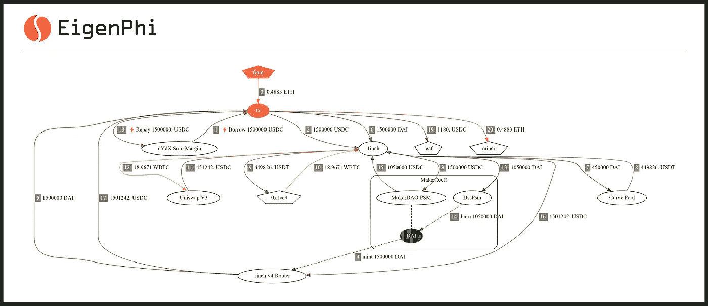
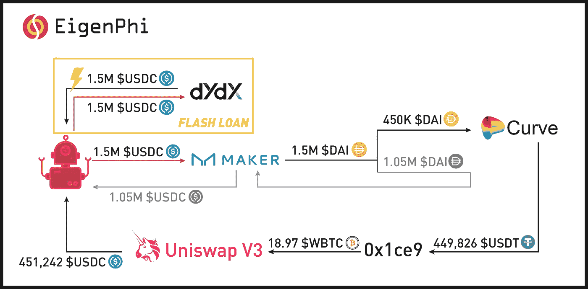

# 不劳而获:如何利用闪贷发起套利？

> 原文：<https://medium.com/coinmonks/get-everything-for-nothing-how-to-use-flash-loans-to-launch-an-arbitrage-d8520827cbfe?source=collection_archive---------4----------------------->

Photo by [dhehaivan](https://unsplash.com/es/@dhehaivan) on [Unsplash](https://unsplash.com/)

快速贷款是一种跨越 DeFi 协议的无抵押贷款。在 MEV 世界中，利用快速贷款开始套利可能是“不劳而获”的最快、最划算的方式之一。

然而，涉及闪贷的交易很复杂，很难破译。如果你看到任何相似的交易，或者任何你认为复杂有趣的交易，只要提交给[我们的 AwesomeTx bounty](https://github.com/eigenphi/AwesomeTx) 就能赢得 USDT。

在这里，我们将剖析一个 MEV 套利者如何在 dYdX 保证金交易协议的闪贷交易中赚取 1180 美元 USDC [。](https://etherscan.io/tx/0x38f9508ce093a289288df9d26f95ee61ab64d0d73a58a2cfa9f7cd92b37b7aed)

让我们从该交易中涉及的角色开始:

## **地址**

*   ***来自:*** 一个 EOA 账号，0x ffff 14106945 BCB 267 b 34711 c 416 aa 3085 b 8865 f。
*   ***到:*** MEV🤖，0x ede 2 fafba 9 e 23418485 f 49 f 052d 0 E1 d 332853 e0f。
*   ***0x1ce9:*** 一个 EOA 账号，0x1ce 943 e 573041463202090 cf 662490 c 95585 a 046。

## **协议**

*   ***dYdX Solo Margin:***一个去中心化的交易平台，目前支持融资融券、现货交易、借贷。
*   ***1inch/1inch V4 路由器:*** DeFi 交换聚合器。
*   ***曲线池:*** 分散交易所(DEX)/自动做市商(AMM)
*   ***Uniswap V3*** :德克斯/AMM
*   ***Maker Dao PSM/DssPsm***:制造商的 [Peg 稳定模块](https://makerdao.world/en/learn/governance/module-psm/) (PSM)。钉住稳定模块(PSM)允许用户以固定利率直接用给定的抵押品类型交换 DAI，而不是借入 DAI。用户可以通过 PSM 将、、换成戴，反之亦然。

## **令牌**

*   ***【美元戴:*** 与美元挂钩的稳定货币，由马克道发行。
*   ***$WETC:*** 包裹比特币，一种与比特币 1:1 背对的 ERC20 代币。
*   ***$USDC:*** 一种与美元挂钩的稳定货币，由圆形发行。
*   ***$USDT:*** 一种与美元挂钩的稳定货币，由系绳发行。

# 它是如何工作的

Figure 1

让我们旋转移动的数字。

Figure 1

如图 1 所示:

1.  首先，MEV🤖0xEdE2(图 1 中的“to”)向 dYdX 借了 150 万美元 USDC(步骤 1)
2.  然后，MEV🤖0xEdE2 将借来的 150 万美元 USDC 发送到 1inch(步骤 2)，并交换了💰通过 MakerDAO PSM 达到 150 万美元 DAI(步骤 3、4、5)。
3.  随后，MEV🤖0xEdE2 再次向 1inch 发送 150 万美元 DAI(步骤 6)，这有助于进行两次互换。
    **【戴】一. 45 万美元。**
    借助 1inch，MEV🤖在曲线池中将 450，000 美元的戴换成 449，826 美元的(第 7.8 步)。然后 449826 美元的 USDT 用 0x1ce9 换了 18.97 美元的 WBTC(步骤 9，10)，很快就被用来在 Uniswap V3 中购买 451242 美元的 USDC(步骤 11，12)。
    ***b . 105 万美元戴。***
    MEV🤖将 1，050，000 美元的戴换成 1，050，000 美元的(第 13，14，15 步)。
4.  USDC 从两次掉期交易中获得的总计 1，501，242 美元被退回给了 MEV🤖通过 1 英寸 V4 路由器(步骤 16、17)。
5.  MEV🤖向 dYdX 偿还了 150 万美元的 USDC 快速贷款(步骤 18)。
6.  MEV🤖总共赚了 1，180 美元 USDC(步骤 19)，向矿工支付了 0.4883 美元联邦税(步骤 20)。

## 高光

*   总共 150 万美元 DAI 中的 105 万美元 DAI 实际上并未使用(见图 2 的灰色部分)，最终偿还给了 dYdX。

Figure 2

## 摘要

总的来说，MEV🤖没有足够的初始资本通过这种快速贷款套利。在支付 0.4883 美元的联邦理工学院矿工小费后，套利者获利 1180 美元 USDC。

正如你所看到的，快速贷款在某些情况下非常有用，例如对于那些希望从两个交易市场的不同代币汇率套利机会中快速获利的交易者。

想继续关注更多闪贷 MEV 的例子吗？请关注我们，了解 MEV 世界的最新动态，如果您对生成上述流程图的工具感兴趣，请告诉我。

不要错过我们的[超赞交易赏金](https://github.com/eigenphi/AwesomeTx)！

跟随我们通过这些来挖掘更多隐藏的 DeFi 的智慧:

*   [EigenPhi 的推特](https://twitter.com/eigenphi)
*   [EigenPhi 的微博提醒](https://twitter.com/eigenphi_alert)
*   [子堆栈](https://eigenphi.substack.com/)
*   [中等](/@eigenphi)
*   [Mirror.xyz](https://mirror.xyz/0xc19565163aFdEe3783FC970E4Bd0275B11848d34)
*   [电报](https://t.me/WisdomOfDeFi)
*   [不和](https://discord.com/invite/JXD8cyzR2a)
*   [时事杂志](https://www.getrevue.co/profile/EigenPhi)

> 加入 Coinmonks [电报频道](https://t.me/coincodecap)和 [Youtube 频道](https://www.youtube.com/c/coinmonks/videos)获取每日[加密新闻](http://coincodecap.com/)

# 另外，阅读

*   [折叠 App 回顾](https://coincodecap.com/fold-app-review) | [Kucoin 交易机器人](/coinmonks/kucoin-trading-bot-automate-your-trades-8cf0ca2138e0)
*   [如何匿名购买比特币](https://coincodecap.com/buy-bitcoin-anonymously) | [比特币现金钱包](https://coincodecap.com/bitcoin-cash-wallets)
*   [币安 vs FTX](https://coincodecap.com/binance-vs-ftx) | [最佳(SOL)索拉纳钱包](https://coincodecap.com/solana-wallets)
*   [比诺莫评论](https://coincodecap.com/binomo-review) | [斯多葛派 vs 3Commas vs TradeSanta](https://coincodecap.com/stoic-vs-3commas-vs-tradesanta)
*   [Capital.com 评论](https://coincodecap.com/capital-com-review) | [香港的加密借贷平台](https://coincodecap.com/crypto-lending-hong-kong)