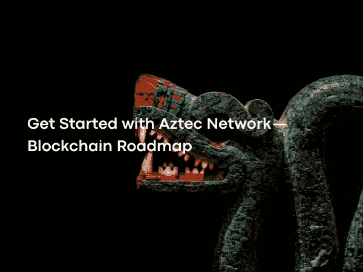

# Aztec 网络入门——区块链路线图

> 原文：<https://medium.com/coinmonks/get-started-with-aztec-network-blockchain-roadmap-d84103c2d9da?source=collection_archive---------4----------------------->

Photo by [Max Lete](https://unsplash.com/@blackprojection)on [Unsplash](https://unsplash.com/?utm_source=medium&utm_medium=referral)

L2 解决方案是在以太坊路线图中占有重要位置的解决方案，它使以太坊能够与分片一起扩展。阿兹特克网络是一个基于以太坊主网的 L2 解决方案，使用零知识证明。

Aztec 网络允许其用户以低交易费用进行保密支付和 DeFi 交易。

最近，认为以太坊会随着合并更新而降低汽油费的误解非常普遍。实际上，合并更新对燃气费没有影响。合并是指验证方法证明工作的过渡，证明利害关系。

 [## 合并——区块链路线图

### 以太坊 2.0，有了新的名字“合并”，可以说是区块链生态系统中最古老的目标之一…

medium.com](/coinmonks/the-merge-blockchain-roadmap-c85641c366c5) 

以太坊燃气费的真正降低将随着改进的滚动式分段的实现而实现。随着以太坊在 2020 年采用以汇总为中心的以太坊路线图，汇总至关重要。以太坊后来改变了它的分片计划，以包括汇总。Proto-Danksharding，即 EIP-4844，就是这样一个例子，它的目标是创建一个额外的数据区，以便可以在以太坊块中使用汇总。合并延迟和以太坊将总结整合到路线图中导致分片计划被推迟到 2023 年。

 [## 以汇总为中心的以太坊路线图

### 以 rollup 为中心的以太坊路线图会是什么样子？上周，乐观小组宣布推出第一个…

ethereum-magicians.org](https://ethereum-magicians.org/t/a-rollup-centric-ethereum-roadmap/4698)  [## Proto-Danksharding 常见问题解答— HackMD

### Proto-Danksharding 常见问题解答[TOC] ##什么是 Danksharding？Danksharding 是新的分片设计 p

notes.ethereum.org](https://notes.ethereum.org/@vbuterin/proto_danksharding_faq#What-is-proto-danksharding-aka-EIP-4844) 

Rollup 和其他 L2 解决方案将有助于以太坊的扩展，直到出现分片。随着 2021 年第一个工作汇总样本的出现，L2 解决方案开始吸引生态系统的注意。汇总将许多交易合并到一个交易中，并在燃气费利益相关方之间进行分配，可以将燃气费减少 100 倍。阿兹特克网络遵循这种方式，与主网络相比，提供了低燃气费、高速度和隐私。

Aztec Network 是 L2 的一个解决方案，它使用 zk-Rollup 技术，为用户提供低燃气费和隐私。

 [## Aztec 网络:Web3 的隐私层

### Aztec 是以太坊上的隐私优先 zk-rollup，为以太坊生态系统带来保密性和成本节约。

aztec.network](https://aztec.network/)  [## ZK-汇总

### 等离子体是建筑可伸缩性方法的名称，这种方法将第 2 层块放在以太坊的顶部…

docs.ethhub.io](https://docs.ethhub.io/ethereum-roadmap/layer-2-scaling/zk-rollups/) 

阿兹特克网络的座右铭是“一分钱一分货”。它旨在创建一个智能合约层，默认具有可编程的隐私，DAOs，NFTs，DeFi 和 Web3 应用程序。

 [## 一分钱的隐私:扩大阿兹特克的 zkRollup

### 我们的隐私经济学-第一以太坊卷。

medium.com](/aztec-protocol/privacy-for-pennies-scaling-aztecs-zkrollup-9f2b36615cc6) 

阿兹特克网络有专家的名字，如扎卡里威廉森，乔安德鲁斯，乔纳森吴在其工作人员。除了 2018 年在 ConsenSys 的领导下获得的 210 万美元核心投资外，它还在 2019 年获得了另一笔核心投资。最后，在 2021 年，在 Paradigm 的带领下，它在 A 轮投资中又募集了 1700 万美元，获得了约 2000 万美元的总投资。

 [## Zachary Williamson —联合创始人兼首席技术官— AZTEC 协议| LinkedIn

### 查看扎卡里·威廉姆森在全球最大的职业社区 LinkedIn 上的个人资料。扎卡里有 3 份工作列在…

www.linkedin.com](https://www.linkedin.com/in/zachary-williamson-b02b0192/)  [## Joe Andrews —产品主管— AZTEC 协议| LinkedIn

### 查看乔·安德鲁斯在全球最大的职业社区 LinkedIn 上的个人资料。乔有 7 份工作列在他们的…

www.linkedin.com](https://www.linkedin.com/in/joe-andrews-2783918a/)  [## 乔纳森·吴—成长—阿兹特克| LinkedIn

### 查看 Jonathan Wu 在全球最大的职业社区 LinkedIn 上的个人资料。乔纳森列出了 7 份工作…

www.linkedin.com](https://www.linkedin.com/in/jonathanjwu/)  [## 区块链技术解决方案|以太坊解决方案| ConsenSys

### 构建下一代应用程序，推出基于区块链的金融基础设施，并通过以下方式访问分散式网络

consensys.net](https://consensys.net/)  [## 范例

### Paradigm 是一家投资公司，专注于支持未来伟大的 crypto/Web3 公司和协议。我们的…

www.paradigm.xyz](https://www.paradigm.xyz/) 

在 zk-rollups 的一般操作中，操作员收集在 rollup 链中进行的事务，并为这些事务创建零知识证明。将生成的零知识证明和压缩数据发送到以太坊主网。通过这种方式，数百笔交易以低油费和高速度在链外处理。

Aztec 网络的工作结构与所有 ZK-roll up 相同，只有少数例外。与 zk-Rollup 最大的区别之一是，在 Aztec 中，与其他 ZK-roll up 解决方案不同，零知识证明创建应用了两次。内部汇总为包含 28 个事务的事务组创建了一个零知识证明。在这种结构中，总共发生 32 次内部汇总，由内部汇总创建的证据被收集，并且具有最多 896 个事务的最终零知识证明由外部汇总创建并被发送到主网络。

阿兹特克网络仍在开发中，并有一个由团队控制的中央运营商。它使用了受 BTC 启发的类似 UTXO 的模型。在以太坊基于账户的模型中，每个账户都有余额。每次转帐时，帐户的余额都会更新。在基于 Aztec 网络 UTXO 的模型中，代替账户的是对应于一定金额的票据并且票据具有所有者，票据可以被认为是所有权可以改变的对象。当发生转账交易时，对应于一定金额的票据的所有权发生变化。基于 UTXO 的模型更容易加密，因为它依赖于两个参数，这两个参数指示纸币对应的金额和纸币的所有者。

 [## 什么是 UTXO 型号？

### 未用交易输出(UTXO)是一个技术术语，指的是在交易结束后剩余的数字货币量

www.investopedia.com](https://www.investopedia.com/terms/u/utxo.asp) 

Aztec Network 使用 zk-PLONK 零知识证明(zero-knowledge proof)，这是 zk-SNARK 基于 Groth16 和 Sonic 的变体，由其首席执行官 Zac Williamson 开发。zk-PLONKs 可以消除对可靠安装的需求或将其保持在最小规模，这是 zk-SNARKs 的一个缺点。

 [## Groth16

### 零知识博客

www.zeroknowledgeblog.com](http://www.zeroknowledgeblog.com/index.php/groth16)  [## Sonic:来自线性大小的通用且可更新的结构化参考字符串的零知识 SNARKs

### 论文 2019/099 Mary Maller，Sean Bowe，Markulf Kohlweiss，和 Sarah Meiklejohn 摘要零知识证明有…

eprint.iacr.org](https://eprint.iacr.org/2019/099)  [## zk-SNARKs 是什么？现金

### 网络升级 5(NU5)2022 年 5 月，Zcash 推出了果园屏蔽支付协议，该协议利用了 Halo 2…

z.cash](https://z.cash/technology/zksnarks/)  [## 了解 PLONK

### 最近，Ariel Gabizon、Zac Williamson 和 Oana Ciobotaru 宣布了一种新的通用零知识证明…

vitalik.ca](https://vitalik.ca/general/2019/09/22/plonk.html)  [## 来自黑暗编译器的透明代码

### 论文 2019/1229 Benedikt Bünz，斯坦福大学 Ben Fisch，斯坦福大学 Alan Szepieniec，Nervos 基金会…

eprint.iacr.org](https://eprint.iacr.org/2019/1229)  [## 斯坦福应用加密小组

### Bulletproofs 是简短的非交互式零知识证明，不需要可信的设置。防弹可以用…

crypto.stanford.edu](https://crypto.stanford.edu/bulletproofs/)  [## 斯塔克-斯塔克威尔

### 斯塔克是一个证据系统。它使用先进的加密技术来提供多对数验证资源和证明…

starkware.co](https://starkware.co/stark/) 

阿兹特克网络与 EVM 不兼容。它使用基于 Rust 编程语言，专门开发的 Noir 语言来使用零知识证明电路。DAO、NFT 和 DeFi 应用程序将发生在 Aztec 的隐私层，它们必须使用 Noir 编程语言和智能合约来创建。

 [## 以太坊虚拟机(ethereum.org EVM)|

### 以太坊虚拟机及其与状态、交易和智能合约的关系介绍。

ethereum.org](https://ethereum.org/en/developers/docs/evm/)  [## 锈

### Rust 速度惊人，内存效率高:没有运行时或垃圾收集器，它可以支持关键性能…

www.rust-lang.org](https://www.rust-lang.org/)  [## 黑色编程语言

### 这本书的这个版本正在公开发行。将会有许多功能在…中缺失

noir-lang](https://noir-lang.github.io/book/index.html) 

zk.money 允许 L2 保密支付，并允许你通过 Aztec Connect SDK 与 DeFi 协议进行交互。自推出以来，zk.money 拥有 75，000 多名注册用户，225，000 多笔交易，8000 万美元以上的总交易量，所有这些都比 mainnet 同行的燃气费低。

 [## zk.money Private DeFi 到了！

### 通过@aztecnetwork 结账 zk.money。你现在可以私下访问🕵️.

zk .钱](https://zk.money/)  [## Aztec 网络:Web3 的隐私层

### Aztec 是以太坊上的隐私优先 zk-rollup，为以太坊生态系统带来保密性和成本节约。

aztec.network](https://aztec.network/connect/) 

zk.money 支持存放 ETH、DAI、renBTC。Aztec 网络上的存款可以在链上查看，但是在 Aztec 网络上进行的交易不能在链上查看。

 [## ETHUSD —以太坊 Fiyat grafi I—交易视图

### 这是一个很好的例子。

tr.tradingview.com](https://tr.tradingview.com/symbols/ETHUSD/)  [## DAIUSD-Grafikler ve Fiyatlar-trading view

### 在尹乐，一美元兑换一英镑。塔明勒·i̇şlem·菲克勒里…

tr.tradingview.com](https://tr.tradingview.com/symbols/DAIUSD/)  [## ren BTC-Grafikler ve Fiyatlar-trading view

### BTC·格拉菲尼·居伦·尹乐。i̇şlem·菲克勒里

tr.tradingview.com](https://tr.tradingview.com/symbols/RENBTC/) 

让爱丽丝从鲍勃在阿兹特克网络的资金中给鲍勃汇去 1 ETH。
AztecNetwork 为 1 ETH 发送交易创建零知识证明。也就是说，为网络上发生的每个交易创建零知识证明，以确保机密性。
通过组合多个事务，为这组事务创建另一个零知识证明，比如 Alice 向 Bob 发送 1 ETH 的事务。

创建的最终零知识证明被发送到以太坊主网上的 Aztec 验证者契约，并被契约批准。因此，通过创建两次零知识证明来确保隐私。

 [## 核验者

### 编辑描述

aztecprotocol.github.io](https://aztecprotocol.github.io/AZTEC/Verifier.html) 

zk.money 不仅支持保密支付，还允许与 Aztec Connect 进行保密的 DeFi 交易。新集成的 Aztec Connect 允许与以太坊主网上的协议进行交互。Aztec Connect 的工作方式类似于 VPN。使用 Aztec 汇总合同作为代理，用户从 Aztec 网络内部与以太坊服务进行交互。

Aztec Connect 目前支持 ElementFi 和 Lido 协议。用户可以通过在 ElementFi 上评估他们的 DAI 来评估统一费率回报的可能性，或者通过在 Lido 上评估他们的 ETH 来获得每日回报的可能性。因此，L2 的交易用户可以在完全保密的情况下访问以太坊流动性，并且从 mainnet 支付低至 100 倍的燃气费。

 [## 元素

### Element 是一个针对固定和可变收益市场的开源协议

www.element.fi](https://www.element.fi/)  [## 押记资产的流动性|利多

### Quantstamp 的使命是保护分散式互联网的安全，并保护了超过 80 亿美元的数字资产风险，使其免受…

利多菲](https://lido.fi/)  [## aave——开源流动性协议

### Aave 是一个开源协议，旨在创建非托管流动性市场，以赚取供应和借贷的利息…

aave.com](https://aave.com/)  [## 复合的

### 复合是一个算法，自主利率协议，为开发人员建立，以解锁宇宙的开放…

复合.金融](https://compound.finance/)  [## 以太坊上的无息借款

### 向 ETH Liquity 借入 LUSD 收取小额的一次性费用来借入 LUSD，而不是高度可变的利率…

www.liquity.org](https://www.liquity.org/) 

Aztec 网络在网络上的存在是有限的，因为它仍处于开发阶段，并且不包括用 Noir 编写的本地协议。阿兹特克网络中被锁定资产的总价值接近 500 万美元。虽然大部分资产是 ETH，但是网络上也有低费率的 DAI 和 renBTC。

Aztec 网络用户分析显示，80%的用户只使用一次。可以看出，用户使用 Aztec 网络 10+次的比率仅为 0.2%。绝大多数用户(~70%)更喜欢存放在 0.01-0.1 ETH 之间。大于 1 ETH 的存款利率似乎很低。

用户使用 Aztec 网络的频率低，数量少。这可以用以下事实来解释:阿兹特克网络仍在开发中，可编程隐私尚未在其上活跃，网络带来各种风险，早期用户可能会得到空投的回报。

由于阿兹特克网络仍在发展中，该系统的某些方面对其安全构成了风险。(盗窃资金、审查和 MEV(矿工可提取价值)等的可能性。)

 [## 阿兹特克— L2BEAT

### 该协议的新版本 Aztec Connect 已经推出，用户被鼓励将他们的资产转移到那里。阿兹特克是…

l2beat.com](https://l2beat.com/projects/aztec/#risks) 

Aztec Network 使用的 zk-PLONK 加密技术仍处于试验阶段，需要一个可信的设置。加密的不正确应用或在可信设置中可能发生的任何错误都可能导致资金被盗，概率很低。

阿兹特克网络可以在智能合同中更新，更新可以即时应用。也就是说，在现有的 Aztec 契约中，可以通过分配不同的契约来改变代码。现有的 Aztec 合同由具有两个钱包利益相关者的多签名钱包管理。当这个团队管理的钱包的两个利益相关者之一批准更改时，合同立即更新。如果更新包含恶意功能更新，就有资金被盗的可能。

由中央运营商管理网络也带来了一些风险。运营商可以任意使用其权力审查任何用户的交易。用户可以通过在一个特殊的时间框架内建议新的屏蔽来规避这种审查，任何运行自己的节点反对这种审查的人都可以建议新的屏蔽。然而，提出新的块需要生成零知识证明。制作零知识证明的成本和复杂性可能是标准用户的另一个缺点。

来自运营商的另一个风险是矿工可开采价值。通过利用其中心位置，运营商可以提前看到用户的交易，并根据这些交易采取有利可图的立场。

与其他汇总解决方案的风险相比，Aztec 网络中涉及的这些风险非常相似。由于大多数汇总仍在开发中，因此它们具有可更新的智能合同和中央操作员。所以大部分汇总都有类似阿兹特克网络的风险。

下一篇文章再见…

> 加入 Coinmonks [电报频道](https://t.me/coincodecap)和 [Youtube 频道](https://www.youtube.com/c/coinmonks/videos)了解加密交易和投资

# 另外，阅读

*   [如何使用 Solidity 在以太坊上创建 DApp？](https://coincodecap.com/create-a-dapp-on-ethereum-using-solidity)
*   加密交易机器人 | [OKEx vs 币安](https://coincodecap.com/okex-vs-binance)
*   [币安 vs FTX](https://coincodecap.com/binance-vs-ftx) | [最佳(SOL)索拉纳钱包](https://coincodecap.com/solana-wallets)
*   [如何在 Uniswap 上交换加密？](https://coincodecap.com/swap-crypto-on-uniswap) | [A-Ads 审查](https://coincodecap.com/a-ads-review)
*   [加密货币储蓄账户](/coinmonks/cryptocurrency-savings-accounts-be3bc0feffbf) | [YoBit 评论](/coinmonks/yobit-review-175464162c62)