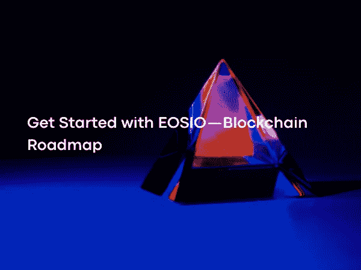

# EOSIO 入门——区块链路线图

> 原文：<https://medium.com/coinmonks/get-started-with-eosio-blockchain-roadmap-cb4754626939?source=collection_archive---------19----------------------->

Photo by [Michael Dziedzic](https://unsplash.com/@lazycreekimages) on [Unsplash](https://unsplash.com/?utm_source=medium&utm_medium=referral)

EOSIO 是一个能够创建智能合同(即 dApp)的平台。在区块链上可以构建许多不同的应用程序。随着越来越多的开发商关注区块链，未来的情况将会非常不同。

 [## 主页

### EOSIO 是一个高性能的开源区块链平台，旨在支持和运行安全、合规和…

eos.io](https://eos.io/) 

EOSIO 在白皮书中谈区块链应用话题；

 [## 白皮书和区块链哲学— EOS Collective

### 文章众筹&在丹尼尔·拉里默视频网站上注册 EOS 令牌白皮书&区块链哲学

eoscollective.org](https://eoscollective.org/papers)  [## 文档/技术白皮书. md at master EOSIO/Documentation

### 摘要:EOS。IO 软件引入了新的区块链架构，旨在支持垂直和水平…

github.com](https://github.com/EOSIO/Documentation/blob/master/TechnicalWhitePaper.md) 

数百万人的支持；需要能够与数千万日活跃用户合作的区块链。在某些情况下，除非用户达到临界质量，否则应用程序可能无法工作，因此能够处理大量用户的平台至关重要。

免费使用；应用程序开发者需要向用户提供免费服务的灵活性。用户不应该为使用该平台或其服务付费。用户可以免费使用的区块链平台可能会被更广泛地采用。开发者和企业可以创造有效的盈利策略。

易于更新和修复错误；构建基于区块链的应用程序的企业需要灵活性，以使他们的应用程序具有新的特性。该平台必须支持智能合约开发。

低延迟；良好的用户体验需要延迟不超过几秒钟的可靠反馈。更长的延迟会让用户感到沮丧，并使非区块链应用程序与现有的非区块链应用程序相比缺乏竞争力。该平台必须支持低延迟的事务。
顺序执行；由于顺序相关的步骤，存在一些不能用并行算法实现的应用。像证券交易所这样的应用程序需要足够的顺序性能来处理大量数据。因此，平台必须支持快速顺序性能。

并行性能；大型应用程序需要在多个 CPU 和计算机之间分担工作负载。

EOSIO 使用委托利益证明(dPoS)共识算法。这种算法意味着利益相关者，即 EOS 持有人，通过投票选举代表，并为当选代表提供生产区块的权限。拥有这种权限的人也被定义为区块生产者。

 [## 共识协议

### EOSIO 区块链是一个高效、确定的分布式状态机，它可以在一个分散的…

developers.eos.io](https://developers.eos.io/welcome/v2.0/protocol-guides/consensus_protocol) 

在 EOSIO 中，每 0.5 秒产生一个块，即每秒 2 个。如果未在 0.5 秒内生成，该块将被跳过，并在 0.5 秒后生成。换句话说，如果在块生产中有 4 秒的延迟，则形成 8 个块的间隙，但没有数据丢失。

 [## EOS 块生产者

### EOS 网络上的 block producer 候选人 Google Cloud 现在开始接受投票。利用 EOSIO 开源软件…

dlt.withgoogle.com](https://dlt.withgoogle.com/eos#:~:text=A%20core%20component%20of%20the,latency%20global%20fiber%20optic%20network)  [## EOS 区块生产商排名

### EOS 权威——该页面显示所有生产商的排名。除了目前的排名，它还显示了总…

eosauthority.com](https://eosauthority.com/producers_rank) 

区块生产者是通过投票选出的，这个投票是按照一定的周期进行的。每 126 个街区意味着 1 圈。每个区块生产商可以生产 6 个区块。因为选择了 21 个块生产者，所以数字 126 由 6×21 形成，即 1 轮。

如果发生器丢失了一个块，并且在过去的 24 小时内没有产生任何块，则在通知区块链开始重新生成块之前，不会考虑该发生器。这意味着块生产者是不可靠的，无论如何不能成为候选者，从而保证了链的安全性。
在正常情况下，dPoS 区块链不能以任何方式分叉，因为区块生产商不是竞争，而是合作生产区块。在分叉的情况下，共识会自动切换到最长的链。

交易确认；dPoS 块生成只属于块生产者，因此每个交易在 0.25 秒内被 99%确认。如果一项交易得到了 21 个生产者中至少 15 个的批准，它就是一项有效的交易。

 [## 委托股权证明|币安学院

### 委托股权证明(DPoS)穆塔巴卡特·阿尔戈里茨佩克·科克·基西·塔拉芬丹·达哈·恩切基·波斯(希塞·i̇spatı)…

academy.binance.com](https://academy.binance.com/tr/articles/delegated-proof-of-stake-explained) 

区块奖励是肯定的区块生产者将是 21，但也将选择一个储备。预计备用块生产商的数量在 100-200 之间。

虽然 EOSIO 是免佣金的，但从技术上来说，在没有对账机制的情况下，交易不可能是自由的，只是支付的形式不同而已。街区奖励是；区块生产者每生产一个区块获得 0.25%，每个区块的 0.75%分配给所有区块生产者，即取决于他们在候选人中获得的票数。所以有 1%的佣金。

EOSIO 系统允许接收由 12 个特殊字符组成的特殊名称。

行动；每个帐户都可以向其他帐户发送已配置的操作，并定义脚本来管理收到的操作。EOSIO 为每个账户提供了自己的私有数据库，可以通过自己的交易数据库进行访问。动作和自动化事务处理程序的结合展示了 EOSIO 如何与智能合约一起工作。

 [## 行动

### EOSIO 的开发者门户。EOSIO 是下一代开源区块链协议，具有业界领先的…

developers.eos.io](https://developers.eos.io/manuals/eos/v2.1/cleos/command-reference/get/actions/) 

基于角色的权限管理；休假管理提供了一个通知系统，可以控制谁可以在何时做什么。

 [## EOS 角色和权限

### 这是归档版本的文档。有关当前版本的文档，请查看知识库…

kb.orbitgt.com](https://kb.orbitgt.com/224/server/eos/roles_permissions) 

命名权限级别；基于名称的权限级别可以在 EOSIO 中创建。EOSIO 允许每个帐户持有人定义自己的层次结构以及分组和定义操作。

 [## EOS 白皮书演练:帐户、权限级别和权限映射以及权限…

### 在上一篇文章中，我们讨论了 EOS 中基于角色的权限管理。在本文中，我们将讨论如何…

steemit.com](https://steemit.com/eos/@bluabaleno/eos-whitepaper-walk-through-account-permission-levels-and-permission-mapping) 

强制延迟的行动；在 EOSIO 上进行某些交易可能需要经过一段时间。

 [## EOS-白皮书/actions-with-mandatory-delay . MD at master snak orse/EOS-白皮书

### 具有强制延迟的动作===时间是安全性的重要组成部分。在大多数情况下，不可能知道是否…

github.com](https://github.com/snakorse/eos-whitepaper/blob/master/accounts/actions-with-mandatory-delay.md) 

找回被盗的钥匙；EOSIO 允许找回被盗或丢失的钥匙。提供另一个恢复帐户，以便为该帐户定义。

 [## EOS 权威——如何在 EOS 上找回您的 genesis 丢失的关键帐户

### 这篇文章是为那些丢失了 genesis EOS 密钥的令牌持有者而写的。您的帐户仅适用于…

eosauthority.com](https://eosauthority.com/blog/How_to_recover_your_genesis_lost_key_account_on_EOS) 

最小化通信延迟；延迟是一个帐户向另一个帐户发送操作，然后收到响应所需的时间。目标是允许两个进程在单个块中通信，而不必在每个动作之间等待 0.5 秒。为了激活，EOSIO 将每个块分成循环。每个循环被分割成块，每个块包含一个事务列表。每个动作包含一组要交付的动作。

 [## 文档/技术白皮书. md at master EOSIO/Documentation

### 摘要:EOS。IO 软件引入了新的区块链架构，旨在支持垂直和水平…

github.com](https://github.com/EOSIO/Documentation/blob/master/TechnicalWhitePaper.md#minimizing-communication-latency) 

令牌模型和采购；
EOSIO 应用消耗的资源有三类:
带宽和存储(磁盘)
计算(CPU)
状态存储(RAM)

 [## EOSIO 令牌教程

### 本教程探讨了 EOSIO token 智能合约示例，它可以帮助您获得所需的基本知识…

developers.eos.io](https://developers.eos.io/welcome/v2.2/tutorials/eosio_token) 

带宽和计算(CPU)有两个组成部分，瞬时使用和长期使用。区块链跟踪所有动作，这些动作最终被所有节点存储和下载。

状态存储器(RAM)中保存的信息是可从应用程序逻辑访问的信息。它包含订单簿和帐户余额等信息。如果应用程序从未读取过状态，则不应存储该状态。
此外，EOSIO 内部的块制造商公布了自己的处理能力、RAM 容量、带宽等。，有了区块链，大家都知道了。这样就可以为人们确定使用率，即可以获得 1%的 EOSIO 币。可以使用制造商提供的 1%的 CPU 能力。换句话说，系统的份额和 EOS 一样多。
另外，如果没有动作产生，EOS 币可以租借。

账户冻结；如果 EOSIO 存在欺诈行为；在这种情况下，如果 21 个生产者中的 15 个被投票暂停相关账户，该决定将被直接处理，账户将被冻结。

改变代码；当 EOSIO 中有一个合同没有按预期运行时，合同所有者将能够更新该合同。如果它以 15/21 的比率被块生产者接受，更新将发生。
宪法；从某种意义上说，每一个 EOSIO 用户都要声明自己接受某一条法律。它有一种方法，可以通过说话来解决计算机代码无法解决的问题。

 [## # ask block one:EOS io 基础设施有什么好处？

### 你问了，我们会带着答案回来。这是我们对#AskBlockone Twitter 问答的第一个回应…

eos.io](https://eos.io/news/askblockone-what-are-the-benefits-of-the-eosio-infrastructure/) 

区块链间通信；EOSIO 旨在促进块间通信。这是通过使创建动作实体的证明和动作数组的证明变得容易来实现的。

隔离证人；SegWit 是指在计算事务 ID (TXID)时，因为不再需要见证数据，所以后来会忽略见证数据。

EOSIO 使用的 dPoS 算法，使得 EOSIO 相比 PoS 和 PoW，是一个更加集中化的硬币。EOSIO 是中心，但不像 NEO 那样集中。同时，EOSIO 也不会是以太坊杀手。

 [## 新智能经济

### 争夺 500，000 美元的奖金和 2 亿美元的孵化支持 planathon:赢得制作最佳产品的奖金乘数…

neo.org](https://neo.org/) 

以太坊的路线图进程将随着 Casper 和 Sharding 的更新对市场产生积极影响。以太坊将去中心化的概念放在了首位。EOS 和 ETH 的区别已经在这里了，即在优先级上，EOS 互操作性和 ETH 分散优先。

 [## 以太坊卡斯帕解释|风暴增益

### 以太坊是世界上第二流行的加密货币背后的平台，创建于 2015 年。甚至在……

stormgain.com](https://stormgain.com/blog/ethereum-casper-protocol-explained)  [## ethereum.org

### 分片应该在 2023 年的某个时候发布，这取决于合并后工作进展的速度。这些碎片会给…

ethereum.org](https://ethereum.org/en/upgrades/sharding/) 

EOS 似乎已经形成了博弈论的概念。持有和购买 EOS 代币确实有正当的理由。

EOS 在将近一年的 ICO 期内，提高了 3B+美元。由于如此高的 ICO，该项目有望取得进一步进展。

在宪法的发展过程中，宪法每隔一段时间发布一次，并被使用者所接受。宪法已经写好了，但是谁来主持正义呢？

 [## EOS 官方浏览器和 EOS 权威钱包| EOS 权威

### 官方 EOS 块资源管理器和 EOS 权威钱包。搜索 EOS 交易，块，帐户，令牌，雷克斯，价格…

eosauthority.com](https://eosauthority.com/constitution) 

其中一个宪法是；“这个伊奥西奥·区块链没有主人，没有经理。它只受本宪法条款的约束”。行政是根据宪法确定的，也就是说，行政人员实际上就在制定这部宪法的人当中。决定这部宪法的人可以在未来修改它。
另一种体质；“司法的选择，争端的法律选择，将是本宪法、调解律师和马耳他法律，按优先顺序排列。”

另一个重要的问题是砌块生产商所使用的计算机的成本，以及连锁店是否能够支付这些费用的问题。
砌块生产商的年成本约为 100 万美元。由于将有 21 到 100–200 个备用区块生产商，最多有 121 个区块生产商，这意味着每年的费用将为 1 . 21 亿美元+。每个区块的 1%将分配给区块生产商。

相比以太坊；以太坊日均交易量最多为 4 万美元。40K x 365 赚了 1400 万美元+。换句话说，即使和以太坊用的一样多，也无法满足方块制作者的开支。
EOSIO 区块链的交易据称是免费的，但费用会从网络中扣除。(121 米/1.460/1 米)x 100 = 0.82%的通货膨胀率。EOS 已经设定了 5%的最大通胀率。

 [## EOS usdt-Grafikler ve Fiyatlar-trading view

### 在尹乐的一个小村庄里。i̇şlem·菲克勒里

tr.tradingview.com](https://tr.tradingview.com/symbols/EOSUSDT/) 

街区生产者通过投票选举产生。每枚 EOS 硬币相当于 30 票。换句话说，持有硬币多的人更有发言权，但几乎每分钟都要选举一个街区制作人。考虑到许多投资者将把他们的硬币留在交易所，没有理由认为交易所不应该投票。

 [## 文档/技术白皮书. md at master EOSIO/Documentation

### 摘要:EOS。IO 软件引入了新的区块链架构，旨在支持垂直和水平…

github.com](https://github.com/EOSIO/Documentation/blob/master/TechnicalWhitePaper.md#background)  [## EOS 集中化问题

### 引用 Bitcointalk 中热拉尔多的话

medium.com](/@CryptoPeterG/eos-centralization-problem-bd7a392eeed2)  [## 常见问题解答

### 区块链是一种数字分类账，包含在给定网络中复制和分发的完整记录…

eos.io](https://eos.io/faq/) 

下一篇文章再见…

> 交易新手？试试[加密交易机器人](/coinmonks/crypto-trading-bot-c2ffce8acb2a)或者[复制交易](/coinmonks/top-10-crypto-copy-trading-platforms-for-beginners-d0c37c7d698c)