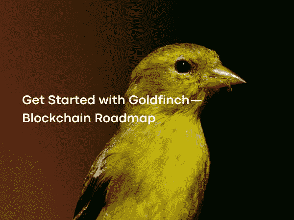

# 金翅雀入门——区块链路线图

> 原文：<https://medium.com/coinmonks/get-started-with-goldfinch-blockchain-roadmap-e89ea8ed2a36?source=collection_archive---------13----------------------->

Photo by [Joshua J. Cotten](https://unsplash.com/@jcotten)on [Unsplash](https://unsplash.com/?utm_source=medium&utm_medium=referral)

金融和人们对金融工具的获取在资本主义特有的债务经济中占有很大的位置。分散式金融应用程序中的 Goldfinch 协议连接了真实世界经济和加密经济，使访问金融工具变得更加容易。

 [## 金翅雀

### 我们正在建立一个分散的信贷平台，增强金融包容性。我们相信有大量未开发的…

金翅雀.金融](https://goldfinch.finance/) 

与 DeFi 应用程序中使用的超额抵押方法不同，Goldfinch 使用自己的共识信托机制实现。

 [## 什么是超额抵押？

### 超额抵押(OC)是提供价值超过足以弥补潜在损失的抵押品…

www.investopedia.com](https://www.investopedia.com/terms/o/overcollateralization.asp#:~:text=What%20Is%20Over%2DCollateralization%3F,than%20the%20amount%20being%20borrowed)  [## 信任证明

### 一种增强众包服务责任的信任证明共识协议

tokens-economy.gitbook.io](https://tokens-economy.gitbook.io/consensus/chain-based-others/proof-of-trust-pot) 

迄今为止，金翅雀已经向企业提供了 1 亿美元的贷款。美国、肯尼亚、尼日利亚、菲律宾和墨西哥是信贷提供最多的企业所属国家的前列。金翅雀生态系统包括支持者、审计者、LP 提供者和借款者，所有主体必须彼此协调行动，系统才能正常工作。

金融在资本主义发展中国家的增长和发展中占据了很大的位置。从国家的角度来看，各国毫不犹豫地使用各种金融工具来创造资金，减少借贷，增加热钱的流动。此外，他们不时发放小额贷款，以加快生产活动，支持将为国家国内经济创造附加值的项目和个人。这些小额贷款项目从农业到技术，从物流到小企业。根据一项主要考察发展中国家小额信贷计划并在 2012 年继续进行的研究，小额信贷计划在提高国家的国民生产总值、提高公民的福利水平以及揭示将为国家增值的项目方面非常重要。虽然小额金融对国家的重要性以这种方式表达，但它也有一部分反映在个人身上。

 [## 小额信贷的宏观经济学

### 抽象。小额金融的总体和分配影响是什么？为了回答这个问题，我们开发了一个…

academic.oup.com](https://academic.oup.com/restud/article-abstract/88/1/126/5891672?login=false) 

发达国家获得金融产品和贷款的机会远远高于发展中国家和不发达国家。世界人口中的大多数成年人没有银行账户或无法获得金融工具，而这部分人中的大多数是非洲和南美洲国家。根据 2021 年的一项调查，无银行账户率最高的 5 个国家是:摩洛哥、越南、埃及、菲律宾和墨西哥。此外，虽然个人可以获得银行服务，但由于抵押问题，似乎无法获得许多金融工具，特别是贷款产品。去中心化金融可以提供很多传统金融无法提供的服务，它让个人有机会成为自己的银行。在加密生态系统中的许多借贷平台中，金翅雀项目采取了更集中但间接更面向解决方案的方法。

 [## 《全球金融杂志》——2021 年世界上无银行账户最多的国家

### 全球数亿人没有支票或储蓄银行账户。金融排斥损害了他们的…

www.gfmag.com](https://www.gfmag.com/global-data/economic-data/worlds-most-unbanked-countries) 

Goldfinch 是一个运行在以太坊上的借贷平台，为金融科技公司提供流动性。平台的主要目的之一可以定义为增加购债系统的用户数量，为去中心化金融中的过度抵押制度带来一股新的气息。

 [## 首页| ethereum.org

### 以太坊是数字货币、全球支付和应用的发源地。社区建立了一个…

ethereum.org](https://ethereum.org/en/) 

DeFi 不触及最终用户的原因之一是超额抵押系统。金翅雀旨在通过协商一致的信任来解决这个问题。金雀区别于生态系统中其他贷款平台的一个最重要的方面是，所提供的贷款不仅对加密生态系统中的个人和机构有吸引力，而且对实体经济中的企业也有吸引力。这样，该协议在实体经济和加密经济之间架起了一座桥梁。目前，有 28 个不同国家的组织在使用金翅雀为他们自己地区的商业发展提供服务，并为生活在该地区的人们提供小额信贷。在协议中，每个人都可以参与贷款，并从收到的利息中获得被动收入。

通常情况下，如果想获得连锁贷款的人想从 AAVE 复利等贷款平台借款，他们需要出示比他们想借的多得多的抵押品。这是因为在供应链上没有像银行那样与中央政府合作的信贷审批机构。由于目前想要借款的人没有抵押品，DeFi 协议中的信贷机制不是针对最终用户的，而是针对杠杆头寸持有者和套利交易者的。为了解决这个问题，金翅雀通过共识机制在信托内部引入了一个新的系统，可以称为信贷审批委员会。这个系统包括借款人、支持者、有限合伙人和审计员。

 [## aave——开源流动性协议

### Aave 是一个开源协议，旨在创建非托管流动性市场，以赚取供应和借贷的利息…

aave.com](https://aave.com/)  [## 复合的

### 复合是一个算法，自主利率协议，为开发人员建立，以解锁宇宙的开放…

复合.金融](https://compound.finance/) 

传统金融中的金融科技企业被列入借款人类别。由于官僚主义和高利率，正常的借款或筹资流程使通过 DeFi 借款更具吸引力，特别是在发展中国家，企业正在选择金翅雀作为新的选择。

支持者是协议中的关键团队。支持者也可以被认为是天使投资者。在希望获得贷款的企业向协议提出申请后，首先审查的是金融家。如果金融家认为企业适合贷款，他们自己提供初始资本。

LP 提供者可以是协议上的高级资金池，主要的 USDC 资金池，没有对任何私人商业贷款开放，任何提供流动性的人。在支持者批准企业并提供初始资本后，优先池中的金额按比例分配给支持者投资到企业开设的借款池中的初始资本损失。添加高级池流动性需要通过平台上的个人或平行市场进行 KYC 验证。

审计员是确认企业是否接受贷款的单位。为了成为协议中的控制器，平台需要一定量的 GFI 股份。通过这种方式，可以防止可能的 Sybil 攻击，并提高审计人员的质量。

 [## gfi USD-Grafikler ve Fiyatlar-trading view

### 在坎卢 GFI/尹乐的基础上。i̇şlem·菲克勒里

tr.tradingview.com](https://tr.tradingview.com/symbols/GFIUSD/)  [## 西比尔发作

### Sybil 攻击是指攻击者同时伪装成许多人。这是最大的问题之一…

www.sciencedirect.com](https://www.sciencedirect.com/topics/computer-science/sybil-attack#:~:text=A%20Sybil%20attack%20is%20defined,and%20function%20as%20distinct%20nodes) 

首先，想要获得贷款的企业需要在平台上建立一个借款人池，这个池由两个组成部分组成，初级份额和高级份额。当打开这个资金池时，企业必须指定他们将支付的利息、支付频率、可以从资金池中提取的最大金额和违约利息。此外，企业应该添加他们正在做什么，他们将如何使用贷款被撤回，以及谁在团队中。借款人池实际上是提交给金翅雀的预协议。这一过程完成后，审计员检查池和条件，并确定该企业是否有资格获得贷款。如果企业有资格获得贷款，这一次支持者开始发挥作用。

 [## 巴克斯

### 例如:考虑一个借款人池，利率为 15%，杠杆率为 4.0 倍。如果支持者提供 20 万美元…

docs.goldfinch.finance](https://docs.goldfinch.finance/goldfinch/protocol-mechanics/backers) 

在收到的众多申请中，支持者可以自由选择他们将投资的企业。在申请过程中制定了初步协议后，支持者和借款者企业可以走到一起，通过再次查看条件、改进和查看企业的链外记录和财务历史来决定是否投资。如果企业说服了支持者，第一笔损失资本将被添加到借款人资金池的次级部分。之所以称之为先亏资本，是因为池内企业要提取的贷款会先从这部分覆盖，不还款的情况下会亏损的资本属于支持者。

在添加第一笔损失资本后，一旦该合同在借款人池中被认为是安全的，锁定在流动性提供者锁定其资本的高级池中的 USDCs 将按比例添加到他们转移给支持者的资本中。在这个过程之后，获得贷款的企业开始按照他们在开始时指定的条件来处理贷款，并期望他们在支付利息时按照协议进行还款。

支持者、流动性增加者和平台本身都从这一借贷过程中获得了数字回报。赞助人比其他演员挣得多，因为他们承担更多的风险。最重要的原因是他们增加了第一笔损失资本。

无论实体 A 是否通过 Goldfinch 协议申请 500 万美元的贷款，它都已获得审计人员的批准，100 万美元作为支持者的第一损失资本投入，其余 400 万美元来自高级流动性提供者池。在实体 A 在给定期限内支付贷款利息的情况下，偿还的利息金额按如下方式分配给所有组成部分。

优先份额回报:总利息(12%) —协议储备份额(10%) —再分配费(20%) =净利息收益率(8.4%)

支持者回报:总利息(12%) —协议储备份额(10%) +再分配费(20%) =净利息收益率(20.4%)

支持者的利息回报将高于风险较小的 LP 提供者，因为他们承担了更大的风险。

Goldfinch 向许多企业提供了约 1 亿美元的贷款，主要是 Stratos、Almavest 和 Cauris。其中一些企业进行更多的机构投资，而其他企业为该地区的人民提供定制的小额贷款。Stratos 是一家同时为美国金融科技公司提供咨询和投资的公司，QuickCheck 为尼日利亚的中下层客户提供消费贷款，PayJoy 为墨西哥购买智能手机的客户提供贷款。

 [## Stratos —我们投资于创造未来的人。

### Stratos 投资于构建未来技术的人员。

www.stratos.xyz](https://www.stratos.xyz/)  [## Goldfinch 支持 Almavest 向 Oya Group 投资 490 万美元，并将高级资金池提高到 2500 万美元

### 金翅雀社区今天分享了两项重大进展:

medium.com](/goldfinch-fi/goldfinch-supports-almavests-4-9m-investment-into-oya-group-raises-the-senior-pool-to-25m-e0de96cafb8c)  [## Goldfinch 向 Cauris 提供了 510 万美元，作为 1 亿美元 DeFi Fintech 债务基金的一部分

### 我们很高兴地宣布，将 DeFi 引入 fintechs 的团队 Cauris 已经通过金翅雀协议筹集了 510 万美元…

medium.com](/goldfinch-fi/goldfinch-provides-cauris-with-5-1m-as-part-of-a-100m-defi-fintech-debt-fund-8161fa185c27) 

该平台提供贷款的业务通常包括为增加发展中国家的金融和技术活动而建立的中介贷款平台，并将金融部门的人包括在内。Cauris Fund 现已第三次开放借款人池，专门向那些将为非洲大陆没有银行账户的人口打开金融大门的企业提供贷款。

自 2021 年初以来征收的税收约为 500 万美元以上。其中 400 万美元+分配给协议的流动性提供者和融资者，而剩余的 80 万美元+是协议的剩余回报。

迄今为止，金翅雀已经向企业提供了总计 1 亿美元以上的贷款。参与该协议的主要是发展中国家，通过金翅雀获得贷款的主要是肯尼亚、墨西哥、加纳、尼日利亚和美国的企业。

金翅雀的治理令牌 GFI 的总供应量设定为 1.2 亿，并计划按一定比例分配给许多组件。这些股份的大部分是留给团队、早期投资者和流动性挖掘奖励的。确定为 16%的流动性挖掘率的 4%是空投给那些在一定时间内将 USDC 添加到高级池的人，4.2%是在早期流动性挖掘计划范围内为那些在一定时间内添加 USDC 的人提供 6 个月的线性开放，其余 8%仍在进行中。高级池是为流动性提供者保留的。为了增加资助者对项目的承诺，每支付 1 个 USDC 利息，就给予一定数额的 GFI 奖，按 2%计，总共 8%，对完成飞行学院范围内任务的人，以及其他目前不活跃但将来会实施的资助者，按 2%的比率给予 GFI 奖。GFI 被留作赌注的奖励。

 [## 令牌组学

### 编辑描述

docs.goldfinch.finance](https://docs.goldfinch.finance/goldfinch/tokenomics) 

还有一个叫 FIDU 的令牌，它保存平台内部添加的流动性信息。高级池有两种不同类型的流动性挖掘收益，第一种是直接基于 USDC，另一种是作为 GFI 获得的。在向资金池添加流动性后，平台会发行 FIDU 令牌作为回报。为了进行 GFI 流动性挖掘，有必要通过曲线将 FIDU 添加到 FIDU-USDC 池中。这样做之后，就有可能通过增加高级资金池的流动性来赚取 USDC 和 GFI。

 [## 金翅雀

### 编辑描述

app.goldfinch.finance](https://app.goldfinch.finance/stake)  [## 曲线. fi

### Curve 是以太坊上的一个交易所流动性池，旨在:极其高效稳定的货币交易，低风险…

曲线. fi](https://curve.fi/) 

在当前的加密生态系统中，Goldfinch 与许多具有现实生活适应性的项目处于不同的位置。加密最有效的领域是信贷平台，能够在这两个世界之间架起桥梁既增加了加密的适应过程和影响范围，又建立了无银行部门与金融的关系。

尽管金雀目前的贷款流程是通过公司业务，但有一种机制允许在未来几年提供连锁零售贷款。与此同时，近年来，当机构与 crypto 的关系增加时，企业的链上记录透明地位于区块链上，这一事实可以被认为是可以增加或减少人们对机构的信任的因素。根据金翅雀团队的说法，他声称该协议对于整个加密生态系统来说并不稳定，并且起伏并没有对该项目产生巨大影响。这可以被认为是正确的，因为这是由于这样一个事实，即向协议提供流动性或想要获得贷款的人只在 USDC 这样做，并且要赚取或支付的利息以美元计算。企业不会受到任何与加密相关的波动的影响，因为它们不像其他已知协议那样使用超额抵押方法。

当 crypto 进入下降趋势时，投资者转向稳定的加密货币，这些货币在生态系统中似乎更安全，并将它们押注在某些协议上，以赚取被动收入。由于 Goldfinch 的贷款机制基于实际利率，因此年利率高于其他 DeFi 协议，可以将平台的负面趋势转化为正面趋势。尽管金翅雀正在从普通加密市场中分离出来，但宏观经济危机使得该平台同样充满风险。然而，即使他们在提供贷款时考虑到该国货币的稳定性、可持续的商业模式和可能的宏观危机来进行交易，实体经济也可能面临 COVID 等意外情况。在这种危机中，首先受到影响的重要部门之一是金融。在这种情况下，企业延迟还款或无力支付可能会使协议陷入重大危机。

为了避免未来的流动性危机，不减少进入平台的资本和增加支持者的数量，金翅雀准备在未来几个时期开放二级市场。建立这些二级市场是为了允许已经将资本转移到借款人资金池的支持者将他们在该资金池中的头寸出售给另一个支持者。由于付款计划在给定的承诺中有较长的时间间隔，这不仅允许已经有头寸的支持者获得资本并进入新的借款人池，而且为希望在该池中有头寸但由于池关闭而无法登录的新支持者创造了机会。在这个应用程序的生产过程中，协议中的资金流动和增加对借款人和投资者都非常重要。

下一篇文章再见…

> 加入 Coinmonks [电报频道](https://t.me/coincodecap)和 [Youtube 频道](https://www.youtube.com/c/coinmonks/videos)了解加密交易和投资

# 另外，阅读

*   [Bookmap 点评](https://coincodecap.com/bookmap-review-2021-best-trading-software) | [美国 5 大最佳加密交易所](https://coincodecap.com/crypto-exchange-usa)
*   [加密交易机器人](/coinmonks/crypto-trading-bot-c2ffce8acb2a) | [硬币门评论](https://coincodecap.com/coingate-review)
*   最佳加密[硬件钱包](/coinmonks/hardware-wallets-dfa1211730c6) | [Bitbns 评论](/coinmonks/bitbns-review-38256a07e161)
*   [新加坡十大最佳加密交易所](https://coincodecap.com/crypto-exchange-in-singapore) | [购买 AXS](https://coincodecap.com/buy-axs-token)
*   [红狗赌场评论](https://coincodecap.com/red-dog-casino-review) | [Swyftx 评论](https://coincodecap.com/swyftx-review)