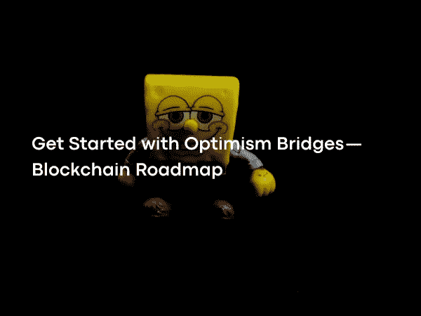

# 乐观桥入门——区块链路线图

> 原文：<https://medium.com/coinmonks/get-started-with-optimism-bridges-blockchain-roadmap-c9bb083e92a8?source=collection_archive---------15----------------------->

Photo by [Jesus Vidal](https://www.pexels.com/@jesuszun18/) on [Pexels](https://www.pexels.com/)

区块链的交流需要中介。当然，这些中间人是区块链黑客的首要目标。有些项目试图消除对这些中介的信任。

防欺诈是系统中的防欺诈系统。只要不出示证据，系统就会诚实地运行。这就是为什么使用防欺诈的系统被称为乐观系统。基于防欺诈的网桥基于 1/N 信任假设。

防欺诈桥梁示例；

由于 Nomad bridge 智能合约方面的错误，1 . 9 亿美元的资产被盗。

游牧桥可以很容易地穿越许多不同的 EVM 链，而彩虹桥只能在以太坊/附近运行。

 [## 游牧者|桥梁

### Nomad 是一种跨链通信标准，支持令牌和数据在…

app.nomad.xyz](https://app.nomad.xyz/)  [## 虹桥

### 在以太坊、极光和 NEAR 之间转移代币！

rainbowbridge.app](https://rainbowbridge.app/transfer)  [## 彩虹桥正在直播

### 2021 年 4 月 6 日— NEAR 团队今天，NEAR 团队激动地宣布彩虹桥投入使用，ERC-20 代币…

near.org](https://near.org/blog/the-rainbow-bridge-is-live/) 

区块链与桥梁的交往是研究最多的话题之一。桥梁建筑已经使用许多不同的技术出现；

雪崩桥，一种使用 SGX 技术的解决方案，
区块链间通信(IBC)，共识级解决方案，
彩虹桥，轻客户端解决方案，
基于有效性证明的桥可以被列为以太坊/Mina 之间的无桥解决方案。

 [## 雪崩桥:在以太坊之间转移资产

### Avalanche Bridge (AB)直接连接到您的 MetaMask 钱包，快速、便宜、安全地传输以太坊…

bridge.avax .网络](https://bridge.avax.network/proof-of-assets)  [## 宇宙桥区块链间通信(IBC)现已在 Terra(露娜)上线

### 10 月 21 日，区块链间通信(IBC)协议在 Terra ( LUNA) mainnet 上线。嫩薄荷的…

cryptoslate.com](https://cryptoslate.com/cosmos-bridge-inter-blockchain-communication-ibc-is-now-live-on-terra/)  [## ETH-彩虹桥附近

### 有许多区块链和可伸缩性解决方案，当我们构建时很难决定使用哪一个…

near.org](https://near.org/blog/eth-near-rainbow-bridge/)  [## 电子伏特

### 互联网……

minaprotocol.com](https://minaprotocol.com/tr) 

重要的是桥梁既安全又快速便宜。大多数桥梁上的资产受 Multisig 钱包保护，仅基于少数钱包的签名，迄今为止，1B 美元+硬币因桥梁黑客攻击而被盗。由于这些黑客攻击大多是由人为错误造成的，因此消除人为信任因素对于区块链安全非常重要。在浪人桥的黑客攻击过程中，黑客分享了他们开了一家假公司，并招募了工程师。黑客通过一个受感染的 pdf 向他的 Ronin 团队的受访者发送了一份不错的薪水，结果，他接管了桥上的大多数验证者。这种简单的网络钓鱼攻击导致了价值 5 . 4 亿美元的黑客攻击。

 [## CoinsDo-下发方案

### CoinsDo-数字资产管理方案,下发方案

www.coinsdo.com](https://www.coinsdo.com/wallet_dispatching.html)  [## 什么是多重签名钱包(Multisig)？

### 显然，加密钱包是购买、销售和存储加密货币的基本要求。你不能…

101blockchains.com](https://101blockchains.com/multisignature-wallets/)  [## Axie Infinity 的浪人桥在 5.52 亿美元的黑客攻击后重新开放——解密

### Sky Mavis，即玩即赚视频游戏 Axie Infinity 背后的开发商说，它正准备重新开放浪人…

decrypt.co](https://decrypt.co/103745/axie-infinitys-ronin-bridge-to-re-open-after-552m-hack)  [## 什么是网络钓鱼？示例和网络钓鱼测验

### 没有单一的网络安全解决方案可以避免所有的网络钓鱼攻击。您的公司应该考虑分层安全…

www.cisco.com](https://www.cisco.com/c/en/us/products/security/email-security/what-is-phishing.html)  [## 浪人网络:一个 6 亿美元的黑客对加密技术的现状说了些什么

### 数千人，如果不是数百万人，可能会在历史上第二大加密黑客攻击中损失金钱。浪人…

www.bbc.com](https://www.bbc.com/news/technology-60933174) 

每天都有不同的区块链解决方案出现，每一个都为不同的问题带来了解决方案。虽然这种多样性是好的，但由于区块链被设计成一个封闭的盒子，如果没有中介，它们就不能相互交流。对桥梁的需求与日俱增，这样不同的生态系统就可以相互影响。有许多桥接架构从不同的角度探讨了去中心化和不信任的概念。

在使用中央和可信桥向另一个链传输消息的过程中，存在某些参与者。中央桥梁通常需要信任一个或多个参与者。这些桥梁的安全性是由这些演员的声誉来衡量的。币安公司可以提供一个需要信任的币安桥梁中心和桥梁建筑的例子。虽然从技术上讲，资金是由币安担保的，但对该桥的信任是基于该公司的用户基础和声誉。由于这种架构非常容易构建，而且从使用成本来看通常也不贵，所以类似的架构很常见。然而，由于桥上押记资金的安全只需要某些行为者的信任，因此可以说安全水平很低。

 [## Binance.org 币安|币安智能链|币安大桥|币安互换

### 币安链和币安智能链的桥接和置换

www.bnbchain.org](https://www.bnbchain.org/en/bridge) 

门限签名方案，可以开发出比基于少数人签名的桥系统更广泛参与的桥。所使用的方案允许收集大量地址的签名并用作单个签名。Synapse 和 Thorchain 就是使用这种技术的网桥类型。虽然就安全性而言，分散信任比集中桥更好，但是两个链之间的通信仍然需要依赖大多数验证器。除此之外，基于 BLS 的桥梁也有望随着即将到来的 Boneh-Lynn-Shacham(BLS)更新而发展。由于 BLS，只要达到所需的多数，多个签名就可以变成单个签名。使多重签名成为单一签名的能力允许在不需要与验证者进行额外交互的情况下传输消息。这样，可以在两个区块链之间建立基于 BLS 签名的信任最小化桥。

 [## 突触

### Synapse 是一个跨链层协议，支持链之间的互操作性。

synapseprotocol.com](https://synapseprotocol.com/?inputCurrency=USDC&outputCurrency=USDC&outputChain=10)  [## 主页

### THORChain 是一个结算层，促进 7 个链之间的互换，包括比特币、以太坊、币安链…

www.thorchain.com](https://www.thorchain.com/)  [## 草稿-irtf-cfrg-bls-签名-04

### March 博纳互联网选秀斯坦福大学意向状态:信息 s·戈尔布诺夫截止日期:2021 年 3 月 14 日…

datatracker.ietf.org](https://datatracker.ietf.org/doc/html/draft-irtf-cfrg-bls-signature-04)  [## 比特币上的 BLS 签名

### 基于配对的密码学:第 2 部分

medium.com](/coinmonks/bls-signatures-on-bitcoin-fc837c799380) 

分散的和信任最小化的桥旨在最小化对中间人的信任。这些桥的一些类型是卷桥，IBC，XCM 和乐观桥。虽然这些桥是安全的和分散的，但是它们在技术上很难开发，并且通常与不同的区块链技术的兼容性很低。

 [## 汇总到汇总桥:连接层 2s

### 以太坊已经开发了一个庞大但支离破碎的第二层环境。卷对卷网桥用于连接…

www.theblockresearch.com](https://www.theblockresearch.com/rollup-to-rollup-bridges-connecting-layer-2s-133125)  [## 区块链间通信

### 编辑描述

ibcprotocol.org](https://ibcprotocol.org/)  [## 用于跨链应用的 XCM 接口

### 我们的桥将支持以太坊智能合约和 parachain 应用之间的任意消息传递。我们将需要 XCMP…

snowbridge-docs.snowfork.com](https://snowbridge-docs.snowfork.com/building-with-snowbridge/xcm-for-state/)  [## 探索乐观主义集体

### 了解 OP 并开始使用乐观应用程序。

app .乐观. io](https://app.optimism.io/bridge) 

区块链建筑中的乐观结构采用防欺诈技术，这种技术正变得日益普遍。首先使用分片的网络，然后是乐观汇总，现在是乐观桥都参与到这个过程中。
欺诈证明证明状态转换是假的。在使用防欺诈的系统中发生的每个状态转换都被接受，并假设它是正确的，只有在检测到错误或欺诈时才生成防欺诈。换句话说，当系统诚实地发展时，没有证据产生。生产时有很重要的防伪功能；数据可用性，如果一个人想证明一个状态转换错误，他们必须能够访问所有的数据。这表明数据的可访问性在基于防欺诈的系统中更为重要。

在乐观桥架构中，有一些参与者在链外工作。这些因架构而异，但基本上，这两个角色是中继者和观察者。想要将资产从区块链 A 转移到区块链 B 的用户首先与区块链 A 上的桥接合同进行交互，并在链上确认该交易。之后，中继器将数据从链 A 传输到链 B，如果链 B 中没有产生防欺诈证据，则交易被认为是正确的。如果中继者发送错误的数据或试图双倍花费数据，则由观察者生成防欺诈证明，并且中继者受到惩罚，而观察者得到奖励。为了在乐观系统中平稳地维持系统，至少一个观察者是诚实的就足够了。乐观的桥梁；它比在基于门限签名方案的桥中发现的架构安全得多，基于门限签名方案的桥在绝大多数验证器中需要 K/N 信任。虽然最佳桥梁在架构上是安全的，但复杂的合同结构会导致暴露于智能合同风险。

 [## 什么是区块链中的重复消费？

### 重复消费是指加密货币可能被使用两次或更多次的风险。交易信息在…

www.investopedia.com](https://www.investopedia.com/terms/d/doublespending.asp) 

许多不同的 L1 项目，如 Near、Avalanche 和 Polkadot，在大肆宣传下取得了成功。这些项目已经形成了一个庞大的生态系统和一个庞大的用户群。随着新 L1 项目的发展，这些链的通信和互操作性成为了更大的挑战。这个过程揭示了建立在信任最小化或无信任结构中的桥梁。

 [## 接近协议|重新想象您的世界

### 在 NEARverse 中主张权利的最佳方式是创建一个帐户(钱包)。然后，选择第一步…

near.org](https://near.org/?utm_source=Search&utm_medium=cpc&utm_campaign=NEARBRANDED&utm_term=BrandKeywords)  [## Avalanche:速度惊人、成本低廉且环保| Dapps 平台

### 以最少的硬件投入扩展到数百万个验证器，或锁定您的 AVAX，以帮助处理交易和…

www.avax.network](https://www.avax.network/)  [## 波尔卡多特网络

### netim Polkadot 向 proto kolüzerinde kontrole SAH iptir 付款。第二平台……

polkadot.network](https://polkadot.network/tr/) 

Nomad 是一个基于防欺诈的协议，受乐观汇总设计的启发。它之所以被称为协议，不仅因为它充当了桥梁，还因为它支持链间治理和应用程序。该协议由链外契约和链外参与者组成。

Onchain 契约被定义为主链和副本链契约。有了 Home 契约，消息被传输，想要采取行动的用户与这个契约进行交互。副本契约是接收消息和链外参与者进行交互的契约。由于链上合同被设计为可以通过五个参与者中的三个的签名来升级，并且智能合同是复杂的，所以这里存在智能合同的风险。

外链演员；

主链上的 DAO 选择更新程序。刀由五个人组成，由灵知钱包保护。要成为更新者，DAO 至少需要三个签名。更新器负责监控源链上的 home 契约，处理消息和更新 root。副本契约的诚实运行需要完全信任更新者的诚实。在 Nomad 架构中，与乐观汇总不同，更新程序可能会传输不正确的数据。这就是为什么更新者必须持有赌注硬币作为保证，他们将诚实地在主链上行动。如果复制品向链发送虚假数据，其他链外参与者创建防欺诈，并且从 mainnet 中扣押赌注硬币。在这里，它迫使更新者诚实行事。

 [## 概述— Gnosis 安全

### Gnosis Safe 是管理以太坊上数字资产的最值得信赖的平台

gnosis-safe.io](https://gnosis-safe.io/) 

Watcher 负责监控更新程序与主合同的交互，监控副本合同并创建防欺诈。为了使 Watcher 防欺诈，所有数据都必须是可访问的。在这种情况下，随着 Nomad 的广泛使用，随着观察者需要监控的数据增加，未来可能有必要在去中心化方面做出妥协。然而，由于该系统是基于 1/N 信任假设的，所以它可能不会在信任环境中造成问题。

中继器负责将更新从主协议发送到一个或多个副本协议。它还可以监控副本合同的更新，并生成防欺诈信息。

处理器验证未决消息，并将它们发送给最终用户。处理器可以通过生成防欺诈代码来控制系统的完整性。

 [## 体系结构

### 编辑描述

docs.nomad.xyz](https://docs.nomad.xyz/token-bridge/architecture) 

历史上曾有一次，人们注意到 Nomad 桥上的一个漏洞，价值 1 . 9 亿美元的硬币被盗。这次黑客攻击的原因是一次更新后的智能合约错误。错误包括转发的消息可以被处理，即使它是在不正确的根下传递的。这导致管理系统必须删除每个错误的交易。更新是为了消除这一错误。

 [## 修复:防止恢复过程中无效的消息最终被 prestwich 处理…

### 动机目前，如果消息被证明是在欺诈性的根下，那么即使根是…

github.com](https://github.com/nomad-xyz/monorepo/pull/289) 

在更新契约时，有三个不同的根在所讨论的契约中被控制；一个包含消息还没有被批准或处理，另一个完成了挑战期而没有生成防欺诈，即消息是正确的，另一个包含消息被批准。通常情况下，root 0，即包含错误消息的 root，不应包含在白名单中，以免被合同接受，但由于被遗忘在白名单中，黑客将他们希望接受的消息写入了合同。因此，合同中的 1 . 9 亿美元硬币被盗。

 [## 沙丘

### 社区的区块链生态系统分析。探索和分享来自以太坊，xDai，多边形，乐观…

dune.com](https://dune.com/queries/1128479/1926897) 

没有信息表明 Nomad bridge 合同在此次更新后接受了独立组织的额外审计，任何审计报告中都没有提到这一错误。理解这里的错误是由智能契约中的一个 bug 引起的，而不是由桥的乐观桥结构引起的，这一点非常重要。智能合约风险是在与分散应用程序的每次交互中承担的风险，类似的风险也发生在桥上，因为智能合约在桥上工作，但也有例外。

合同中的漏洞被一个黑客注意到了，游牧者的合同被几十个人洗劫一空。第一个黑客入侵了 ETH，他在入侵前 45 天左右从一个混合器中取出了 ETH。在黑客窃取了大约 3000 万美元硬币后，社交媒体上有人分享说，黑客的交易可以被复制，硬币也可以用类似的方式被盗。后来，合同中的硬币开始被使用这些信息的人提取。whitehat 和 blackhat 黑客通过复制第一个黑客的交易，掠夺了大约 1 . 5 亿美元的资产。根据 Peckshield 提供的数据，有 42 个账户从大桥盗取了超过 1 亿美元的资产。其余 4000 万美元资产被其他用户窃取。

 [## PeckShield —行业领先的区块链安全公司

### 编辑描述

peckshield.com](https://peckshield.com/) 

自推出以来，以太坊一直在满足开发者和用户的许多需求。但是以太坊中的扩展问题正促使用户和开发者竞相寻求区块链解决方案。

Near 是使用分片的区块链，而 Aurora 是运行 EVM 的 Near 的解决方案。与汇总不同，Aurora 是一个执行、数据可访问性和结算都在 mainnet 附近的解决方案。由于 rollup 的模块化结构，roll up 桥中遇到的延迟问题在 Aurora 的桥中不存在。由于奥罗拉是一个独立的区块链和区块链被设计得像一个封闭的盒子，与另一个连锁店的交流存在障碍。对于这些障碍，诸如 IBC 和轻型客户端网桥之类的解决方案是在协议层提供的。Near、Rainbow Bridge 和 Light Client Bridges 是通过相互监控两个链的最新状态来工作的网桥。

 [## 向星星射击。

### Aurora 提供以太坊兼容性、接近协议的可扩展性和行业第一的用户体验，通过…

极光. dev](https://aurora.dev/) 

区块链由报头、事务、状态和缓存数据组成。报头包含确认区块链中的数据所需的最小数据，并且包含基本信息，例如先前的块散列和时间戳。轻型客户端不必下载区块链中的所有数据，因为标头负责验证数据。但是，这导致轻型客户端依赖于大多数完整节点。数据可用性采样(DAS)等各种解决方案正试图克服障碍。轻型客户端用于与区块链交互和在桥梁设计中确认区块链上的交易等领域。

轻客户端本质上是一个计算机程序。因为它可以运行智能合约，所以当加密基础结构在区块链形成时，轻客户端可以作为智能合约运行。由于可互操作的轻型客户端，两个区块链可以批准块头，而不需要第三方参与者的信任，区块链桥可以在没有信任的情况下设计。

彩虹桥是由 1inch 股票市场首席技术官安东·布科夫设计的。如同所有的区块链桥一样，彩虹桥由链外和链内的演员控制。桥上的链上参与者由在 Near 网络上用 Rust 编写的以太坊轻客户端和在以太坊网络上用 solidity 编写的 Near 轻客户端组成。实现轻客户端存在一些密码障碍。

 [## 认识一下 1inch 团队:Anton Bukov，1inch Network 的联合创始人

### 继续我们关于 1 英寸团队主要成员的系列文章，我们将介绍 1 英寸网络的联合创始人安东…

blog.1inch.io](https://blog.1inch.io/meet-1inch-team-anton-bukov-co-founder-and-cto-9d0d1b56142b)  [## 1 英寸—以太坊、币安智能链、乐观、多边形、Arbitrum 上的 DeFi / DEX 聚合器

### 以太坊、币安智能链、乐观、多边形等市场上流动性最强、利率最高的 DeFi / DEX 聚合器

app.1inch.io](https://app.1inch.io/#/1/swap/ETH/DAI) 

EthOnNearClient 是 Near 网络上的以太坊轻客户端，用 Rust 写的。这个客户端存储以太坊头。如果在每次状态改变时新的报头被存储在邻近网络中，存储成本将不断增加，导致网桥处理成本增加。因此，通过网桥传输的数据只能存储七天。如果通往以太坊/Near 的桥上的交易没有在七天内完成，资产可以无限期地保持赌注。

NearOnEthClient 是以太坊网络上的 Near Light 客户端，用 Solidity 编写。该客户端的工作方式类似于 EthOnNearClient。Near 使用 ED25519 签名方法对来自批准块的验证器的消息进行签名。由于这种签名方法与 Solidity 不兼容，因此在以太坊上运行将非常困难且成本高昂。这就是乐观方法发挥作用的地方。除了 NearOnEthClient 签名之外，Near 头中的所有信息都被认为是正确的，四个小时的等待期开始。在这四个小时的等待期间，监管机构检查数据的准确性，如果有欺诈企图，只需出示防欺诈证明就足以防止欺诈。

 [## 介绍

### Ed25519 是一个公钥签名系统，具有几个吸引人的特性:快速的单签名验证…

ed25519.cr.yp.to](https://ed25519.cr.yp.to/) 

众所周知，这个演员只有一个目的；它可以被定义为将一个区块链发生的事件传送到另一个区块链。这就是为什么两个客户端契约需要添加一个证明者。其中一个证明者 EthOnNearProver 在 Near 中验证以太坊中的事务，而 NearOnEthProver 在 Ethereum 中验证 Near 中的事务。多亏了校对人员，彩虹桥的设计变得更加安全。

 [## GitHub—aurora-is-near/彩虹桥:🌈🌈🌈近以太坊分散桥

### CLI 的当前版本是一体式软件包，可用于生产和测试。因此，即使…

github.com](https://github.com/aurora-is-near/rainbow-bridge) 

彩虹桥实际上被设计成一种不需要任何信任假设的结构，就像 IBC 一样。但 Solidity 和以太坊标准的难点在于，在设计的某一部分采用了乐观的做法。在建筑上，彩虹也许是两个独立生态系统之间最安全的桥梁之一。

彩虹桥是以太坊桥中第四大桩资产桥。可以说，Aurora 和 Near mainnet 上的大部分桥流动性都在彩虹桥中，使用户更容易采用。迄今为止，彩虹桥已向 13K+用户转移了 25 亿美元以上的资产，总共转移了 39K+的资产。

《彩虹桥》中的乐观方法是由于密码壁垒。尽管这种基于防欺诈的桥成功地经受住了黑客攻击，但在基于防欺诈的系统中存在一些问题，尤其是验证者困境和延迟。根据 Aurora Labs 首席执行官的声明，彩虹桥未来可能会从基于防欺诈的架构切换到基于零知识证明的架构。目前，一家名为电子实验室的公司正在进行彩虹桥向 zk 架构过渡的研究。除此之外，根据 Near Protocol 联合创始人伊利亚的说法；由于 IBC 和彩虹建筑的相似性，彩虹和 IBC 桥在未来将有可能合作。

 [## 验证者的困境—词汇表| Smith + Crown

### 验证者的困境是由于缺乏激励来验证和存储新交易的记录…

smithandcrown.com](https://smithandcrown.com/glossary/verifiers-dilemma/)  [## 电子实验室

### 在你最喜欢的区块链上私下交易。发送任意金额，隐藏发送者，接收者和金额。Testnet Live…

electronlabs.org](https://electronlabs.org/)  [## 向星星射击。

### Aurora 提供以太坊兼容性、接近协议的可扩展性和行业第一的用户体验，通过…

极光. dev](https://aurora.dev/)  [## 伊利亚·波洛苏欣—维基

### 近协议的创始人

golden.com](https://golden.com/wiki/Illia_Polosukhin-AMMYWMX) 

如果系统中的计算成本很高，则要么将有效性(zk)证明制成小证明并加以证明，要么通过用基于防欺诈的系统来证明来降低计算成本。奖励和惩罚机制似乎比基于防欺诈的系统更简单，因为数据的有效性在基于有效性证明的系统中被直接证明。由于欺诈在基于防欺诈的系统中被证明，除非系统中存在欺诈，否则不知道系统是否被实际监控。

 [## ZK-汇总

### 等离子体是建筑可伸缩性方法的名称，这种方法将第 2 层块放在以太坊的顶部…

docs.ethhub.io](https://docs.ethhub.io/ethereum-roadmap/layer-2-scaling/zk-rollups/) 

这一点在彩虹桥黑客攻击中清晰可见。黑客试图将以太坊的无效交易发送到 Near，观察者产生防欺诈，但看到这一点，MEV bot 阻止了观察者交易，自己获得了黑客无法获得的奖励，实际上是观察者。

 [## MEV 探索

### MEV 探索

梅夫·Exploreexplore.flashbots.net](https://explore.flashbots.net/) 

做看守的演员即使不造假也要给个奖，让他们自己干活；不可能分配公平的奖励，因为除非网络中存在欺诈，否则无法知道他们是否实际工作。这就是为什么这被视为一个有问题的解决方案。让担任观察者的人受到欺诈者的惩罚。然后，这变成了一个麻烦的解决方案，因为除非网络中存在欺诈，否则观察者不能获得奖励，并且即使他们获得奖励，MEV 攻击也可能发生。由于 zk 技术不太稳定，基于防欺诈的系统似乎还会继续使用很长一段时间，但由于这些原因，基于 ZK 的系统将在未来脱颖而出。

 [## 最大可提取值(MEV)| ethereum.org

### 最大可提取值(MEV)简介

ethereum.org](https://ethereum.org/en/developers/docs/mev/) 

硬币是区块链安全方面最有问题的部分之一，是桥梁。开发了许多不同的技术来使这些桥更安全，并完全消除信任桥的义务。这些技术的问题是计算成本非常高。高昂的计算成本迫使开发者使用欺诈和有效性证明。存在基于有效性证明的超链接比欺诈证明更有利的情况；它们可以被列为速度、计算成本和置信度假设。随着零知识证明的发展，基于防欺诈的系统将被基于有效性证明的系统所取代。能够通过使用多重签名管理的钱包升级智能合约在去中心化方面是一个问题，并且每个升级的实现没有单独的审核在安全性方面是一个单独的安全问题。因此，人们认为协议级解决方案(IBC、XCM、Enshired Rollup Bridge)将比智能合同级桥接更常见，并将在构建多链未来中发挥重要作用。

 [## 核心协议中包含的总结

### Polynya 在他的推文中有一个很棒的分类帖子…

forums.minaprotocol.com](https://forums.minaprotocol.com/t/enshrined-rollups-in-core-protocol/5676) 

下一篇文章再见…

> 加入 Coinmonks [电报频道](https://t.me/coincodecap)和 [Youtube 频道](https://www.youtube.com/c/coinmonks/videos)了解加密交易和投资

# 另外，阅读

*   [Pionex 双投](https://coincodecap.com/pionex-dual-investment) | [AdvCash 审核](https://coincodecap.com/advcash-review) | [光宗耀祖审核](https://coincodecap.com/uphold-review)
*   [面向开发者的 8 个最佳加密货币 API](https://coincodecap.com/best-cryptocurrency-apis)
*   [7 个最佳零费用加密交换平台](https://coincodecap.com/zero-fee-crypto-exchanges)
*   [最佳网上赌场](https://coincodecap.com/best-online-casinos) | [期货交易机器人](/coinmonks/futures-trading-bots-5a282ccee3f5)
*   [分散交易所](https://coincodecap.com/what-are-decentralized-exchanges) | [比特 FIP](https://coincodecap.com/bitbns-fip)