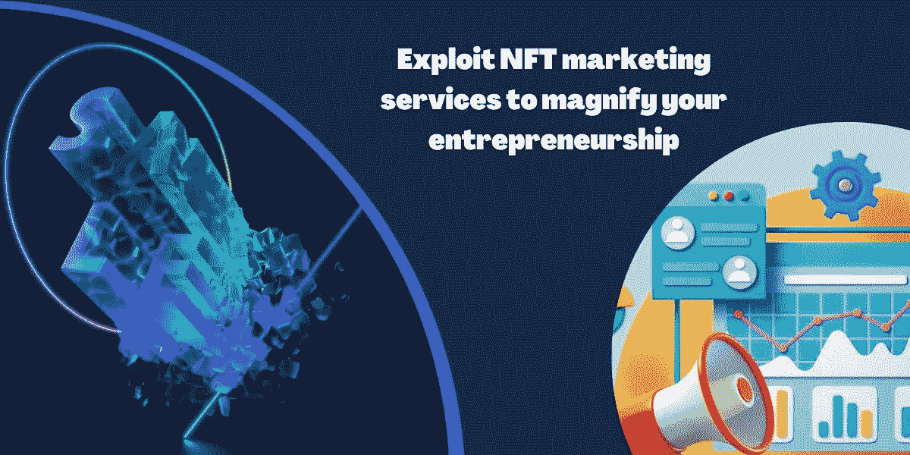

# 获得 NFT 营销服务——NFT 企业家精神的显著成效

> 原文：<https://medium.com/coinmonks/get-the-sharp-results-of-nft-marketing-services-nft-entrepreneurship-8f63074735cc?source=collection_archive---------33----------------------->

Source:Appdupe

不要仅仅因为你在寻找最佳的营销策略就认为你已经绝望了。不管怎样，现在读完这篇博客后，你需要花几分钟的时间来知道正确的道路。此外，期待这个宏伟的 NFT 营销服务，并促进您的服务在瞬间。所有的企业都将登陆一个需要营销解决方案的平台。你可以仔细研究领先的营销公司，如 NeoReach、Appdupe、Blockchain App Factory 和 INORU，以满足你的需求。

点燃势头，你可以使用这个博客作为思考解决方案的指南。通过适应各种 NFT 营销策略，使你的企业朝着刺激目标的方向前进。如果你是一名企业家，那就全力以赴向那些能够大幅增加你的观众群的领先公司发展。

让你认识到 NFT 营销机构的重要性及其宝贵的工具，我可以发誓你会成为一个热潮。不浪费一分钟，你可以分配你的宝贵时间来阅读这个博客。在此拍摄您点击瞬间的快照……

## 🔥 **NFT 营销机构——NFT 市场的基石**

你知道培训自己了解 NFT 营销策略的重要性及其熟悉程度的最佳机会。尽管面临各种挑战，但密码创业者会尽最大努力为你的服务打造商业驱动的营销解决方案。看看这个博客…

> NFT 营销服务是 NFT 产品和服务的广告和促销部分。他们打算销售 NFT，推动 NFT 的大量销售，并在更好的范围内促进不和谐社区。

Source:Appdupe

激增顶级机构的最佳公告，以更好的机会营销他们的 NFT。你必须知道一级和二级营销工具。

✅Website 发展

✅Research 分析

✅Search 发动机优化

✅Blogging

✅Content 营销

✅Video 营销

✅Influencer 营销

✅Social 媒体公告

✅PR 发布

✅E-mail 营销活动

## 🔥**为您的 NFT 调整营销方法**

📯**动态分析方法**:这种方法完全以研究为导向，依赖于与用户的交流和互动。它包括通过进行各种离线会议来进行一手和二手研究，以了解需求和要求。因此，结果给出了下一步要做什么的最佳理解。

Source:gettyimages

📯**多渠道方法**:这种方法包括在社交媒体上获得活跃的 10 亿用户的关注。此外，它还包括在线营销、电子邮件、影响者、内容甚至视频。多渠道是有益的，因为你不能仅仅依赖与用户的几分钟互动。一段时间后，他们的心态可能会发生一些变化。

> *“战略不是计划的结果，而是相反:它的起点。”*

📯**策略与实施**:分析目标受众后，了解他们的欲望很重要。然后仔细检查正确的方法并执行它们也是有效的。NFT 营销机构的工作是调整其战略并使其发挥作用。

## 🔥**现在，NFT 营销策略的合适工具是什么？？？**

就像我之前说的，下面的列表将给出 NFT 营销工具的每个优势的清晰图像:

🔦**“网站”是第一印象**

首先，创建一个信息丰富和有吸引力的网站是一项挑战和耗时的工作。但是听过这句话，“第一印象可能是最好的。”相应地，网站的形象将决定成功率，并决定实现目标的概率。

source:tenor

🔦**搜索引擎优化；如果不是他们，那是谁？？？**

SEO 是思考、分析当前 NFT 市场趋势并收集信息的专家。他们优化正确的营销策略，使网站排名靠前。

 [## IDO 营销服务 IDO Launchpad 的白衣骑士

### IDO launchpad 是一种为加密项目和开发筹集资金的新颖方式。最初的 Dex 产品服务于…

medium.com](/nerd-for-tech/ido-marketing-services-a-white-knight-for-ido-launchpad-dd7e23268136) 

🔦**博客——营销中的用词选择**

应该有一些信息丰富的内容，最终满足用户的需求。博客和论坛经常迷惑用户，通过词汇来窥视里面的内容。

🔦**利用社交媒体渠道利用 NFTs**

不是第一次，但离开社交媒体网站是不可取的。它包括 Twitter、Reddit、脸书、Instagram 和 LinkedIn。在这个网站上，用你的 NFT 产品和服务娱乐你的用户是最好的机会。

source:tenor

🔦**电子邮件营销；证明使用群发邮件的合理性**

另一种介绍 NFT 收藏品的方式是电子邮件营销。大量电子邮件的存在是为了向全球潜在用户发送电子邮件，以获得个人回应。人们甚至可以发送后续信息并获得他们喜欢的内容。也许你需要尝试几次，因此，群发邮件就变得简单了。

## 🔥**结论**

我总结我的想法，通过带来网络战略和研究分析，你可以在你的 NFT 销售中脱颖而出。如果你得到了你的解决方案，那么立即抓住最好的 NFT 营销服务来拓展你的业务。雇佣最好的 NFT 营销专家来成倍地增加你的收入，从而缩短你的限制，扩大你的局限。最终，留给你惊人的营销解决方案，我希望你达到最好！！！

> 交易新手？试试[密码交易机器人](/coinmonks/crypto-trading-bot-c2ffce8acb2a)或者[复制交易](/coinmonks/top-10-crypto-copy-trading-platforms-for-beginners-d0c37c7d698c)