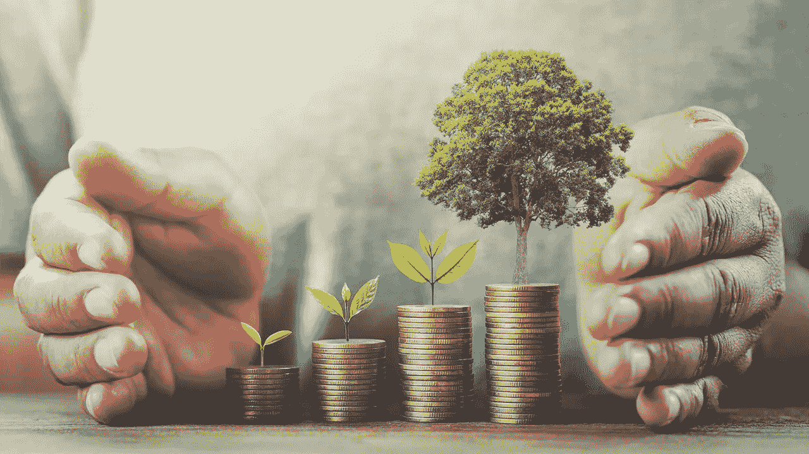

# 获得并保持世代财富

> 原文：<https://medium.com/coinmonks/getting-and-maintaining-generational-wealth-c78c978e462c?source=collection_archive---------50----------------------->

# 世代财富

听到“世代财富”这个词，你可能会想，“哇，这很重要。”你可能已经忘记了，因为你全神贯注于别的事情。摆脱债务，把钱存起来，或者实现其他金钱目标只是几个例子。为下一代积累财富可能不是你现在最优先考虑的事情，因为你正全神贯注于处理眼前的财务需求。不过，从长远来看，这是你应该考虑的事情。

“转移世代财富”这个说法指的是什么？？别担心！这是什么以及如何为你的家庭建立一个将在这篇文章中解释。

代际财富的含义:从一代传到下一代的财富被称为代际财富。这也被称为家庭财富或遗产财富。如果你能为你的子女或孙辈留下一些东西(比如遗产)，你就在帮助增加你家庭的代际财富。

当然，你可能会给家人留下很多东西，比如美好的回忆和健康的基因。然而，我指的是你能够留下的财政资源。这种财富可以采取多种形式，包括房地产资产、股票市场投资或未来的金融教育。

# 如果你是白手起家或者有债务，家族财富是至关重要的.......

如果他们有钱，你的父母可以支付大学费用。这个选择会影响你的财务状况。为住房或退休储蓄可能比偿还大学贷款更好。随着你在财务旅程中的进步，你可能已经意识到从财务失误中恢复过来并不容易。

它可以防止超支或者让你更快地做预算。

黑人和棕色人种家庭积累的财富比白人家庭少。种族主义造成的。少数民族必须为后代创造财富。

# 让我们为子孙后代创造财富。

创造财富很简单。你必须获得资产或为退休积累资金。当你去世时，你会把你的资产留给后代。

这听起来容易，但做起来很难。如果你想攒钱，为下一代攒钱可能会显得力不从心。可以理解。

在为世代财富做准备之前，你必须建立你的退休计划和财务目标。一旦你为你的黄金岁月控制了你的财务，开始为未来储蓄。

这里有几个策略可以给你的子孙留下金钱遗产。

# 股票是很好的投资

长期的财富积累可以通过参与股市来完成。如果你希望创造一份能延续几代人的财富遗产，这是一个很好的选择。如果你从来没有做过股票市场，它可能会令人生畏。如果你想在有生之年或更长的时间里增加财富，这是一个非常重要的方法。

投资低成本的指数基金是启动股市的最佳途径。在这些基金中可以找到低成本和长期收益。

# 把你的公司建成一个王朝

超过百分之三十的家族企业传承到下一代，这是一个强有力的指标，表明这些公司有潜力取得重大成功。如果家族企业非常成功的话，考虑一下让你的孩子来掌管它。

尽管许多家族企业没能延续到第二代，但你的家族企业仍有希望。如果你的孩子的兴趣和能力与你相似，他们很有可能希望接管你发展的企业。

如果你想尽最大可能顺利过渡到下一代，你应该尽早让你的孩子参与到家族企业中来。他们需要了解公司是如何运作的，以及如何在公司内部保持成功。

如果他们对你开发的业务不感兴趣，不要期望他们会控制你的业务。如果他们不能或不愿经营这家公司，可以考虑卖掉它，以另一种方式为世代财富融资。

拥有人寿保险让你有能力在意外去世时保护你所爱的人。如果你无法谋生，你的孩子可能需要生活在不太理想的经济条件下。如果你现在花时间努力为你自己和你的孩子购买一份人寿保险，你也许能让他们免于经济灾难。此外，如果他们没有你，他们将有许多其他问题要处理。

教育通常能为你的孩子提供一种养活自己的手段。许多拥有大学学位的人有机会追求可以帮助他们管理财务的高薪工作。

任何受过教育的人都会一直接受教育。虽然生活中的其他事情来来去去，但没有人可以带走你的教育。如果你能帮助你的孩子无债一身轻地从大学毕业，你就是在帮助他们为更好的财务前景做准备。

考虑一下，通过支付孩子的教育费用，你可以减轻多少经济压力。投资孩子的教育是积累世代财富并为他们的财务成功做好准备的好方法！

# 教你的孩子理财

据估计，70%的家庭财富在第二代中流失。而 90%的人第三次都失败了！

用这样的统计数据为一笔丰厚的遗产存钱似乎毫无意义。然而，在许多情况下，代际财富损失可以通过金融教育来避免。毕竟，如果你的孩子缺乏理财素养，很容易失去世代财富。

这就好比要求你的孩子在你死后维护一辆经典的古董车，却不教他们任何机械技能。这辆车几乎肯定会在某个时候抛锚。同样，如果你不教你的孩子任何关于个人理财的知识，你留给他们的财富可能会在他们的一生中逐渐减少。

因为你对传承家族财富感兴趣，你可能对个人理财很熟悉。教你的孩子这个。这种理解将创造并保护世代财富。可以用很多方式和孩子讨论钱的问题。孩子们可以通过书籍、活动或听取财务决策来了解金钱。

你甚至可以帮助他们在年轻时开立银行账户，向他们灌输为未来储蓄的价值。

拥有各种收入来源有助于为后代创造财富。百万富翁平均有七种收入来源！

有许多不同类型的收入，但其中最好的是被称为被动收入。当你用时间换取金钱时，比如通过一份工作或兼职，你就获得了积极收入。

被动收入是在初始设置花费很少时间后从您的资产中获得的。出租房产、图书版税、点对点借贷等等都是例子。因此，如果你投入最初的努力会有所帮助，但是一旦这样做了，你将继续从你的努力中获益。因此，你可以写一本书，赚取未来几年的版税，或者买一栋房子出租，获得净租金收入。开始建立被动收入流，创造世代财富！

# 首先，照顾好你自己

世代财富只能通过为未来存钱来实现。首先支付自己是省钱的最快和最有效的方法。当你拿到薪水时，你会立即把钱转入你的储蓄和投资。这样你会省下很多钱，而且你不用担心很快花光。如果可以的话，开一个储蓄账户，在那里你可以获得利息。

你必须考虑将你的部分资金投入股市，以增加你的长期净值。如何传承家族财富

你现在明白了如何创造代际财富，但你还必须想出一个传承财富的策略。以下是你需要做的事情，以确保你的金融资产平稳过渡到下一代。

遗产计划对于确保你的资产平稳过渡是必要的。随着你的遗产越来越大，这个计划会变得越来越复杂。在任何阶段，我都会建议你向律师咨询如何制定你的遗产计划。

根据你的目标和资产，计划会有很大的不同。你可以在法律专业人士的帮助下创建一个项目，让你的资产以最少的麻烦转移给你的孩子。

遗嘱可能包含在你的遗产计划中，但是即使你没有遗嘱，你也应该写一份。你的具体愿望应该包含在遗嘱中——你对任何累积资产的计划越详细越好。

幸存者通常没有遗嘱就不同意。他们很激动，因为你走了。遵循明确的建议，以避免悲剧和经济创伤。复杂但令人钦佩:为后代创造财富。在你的财务之后，保留你家庭的未来。

找到适合你的工作，因为不是每个人都想投资或创业。不管你的技术如何，教你的孩子关于金钱的知识。如果你教你的孩子关于个人理财的知识，他们会走在游戏的前面。

> 加入 Coinmonks [电报频道](https://t.me/coincodecap)和 [Youtube 频道](https://www.youtube.com/c/coinmonks/videos)了解加密交易和投资

# 另外，阅读

*   [如何购买瑞波(XRP)](https://coincodecap.com/buy-ripple-india) | [非洲最好的加密交易所](https://coincodecap.com/crypto-exchange-africa)
*   [非洲最佳加密交易所](https://coincodecap.com/crypto-exchange-africa) | [Hoo 交易所评论](https://coincodecap.com/hoo-exchange-review)
*   [eToro vs robin hood](https://coincodecap.com/etoro-robinhood)|[MoonXBT vs by bit vs Bityard](https://coincodecap.com/bybit-bityard-moonxbt)
*   [有哪些交易信号？](https://coincodecap.com/trading-signal) | [比特斯坦普 vs 比特币基地](https://coincodecap.com/bitstamp-coinbase)
*   [ProfitFarmers 点评](https://coincodecap.com/profitfarmers-review) | [如何使用 Cornix 交易机器人](https://coincodecap.com/cornix-trading-bot)