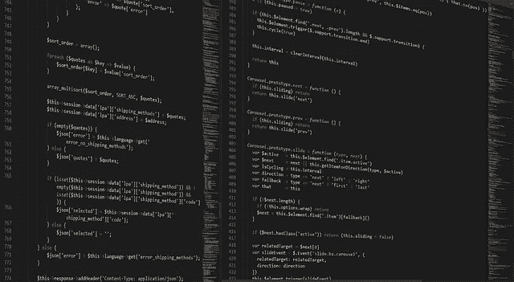

# 使用 Web3.js 获取 CSC 网络状态

> 原文：<https://medium.com/coinmonks/getting-csc-network-status-using-web3-js-83dc3aef0d0b?source=collection_archive---------29----------------------->

你有没有尝试过找一个开发者端的工具来帮助你进行开发？在本教程中，我们想和 web3.js 一起为 csc 创建一个开发者站。



image by Boskampi

## 装置

首先，您需要将 web3.js 放入您的项目中。这可以通过以下方法实现:

*   npm: `npm install web3`
*   纱线:`yarn add web3`
*   纯 js:链接`dist/web3.min.js`

您可以将此文件包含在 html 文件中:

```
<script src="https://cdn.jsdelivr.net/npm/web3@latest/dist/web3.min.js"></script>
```

UNPKG:

```
<script src="https://unpkg.com/web3@latest/dist/web3.min.js"></script>
```

## 设置提供者

要与节点 rpc 交互，我们应该首先设置提供者:

```
var Web3 = require('web3');
var web3 = new Web3('https://testnet-rpc.coinex.net');
// or
var web3 = new Web3(new Web3.providers.HttpProvider('https://testnet-rpc.coinex.net'));
```

## 默认块

默认块用于某些方法。您可以通过将 defaultBlock 作为最后一个参数传入来覆盖它。默认值为`"latest"`。

## 财产

默认块参数可以是下列参数之一:

*   `Number|BN|BigNumber`:一个街区号
*   `"earliest"` - `String`:创世纪板块
*   `"latest"` - `String`:最新区块(区块链现任负责人)
*   `"pending"` - `String`:当前挖掘的块(包括未决事务)

```
<p id="block"></p>
document.getElementById("block").innerHTML = web3.eth.defaultBlock;
```

## getGasPrice

```
web3.eth.getGasPrice([callback])
```

返回当前天然气价格 oracle。气价是由最后几个街区的气价中值决定的。

> 交易新手？试试[加密交易机器人](/coinmonks/crypto-trading-bot-c2ffce8acb2a)或者[复制交易](/coinmonks/top-10-crypto-copy-trading-platforms-for-beginners-d0c37c7d698c)

## getBlockTransactionCount

返回给定块中的事务数量。

## 因素

1.  `String|Number|BN|BigNumber` -块号或散列值。或者如[默认块参数](https://web3js.readthedocs.io/en/v1.7.4/web3-eth.html#eth-defaultblock)中的字符串`"earliest"`、`"latest"`或`"pending"`。
2.  `Function` -(可选)可选回调，返回一个错误对象作为第一个参数，结果作为第二个参数。

## 返回

`Promise`返回`Number` -给定块中的事务数。

例如:

```
web3.eth.getBlockTransactionCount("0x12efdf7be932add184bd1f80b087eadbfe1d15da2a8a453fbf94fb590605f776");
```

## 获得交易

返回与给定事务哈希匹配的事务。

## 因素

1.  `String` -交易散列。
2.  `Function` -(可选)可选回调，返回一个错误对象作为第一个参数，结果作为第二个参数。

## 返回

`Promise`返回`Object` -一个事务对象其哈希`transactionHash`:

*   `hash` 32 字节- `String`:交易的哈希。
*   `nonce` - `Number`:发送方在本次之前的交易笔数。
*   `blockHash` 32 字节- `String`:该事务所在块的 Hash。`null`如果待定。
*   `blockNumber` - `Number`:该交易所在的块号。`null`如果待定。
*   `transactionIndex` - `Number`:块中交易索引位置的整数。`null`如果待定。
*   `from` - `String`:寄件人地址。
*   `to` - `String`:收款人地址。如果是合同创建交易。
*   `value` - `String`:价值转移于魏。
*   `gasPrice` - `String`:发送方在魏提供的气价。
*   `gas` - `Number`:发件人提供的气体。
*   `input` - `String`:随交易发送的数据。

## 例子

```
web3.eth.getTransaction("0x74c163e2c55e1390d148988e40152e16260d81c50bd56e2c2c5b0d3d6a3b38ab");//output
<state>: "pending" <state>: "fulfilled"<value>: Object { blockHash: "0xb87e10d69de0ce988c16e55619a157ccd8fd3f3a6720581b7bec01fa82899476", blockNumber: 11023436, from: "0x2a6BFd97C83d967361Fa30b78c5f1A042c1A2D77", … }blockHash: "0xb87e10d69de0ce988c16e55619a157ccd8fd3f3a6720581b7bec01fa82899476"blockNumber: 11023436from: "0x2a6BFd97C83d967361Fa30b78c5f1A042c1A2D77"gas: 408889gasPrice: "500000000000"hash: "0x74c163e2c55e1390d148988e40152e16260d81c50bd56e2c2c5b0d3d6a3b38ab"input: "0x7b3205f5"nonce: 163811r: "0xbf6da965cb3a49df7d8b9fe58b04873c99699b2e55d980a1b25345ea36ab9406"s: "0x736a83f743d06550aa0c4101159eb93250192dfc3e24b06750230081e24fbbf0"to: "0xE2EB501799919E19138cBaB1D5E30461f50fde26"transactionIndex: 0v: "0x8e"value: "0"
```

## getTransactionCount

获取从此地址发送的交易数量。

## 因素

1.  `String` -获取交易数量的地址。
2.  `Number|String|BN|BigNumber` -(可选)如果您传递此参数，它将不会使用用 [web3.eth.defaultBlock](https://web3js.readthedocs.io/en/v1.7.4/web3-eth.html#eth-defaultblock) 设置的默认块。也可以使用预定义的块号，如`"earliest"`、`"latest"`和`"pending"`。
3.  `Function` -(可选)可选回调，返回一个错误对象作为第一个参数，结果作为第二个参数。

## 返回

`Promise`返回`Number`——从给定地址发送的交易数。

## 例子

```
web3.eth.getTransactionCount("0x2a6BFd97C83d967361Fa30b78c5f1A042c1A2D77");
```

## 估计气体

执行消息调用或事务，并返回使用的气体量。注意:您必须指定发件人地址，否则您可能会遇到奇怪的行为。

## 因素

1.  `Object` -一个事务对象，见[web 3 . eth . send transaction](https://web3js.readthedocs.io/en/v1.7.4/web3-eth.html#eth-sendtransaction-return)不同的是对于调用来说`from`属性也是可选的。
2.  `Function` -(可选)可选回调，返回一个错误对象作为第一个参数，返回结果作为第二个参数。

## 返回

`Promise`返回`Number`——模拟通话/交易使用的气体。

## 例子

```
web3.eth.estimateGas({
    to: "0x11f4d0A3c12e86B4b5F39B213F7E19D048276DAe",
    data: "0xc6888fa10000000000000000000000000000000000000000000000000000000000000003"
})
```

## 符号

使用特定帐户签署数据。此帐户需要解锁。

## 因素

1.  `String` -数据签署。如果是字符串，将使用 [web3.utils.utf8ToHex](https://web3js.readthedocs.io/en/v1.7.4/web3-utils.html#utils-utf8tohex) 进行转换。
2.  `String|Number` -签署数据的地址。可以是 web3.eth.accounts.wallet 中本地钱包的地址或索引。
3.  `Function` -(可选)可选回调，返回一个错误对象作为第一个参数，结果作为第二个参数。

## 返回

`Promise`返回`String` -签名。

## 例子

```
web3.eth.sign("Hello Coinex!","0x2a6BFd97C83d967361Fa30b78c5f1A042c1A2D77")
```

在本教程中，我们将使用 web3.js 与合同进行交互

有关更多信息，请查看 web3.js 文档:

[https://web3js.readthedocs.io/en/](https://web3js.readthedocs.io/en/)

检查 csc 文档:

 [## CoinEx 智能链

### CoinEx 智能链

CoinEx 智能 Chaindocs.coinex.org](https://docs.coinex.org/#/en-us/introduction) 

> 加入 Coinmonks [电报频道](https://t.me/coincodecap)和 [Youtube 频道](https://www.youtube.com/c/coinmonks/videos)了解加密交易和投资

# 另外，阅读

*   [最佳以太坊钱包](https://coincodecap.com/best-ethereum-wallets) | [电报上的加密货币机器人](https://coincodecap.com/telegram-crypto-bots)
*   [交易杠杆代币的最佳交易所](https://coincodecap.com/leveraged-token-exchanges)
*   [如何给 MetaMask 钱包添加 Arbitrum？](https://coincodecap.com/how-to-add-arbitrum-to-metamask-wallet)
*   [KuCoin vs 北海巨妖 vs BitYard](https://coincodecap.com/kucoin-vs-kraken-vs-bityard) | [密码交易机器人](/coinmonks/crypto-trading-bot-c2ffce8acb2a)
*   [最佳加密交易 VPNs】](https://coincodecap.com/best-vpns-for-crypto-trading)