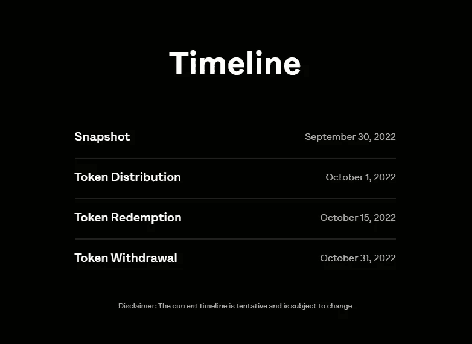
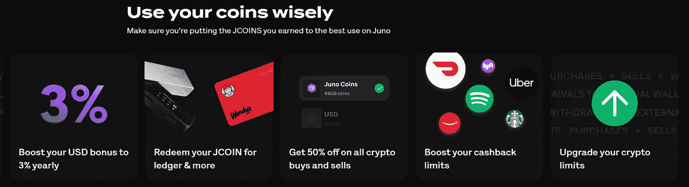

# 乘坐$ JCOIN airdrop 快照 9 月 30 日

> 原文：<https://medium.com/coinmonks/getting-in-on-the-jcoin-airdrop-snapshot-september-30th-8340cadc3898?source=collection_archive---------1----------------------->

嘿，伙计们，如果你一直在跟随我度过这个熊市，那么你会知道我花了很多时间研究不同的平台，这些平台在你等待事情结束时为你的资产提供了相当稳定的回报。我在过去对 Juno Finance 做了[深入的回顾(也不要与 Juno 网络混淆)，但是他们](/coinmonks/things-to-consider-before-venturing-into-juno-is-this-the-future-of-cryptobanking-2456f0b3b636)[最近](https://juno.finance/blog/Introducing-$JCOIN)宣布他们将为 Juno 用户空投他们自己的原生令牌$JCOIN。

我稍后会更详细地介绍 airdrop，但首先让我回顾一下 Juno 本身以及其他附加优势，这也是我认为 Juno 与其他 TradFi 银行相比独树一帜的原因。

# 快速回顾一下[朱诺金融](https://onjuno.onelink.me/TkoI/referral?code=JAME4XIL):

Juno 上的[于 2020 年推出(或在](https://onjuno.onelink.me/TkoI/referral?code=JAME4XIL) [2022](https://juno.finance/blog/the-journey-from-OnJuno-to-Juno) 年正式重新推出为 Juno)，许多人认为它是一家新银行，但事实上，它实际上并不是一家银行。也许最容易想到的是 Juno 分成两个不同的部门——TradFi 和 Crypto。TradFi 部门充当银行的角色，因为他们的银行服务是由 FDIC 成员[Evolve Bank and Trust](https://www.getevolved.com/)提供的。换句话说，就像任何其他官方银行一样，你的资金由联邦保险公司(FDIC)承保，最高可达 25 万美元。

另一方面，加密部门没有得到联邦存款保险公司的保险(据我所知，没有一个加密部门能够得到保险)，但是“在信托和特许保管人的监管下，他们将大部分加密数据保存在冷库中，并购买了必要的保险。”从我[读到的](https://www.thewaystowealth.com/reviews/onjuno-review/)来看，这个冷藏库来自 BitGo，如果你之前没听说过，他是一个主要的行业加密货币托管人，参与了 [2016 年 BitFinex 黑客攻击](https://www.ccn.com/bitgo-claims-software-not-fault-bitfinex-hack/)。

# 使用 Juno 赢取和节省

Juno 本质上一直在创造加密货币和传统法定货币之间最简单的桥梁，这将增加用户对加密空间的采用。让 Juno 脱颖而出的特性？

1.  **2.15%的菲亚特支票利息** —我知道在 crypto 中赚取的 2.15%的利息是一个相当大的零汉堡，但在 TradFi 世界中，这比[有息支票账户的全国平均水平](https://www.valuepenguin.com/banking/average-bank-interest-rates)高 70 倍以上。不像加密项目，因为这是一个标准的支票账户，你的菲亚特是联邦存款保险公司保险的。
2.  **加密薪水支票**——我想这对喜欢 DCA 的人来说特别有吸引力，但有了 Juno，你可以将所有/部分/没有[薪水支票分配给加密](https://help.juno.finance/en/articles/5791854-how-to-set-up-a-crypto-paycheck)。甚至还有一个“自动扫描”功能，可以像 Metamask 一样自动将您购买的密码发送到您的第三方钱包。即使您没有加密支票，如果您设置了至少 250 美元或以上的直接存款，那么您就有资格参加 [Juno Metal Checking](https://juno.finance/legal/metal-terms) ，这就引出了第三个功能…
3.  **使用您的借记卡在特定品牌上最高可获得 10%的返现** —通常只有 5%，但目前直到 10 月 15 日，如果您选择用您的 Juno 借记卡支付$USDC，您可以获得 10%的返现。起初，我并没有对此大肆宣传，直到我看到了这些品牌。目前有 40 多种可供选择，但我目前的选择包括:

Don’t judge me for the Taco Bell

我从事信用卡里程和积分游戏已经有一段时间了，通常情况下，如果运气好的话，你会在信用卡上看到的最高返现率(没有明显的限制)是 5%左右，所以 10%几乎是彻头彻尾的便宜。

# 够了，那么空投呢？

明天(2022 年 9 月 30 日), Juno 将执行快照以检查现有用户，令牌将于 10 月 1 日分发:

因此，如果您正处于决定是否注册 Juno 的边缘，这可能是您这样做的最终动机。老实说，虽然我不知道它有多准确，因为显然我的已经被分配了:

# $JCOIN 有效用吗？

这可能是最令人兴奋的，因为他们为$JCOIN 持有者提供了许多诱人的好处，包括:

我最感兴趣的功能是 3%的美元红利，这比一般的支票账户要好 100 倍。从我收集的信息来看，Juno 没有像许多 TradFi 银行那样采用奖励积分系统，而是将奖励积分转化为代币，我认为这是一个 20 年左右的概念，大多数 TradFi 银行可能会采用。

# 结论

老实说，我不知道这些代币值多少钱，我也不建议单独注册 airdrop，但我确实认为 Juno 是一款很棒的产品，因为你可以停放你的菲亚特，而不必担心变得崎岖不平。与 Celsius 或 Voyager 等平台不同，由于 Juno 是 TradFi/Crypto 的混合体，您的菲亚特获得了高达 25 万美元的 FDIC 保险，因此在 Juno 发生意外的情况下，您的资金仍应得到保护。

如果你像我一样，你可能一直在储蓄 USDC 美元，以便进入市场，当我们希望看到最后的投降，这将(希望)标志着熊市的结束。

在我看来，Juno 提供了一个更好的选择，让你以巨大的折扣在现实生活中购买 USDC，同时等待我们有望很快看到的底部桶崩溃价格。

如果你正在阅读这篇文章，并且也有兴趣试用 Juno，请考虑支持这个博客，并使用我的推荐链接:[https://onjuno.onelink.me/TkoI/referral?code=JAME4XIL](https://onjuno.onelink.me/TkoI/referral?code=JAME4XIL)。如果你直接存入 250 美元或更多，我们都将得到 100 美元。

感谢阅读，请一如既往地在 twitter 上关注我，阅读我的所有最新发现和更新:【https://twitter.com/CryptosWith

声明:这些信息都不是财务建议，只是我在网上随便找的一个人的推测。请考虑这纯粹是教育和娱乐的目的。像往常一样，请做你自己的研究或联系财务顾问，找到什么投资可能最适合你。

> 交易新手？试试[密码交易机器人](/coinmonks/crypto-trading-bot-c2ffce8acb2a)或[复制交易](/coinmonks/top-10-crypto-copy-trading-platforms-for-beginners-d0c37c7d698c)