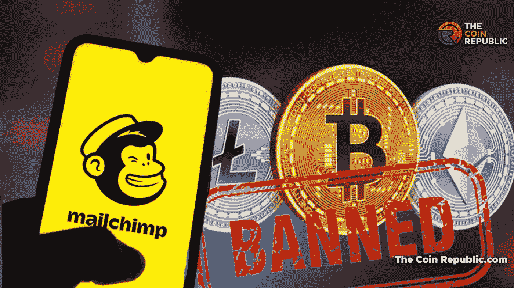
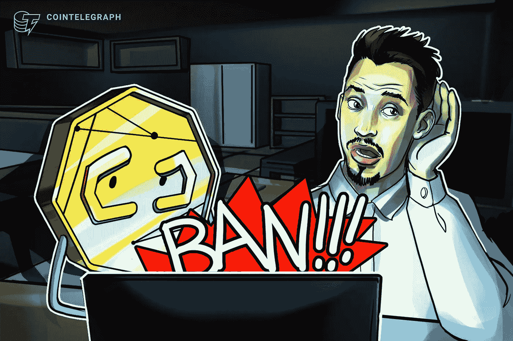
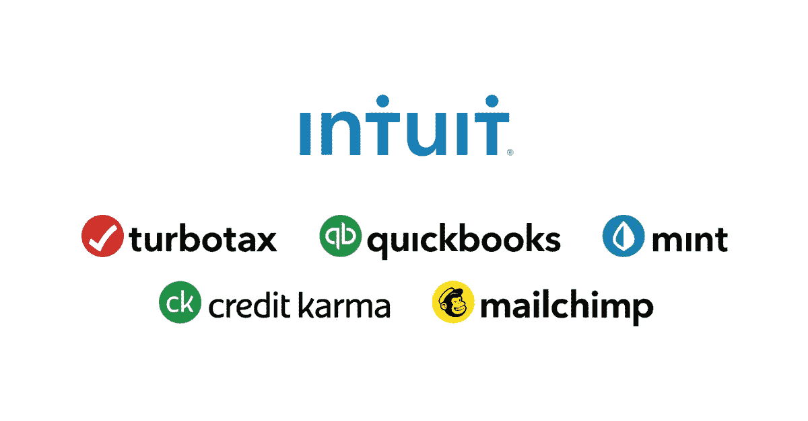

# 越来越崎岖的 Mailchimp！

> 原文：<https://medium.com/coinmonks/getting-rugged-by-mailchimp-607854f7e992?source=collection_archive---------37----------------------->

Mailchimp bans crypto companies abruptly.

没错，就连 Mailchimp 这样成熟知名的网络 2 公司也能做到这一点！

解密、Messari、Edge wallet、Cointelegraph 和 Ethereum Foundation，web3 中一些大名鼎鼎的公司都曾经被 Mailchimp 攻击过。

原因何在？

”后来情况变得很清楚，这些账户由于违反服务规定而被禁用或“暂时挂起”。

据 Mailchimp 网站称，该条款属于“可接受使用”政策的范畴，该政策概述了被禁止的内容。

在这一节中，它指出，“加密货币、虚拟货币以及与首次代币发售相关的任何数字资产”都是被禁止的，因为“滥用投诉率高于平均水平”。"

简而言之，web3 上有太多的骗子和骗局，用户对此并不满意，他们会向 Mailchimp 投诉，Mailchimp 现在会先发制人地挂起他们发现可疑的 web3 玩家的账户。

这就是问题所在，嗯？

谁对谁是萨斯有最终决定权？

提供服务的人自然对吗？

但这对用户来说非常不公平，因为有些用户多年来一直在忠实地使用 Mailchimp，并不断积累电子邮件用户群。

现在，他们甚至不能登录 port 查看用户的电子邮件。

想象一下这种混乱。

Imagine you are a small business or founder who just started building an audience and this happens to you suddenly.

无法发送新闻稿，无法回答赞助商为什么和可能的收入损失。

更糟糕的是，他们甚至不能发送电子邮件通知他们的订户，因为这样做的媒介已经被拿走了！

这种情况以前也发生过。

还记得 Youtube 禁止像 Bankless 和乐观频道这样的网络 3 播放器吗？

它在社区引发的强烈反对。

当然，他们同样迅速地打开它们，但这在每个人的嘴里留下了不好的味道。

现在这个？

可以说“Mailchimp-replacement”是每个人现在都在思考的问题。

如果它能发生在大男孩身上，它也能发生在你身上。

虽然大公司有财力、时间、声誉和人力来获得那样的回报，但小公司就做不到这一点。

审查是个问题，但我们仍然要看看 web3 如何才能安全而明智地解决这个问题。

Mailchimp 很强大。

Intuit bought Mailchimp in 2021 for $12B.

Mailchimp 于 2001 年创立，最初只是一个自发的附带项目，现在已经发展成为一个服务于 1100 万活跃客户和 40 亿用户的庞大受众群体。

我的天，他们在这个行业中是如此的强大。

Mailchimp 最好能迅速解决这个问题，并找到一个真正好的答案来解决这个问题，否则他们将失去社区和用户社区的信任。

我知道 Mailchimp 希望为阻止 web3 中的诈骗者、网络钓鱼和不良行为者尽自己的一份力量。

但这是对的吗？

仅仅因为你能，并不意味着你应该。

至少，这并不意味着你应该如此随意地去做。

建立信任需要多年，摧毁信任只需要几秒钟。

-

你使用 Mailchimp 吗？

-

#初创公司#业务#初创公司 x #增长#成功#社交媒体#文化# web3 # eth # btc #加密#黑客#诈骗# mailchimp #电子邮件# web3media #分散化#自由#审查#新闻通讯#社区

> 交易新手？试试[加密交易机器人](/coinmonks/crypto-trading-bot-c2ffce8acb2a)或者[复制交易](/coinmonks/top-10-crypto-copy-trading-platforms-for-beginners-d0c37c7d698c)