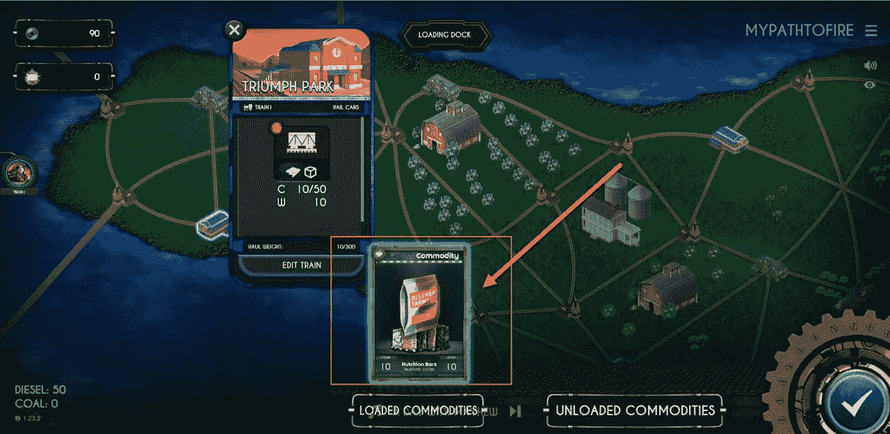

# 世纪列车入门

> 原文：<https://medium.com/coinmonks/getting-started-in-train-of-the-century-f5e6151b4312?source=collection_archive---------28----------------------->

蜡区块链上超赞的 Play2Earn 游戏。

各位加密游戏玩家好，今天我开始玩一个新的游戏，名为世纪列车。

注册后，我创作了我的第一列火车。

然后我缩小地图，可以看到一个闪烁的蓝点，显示我在哪里。然后我可以放大我的火车，在火车站找到它。

**购买我的第一辆火车**

在组装我的第一辆火车之前，我需要购买火车所需的不同部件。这些包括:

*   运动的
*   导体
*   客车
*   运货车

[来源](https://wax.atomichub.io/market?collection_name=centurytrain&order=asc&schema_name=locomotive&sort=price&symbol=WAX)

为了做到这一点，我去了 Atomic Hub，这是一个蜡上 NFTs 的市场，并登录。然后用世纪列车搜索，先用火车头过滤。在这里，我可以看到许多不同的火车选择购买。

[来源](https://wax.atomichub.io/market?collection_name=centurytrain&order=asc&schema_name=locomotive&sort=price&symbol=WAX)

然后，我按照从低到高的价格排序，查看报价。然后，我可以悬停在一列火车上，查看它的一些统计数据。在这里，你可以看到最便宜的是一个普通卡和重要的细节，如它可以行驶多远，速度和燃料。

这些便宜的火车不能走很远，但对于开始和学习游戏来说是可以的。我买了最便宜的开始，然后重复了指挥，客车和轨道车的过程。

**组装我的第一辆火车**

然后我需要把我的第一列火车放在一起，所以我回到地图上，点击车站，然后编辑火车。然后，我可以创建我想要的火车。

我的火车只能载一节车厢，所以我最初选择了客运列车，但车站上没有乘客。最后，我把我的货车加到我的火车上，并试图增加一些要运输的货物。

这里也没有要运输的货物，这时我意识到我需要从市场上买一些货物。因此，我回去买了一些不同的货物，并试图再次装载我的火车。

最后，我买了一件适合我的轨道车并可以装载的商品。我注意到营养棒每根只有 10 磅重，所以事实上我可以带 5 根。所以我回到市场，又买了 4 块营养棒。希望对方台买！

带着满载的轨道车，我准备好了去铁轨上..光是把一列火车从一个车站送到下一个车站，就比我预计的时间要长。

**去另一个车站**

多年前玩过铁路大亨之后，我隐约知道铁路战略游戏应该如何运作。那时候更像是建造你的车站和铺设你的轨道。现在有了 crypto，就有了现实生活中需要考虑和使用 NFTs 的经济因素。

现在是时候让我的火车驶入荒野，去另一个车站了。

因为我只有一个便宜的火车头，它不能走很长的距离，所以你可以看到我只能去两个标记的车站。我选择海风公园，但首先我需要买一些燃料。要购买燃料，我需要英格姆代币。为了得到铯，我需要去另一个交易所买一些。

[来源](https://wax.alcor.exchange/)

我去了 Alcor，买了 100 托西姆，大约是 0.2 蜡。

回到游戏，我去了英格姆市场，为我的柴油火车买了 50 柴油。这花了我 10 托币。

然后，我试图将我的火车调度到新的车站，但得到警告说我没有足够的燃料。我决定再买 100 台柴油，这对我往返应该有好处。

到达车站需要 1 小时 48 分钟，它给我提供了一个玩小游戏的机会。我决定打第一场，铁路场后卫，虽然我只得到 11 分，但还是很不错。我没有得到任何玩迷你游戏的密码，所以如果我想玩一些迷你游戏的动作并获得密码，也许我会坚持滚动币。

我的火车现在安全地开往海风公园，我决定今天就到此为止。我将在明天的火车上查看，并在下次更新时向你报告我第一次跑步赚了多少火炬币！

感谢阅读。

**资源:**

维基:[来源](https://wiki.trains.cards/)

白皮书:[来源](https://trains.cards/whitepaper/)

**学分:**

标题图片是我自己在 Canva 中创建的，图片来自 Canva Pro 许可的[源](https://www.canva.com/p/sketchify/)和[源](https://pixabay.com/de/users/30090/)。

截图取自游戏中的[来源](https://play.trains.cards/)，除非另有说明。

也感谢 [@thecyberdexter](https://ecency.com/@thecyberdexter) 在他的流上给了我一个游戏的概述。

**我们来连线:** [mypathtofire](https://linktr.ee/mypathtofire)

> 交易新手？试试[加密交易机器人](/coinmonks/crypto-trading-bot-c2ffce8acb2a)或者[复制交易](/coinmonks/top-10-crypto-copy-trading-platforms-for-beginners-d0c37c7d698c)