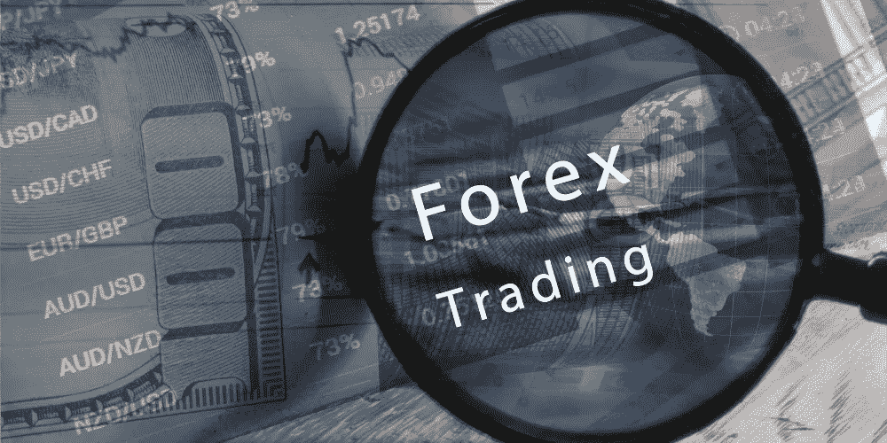

# 股票、期货和外汇市场交易入门

> 原文：<https://medium.com/coinmonks/getting-started-trading-equities-futures-and-forex-markets-a20769cdf711?source=collection_archive---------32----------------------->

Getting Started Trading Equities, Futures, and Forex Markets

如果你是交易新手，我肯定你听说过这样一句话:“今天市场上涨了多少？”或者类似的东西。如果你已经有一段时间了，你可能会听到有人说“不要担心，市场总是在上涨。”即使我们现在都知道这不是真的，有些人仍然这样认为。因此，让我们来看看开始交易股票、期货和外汇市场的两种方法:

# 股票、期货和外汇市场

股票、期货和外汇市场都是基于资产价值进行交易的金融市场。最常见的股权类型是股票，代表公司的所有权。当一方同意在未来的某个时间以特定的价格购买或出售一项资产时，就签订了期货合同；它有助于对冲市场风险，如果价格在到期前上涨或下跌，交易者可以在到期前锁定利润。外汇是指任何货币对(例如美元/欧元)，其中两种货币直接或间接通过这些资金的其他投资(例如股票)进行交易。

# 股票和外汇市场

股票是公司的股份。你可以在股票市场上买卖它们，这是世界上最大的金融市场。期权是差价合约(CFDs)，它允许你在没有实际拥有标的资产的情况下押注价格变化。它们类似于期货，因为它们在未来某个日期到期，不需要直接购买实物商品或证券——它们只是对一段时间内价格变化的押注。

外汇市场由全球多个交易所的所有货币对组成，包括主要国家货币，如美元/欧元美元或英镑/美元。其他工具包括黄金价格(GLD)、原油价格(CL)、债券(BUND)等。，每一个都有不同的合约规范，这取决于进入这个领域时可能选择的交易策略类型

# 期货

期货是一种金融衍生品，允许交易者对冲风险，并对资产的未来价格运动进行投机。它们是在未来某个日期以预定价格购买或出售特定资产的标准化协议。

当你购买一份期货合约时，这意味着你已经与卖方达成协议，当一项资产的价值达到一定水平(通常是合约中规定的水平)时，你将接受该资产的交割(或占有)。当你卖出一个时，这意味着你的买家已经同意在价格达到一定水平时交出所有权——同样典型的是他们与你作为卖家的协议中规定的那些。

**例如:**假设 X 公司想从地球上其总部城市附近种植麦田的农民 Y 那里购买价值 100 万美元的小麦；Y 公司同意了，因为这是它赚钱的最好机会，因为没有其他买家愿意支付比 X 公司现在需要的价格更高的价格。

# 外汇市场

外汇是指外汇市场，您可以在此交易美元/英镑或欧元/美元等货币；这包括直接通过银行/经纪人买卖这些货币，这些银行/经纪人在两个不同国家的中央银行之间提供货币兑换，以便交易者在这些国家境内使用其资金进行交易时获得支付的利息，而不是仅仅将资金汇往国外而不对这些资金支付任何利息，因为双方之间实际上没有任何交易，只有美元易手！

外汇交易是通过买卖货币合约来投资货币的行为。你也可以把它想象成一个货币相互交易的市场。外汇交易既指现货交易，也指期货交易，是两种类型的外汇工具:

即期——这是指以当前市场汇率买入或卖出一种货币。一旦你看到价格已经达到目标水平(例如，1 美元= €1)，你就可以向你的经纪人开仓。如果你能在任何人之前以这个价位购买，那么恭喜你！你从他们身上赚了钱；然而，如果没有，那么简单地等到其他人都买了他们所有的股票，这样你也买了！

# 股票、期货和外汇市场交易入门

股权是一种代表公司所有权的证券。例如，苹果公司、微软公司和谷歌公司都是可以在纽约证券交易所(NYSE)等交易所买卖股票的公司。您也可以通过您的经纪人的二级市场交易平台交易这些股票，或者在纽约证券交易所或纳斯达克证券交易所上市的公司发行这些证券的期权合同的情况下，直接从另一个投资者那里购买这些股票(见下文)。

# 这些不同的乐器是什么？

股票就是股票。它们代表公司或企业的所有权，可以在纽约证券交易所(NYSE)或纳斯达克(NASDAQ)等交易所进行买卖。期货合约是在未来特定日期以预定价格购买或出售基础证券的协议，通常在场外交易。

最常见的期货合约是玉米、小麦和大豆；它们也用于金属，如金和银；欧元/美元等外币；原油等大宗商品；像政府债券这样的利率产品；包括每桶石油价格和每千立方英尺天然气价格的能源期货；股票指数包括道琼斯工业平均指数(DJIA)、纳斯达克 OMX 指数(PHLX)、美国证券交易所指数(AMEX 综合指数)等。

# 我可以交易哪些类型的金融工具？

这三种金融工具是股票、期货和外汇。每种类型都有自己独特的特征，使其独一无二。股权是公司或其他实体的所有权。这些可以在证券交易所交易。

期货合约是双方在未来某个日期以约定的价格购买或出售某种商品的协议，以换取根据合同签订时双方约定的实际价格立即交货或付款。当今的市场条件由当前的供求因素决定，这些因素与当前在全球市场上交易的商品相关。

# 交易这些产品需要多少利润？

保证金要求是开户时必须存入的金额，根据产品类型的不同而有所不同。在您进行任何交易之前，最低保证金要求将显示在您的交易平台上。必须作为抵押品持有的总股本的百分比也因工具而异，但通常在 2%到 5%之间。

除了这两个因素，在决定某个产品是否适合你时，还有一件事需要考虑:我有多少时间？如果其他方法都失败了，那么也许可以试试这个简单的规则:如果有什么事情每天花不到五分钟，那就开始做吧！

# 我如何开始交易股票、期货和外汇市场？

有很多方法可以开始交易股票、期货和外汇市场。最好的学习方法是自己动手——但是如果你没有时间或耐心，那么网上有很多免费资源。您还可以从各种不同的平台中进行选择，这些平台提供对他们自己的软件程序的访问，这样您就不必担心为了让您的投资增长而学习事情是如何工作的。

# 结论|开始股票、期货和外汇市场交易

虽然交易是一项有趣的活动，可以出于多种不同的原因进行，但重要的是要强调，在一头扎进去之前，花点时间，尽可能了解交易过程的一切。没有必要仓促行事，尤其是如果你想从投资中赚钱的话。如果你刚刚开始，那么重要的是先学习交易的基础知识，一旦你对自己的工作感到满意，再学习更复杂的策略。

> 交易新手？试试[加密交易机器人](/coinmonks/crypto-trading-bot-c2ffce8acb2a)或者[复制交易](/coinmonks/top-10-crypto-copy-trading-platforms-for-beginners-d0c37c7d698c)