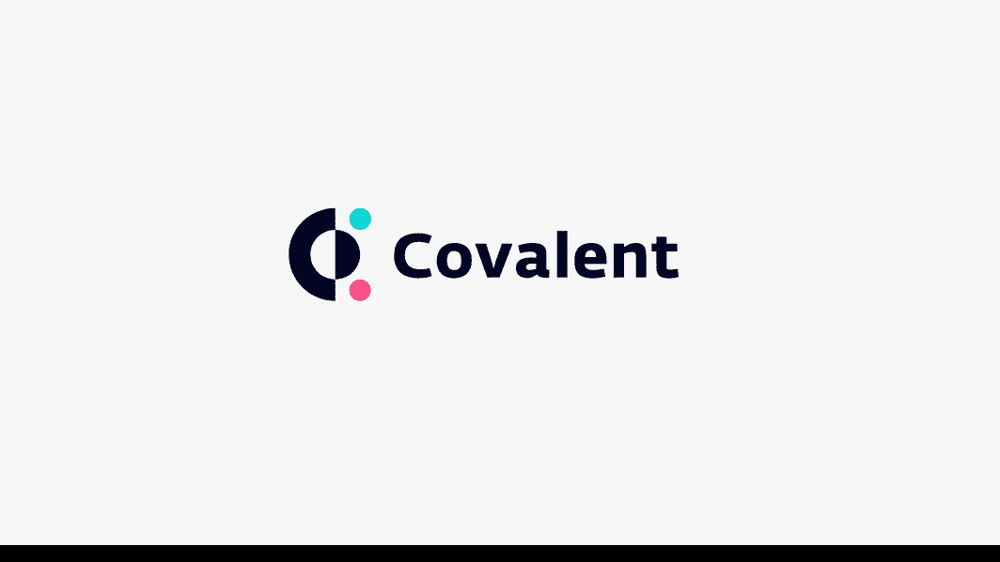
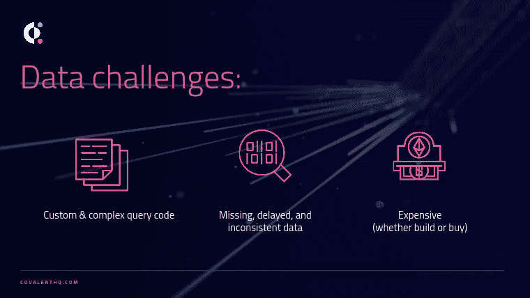
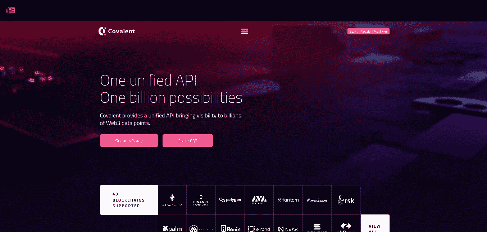
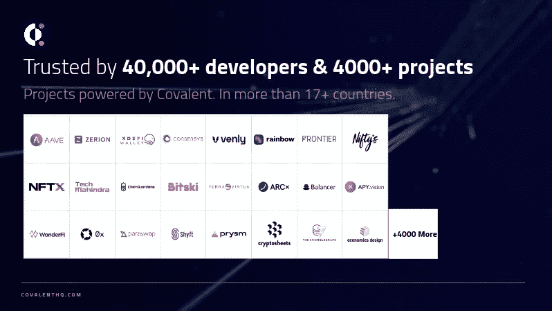
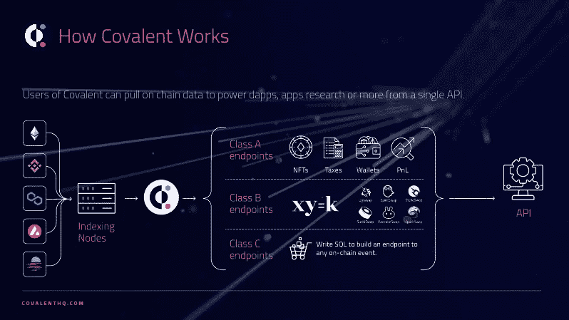
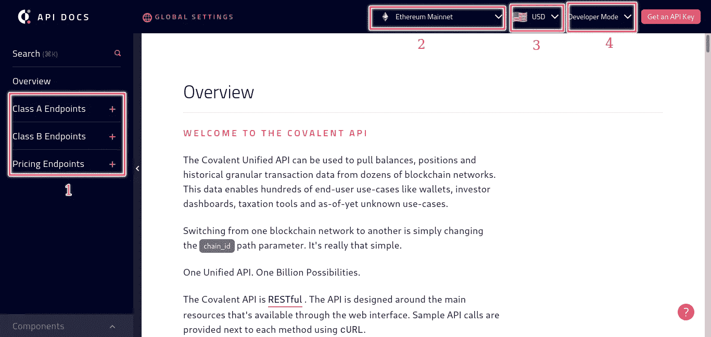
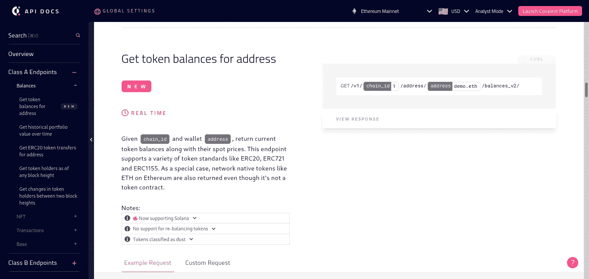
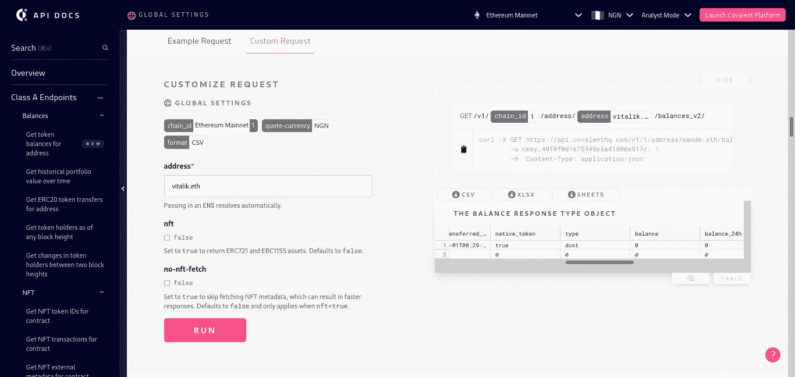
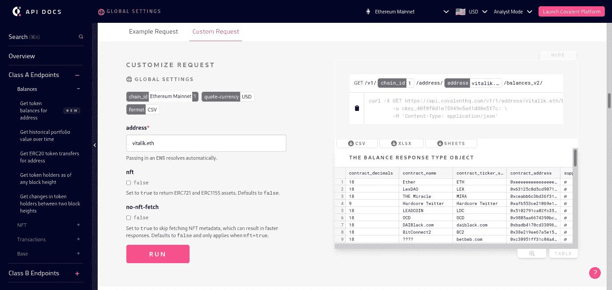

# 开始使用共价统一 API 构建 Web3 应用程序

> 原文：<https://medium.com/coinmonks/getting-started-with-covalent-unified-api-to-building-web3-apps-e35f7197da67?source=collection_archive---------11----------------------->

数据已成为本世纪的新黄金，随着数据链的不断增长，区块链数据越来越难以查询。对于区块链的主流采用，数据互操作性对于用户和企业的大规模运营是至关重要的，共价解决了其统一的 API。

Covalent Logo

# 区块链数据存在哪些问题(数据挑战)？

Data Challenges

*   **定制&复杂的查询代码:**连接到不同的端点以获得不同的区块链数据是耗时且消耗内存的，需要大量代码来完成。
*   **缺失、延迟和不一致的数据:**由于使用了不同的端点，延迟确实会根据所使用的节点而发生。在不同的区块链数据中，由于不同的生态系统设计，响应可能不同。
*   **昂贵(无论是构建还是购买):**区块链产生的数据杂乱无章、难以理解且难以存储。运行您的节点或支付 RPC 存储成本将继续增加。

# 什么是共价？

Covalent Website [https://www.covalenthq.com/](https://www.covalenthq.com/)

**共价**是访问所有链上数据的一站式工具。它是区块链和应用程序之间的一层。它提供了一个统一的 API，可以通过改变不同区块链的参数从云中进行查询。尽管它本质上是多链的，但它提供了一种非开发人员可以用来查询链上数据的分析模式。

# 共价用例

用共价统一 API 构建有无限的可能性。共价目前被用于游戏、DeFi 税、DAO 数据、交易数据、仪表板、链上取证、流动性农业数据、KYC、预测分析、治理数据、交易和 NFTS。查看[共价用例](https://www.covalenthq.com/product/dex/)的更多可能性。

# 使用共价统一 API 的项目

[https://www.covalenthq.com/about/](https://www.covalenthq.com/about/)

共价目前正在授权 40，000+开发人员，超过 4，000+项目已经用其统一的 API 构建。使用共价的著名项目有 [AAVE](https://aave.com) 、[帕拉斯瓦普](https://paraswap.io/#/?network=ethereum)、[彩虹](https://rainbow.me)、[康森斯](https://consensys.net/)等。

# 什么是共价统一 API？

Covalent Unified API

**共价统一 API** 是一个单一的 API 端点，将不同的区块链生态系统置于一个端点之下。通过将参数更改为区块链自己的参数来与您选择的区块链进行交互既省时又省钱。查看所有不同的链[共价支持在这里](https://www.covalenthq.com/docs/networks/)。

# 共价是如何工作的

**索引节点:**共价运行索引节点，从所有区块链中获取数据，并将其格式化为不同类别的端点。
**A 类端点:**这些是对任何受支持的链的查询，如；地址、NFT 数据及其元数据的令牌平衡。
**B 类终点:**这些是协议特定的，即 DEX 数据。
**C 类端点:**这允许您从共价数据构建端点。

# 导航共价 API 参考

首先，访问[共价 API 参考](https://www.covalenthq.com/docs/api/#/0/0/USD/1)网站。

[https://www.covalenthq.com/docs/api/#/1/0/USD/1](https://www.covalenthq.com/docs/api/#/1/0/USD/1)

1.**端点**被左侧栏分解成不同的类。
2。**以太坊 Mainnet** 是默认的区块链点击下拉可以换到你选择的区块链，
3。 **USD** 是默认电流，共价提供包括尼日利亚 NGN 在内的不同货币。
4。**开发者模式**是默认模式，分析模式以 CSV 格式显示响应。

# 获取地址的令牌余额

1.  导航至[共价 API 参考](https://www.covalenthq.com/docs/api/#/0/0/USD/1)；选择链并将模式更改为分析模式。
2.  选择**A 类端点** > **余额** > **获取令牌余额为地址**

3.将导航切换到自定义请求，输入地址；也允许使用 ENS 地址，在本例中，我们将检查“vitalik.eth ”,然后单击“run”

Before clicking run button

After clicking run button

# 结论

共价为快速开发提供一级开发者资源:[共价文档](https://www.covalenthq.com/docs/)、[共价 API 参考](https://www.covalenthq.com/docs/api/)、[代码模板](https://github.com/covalenthq/web3-resources)。

# 资源:

[共价🛠用一个统一的 API 构建 Web3 应用](https://www.youtube.com/watch?v=rdRQSACyA4U)
[共价— Web3 Youtube 播放列表](https://www.youtube.com/playlist?list=PLe_13_jmjmu5JRirpmcBOjGJBuL2VBccb)

> 交易新手？尝试[加密交易机器人](/coinmonks/crypto-trading-bot-c2ffce8acb2a)或[复制交易](/coinmonks/top-10-crypto-copy-trading-platforms-for-beginners-d0c37c7d698c)
> 
> 加入 Coinmonks [电报频道](https://t.me/coincodecap)和 [Youtube 频道](https://www.youtube.com/c/coinmonks/videos)获取每日[加密新闻](http://coincodecap.com/)

## 另外，阅读

*   [复制交易](/coinmonks/top-10-crypto-copy-trading-platforms-for-beginners-d0c37c7d698c) | [加密税务软件](/coinmonks/crypto-tax-software-ed4b4810e338)
*   [网格交易](https://coincodecap.com/grid-trading) | [加密硬件钱包](/coinmonks/the-best-cryptocurrency-hardware-wallets-of-2020-e28b1c124069)
*   [密码电报信号](/coinmonks/top-3-telegram-channels-for-crypto-traders-in-2021-8385f4411ff4) | [密码交易机器人](/coinmonks/crypto-trading-bot-c2ffce8acb2a)
*   [最佳加密交易所](/coinmonks/crypto-exchange-dd2f9d6f3769) | [印度最佳加密交易所](/coinmonks/bitcoin-exchange-in-india-7f1fe79715c9)
*   [面向开发人员的最佳加密 API](/coinmonks/best-crypto-apis-for-developers-5efe3a597a9f)
*   最佳[密码借贷平台](/coinmonks/top-5-crypto-lending-platforms-in-2020-that-you-need-to-know-a1b675cec3fa)
*   [免费加密信号](/coinmonks/free-crypto-signals-48b25e61a8da) | [加密交易机器人](/coinmonks/crypto-trading-bot-c2ffce8acb2a)
*   [杠杆代币](/coinmonks/leveraged-token-3f5257808b22)终极指南