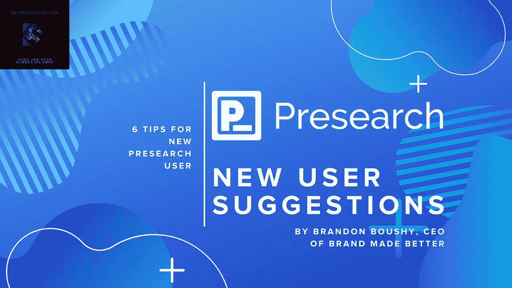
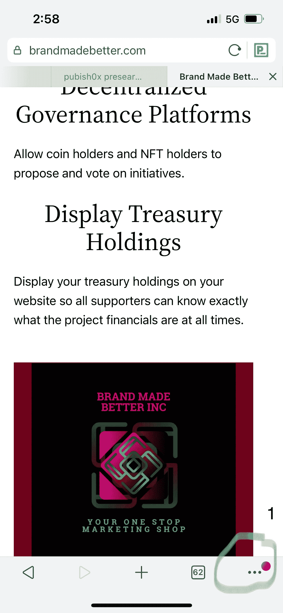
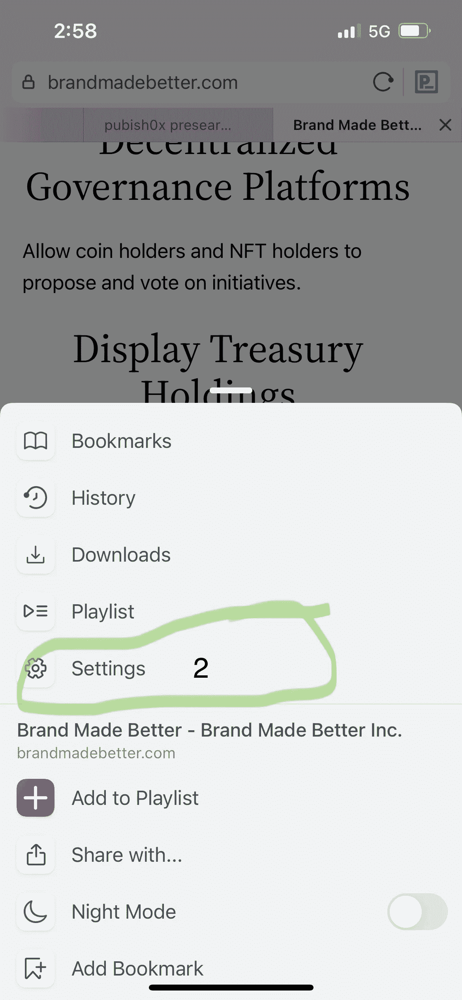
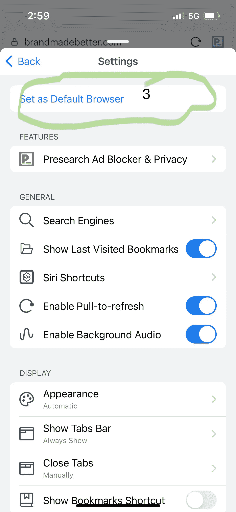
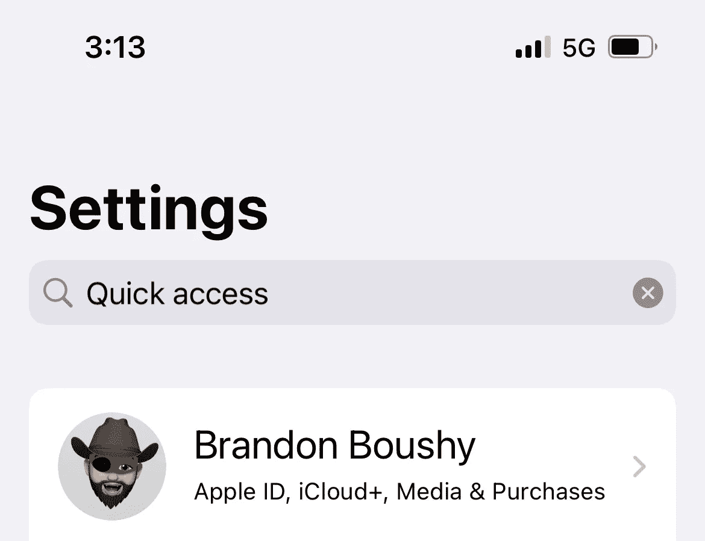
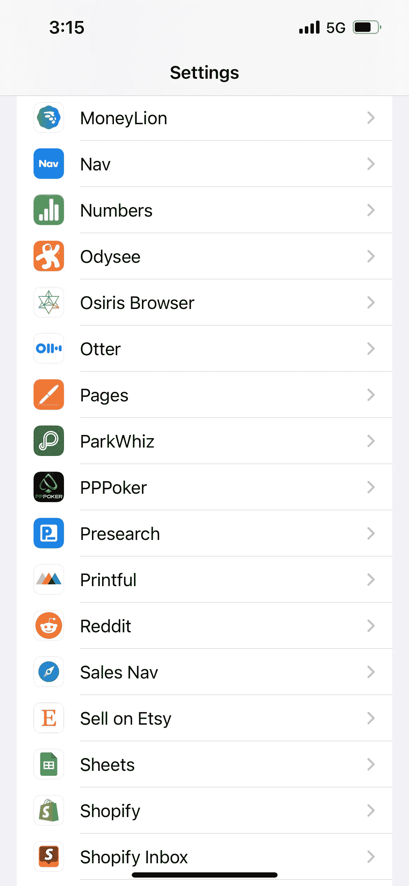
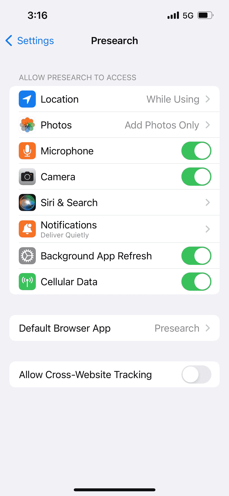
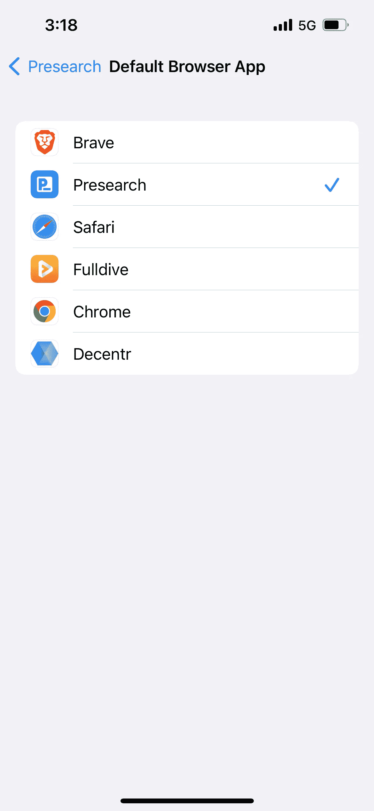
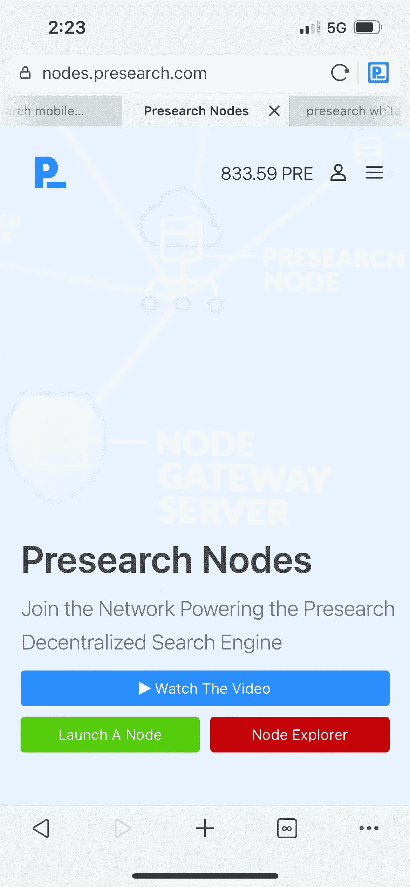

# 预搜索入门

> 原文：<https://medium.com/coinmonks/getting-started-with-presearch-b5e10ab0f642?source=collection_archive---------10----------------------->

6 Tips for New Presearch Users

有很多新用户对预搜索感到疑惑，所以我将回答一些人们问的常见问题。

在你开始之前，我想提供。您有机会使用我的推荐代码注册:

https://presearch.com/signup?rid=2270247

我们每个人都得到 25 元的奖金，在你活跃 30 天后，你已经从搜索中获得 50 元。

本文中的一些链接需要您登录才能查看。请确保您登录后才能正确查看它们。

如果您已经使用了预搜索，请花点时间在“其他”类别中为“品牌制造得更好”投票投票给 https://presearch.com/vote/GrantVote

# 什么是预搜索？

预搜索是一个搜索引擎，具有一些独特的功能，包括:

1.  隐私搜索
2.  搜索赚取
3.  用户操作的服务器
4.  推荐项目。
5.  付费广告的无限点击量和浏览量。
6.  能够将数百个搜索引擎设置为默认搜索，并通过搜索栏直接访问它们。请在下面找到完整的列表。

 [## 预研究

### Presearch 是一个分散的搜索引擎，由社区提供动力。

account.presearch.com](https://account.presearch.com/providers?rid=2270247) 

# 预搜索隐私是如何工作的？

预搜索使用位于加州、俄亥俄州、欧洲和亚洲的网关来处理搜索请求。

当您执行搜索时，它会转到加利福尼亚、俄亥俄、欧洲和亚洲的网关之一，在将搜索请求发送到用户操作的节点之前删除所有可识别的数据。该节点查询您的首选搜索提供商，然后将信息发送回网关，网关添加广告并返回给用户。

阅读白皮书了解更多信息。

Presearch white paper

# 你如何获得搜索奖励？

首先，您需要注册一个帐户，您可以在此处注册:

 [## 切换到预搜索，保护您的隐私！

### 预搜索是一个分散的搜索引擎，保护您的隐私，奖励您加密货币，并提供…

presearch.com](https://presearch.com/signup?rid=2270247) 

当你第一次赚了一笔钱后。一天 25 次正常搜索。每天可用的最大硬币是 2.5 便士，每次搜索为 0.1 便士。它与 PRE 的价格成反比。

这意味着像普通搜索引擎一样使用它。代币农场将得到您的帐户被禁止提取预。

此外，不要将预搜索与 VPN 一起使用，如果使用 VPN，被标记为令牌农民的可能性更高。

## 如何让预搜索更容易使用？

Presearch 试图尽可能方便地使用他们的搜索引擎。他们提供浏览器扩展和移动应用程序，所以你可以使用预搜索作为你的默认搜索引擎。

获取 Brave、Firefox 或 Google 的预搜索浏览器扩展。Brave 和谷歌 Chrome 也可以使用主页扩展

 [## 预研究

### Presearch 是一个分散的搜索引擎，由社区提供动力。

account.presearch.com](https://account.presearch.com/extensions?rid=2270247) 

它们也是 Decentr 的默认搜索引擎。如果你注册了 Decentr 和 Presearch，你可以获得两个项目的硬币。

您可以从手机上的 App Store 下载移动应用程序。

## 将您的预搜索应用程序设置为 iOS 中的默认网络浏览器

如果你用很多话来发短信，或者人们和你分享链接，这真的很重要。

点击 iOS 应用程序右下角的“…”。看起来是这样的:

BrandMadeBetter.com in Presearch app

然后你会想要点击设置。

Access Presearch in-browser settings

接下来，您将点击“设为浏览器”

Presearch app in-browser settings

这将带您进入 iOS 快速访问设置。屏幕看起来会像这样。

iOS quick access settings

向下滚动直到看到预搜索，然后单击它。

Quick Settings for Apps in iOS

那么有两个设置需要更改:

iOS Presearch Settings

1.Siri 和搜索:更改您希望 Siri 在预搜索中使用的任何设置

Siri & Search Preferences

2.默认浏览器应用:验证预搜索是你的默认搜索引擎。

iOS Default Search Engine Settings

现在应该很容易使用预搜索并获得您的奖励。

# 如何操作用户操作节点？

要运行用户操作的节点，您需要通过仪表板或购买 4，000 PRE。一次交易。您需要前往:

 [## 预研究

### Presearch 是一个分散的搜索引擎，由社区提供动力。

nodes.presearch.com](https://nodes.presearch.com/) 

https://nodes.presearch.com/

观看视频，然后单击“启动节点”阅读说明。然后转到节点仪表板。

 [## 预研究

### Presearch 是一个分散的搜索引擎，由社区提供动力。

nodes.presearch.com](https://nodes.presearch.com/dashboard) 

您将需要仪表板中的节点注册码。

确保在单独的选项卡中打开下一个链接。

https://nodes.presearch.com/instructions

然后你需要创建一个 Ubuntu 服务器，web3 服务器(FLUX 是成本最低的)，或者在你的电脑上设置一个节点。您还需要创建一个 docker 映像并下载 Putty。

我不是开发人员，所以我不打算尝试这样做。走你通过整个过程，但有一吨的指南和人谁可以帮助你在电报或不和谐的节点渠道。我发现这个最有用:

[https://www . publish 0x . com/earnings 0x/presearch-nodes-a-comprehensive-guide-to-run-a-presearch-nod-xnqpgxk？a=MvbmQYjGbY](https://www.publish0x.com/earnings0x/presearch-nodes-a-comprehensive-guide-to-run-a-presearch-nod-xnqpgxk?a=MvbmQYjGbY)

# 如何获得推荐奖励？

请访问您的推荐页面

 [## 预研究

### Presearch 是一个分散的搜索引擎，由社区提供动力。

account.presearch.com](https://account.presearch.com/referrals?rid=2270247) 

您可以在以下位置共享链接:

*   脸谱网
*   推特
*   商务化人际关系网
*   电子邮件
*   网站横幅

您还可以阅读条款和条件以及常见问题。您将看到一个推荐列表，显示他们活跃了多长时间，以及他们最近使用该平台的时间。

# 你也可以使用预搜索做广告

如果你有自己的生意或者有想分享的附属链接，你可能想在 Presearch 上做广告。

现在还是广告时代的早期。他们对广告有独特的看法，你可以给一个关键词加少到 100 的 PRE。然后你会想配对一个广告。

这种形式的搜索引擎广告的独特之处在于，它不按每次点击成本、每次行动成本或每次印象成本收费。事实上，当您下注关键字时，您会得到它们，直到:

1.  有人出价比你高。
2.  他们开始使用消费模式。

如果您愿意，您也可以将 PRE 从当前关键字中取出，并保护一个不同的关键字。

我使用关键词已经一年多了，在这段时间里我已经积累了大约 100 个关键词。它最适合 1 到 2 个单词的术语。长尾关键词不太好用。

# 是时候来点无耻的自我推销了。

我是一名专业营销人员，也是预研究资助的最终候选人之一。如果你喜欢这个博客，如果你能通过以下方式帮助我，我将不胜感激:

1.  掌声👏在按钮下面。
2.  订阅我的邮件列表，这样你就可以及时了解 Presearch、VaporFi 和 BrandMadeBetter 等项目的最新进展。
3.  在预研究资助竞赛中为 Brand Made Better 投票，这样我的加密项目就可以有一个惊人的开始。

谢谢大家！不要随便搜！预习一下！

 [## 预研究

### Presearch 是一个分散的搜索引擎，由社区提供动力。

presearch.com](https://presearch.com/vote/GrantVote) 

> 交易新手？试试[加密交易机器人](/coinmonks/crypto-trading-bot-c2ffce8acb2a)或者[复制交易](/coinmonks/top-10-crypto-copy-trading-platforms-for-beginners-d0c37c7d698c)