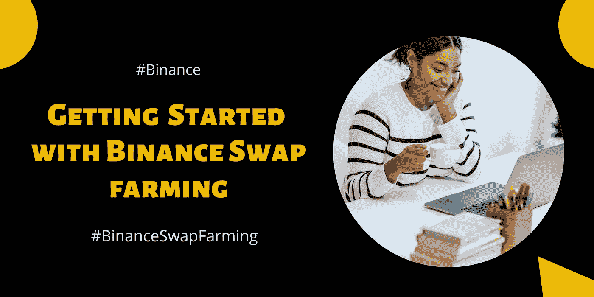
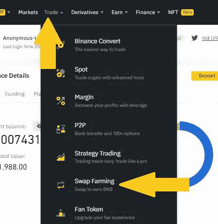

# 币安互换农业入门

> 原文：<https://medium.com/coinmonks/getting-started-with-swap-farming-on-binance-585de3aedc4b?source=collection_archive---------7----------------------->

*互换农业:互换&贸易币 ea* sy *并领取 BNB 奖励*

Binance Swap Farming

币安交换农场提供了一个平台，用户可以交换和交易他们的硬币，并享受非常友好的市场利率。在使用自动做市商模式时，用户可以轻松安全地交换从硬币和代币池中获得的加密对。

有了这种模式，用户可以交易流动性池中的硬币，而不是与另一方交易。本质上，令牌的加密对被汇集在一起，并且特定的令牌价格将由其比率来确定。

币安掉期交易对大多数交易者来说是有利可图的，因为用户可以从 BNB 形式的特定代币对中赚取高达 50%的交易费。

***为了访问币安互换耕作功能，采取以下步骤:***

1.  在主页上的“*贸易*”菜单下，导航至币安互换农业，如下所示。

2.在交换农场页面上，你可以选择输入你想要交换的硬币以及交换哪个硬币。在“交换”标签的右边部分，你会看到你根据所选择的配对的滑动率。继续点击交换按钮。在这个例子中，我将把 BUSD 换成 USDT。

3.只需点击一个按钮，我就可以毫不费力地把 BUSD 换成 USDT。因此，与币安的现货交易相比，掉期交易既快又容易。对于打算在币安兑换硬币的第一次用户来说，交换农场提供了最好的平台。

## 兑换和申领奖励

交换后，您将收到一个通知，表明交易成功。

一旦交换成功，它会自动记录在仪表板上的交换历史记录中。

在币安，互换种植的最大好处之一就是获得回报。要申领您的奖励，只需点击交换菜单下的“*申领奖励*”。

要访问您的奖励历史记录，只需点击*“历史记录”*菜单，然后选择“*兑换*”选项，然后点击“*申领*”，如下所示。

## 互换农业的主要优势是什么？

1.  在币安掉期交易上交易硬币时，套利用户和高频交易者有完整的 API 支持。
2.  在任何交易环境中，安全都是最重要的。与 Defi 互换不同，互换农业提供了一个安全*(防黑客)**(SAFU)*的平台。
3.  由于 BNB 高达 50%的费用回扣，该平台热衷于向交易者提供丰厚的奖励，使其成为最终的交易点。
4.  币安互换农业流动性池支持超过 180 个加密对，因此满足了大多数交易者的需求。
5.  不用说，加密市场有很大的波动性，然而，在币安掉期交易中，你可以期待很低的滑点率。这个因素使得它对交易者更有吸引力。
6.  通过一个简单易用的界面，交易者可以在几秒钟内交换他们的硬币。

## 从币安应用程序访问币安互换农业

大多数币安用户通过手机应用程序访问币安服务。因此，我将一步一步地向您展示如何通过币安应用程序导航币安互换农业。

1.  登录您的币安应用后，点击“*更多*”选项，如下图所示:

2.通过向下滚动页面来识别*“贸易”*类别，并点击类别中的“*互换农业*”选项。

3.BUSD 和 USDT 之间的简单互换看起来会像这样。

4.在成功的交换交易后，将出现如下所示的通知。

5.申领奖励非常简单。只需返回交换页面，点击“*申领奖励*”按钮。

**涉及的风险**

除了币安互换农业是最好的交易平台之一，它也伴随着风险。交易者应该意识到，当交易量很大时，他们一定会经历很高的滑点率。

**即将开展的活动**

*如果你是币安的定期掉期交易用户，一定要查看高频交易者的交易比赛。有机会获得互换耕作的奖励。*

[***币安互换养殖入门> >***](https://www.binance.com/en/swap?ref=431277160)

[***开立币安账户> >***](https://accounts.binance.com/en/register?ref=431277160)

***关联披露:*** *本帖包含关联链接。如果您使用这些链接购买一些东西，我们可能会赚取佣金，对您没有额外的费用。感谢*。

> 交易新手？尝试[加密交易机器人](/coinmonks/crypto-trading-bot-c2ffce8acb2a)或[复制交易](/coinmonks/top-10-crypto-copy-trading-platforms-for-beginners-d0c37c7d698c)