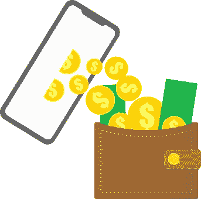

# 加纳人现在可以在 Dart Africa 上轻松安全地出售比特币

> 原文：<https://medium.com/coinmonks/ghanaians-can-now-sell-bitcoin-easily-and-securely-on-dart-africa-172121e18143?source=collection_archive---------48----------------------->

加密货币是一种数字或虚拟货币，它使用加密技术来保护其交易并控制新单位的创建。加密货币是分散的，这意味着它们不受政府或金融机构的控制。比特币是第一种也是最知名的加密货币，诞生于 2009 年。今天，有超过 1000 种不同的加密货币在流通。加密货币通常在分散的交易所交易，也可以用来购买商品和服务。

加密货币的世界正在快速发展，各种交易平台正在涌现，各种技术使交易变得更容易。一个例子是币安，它提供分散交易、保证金交易和硬币互换服务。比特币基地允许用户购买、出售和存储加密货币。Bitfinex 提供保证金交易、卖空交易、场外交易(OTC)以及一个用于买卖加密货币的点对点(P2P)市场。

加纳人是世界上最狂热的比特币创造者之一。这种数字货币在中国越来越受欢迎，尤其是在那些寻求逃避政府管制和规避通胀的人群中。因此，当谈到在加纳销售比特币时，Dart Africa 是首选平台。

> 交易新手？试试[加密交易机器人](/coinmonks/crypto-trading-bot-c2ffce8acb2a)或者[复制交易](/coinmonks/top-10-crypto-copy-trading-platforms-for-beginners-d0c37c7d698c)

## DART 非洲平台的特点

[Dart Africa](http://dartafrica.io) 是一个安全可靠的平台，可以用你的比特币兑换加纳塞地。它提供了独特的功能，使其成为用户的最佳选择。这些功能包括:

●惊人的价格:如果你想在 Dart Africa 上出售你的比特币，你可以确信你没有被骗。该平台的声誉非常好，以交易比特币的比率非常好而闻名。此外，还有一个汇率计算器，可以帮助您计算您想要出售的任何加密货币的 cedi 等值。

●安全性:Dart Africa 是一个非常重视数据和资金安全的安全平台。该团队采取措施确保您的数据和资金安全，包括使用多层安全措施。

●用户界面:Dart Africa 易于导航，这得益于其令人敬畏的设计和简单的布局。这对新手和有经验的交易者来说都是完美的。

●速度:Dart Africa 的付款是即时的，没有额外的费用。在平台上完成一笔交易只需一分钟或更短时间。

## 如何在 DART AFRICA 上销售比特币

按照这些说明，在 Dart Africa 上出售加密货币非常简单。

1.  第一步是[下载 Dart Africa 应用](https://play.google.com/store/apps/details?id=com.dartafrica&gl=US)并注册账号。您需要您的姓名、电子邮件地址和手机号码。
2.  继续设置您的交易 pin。请妥善保管此 pin 码，您在后续交易中会用到它。
3.  选择要出售的加密货币(在本例中为比特币)。输入比特币的金额，然后点击“立即出售比特币”继续。
4.  系统会生成一个钱包地址，复制这个地址，把你的比特币存进去。
5.  确认后，您的现金将进入您的钱包，然后您可以提取到您的银行账户或移动货币。提现在平台上是即时的。

非常容易？肯定！所有这些过程都是免费的。当您在 Dart Africa 上交易时，没有额外的费用。此外，该移动应用程序在 App Store 和 Play store 上都可以使用。平台支持的加密货币包括:比特币、、、戴、以太坊、币和莱特币。