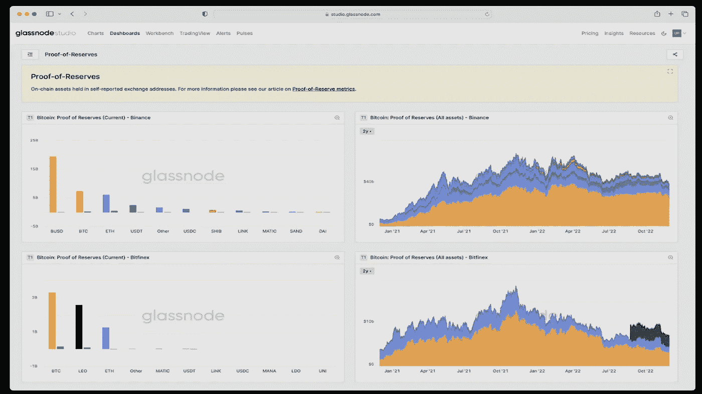
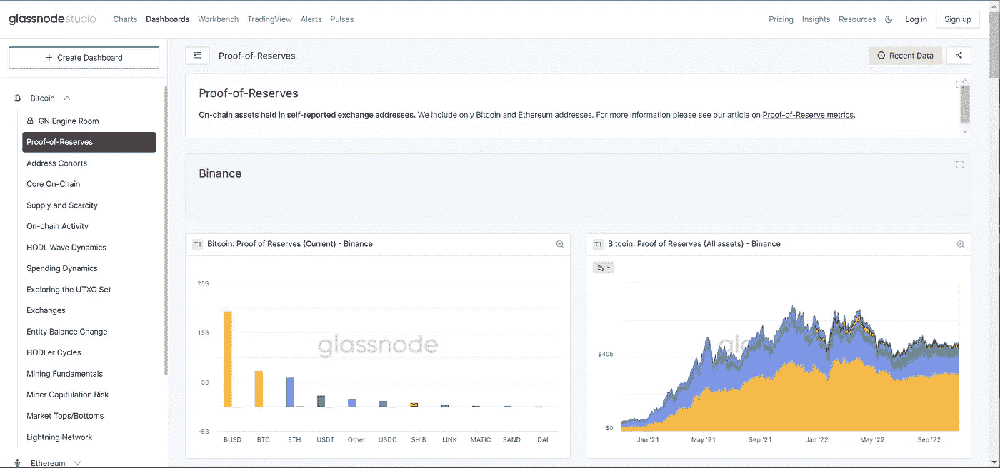
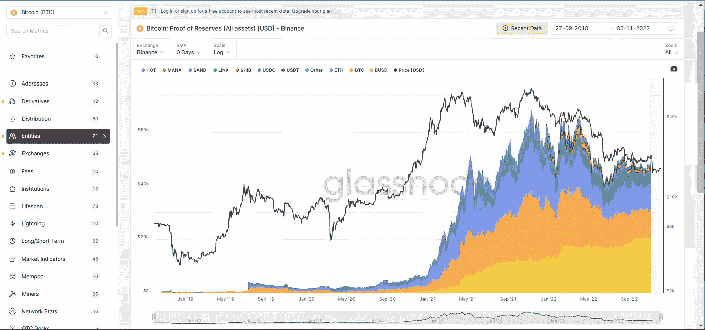
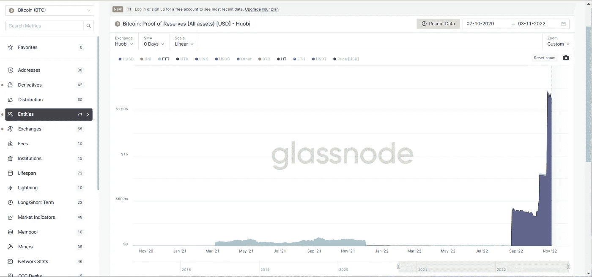

# Glassnode 向所有用户提供新的“储量证明”功能

> 原文：<https://medium.com/coinmonks/glassnode-offering-new-proof-of-reserves-feature-to-all-users-7e647c5012ae?source=collection_archive---------44----------------------->

从今天开始，链指标的顶级来源之一 Glassnode 增加了一个令人敬畏的新指标，鉴于最近 FTX 的惨败，它将成为密码交易所重获任何公众信心的工具。

“为了提高透明度，并试图对抗部分储备的做法，许多交易所已经开始自行报告其加密储备的过程。业内通常将这种做法称为**、**、**、**，其中涉及对所持准备金(链内)和匹配负债(链内和链外)的可核实披露。”
——玻璃节点工作室

只要点击 Glassnode.com[的外汇储备证明仪表盘](https://studio.glassnode.com/dashboards/proof-of-reserves)，任何人都可以看到 9 家最大交易所有形资产的实时构成。目前，显示的钱包由已在他们的比特币和以太币钱包上确认的交易所余额组成，(其他第一层持有物未显示，如 Solana)，以及他们在 stablecoins 中持有的内容，包括他们自己的本地 stablecoins。

这给了我们一个有趣的见解，那就是任何人都可以看到他们的储备中有哪些硬币。通过比较不同时期的交易所储备，值得注意的是，除了 Bitfinix 和 Bitmex(排名第二和第三的交易所)之外，所有交易所都在 stablecoins 中持有最大百分比的储备，无论是 USDT (Tether)还是 USDC。作为最大的交易所，币安持有近 200 亿美元稳定的 BUSD，并在过去一年稳步增加了对 BUSD 的持有。

由于 ERC-20 硬币也被显示，我们可以看到某些替代硬币，交易所可能有既得利益。例如，Bitfinix 持有超过 2.5 万亿美元的 Leo 代币，Crypto.com 持有接近其 6.55 亿美元的 Shiba Inu 5 亿美元。

一个令人担忧的发现来自霍比，他们似乎购买了很多他们自己的本地令牌 HT。去中心化的交易所在 10 月底持有的 HT 已经增加了一倍多，现在持有超过 1.7 万亿美元的本国货币。

这是令人不安的，因为 FTT (FTX 的本土标志)的过多导致了 FTX 的垮台。

对于任何有兴趣查看更多关于比特币的文章的人，只需点击这个[链接](https://www.thegoldforecast.com/bitcoin)。

> 交易新手？尝试[加密交易机器人](/coinmonks/crypto-trading-bot-c2ffce8acb2a)或[复制交易](/coinmonks/top-10-crypto-copy-trading-platforms-for-beginners-d0c37c7d698c)
> 
> 加入 Coinmonks [电报频道](https://t.me/coincodecap)和 [Youtube 频道](https://www.youtube.com/c/coinmonks/videos)获取每日[加密新闻](http://coincodecap.com/)

## 另外，阅读

*   [复制交易](/coinmonks/top-10-crypto-copy-trading-platforms-for-beginners-d0c37c7d698c) | [加密税务软件](/coinmonks/crypto-tax-software-ed4b4810e338)
*   [网格交易](https://coincodecap.com/grid-trading) | [加密硬件钱包](/coinmonks/the-best-cryptocurrency-hardware-wallets-of-2020-e28b1c124069)
*   [密码电报信号](/coinmonks/top-3-telegram-channels-for-crypto-traders-in-2021-8385f4411ff4) | [密码交易机器人](/coinmonks/crypto-trading-bot-c2ffce8acb2a)
*   [最佳加密交易所](/coinmonks/crypto-exchange-dd2f9d6f3769) | [印度最佳加密交易所](/coinmonks/bitcoin-exchange-in-india-7f1fe79715c9)
*   开发人员的最佳加密 API
*   最佳[密码借贷平台](/coinmonks/top-5-crypto-lending-platforms-in-2020-that-you-need-to-know-a1b675cec3fa)
*   [免费加密信号](/coinmonks/free-crypto-signals-48b25e61a8da) | [加密交易机器人](/coinmonks/crypto-trading-bot-c2ffce8acb2a)
*   [杠杆代币](/coinmonks/leveraged-token-3f5257808b22)终极指南