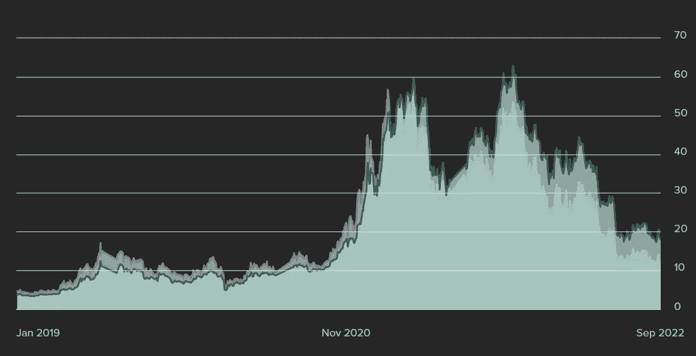
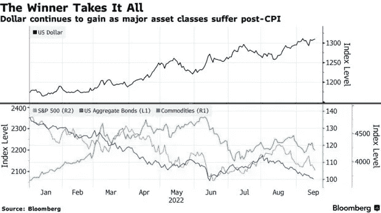

# 全球市场卷轴-比特币未平仓权益标志着投资公司的积累

> 原文：<https://medium.com/coinmonks/global-markets-reel-bitcoin-open-interest-marks-investment-firm-accumulation-1e0943dc9d53?source=collection_archive---------27----------------------->

## 灰度信任和开放兴趣揭示 Crytpo 市场转向

Grayscale Bitcoin Trust Representing $12.5b Assets Under Management

随着 2020 年疫情冠状病毒爆发后全球市场经历通货膨胀复苏，全球市场出现下滑。由于债券显示出反向收益率曲线，美元正在复苏。反向收益率曲线是指美国长期国债的收益率低于短期国债，通常预示着市场的犹豫或不确定性。

美国 10 年期国债被用作许多传统市场的晴雨表，通常被用作房地产市场优惠利率和其他风险投资的金丝雀。目前，10 年期债券收益率为 3.45%，同比增长 157.5%，而 2 年期债券收益率为 3.8%。

在 CPI 数据抵制了前两次加息后，美联储预计下周将加息 0.75-1.00 个基点。如果加息按预期进行，这将标志着从今年 3 月开始加息 3%。期货市场已经消化了这次加息。

量化紧缩或 QT 并不令人惊讶，因为美联储在 2020 年印刷了近三分之一的美国国债以应对冠状病毒。在全球封锁和供应链中断的情况下，通胀处于休眠状态，两年来有效基金利率为零，股票和房地产创下了两位数的纪录。

## 通胀担忧中的市场不确定性

美元指数创下新高，因为第三季度潜在的国内生产总值下降将巩固对衰退担忧的任何疑虑。如果 20 世纪 70 年代是我们即将经历的十年的前奏，那么失业、通货膨胀和经济增长都将被扼杀。这已经可以在传统市场领域看到，因为自 6 月份以来，它们都出现了回调。

美元指数显示，自 2021 年 2 月以来，价格上涨了近 15%，比疫情前的高点上涨了 2%。

## **美元对冲经济衰退；针对美元的加密对冲**

随着比特币的成熟，并开始为机构投资者提供更多流动性，传统资产管理公司将加密视为对冲通胀的手段。贝莱德最近获得了美国证券交易委员会(SEC)批准的首个比特币信托，可能会成为加密市场采用的潜在桥梁，最终将为加密交易员实施现货 ETF。

例如，自 2013 年成立以来，灰度比特币信托(GBTC)已经实现了 12，771%的增长。交易所交易 ETF 让用户可以控制数字资产，而无需承担保管自己加密资产的额外风险。

*阅读更多:* [*EQONEX 交易所转托管资产(AUC)*](/@dean.colias/eqonex-exchange-pivots-to-assets-under-custody-auc-b2f62660b950)

美国证券交易委员会主席加里·詹斯勒(Gary Gensler)一直是加密的主要反对者，并阻止了大多数现货 ETF，但随着各国央行寻求将央行数字货币或 CBD 统一纳入本国法定系统，他的地位可能会下降。

SEC 目前正面临 gray Investments 就一项“反复无常且武断的裁决”提起的诉讼。最大的加密资产管理公司正在起诉美国证券交易委员会，此前他们否认了该公司拟议的交易所交易现货 ETF，称潜在的市场操纵是美国证券交易委员会的主要担忧。

这个消息并不令人惊讶，因为传统金融领域的监管机构或通常与数字货币存在分歧，因为他们通常认为加密是对传统金融和贷款机构的敌对。这可能会改变，因为各经济体希望利用数字货币来对抗通货膨胀和其他经济灾难。

> 交易新手？试试[加密交易机器人](/coinmonks/crypto-trading-bot-c2ffce8acb2a)或者[复制交易](/coinmonks/top-10-crypto-copy-trading-platforms-for-beginners-d0c37c7d698c)