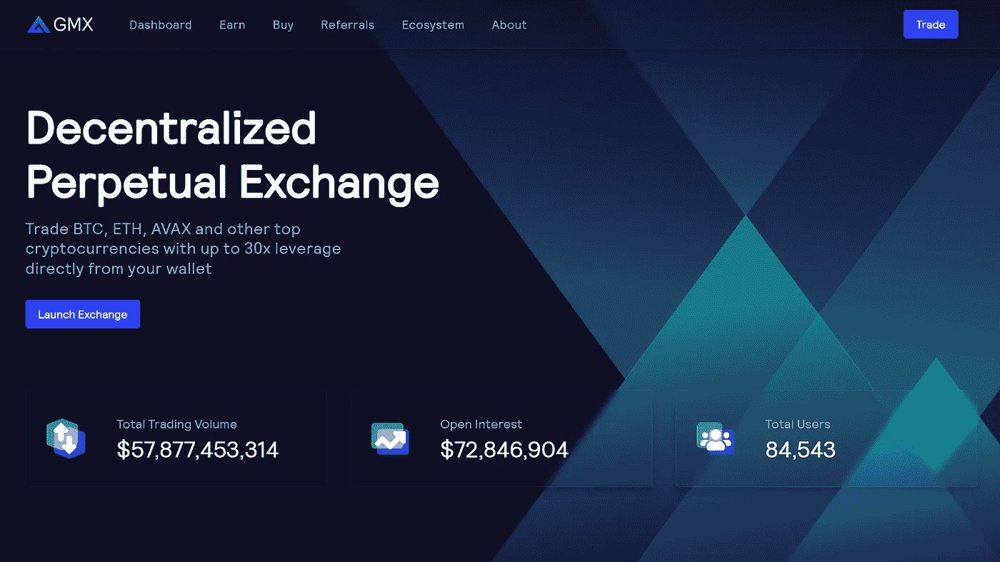
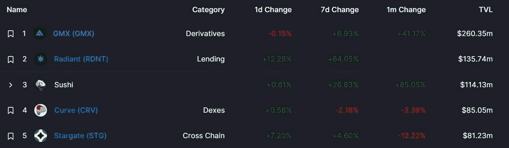
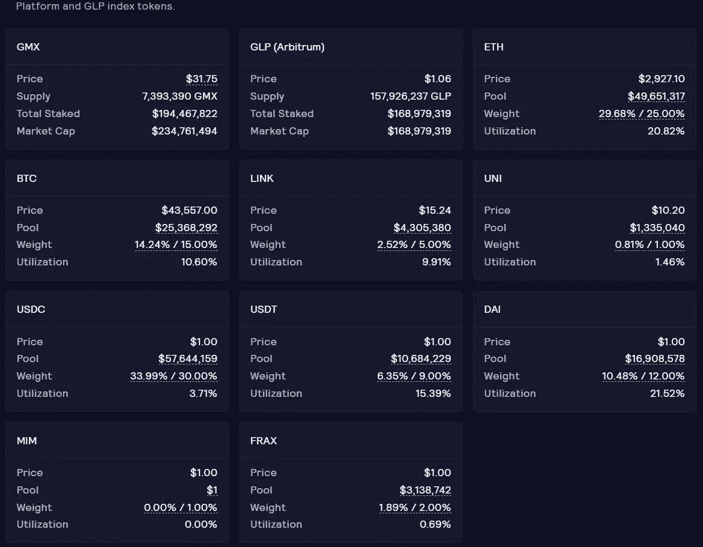
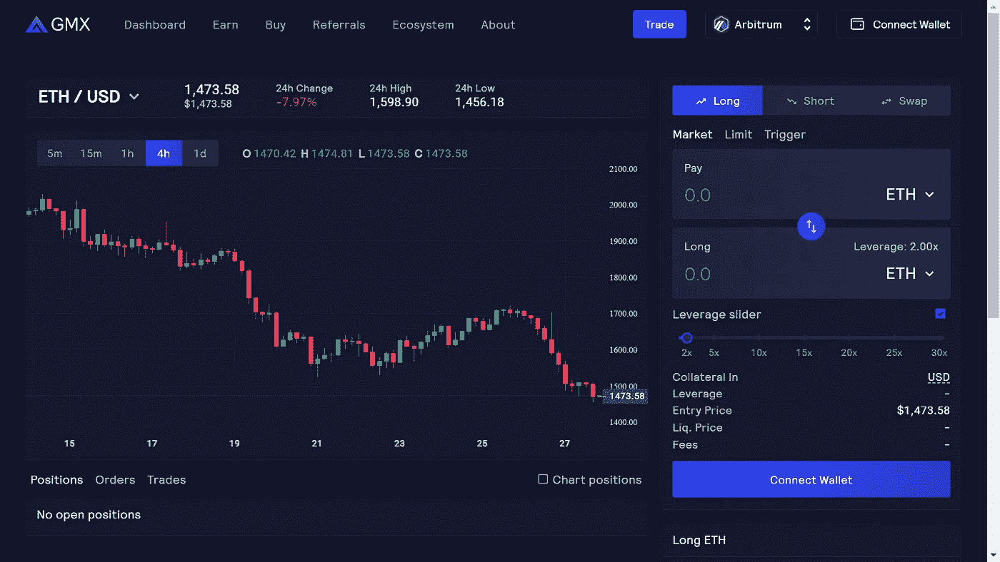
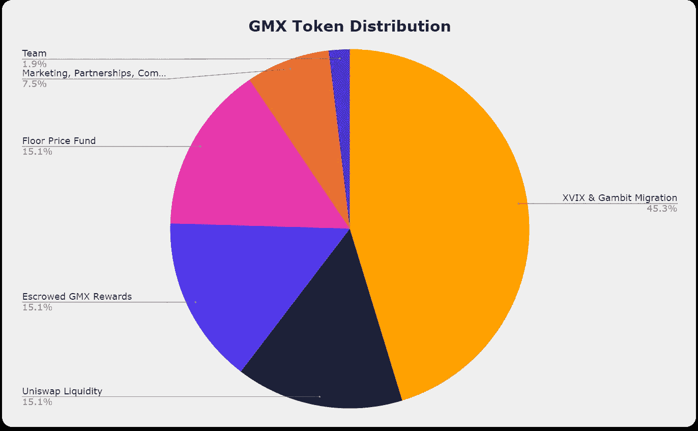

# GMX:简要说明

> 原文：<https://medium.com/coinmonks/gmx-a-brief-explanation-a1f6ade01b04?source=collection_archive---------0----------------------->

## 在这篇深入的文章中发现下一个加密衍生品的领导者

GMX — Decentralized Perpetual Exchange

GMX 是自 2022 年初以来为数不多的升值的加密货币之一。今天，我们将在这篇深入的文章中发现下一个加密衍生品领导者。

**GMX** 是一个分散的现货和永久合约交易平台，支持**低掉期费**和**零价格**影响交易，允许用户在其交易中利用高达**30 倍**的杠杆。

该协议于 2021 年 9 月在 **Arbitrum** 上首次上线，随后于 2022 年初在 **Avalanche** 上推出。

**交易**通过独特的多资产**流动性池**得到支持，该流动性池从做市、掉期费用、杠杆交易(利差、融资费用&清算)和资产再平衡中产生**回报**，这些回报被引导回流动性提供者。

# 什么是 GMX？

最终，有两件事有助于加密货币以这种方式发挥作用:

*   **分散金融(DeFi):** 分散金融的概念是，人们不需要通过银行来获得金融服务或简单地储存他们的钱。
*   密码交易所:密码交易所允许买卖和交换密码。正是通过这种买卖，随着供求法则生效，加密货币获得了价值，投资者发现了他们能够买卖代币或硬币的价值。

虽然 DeFi 的基本原理，如使用不同于传统法定货币的东西作为价值储存手段，即使不比区块链本身的概念更古老，也和它一样古老，但这一概念的发展却更进一步。例如，有很多地方可以让你以加密货币的形式获得贷款，不管有没有抵押品，还有一些地方、系统和代币可以让人们快速、廉价地跨境转移资金。

一些平台将事情带到了一个新的复杂水平，其中之一就是 GMX。该系统旨在将先进的**分散金融**与**加密交换**的概念结合起来。

**GMX** 是一个分散式衍生品交易所，目前部署在 **Arbitrum One Layer 2 (L2)** 缩放解决方案和 **Avalanche** 区块链上。

该协议为少数顶级加密货币和 stables 提供现货交易，即 ETH、、LINK、UNI、DAI、、和。

其永久掉期市场允许交易者以高达 30 倍的杠杆比率做多或做空主要代币。这不是通过指令簿来完成的，而是通过一个被称为 **GLP** 的共享流动性机制来完成的，该机制充当所有可交易资产的池。交易通过当前 oracle 价格(由 Chainlink 担保)进行，理论上深度不确定。

GMX 系统可以分为两个不同的功能令牌:

*   **GMX 令牌**为治。
*   **GLP 令牌**用于交易流动性。

该项目在 Arbitrum(TVL)锁定的 2 . 6 亿多美元的总价值使其成为目前最大的 L2[最大的 dApp。](https://l2beat.com/)

GMX on Arbitrum

# GMX 产品供应

## 交换

*   掉期交易可以按照 oracles 限价单确定的市价执行。
*   根据 GLP 的资产构成，费用从 0.2%到 0.8%不等。
*   通过 GLP 利用共享流动性机制(更多详情见下文)。

## 永久交易

*   交易者可以做多或做空他们喜欢的货币对。
*   杠杆比率在 1.1 倍到 30.5 倍之间
*   市价单、限价单、止盈单和止损单都可用。
*   0.1%开仓/平仓费。
*   小时借用费计算方式:
    —借用资产—池内总资产 0.01%
*   只有 GLP 篮子中的资产可以交易。
    —通过 GLP 利用共享流动性机制。

## GLP

*   GLP 是流动性提供者(LP)令牌，由目标成分权重随净 perp 头寸变化的资产指数组成。
*   可铸造或燃烧以赎回任何指数成分资产。
*   成分资产的动态 GLP 掉期费用定价旨在使实际成分权重达到目标权重。
    —例如，如果 GLP 含有乙醚(ETH)且 ETH 高于/低于其目标重量，则减少/增加池中 ETH 的交易方向将以较低的费用获得激励。
*   GLP 持有者作为所有 perp 交易者的单一交易对手，因此将承担针对 perp 交易者净头寸的 P&L。
    —GLP 的赌注者将累积 70%的平台费作为 LP 奖励。
    —奖励以托管 GMX (esGMX)和 ETH(针对 Arbitrum 上的赌注者)或 Avalanche (AVAX)(针对 Avalanche 上的赌注者)的形式支付

## 治理赌注

*   交易所的治理标志 GMX 可以在以下方面下注，获得 30%的平台费:
    — esGMX
    —乘数点
    — ETH(针对 Arbitrum 上的赌注者)
    — AVAX(针对 Avalanche 上的赌注者)
*   es gmx:
    ——可以被下注来获得奖励，就像 GMX 一样。
    —可以在一年内成为 GMX 代币。
*   乘数点
    ——可以复合以增加 ETH 或 AVAX 奖励。
    —可能有未来的奖金福利。

# 什么是 GMX 代币？

**GMX** 是平台的效用和治理令牌，允许赌注者从整个平台收取的费用中获得 **30%** 。

它在 Arbitrum 和 Avalanche 上可用，可以使用 Synapse 协议桥接。

GMX and GLP Tokens

用户可以将 GMX 押在 Arbitrum 或 Avalanche 上，赢得 3 种不同类型的奖励:

*   托管 GMX (esGMX)
*   乘数点
*   ETH 费(Arbitrum)和 AVAX 费(Avalanche)

# 什么是 GLP 令牌？

**Token 是协议的本地流动性提供者 Token，本质上是 GMX 协议支持的大型资产(目前包括 ETH、BTC、领汇、UNI、、、戴、MIM 和 FRAX)的指数，每周自动重新平衡。**

**该资产作为 GMX 多资产池系统中现有资产的一个指数，也可以随着时间的推移赢得 esGMX 和 ETH 奖励。值得注意的是，GLP 的赌注者获得了 GMX 累积费用的 70 %( T3)。**

****

**GLP index tokens**

# **为什么是 GMX？**

****永久掉期**就像一份没有到期日的期货合约，这意味着该工具可以无限期持有。在 DeFi 中，永久用于投机加密价格行为，只需要很少的前期资本来支持高杠杆头寸。**

**具体到 GMX，该项目提供非托管永久掉期交易，重点是友好的 UX。在 GMX，交易者可以通过快速交易和较低的掉期和交易费用做多和做空，而流动性提供商(LP)可以通过向协议的多资产池系统提供资产来支持杠杆交易和掉期来盈利。**

**DeFi 领域有多个竞争对手也提供永久期货。与此同时，总会有一部分市场份额的集中交易所的威胁正在逼近。**

**那么是什么让 **GMX** 与众不同呢？**

**由于其独特的价值定位，GMX 将自己定位为衍生品领域的领导者，主要有两点:**

*   **代币 GMX 持有者和流动性提供者的强劲增值，以 ETH 计价。**
*   **一个非通货膨胀的象征经济学模型:GMX 流动性模型(GLP)不需要通货膨胀(农场和垃圾场式)的象征性激励。**

# **杠杆交易**

**GMX 是一个流行的 [**分散交易所**](https://blog.cryptostars.is/what-are-decentralized-exchanges-how-do-dexs-work-4e54fd477e0e) 专门从事永续期货交易。该项目于 2021 年底在以太坊第 2 层网络 Arbitrum 上推出，后来部署到 Avalanche，通过向用户提供高达 30 倍于其存款抵押品的杠杆，该项目迅速获得了关注。**

****杠杆交易**是从金融平台借入资金以增加对价格变动的敞口的行为。近年来，杠杆交易已经成为加密生态系统的重要组成部分。除此之外，它允许市场参与者从价格下跌中获利，在不确定的条件下降低风险，并在他们有信心的时候对资产下大赌注。**

**在 crypto 中有几种利用杠杆的方法。币安、FTX 和其他集中交易市场为客户提供借入资金进行交易的能力。币安和 FTX 都允许客户借入相当于初始存款 20 倍的资金。像 Aave 和 MakerDAO 这样的 DeFi 协议以一种无许可的方式针对加密抵押品发放贷款。最近，GME 集团和 ProShares 等传统金融公司开始向机构客户提供杠杆产品，如以太坊期货合约期权和机构投资者的比特币空头 ETF。**

**GMX 与此类服务的不同之处在于，它是一个提供杠杆交易服务的**分散式交易所**。在这方面，它将 Uniswap 等其他 DeFi 交易所的类似经验与币安等公司提供的杠杆交易服务相结合。在 GMX，用户可以在 BTC、ETH、AVAX、UNI 和 LINK 交易中使用高达 30 倍的杠杆。换句话说，如果一名交易员向 GMX 存入价值 1，000 美元的抵押品，他们将能够从其流动性池中借入至多 3 万美元。**

# **在 GMX 交易**

**截至发稿时，GMX 的交易得到了价值超过 2 . 54 亿美元的多资产 GLP 资产池的支持。与许多其他杠杆交易服务不同，用户从包含、ETH、、戴、、、UNI 和 LINK 的流动性资金池而非单一实体借入资金。**

**用户可以在交易所进行“**多头**”“**空头**”或简单的**互换**代币。当交易者预期某项资产的价值会增加时，他们会做多；当他们预期能够以更低的价格买回某项资产时，他们会做空。在 GMX 上，用户可以选择最低 1.1 倍存款的杠杆水平，最高 30 倍的多头和空头交易。**

****

**Trading on GMX**

**GMX 由**链环神谕**驱动。它使用来自主要交易量交易所的总价格来降低临时波动带来的清算风险。当用户的抵押品不足以维持交易时，就会发生清算；然后，平台强行平仓，并存入保证金以弥补损失。**

**当用户开始交易或存入抵押品时，GMX 会对其美元价值进行快照。在整个交易过程中，即使标的资产的价格发生变化，抵押品的价值也不会发生变化。**

**开仓或平仓的交易费用为 **0.1%** 。每小时还会从押金中扣除一笔可变的借款费用。互换费用为 **0.33%** 。由于协议本身作为交易对手，因此在进行交易和退出交易时，对价格的影响很小。GMX 声称，根据其交易池的流动性深度，它可以完全按照市价执行大宗交易。**

**当用户想做多时，他们可以提供他们所赌令牌的抵押品。他们获得的任何利润都是以同样的资产支付的。对于空头，抵押品仅限于支持的稳定客户、、戴或。空头的利润是用稳定的货币支付的。**

# **令牌组学**

****$GMX** 是协议的效用和治理令牌。$GMX 的预计最大供应量为**1325**万枚代币，如果有更多产品推出和需要挖掘流动性，供应量还会增加。但在做出任何改变之前，这将受到治理投票的影响。**

**这 1325 万美元的 GMX 代币将如何分配:**

*   **600 万 GMX 从 XVIX 和 Gambit 迁移。**
*   **200 万 GMX 与瑞士联邦理工学院在 Uniswap 上进行流动性配对。**
*   **200 万 GMX 预留给托管的 GMX 奖励公司。**
*   **由底价基金管理的 200 万 GMX 代币。**
*   **100 万 GMX 代币留给营销、合作伙伴和社区开发者。**
*   **250，000 枚 GMX 代币在 2 年内直线分发给该团队。**

****

**Tokenomics of $GMX Token**

**最大份额的代币(45.3%)分配给了 XVIX 和 GMT (Gambit)代币持有者的迁移。迁移过程包括以 1 美元 GMX = 2 美元的价格将原始资产(XVIX、XLGE 和 GMT)换成美元 GMX。**

**美元 GMX 代币有一个特点，叫做**底价基金**。该基金以$ETH 和$GLP 计价，以两种方式增长:**

*   **GMX/ETH 流动性由协议提供并拥有，来自该交易对的费用将转换为 GLP 并存入底价基金。**
*   **通过[奥林巴斯债券](https://pro.olympusdao.finance/#/partners/GMX)获得的资金的 50%被送到底价基金，另外 50%用于营销。**

**底价基金有助于确保 GLP 的流动性，并为押注美元 GMX 的人提供可靠的美元回报流。**

**随着底价基金的增长，如果(底价基金)/(GMX 总供应量)小于$GMX 的市场价，它可以用来回购和烧掉 GMX。这导致了$GMX 在$ETH 和$GLP 方面的最低底价。**

# **包裹**

**GMX 是一个用户友好的交易所，提供关于交易、费用和流动性的全面数据。该平台拥有其管理的资产、交易量、费用和交易员头寸的详细信息。它还提供了一个文档部分和信息，如何桥到雪崩或 Arbitrum 或获得 GMX 和 GLP 令牌。该交易所提供了一种理解其机制的简单方法。**

**在本文中，我们简要介绍了下一位加密衍生品领导者 **GMX** 。继续阅读，了解最新的区块链故事。**

## ****和我保持联系！👋****

**穆罕默德·沙赫扎德
—*[*Rene sis tech*](https://medium.com/u/8721a6090e85?source=post_page-----a1f6ade01b04--------------------------------)**LinkedIn**https://www.linkedin.com/in/ishanshahzad/[▶️](https://www.linkedin.com/in/ishanshahzad/)***

> ***交易新手？试试[加密交易机器人](/coinmonks/crypto-trading-bot-c2ffce8acb2a)或者[复制交易](/coinmonks/top-10-crypto-copy-trading-platforms-for-beginners-d0c37c7d698c)***