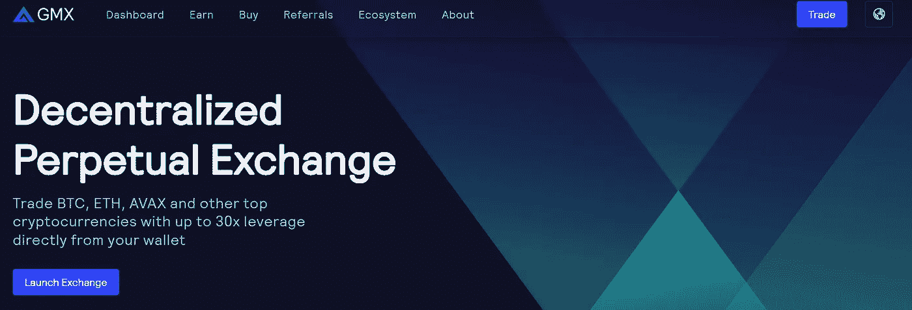

# GMX——简介

> 原文：<https://medium.com/coinmonks/gmx-a-brief-introduction-a028232c85b2?source=collection_archive---------7----------------------->

2022 年 9 月 5 日，GMX 产生了近 100 万美元的费用。

这使它成为当天的第 3 名，本周的前 5 名。

你听说过，可能买过，可能用过。

这是该协议提供的另一个介绍。

# 什么是 GMX？

一个分散的链上永久合同交易所，为股东和有限合伙人带来收入。平台提倡 0 价格冲击交易低滑点。

它在 Arbitrum 和 Avalanche 上起作用，通过突触起主动桥作用。

# **这有什么关系？**

GMX 在 Arbitrum 上拥有最高的 TVL，这是特别令人印象深刻的，因为它与 dYdX 和 Synthetix 是同一级别的，只是在力学上有一些差异。

它使用链接和聚合交换价格作为提要。

你可以押注 GMX，然后在 Arbitrum 或 Avalanche 上获得衍生品，中间有一座桥梁。30%的交易费归这些赌注者所有。

将 GMX 与竞争对手区分开来的一个重要点是，下注奖励以 ETH 或 AVAX 支付，具体取决于你下注的地点。

您还可以通过其他方式赢取托管 GMX 和乘数点奖励。这些奖励可以是复合的，也可以是索取的。

# **托管 GMX (esGMX)**

类似于 GMX 赌注，赌注他们赚取奖励。他们可以被授予一年成为 GMX。

# **乘数点**

通过押注 GMX 获得的乘数点，旨在奖励长期持有人，同时避免通货膨胀。他们可以像 GMX 赌注一样被下注以获得奖励。在拆除 GMX 和 esGMX 的桩时，大约有 10%被烧毁.

# **底价基金**

这是一个协议拥有的基金，以帮助确保流动性存在的 GLP 和 ETH 奖励 GMX 的股东。需要的时候也可以用来回购和焚烧 GMX。

该基金是通过 GMX/ETH 基金(创造 GLP 代币)和奥林巴斯债券的费用积累起来的。

# **令牌**

30%的费用归 [$GMX](https://twitter.com/search?q=%24GMX&src=cashtag_click) 的股东，70%归 [$GLP](https://twitter.com/search?q=%24GLP&src=cashtag_click) 的股东(GMX/联邦储蓄银行流动性提供者)。GMX 的最大供应量是 1325 万枚代币，随着需求的增加和治理的肯定，还有铸造更多代币的潜力。

该项目已经做得相当好，并且相对受欢迎。感谢，至少是感谢这个领域中那些已经表现出兴趣一段时间的受欢迎的人，包括亚瑟·海斯。

# **下线**

现在这个领域的一个普遍趋势是提供推荐费的加密项目。用户第一次进行交易时，推荐代码存储在智能合约中。代销商从用户交易费用中赚取回扣，最高可达交易折扣的 10%和回扣的 15%。

# **结论**

DEX perpetuals 并不是一个新概念。然而，GMX 确实提供了一些独特的特征。在这种下跌趋势中，人们想要一些令人兴奋的东西。

一种相对复杂的技术产品，比如带有新奖励方式的永久指数，至少在短期内会赢得一些青睐。这么多有点类似的项目，长期潜力如何？GMX 确实有增加更多功能的计划。时间会证明一切。

# 你觉得这有帮助吗？

我每天 16 个小时关注这个行业，从空间的每个角落为您带来见解和分析。

要保持循环，请执行以下操作:

1.  在[的秘密高潮](https://medium.com/u/ac6a6e914928?source=post_page-----a028232c85b2--------------------------------)跟随我
2.  在推特上关注我 https://twitter.com/TheCryptoClimax

请务必[订阅我的免费时事通讯，获取独家内容！](https://www.getrevue.co/profile/thecryptoclimax?element=subscribe-through-revue)

**下一篇文章再见，我将从基本原则中强调非功能性测试的实际好处。**

> 交易新手？尝试[加密交易机器人](/coinmonks/crypto-trading-bot-c2ffce8acb2a)或[复制交易](/coinmonks/top-10-crypto-copy-trading-platforms-for-beginners-d0c37c7d698c)