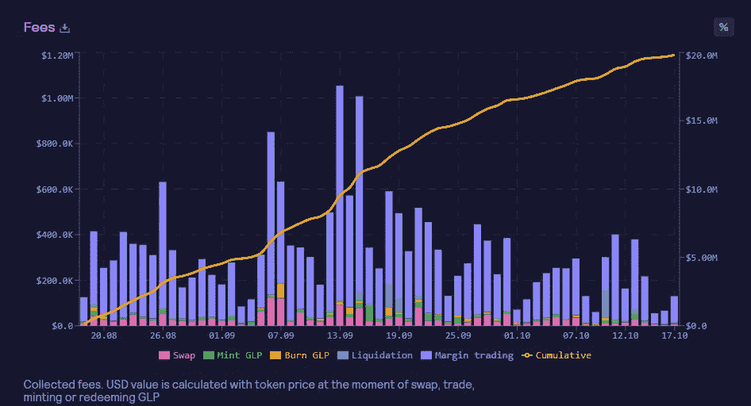

# GMX 竞争者——您可以拥有部分赌场并赚取#realyield 的 3 个地方

> 原文：<https://medium.com/coinmonks/gmx-competitors-3-places-where-you-can-own-part-of-the-casino-and-earn-realyield-7dacaf11a472?source=collection_archive---------0----------------------->

嘿，伙计们，如果你已经关注了我以前的[文章](/coinmonks/is-gmx-a-option-for-the-bear-market-an-in-depth-review-2c2eff249b7b)，你就会知道我是 [GMX.io](https://gmx.io/trade?ref=Jaik83) 的忠实粉丝，这是一个永久的交易平台，在这里你可以基本上作为赌场的一部分，并从平台产生的费用中获得回报——即从交易和清算中获利。尽管遭受了[上个月](https://beincrypto.com/gmx-dex-reportedly-suffers-565000-exploit/)50 万美元的剥削，GMX 继续获得人气，并显示出其干涉，在当前的熊市中，其 TVL 稳步获利:

TVL 股市的迅速上涨表明，GMX 的人气并没有减弱，它继续证明，它可以提供最优的市场价格，同时对交易的价格影响最小，同时为其本土代币投资者带来可观的费用和利润:

由于它的成功，难怪如此多的人将 GMX 分支到不同的连锁店，并找到类似的成功。在今天的文章中，我们将介绍几个类似 GMX 的选项，这些选项在过去几个月中受到了类似的欢迎，以及为什么(如果你觉得你错过了 GMX 的机会)现在可能是考虑加入其中一个的好时机。

在我们进入替代品列表之前，让我们先回顾一下什么是 GMX.io，以及它为什么如此成功。

> [GMX.io 审查 DEX 上的永续交易](https://coincodecap.com/gmx-review)

# GMX:GMX 和 GLP

像许多其他原生 DEX 令牌一样，$ **GMX** 从协议费用(即互换/交易费用和令牌排放量)中获得其价值和效用。平台收取的费用越多，GMX 代币的价值就越高。更确切地说，协议费总额的 30%流向了 GMX 的股东，70%流向了 GLP 的股东。然而，真正让$GMX 区别于其他代币的是，如果你下注$GMX，你得到的奖励是以$ETH 和托管的$GMX(迄今为止，如果你在 Arbitrum 上，总的年利率为 13.25%)或$AVAX 和托管的$GMX(迄今为止，如果你在 Avalanche 上，总的年利率为 13.81%)的形式分发的。

姐妹令牌$ **GLP** 主要从交易者清算中获得收入(确切地说，是协议总收入和排放量的 70%)。换句话说，你将从那些通过杠杆化失败的多头和空头获利的人身上赚钱。此外，GLP 本身更类似于 ETF，而不是加密货币。据我所知，它与 [Midas Investment 的 Stable YAP 或 Defi Yap](https://yaps.midas.investments/?p=0191) 产品非常相似，因为它由一篮子加密货币组成。正如我之前提到的，因为 GMX 在两条不同的链上，所以有两种不同类型的 GLP。

现在，对于不同的 GMX 替代品…但在此之前，快速免责声明，其中一些是附属链接，所以如果你是这些平台的新用户，考虑支持我的博客(在某些情况下，你自己也是)，点击链接并免费注册。

# [1) Metavault.trade](https://app.metavault.trade/#/?ref=CryptosWith) —多边形；目前高达 69.33%的年利率

在 [Metavault.trade](https://app.metavault.trade/#/?ref=CryptosWith) 上，你会发现与 GMX 几乎相同的布局，在简单互换的基础上拥有 30 倍的杠杆，降低了清算风险，以及最小的价格影响。再次类似于 GMX，人们可以下注$MVX 或$MVLP，以获得平台清算和/或费用:

你可能会首先注意到，4 月份的利率明显高于 GMX，目前 MVX 的利率为 50.38%(相比之下 GMX 为 13.78%)，指数标志 MVLP 的利率为 69.33%(相比之下 GLP 为 19.98%)。我不是 100%确定为什么 Metavault 上的利率如此之高，但我最大的猜测是这与每份股份的 TVL 有关——GMX 目前有价值 388，847，051 美元的 GLP 股份，而 Metavault 目前只有价值 4，580，893 美元的 MVLP 股份。像任何流动性池的机制一样，较低的供应量通常意味着赌注者能够获得更高的回报，因为他们每个人都能够获得更大的奖励-费用馅饼。

**2012 年 11 月 3 日附录:**这是我在 [twitter](https://twitter.com/BMGarber/status/1587834635303751682?utm_source=substack&utm_medium=email) 上注意到的，我认为值得一提。我没有以任何方式对此进行事实核查，但如果您计划使用 Metavault，我认为至少应该谨慎地将它视为另一个风险因素:

# [2)菌丝体永久交换](https://swaps.mycelium.xyz?ref=CryptosWith)—Arbitrum；目前年利率为 20.74%

[菌丝体](https://swaps.mycelium.xyz?ref=CryptosWith)再次类似于 GMX，是阿比特鲁姆日益增长的竞争对手，它有索引的$MLP 令牌(允许赌注者从平台获得 70%的费用)(类似于$GLP ),和$MYC(它的本地平台令牌，类似于$GMX)。

与菌丝体的几个关键区别在于，对于已押的$MYC 有 14 天(两周)的锁定期周期，同时赚取$ETH 的所有已获利息(与$ETH +任何其他托管代币相反):

最后，菌丝体交易者的另一个有趣的特征是，收入最高的 50%的交易者获得奖金支出，获得平台产生的 10%的费用——激励交易者继续交易。

目前，MYC staking 的费率为 15.33% APR(相比之下，GMX 为 13.78%)，MYC staking 的费率目前约为 20.74%(相比之下，GLP $ staking 的费率为 19.98%)。

# [3)增益网络](https://gainsnetwork.io/pools/) —多边形；目前 APY 为 9%

虽然它与其他平台相似，因为它从交易费用中获得收入，但我最后提到[增益网络](https://gainsnetwork.io/pools/)是因为与其他平台相比，它也有一些最明显的不同。也许最大的变化是，你可以发挥 150 倍的杠杆作用，几乎可以在任何市场交易，包括外汇和股票。

**$迄今为止，全球导航卫星系统美元资金池产生了约 4%的 APY 收益，如果您持有他们的一个 NFT，就有能力提高回报:**

**$DAI Vault:**Gains Network 的$ DAI Vault 可能与 GMX 的$GLP token 最相似，基本上是交易交易员损益的 Vault。换句话说，美元 DAI 保险库的收益率将因交易中有多少人赢或输而有所不同。关于$DAI Vault，另一件需要注意的重要事情是，一旦入股，每 24 小时只能撤回一次您 25%的股份(从您最初的股份中)。因此，如果您持有价值 100 美元的 DAI 美元，您每 24 小时只能提取 25 美元。迄今为止，DAI Vault 提供的资金约为 9%的 APY 复利。

# 类似赌场的创收平台需要考虑的一般因素:

如果赌场可以失败，GMX 也可以:所以我在很多[地方听说/读到](https://blog.switcheo.com/gmx-the-casino-you-can-own/)投资赌场就像拥有自己的赌场。这可能是一个公平的比较，因为那些疯狂举债的人通常会进行一些相当重要的赌博，以获得大笔支出。然而，问题是，就像赌场一样，协议的收入结构是基于赌场会赢的事实。换句话说，这个平台假设总会有人因为做多和做空而被清算。大多数人确实不擅长交易，大多数人会赔钱，但正因为我们知道这在统计上是真实的，如果一只大鲸鱼来了并赢了，而且赢得很大，这些赌场般的平台会如何发展仍有待观察。

**4 月/APY 汇率不会永远持续:**关于所有这些平台的普遍共识是，收入并不真正跟随市场，而是随着交易者对市场的反应而变化。换句话说，仅仅因为$BTC 下跌并不一定意味着$GMX 也会下跌——这取决于有多少人在交易和清算他们的$BTC 多头和空头。尽管如此，当出现大规模不可预测的波动时，所有这些平台都会获得巨大的收益，许多交易者可能会左右逢源。另一方面，如果没有人获得 rekt，市场停滞不前，像$GMX 这样的代币很可能不会产生大量回报。

# 结论

在我上一篇关于 GMX 的文章中，我推测类似赌场的收入分享模式可能是下一代 DEX，目前看来我是对的。只要这些模式被证明是成功的，我相信我们可能会继续看到越来越多的 GMX 式的叉子出现。

我仍然相信收入共享模式与加密货币的“去中心化”精神大体一致，我对 GMX 模式的下一次迭代将带来什么样的创新感到非常兴奋。

再次感谢您的阅读，请一如既往地在 twitter 上关注我，阅读我的最新发现和更新:[https://twitter.com/CryptosWith](https://twitter.com/CryptosWith)

声明:这些信息都不是财务建议，只是我在网上随便找的一个人的推测。请考虑这纯粹是教育和娱乐的目的。和往常一样，请做自己的研究或联系财务顾问，找到什么投资可能最适合你。

> 交易新手？试试[加密交易机器人](/coinmonks/crypto-trading-bot-c2ffce8acb2a)或者[复制交易](/coinmonks/top-10-crypto-copy-trading-platforms-for-beginners-d0c37c7d698c)
> 
> [GMX.io 评论 DEX 上的永续交易](https://coincodecap.com/gmx-review)