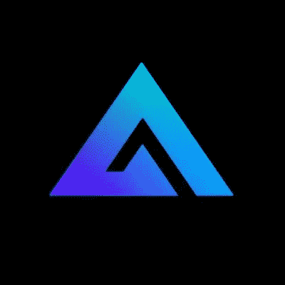
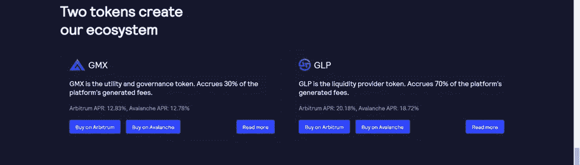
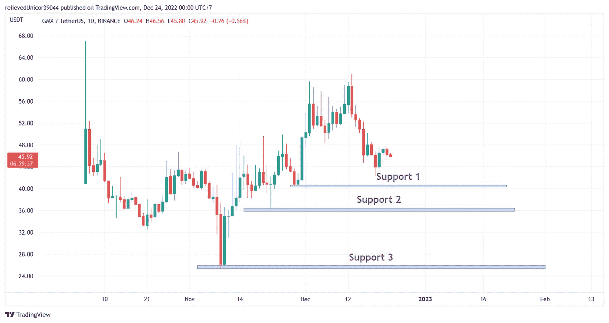
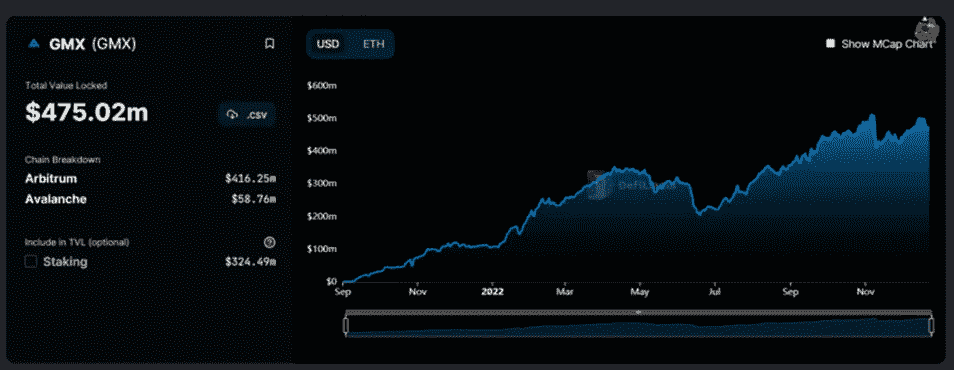

# 仲裁链上的$GMX 潜在硬币

> 原文：<https://medium.com/coinmonks/gmx-potential-coin-on-arbitrum-chain-9c4c04fbd55?source=collection_archive---------36----------------------->

[GMX | Decentralized Perpetual Exchange](https://gmx.io/#/)

**GMX 是一个分散的交易所和永久交易所**,支持低掉期费用和无价格影响的交易。交易由一个独特的多资产池支持，该池从做市、掉期费用、杠杆交易(利差、融资清算费用)和资产再平衡中产生流动性提供者费用。

> 从顶级交易者那里复制交易机器人。免费试用。

[GMX | Decentralized Perpetual Exchange](https://gmx.io/#/)

GMX 有两个代币。**$ GMX 代币是一种公用事业代币，$GLP 是 GMX 流动性提供商代币**，这种代币鼓励用户将其资产作为流动性存入 GMX 交易所，作为回报，他们可以获得 GLP 积分。

> 这个 GMX 站在**仲裁链和雪崩链**上
> 
> 象征性总供应量:8，779，959 GMX
> 
> 象征性流通供应量:8，374，407 GMX

在我看来，GMX 是一个非常有趣的象征，因为当市场经历震荡的几个星期里，GMX 能够保持其价格水平不会下跌太多。当市场经历暴跌时，GMX 也上涨了。**让$GMX 变得有趣的另一件事是，Arbitrum 可以说是最大、最分散的区块链以太坊担保的交易的主要汇总解决方案**

## 技术分析

GMX 有几个支持可以分析。最有可能的是，GMX 将向 40.5 美元的第一个支撑位进发，如果第一个支撑位被打破，它将向 36 美元的第二个支撑位进发。最后一个支撑位是 GMX 在 25 美元水平的最后一道防线。

## TVL 分析(总值锁定)

[GMX: TVL and Stats — DefiLlama](https://defillama.com/protocol/gmx?showMcapChart=true)

*   GMX·TVL 4.74 亿美元
*   GMX 市值 3.86 亿美元
*   拉西奥·麦卡普/ TVL 0.81

注:这只是我个人对$GMX 的看法

> 加入 Coinmonks [电报频道](https://t.me/coincodecap)和 [Youtube 频道](https://www.youtube.com/c/coinmonks/videos)了解加密交易和投资

# 另外，阅读

*   [加拿大最佳加密交易机器人](https://coincodecap.com/5-best-crypto-trading-bots-in-canada) | [库币评论](https://coincodecap.com/kucoin-review)
*   [火币加密交易信号](https://coincodecap.com/huobi-crypto-trading-signals) | [HitBTC 审查](/coinmonks/hitbtc-review-c5143c5d53c2)
*   [TraderWagon 回顾](https://coincodecap.com/traderwagon-review) | [北海巨妖 vs 双子座 vs BitYard](https://coincodecap.com/kraken-vs-gemini-vs-bityard)
*   [如何在 FTX 交易所交易期货](https://coincodecap.com/ftx-futures-trading)
*   [OKEx vs KuCoin](https://coincodecap.com/okex-kucoin) | [摄氏替代度](https://coincodecap.com/celsius-alternatives) | [如何购买 VeChain](https://coincodecap.com/buy-vechain)