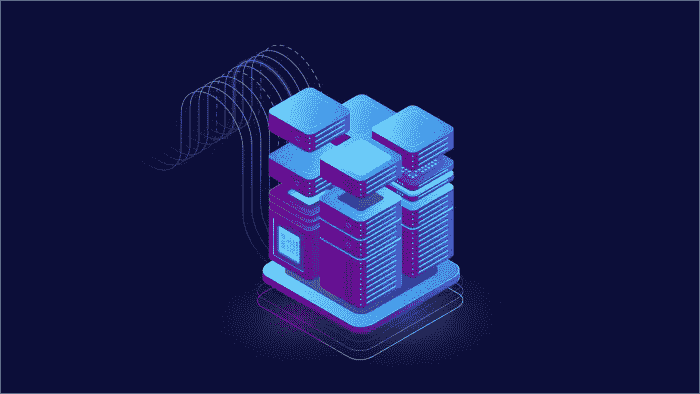
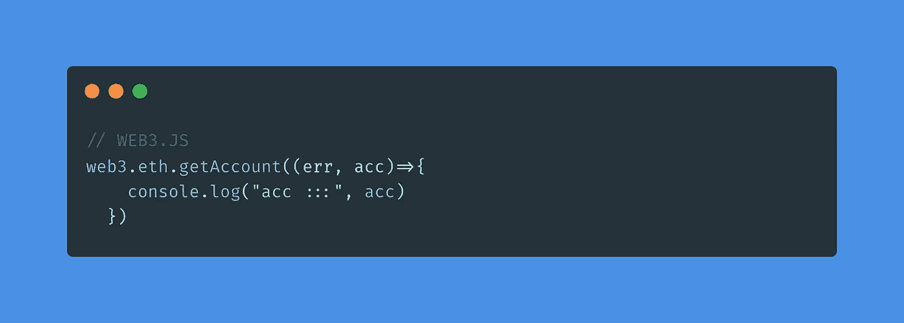

# 大背景下的以太坊

> 原文：<https://medium.com/coinmonks/go-ethereum-in-the-big-picture-125517eb4fe7?source=collection_archive---------14----------------------->

如果你是区块链爱好者，你可能听说过 geth 或 go-Ethereum。但是什么是 geth 呢？

Geth 以太坊是在 Google 的 Go 编程语言中实现以太坊节点的命令行接口。Geth 作为区块链中的一个节点，帮助用户开采以太并创建在以太坊虚拟机上运行的软件。

假设你下载了 Geth 或者 go-Ethereum，Geth 是许多不同区块链节点中的一个。Geth 是一个命令行工具。如果你跑了，会发生两件事，

*   Geth 试图找到我们的区块链节点并连接到他们。
*   Geth 在您的计算机上打开 JavaScript RPC，让您连接到区块链节点。

它将开始连接到其他节点，并开始下载块。下载工作有点像激流。Geth 有几种同步方式。列出如下:

*   完全同步
*   快速同步
*   灯光同步

# 完全同步

如果您将 PC 作为完整客户端或完全同步运行，它将下载所有块头、块体和历史事务。它们都可能是数百万千兆字节的数据。它也需要大量的带宽来下载这些块。

# 快速同步

快速同步还会下载所有块头和块体，但它只会处理最后 1024 个事务。相对来说，它比全同步要轻得多。

# 灯光同步

它将只下载标题并拍摄最新的快照。它不太安全，但速度快得多。

当你在你的电脑上下载并安装 Geth，你可以创建一个账户，你可以发送交易，可以签署交易，以及许多其他事情。Geth 支持 JSON-RPC over HTTP。有不同的方法可以到达下面的 JSON-RPC 列表:

*   IPC —进程间通信
*   HTTP 上的 RPC

**IPC —** 这与您通过文件或管道直接连接到 Geth 有关

**RPC over HTTP —** 这样您就可以通过 HTTP 进行连接，从而使您的浏览器能够进行连接。这就是 WEB3。JS 进场。

**WEB3。这是一个非常简单的 JavaScript 库。它接受命令，并通过 HTTP 将它们重新路由到通过 HTTP-RPC 打开的以太坊节点。假设您有一个网站，该网站使用 WEB3.js，并且您还有一个正在运行的 Geth 节点，您想知道该 Geth 节点中的帐户。您键入以下命令来获得该帐户**

WEB3。JS 会像 Geth 一样通过 HTTP-RPC 在后台通过 AJAX 连接到区块链。它将返回脚本的值，就像与任何其他 HTTP API 交互一样。在这种情况下，您将直接与区块链节点进行交互。

# 下载 Geth

你现在必须去[https://geth.ethereum.org/](https://geth.ethereum.org/)获取当前版本号。提醒一下，Geth 没有升级机制，所以你必须不时地检查新版本。安装后，你没有在你的菜单中找到它，因为 geth 是命令行工具，所以到你的终端键入“Geth ”,它将启动 Geth 应用程序。这是第一次，它会将所有的块从网络导入到你的计算机中。默认情况下，它处于快速同步模式。您可以将 geth 模式配置为完全同步或轻度同步，这由您决定。

我没有涵盖所有的概念，但对于刚开始学习 geth 的人来说，这可能是一个好的开始。

就这样，伙计们！希望对你来说是本好书。谢谢大家！✨

👉联系我:shahirzain100@gmail.com

👉关注我:[GitHub](https://github.com/ShahirZain)LinkedIn

> 交易新手？尝试[加密交易机器人](/coinmonks/crypto-trading-bot-c2ffce8acb2a)或[复制交易](/coinmonks/top-10-crypto-copy-trading-platforms-for-beginners-d0c37c7d698c)