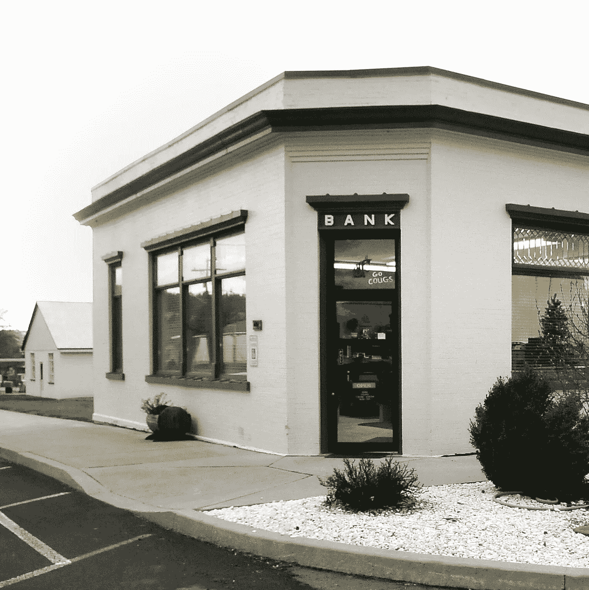

# 去洗钱吧，FTX 有他们自己的美国银行

> 原文：<https://medium.com/coinmonks/go-go-gadget-money-laundering-ftx-had-their-own-us-bank-d808601c24e6?source=collection_archive---------6----------------------->

在另一份“关于 FTX 和 SBF 的最新消息”中，他们的破产申请文件显示，FTX 设法收购了他们自己的美国银行。这就像一个永久的机器，但不是免费的能源，这个故事只是变得越来越糟糕。

# 如此微小的事情会引起如此大的关注

所发现的是 FTX 对法明顿州立银行母公司的 1150 万美元投资。这项投资是通过 FTX 的一家子公司完成的。该分支机构只有一个办公室，而且这个办公室很小，直到最近还只有三名雇员。为了强调该银行与美国其他银行相比是多么“小”，该银行不提供网上银行服务，也没有信用卡。我知道，在美国没有信用卡。

*Farmington State Bank, the small town bank in question*

这一发现引发了一系列问题，这家小银行将如何参与寻找失踪资产？它与 FTX 的关系有多密切？他们是如何在监管者不知情的情况下收购一家银行的？他们为什么要买？

# 收购银行

正是在今年 3 月，阿拉米达研究公司向母公司 FBH 投资了 1150 万美元。当时，该银行在美国 4800 家银行中排名第 26。当时它的净值是 570 万美元。这使得这笔投资超过了净值的两倍。这意味着他们必须为某些东西支付额外的钱，问题是这些东西是什么。

*Ramnik Arora´s profile picture at* [*https://signal.nfx.com/*](https://signal.nfx.com/)

这笔交易是由拉姆尼克·阿罗拉带头发起的，他有时被称为 SBF 的“重要副手”。参与并负责其他几笔大交易的人。

这笔交易是如何发生的也是我认为会彻底调查的事情。这是因为购买一家美国持牌银行的股份需要得到联邦监管机构的批准。这也使得 SBF 与美国监管机构和政府官员的关系有多深的问题变得更加重要。

# 更多加密连接

然而，除了与 FTX 和阿拉米达的加密连接外，FBH 还有另一个加密连接。这要感谢法明顿州立银行的所有者和母公司 FBH。他们在 2020 年收购了这家银行。FBH 的主席是让·沙洛平。因是 80 年代《小侦探》的共同创作者之一而闻名。

但是吉恩.夏洛平除了是个有创造力的天才之外。去去小工具缩略图！也是德尔泰克银行的主席，这家银行就像 FTX 一样，总部设在巴哈马。他们最著名的，也可能是最大的客户是…如果你一直关注 FTX 的故事，你可能已经猜到了。泰瑟，没错。拴在马厩里。

FTX 和阿拉米达是泰特斯最大的商业伙伴。泰瑟公司向他们发行了超过 360 亿美元的稳定债券，仅去年一年就超过 310 亿美元。

# 但是为什么是银行呢

自从阿拉米达和 FTX 投资后，法明顿州立银行经历了一些变化。他们现在被称为在线月光石银行。貌似在网上整容了。

但最大的变化可能发生在银行的存款上。在所有权变更之前，这些存款十多年来一直稳定在 1000 万美元左右。但在第三季度，它们突然激增至 8400 万美元，这是 7100 万美元的流入。这些资金都来自 4 个不同的新账户。

SBF 对法明顿州立银行的计划仍然不为人知。但拥有一家不起眼的小银行的理由只有这么多…

你对此有什么想法，认为 FTX 和阿拉米达拥有一家银行是合法的吗？请在下面的评论区分享你的想法。如果你想支持我和我制作的内容，请考虑关注我，阅读我的其他帖子，或者为什么不两者都做。

网络上见！

图片提供:[https://unsplash.com/,](https://unsplash.com/,)合理使用

资源

1.  [https://www . nytimes . com/2022/11/23/business/ftx-cryptocurrency-bank . html](https://www.nytimes.com/2022/11/23/business/ftx-cryptocurrency-bank.html)

> 交易新手？试试[密码交易机器人](/coinmonks/crypto-trading-bot-c2ffce8acb2a)或[复制交易](/coinmonks/top-10-crypto-copy-trading-platforms-for-beginners-d0c37c7d698c)