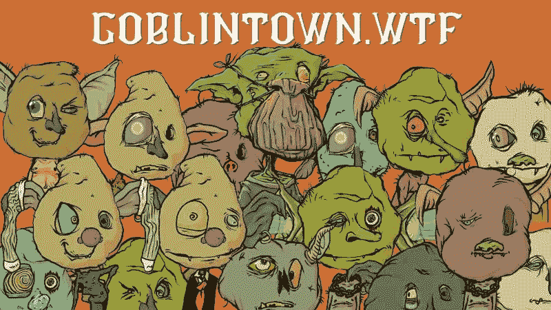
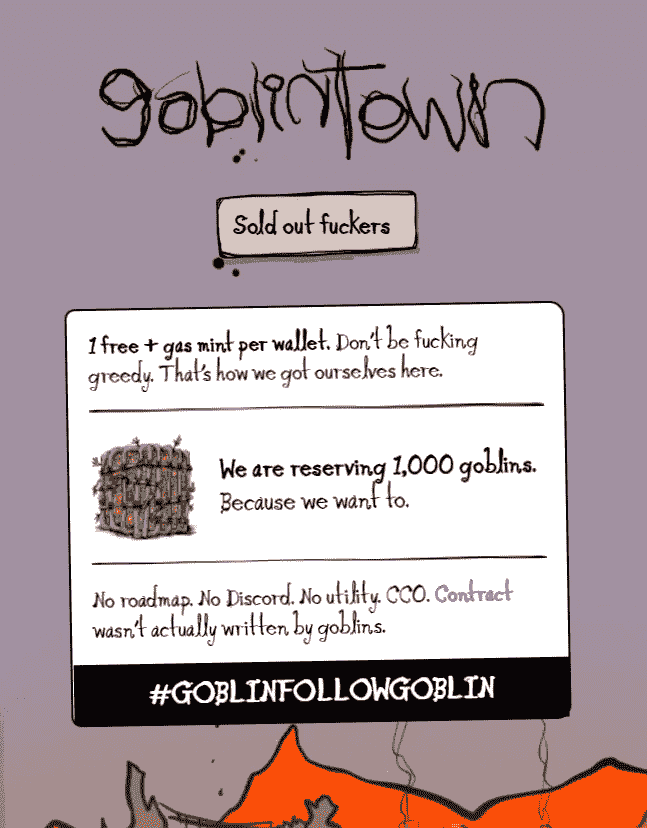
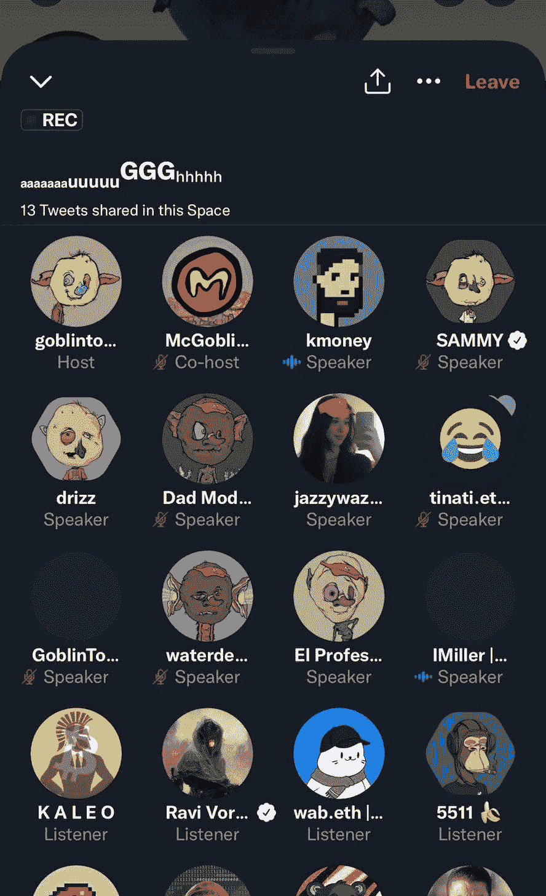
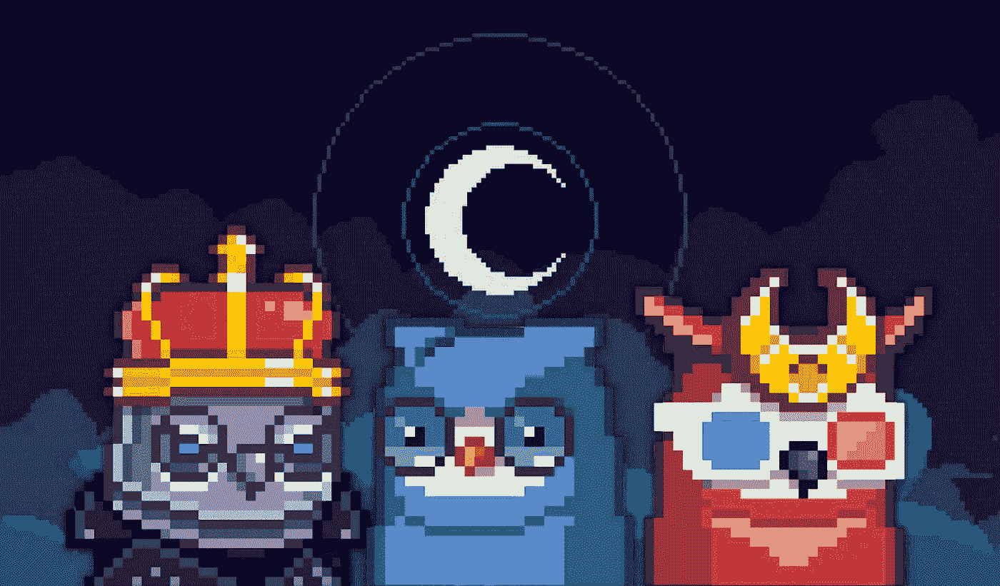

# 格林顿是 NFT 的项目，本不应该成功

> 原文：<https://medium.com/coinmonks/goblintown-is-the-nft-project-that-should-never-have-worked-38390756574c?source=collection_archive---------33----------------------->

GoblinTown came near the end of the NFT craze and still managed to whip up a storm.

想象一下。

2022 年 5 月，隐秘的冬季将全力吹起寒冷、苦涩和酸性的风。

每个人要么对熊市暴跌感到愤怒，要么完全放弃了整个秘密的东西。

硬币价格暴跌，加密游客迅速退出，监管机构开始审查，甚至像 BAYC 和 CryptoPunks 这样的 NFT 顶级项目也出现了最低价。

女士们先生们，来见见戈布林顿。

当其他人都在受苦的时候，GoblinTown 在第一个周末就卖出了 3800 个 ETH。

到目前为止，在仅仅 3 个月大的时候，它已经完成了 25，000 个 ETH 的总销售额，并且仍然是有史以来前 20 个 NFT。

它甚至击败了知名的 NFT，如 Pudgy Penguins 和 Cryptoadz。

这几乎是不可想象的。

Unapologetic and in-your-face, the creators of GoblinTown were master of copywriting, if anything.

“没有路线图，不打不相识。”该项目的网站上写道。“契约实际上不是妖精写的”。

现在再加上“没用”和“没道理”。

当它首次发布时，没有任何创始人的迹象，没有背后的团队，没有太多的目的，坦率地说，有“骗局”写满了它。

这正是加密/NFT 社区喜欢的，嗯？

想想吧。

格林顿非常适合 NFT 的文化基因。

GoblinTown 本身的意思是“熊市”，这是参考了霍比特人(1977)的热门歌曲“下降到地精镇”。

这件艺术品真的是垃圾，粗糙，非常丑陋和可怕。

有些妖精长得像皮克斯蒙·NFT 收藏翻牌中的“凯文”。

有些妖精甚至有露娜纹身！

Imagine hundreds of grown men tuning into a Twitter Space to hears grunts, snorts and giggles for nearly 3 hours!

他们甚至举办了一个 Twitter 空间会议，成年男子可以连续 3 个小时发出妖精的声音！

但我必须说，图形，网站和风格真的补充了叙事，团队在执行方面做了出色的工作。

那么谁是幕后黑手呢？

”在过去的一个月里，尽管密码市场陷入困境，Goblintown 还是抓住了 NFT 收藏家的想象力。现在这个项目背后的团队已经揭露了他们自己是**真相实验室**，他们以前的 NFT 收藏包括光明会集体和 187”

让我吃惊的是真正的执行。

Goblintown 是一个 cc0 项目，这意味着没有版权，任何拥有 NFT 的人都可以用它做任何他们想做的事情。

该团队释放了 9999 只完全免费铸造的妖精。

但是有一个问题。

此后，他们对每笔后续交易收取 7.5%的版税。

MoonBirds is another NFT collection that blew up but for reasons quite different than GoblinTown.

因此，当他们传播这个词和病毒，怪异和滑稽吞没了 NFT 社区和格林顿变得更受欢迎。

所有这些都鼓励了更多的销售和交易，为真理实验室赢得了利润。

它本质上让社区成为你的营销团队、分销网络和最佳大使。

这是一种新时代的商业模式，以前从来没有成功过。

我既敬畏又尴尬，因为我没有早点发现这一点。

要是有办法在像真理实验室这样的公司倒闭前进行种子投资就好了。

-

你听说过格林顿 NFT 吗？

-

# startups # business # startupx # growth # success # social media # culture # entrepreneur # strategy # eth #比特币#加密货币# bayc # NFT # goblin town # goblin # branding # truth labs # web 3

> 交易新手？试试[加密交易机器人](/coinmonks/crypto-trading-bot-c2ffce8acb2a)或者[复制交易](/coinmonks/top-10-crypto-copy-trading-platforms-for-beginners-d0c37c7d698c)