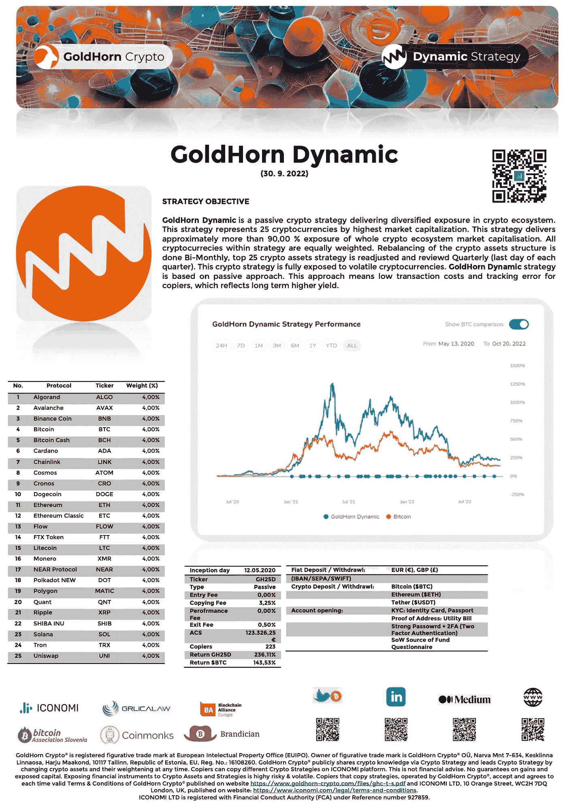

# 金角湾动态策略

> 原文：<https://medium.com/coinmonks/goldhorn-dynamic-strategy-906baf0bcbe4?source=collection_archive---------39----------------------->

密码正在发展成为一种新的资产类别。由于广泛和无限的报价，加密生态系统的投资者面临许多困难，他们中的许多人在不受监管的环境中工作。

开始投资于具有合规框架的监管环境是整个加密生态系统的重大突破。这一框架正由机构公司与各州监管机构携手构建。

因此 [GoldHorn Crypto](https://www.goldhorn-crypto.com/strategies/overview) 提供这种加密投资解决方案。对于进入加密生态系统并渴望了解更多的用户。GoldHorn Crypto 在 [ICONOMI](https://www.iconomi.com/register?ref=PcgeK) 平台上提供 8 种不同的加密策略(在英国伦敦 FCA 金融行为管理局注册)。

[GoldHorn Crypto](https://www.goldhorn-crypto.com/strategies/overview) 提供涵盖高市值代币的策略。如果一些投资者觉得 crypto 波动太大，这些策略会有不同程度的波动。其他加密策略是面向部门的:DeFi(分散金融)和 NFT(不可替代令牌)协议。

这一次[金角加密](https://www.goldhorn-crypto.com/strategies/overview)代表了最流行的策略[金角动态](https://www.goldhorn-crypto.com/strategies/goldhorn-dynamic)。请在下面查找带有描述和特征的数据表。

欢迎来到金角湾加密公司。

*   **金角加密**推特[推特](https://twitter.com/GoldHornCrypto)
*   **金角加密** [LinkedIn](https://www.linkedin.com/company/goldhorn-crypto/)
*   **金角密码**中等
*   **金角加密**是[区块链联盟欧洲](https://blockchainalliance.si/)的成员
*   **GoldHorn Crypto** 是斯洛文尼亚[比特币协会](https://bitcoin.si/)的成员
*   **金角密码** [www](https://www.goldhorn-crypto.com/strategies/overview)
*   **金角加密**电子邮件*support@goldhorn-crypto.com*

> 交易新手？试试[加密交易机器人](/coinmonks/crypto-trading-bot-c2ffce8acb2a)或者[复制交易](/coinmonks/top-10-crypto-copy-trading-platforms-for-beginners-d0c37c7d698c)