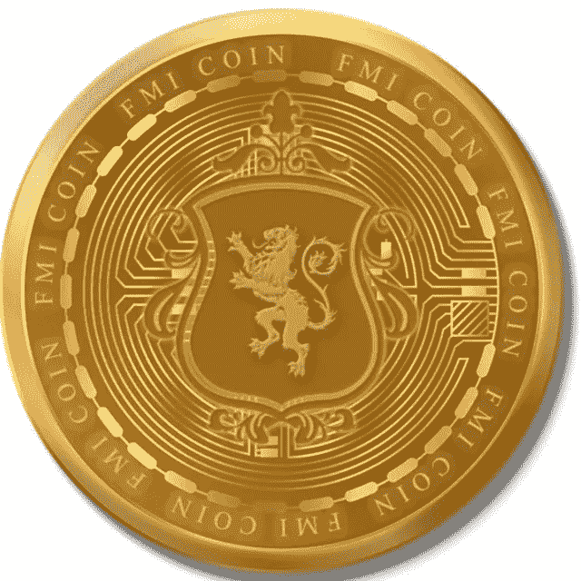

# 高盛推出面向机构客户的趋势工具 crypto explainer

> 原文：<https://medium.com/coinmonks/goldman-sachs-launches-crypto-explainer-trend-tool-for-institutional-clients-267bba209567?source=collection_archive---------25----------------------->

据周四发布的新闻稿称，拥有 153 年历史的华尔街投资银行高盛集团(Goldman Sachs Group Inc .)将推出一项服务，为寻求投资该资产类别的机构投资者解释、分类数字货币市场，并为其带来透明度。

# 快速事实

*   该工具名为 Datonomy，由高盛、金融服务公司 MSCI Inc .和加密情报公司 Coin Metrics Inc .合作开发。
*   Datonomy 根据硬币和代币的使用方式对它们进行分类，旨在为客户提供一种标准化的方法来分析更广泛的加密货币行业，包括分散金融(DeFi)和智能合约平台。
*   “我们坚信，一个一致和标准化的数字资产分类框架对于支持投资者评估市场的能力至关重要，”摩根士丹利资本国际(MSCI)衍生品许可和主题指数全球主管、董事总经理斯特凡·马塔蒂亚(Stéphane Mattatia)在一份声明中表示。
*   此举是机构采用区块链和加密货币的更广泛趋势的一部分。今年 3 月，在纽约加密投资公司银河数字控股公司的帮助下，高盛交易了比特币不可交割期权——一种以现金结算的比特币衍生品——成为[第一家进行场外加密货币交易的美国主要银行](https://forkast.news/headlines/goldman-sachs-execute-otc-bitcoin-trade/)。
*   今年 3 月，该银行达到了另一个里程碑，它提供了第一笔比特币支持的贷款，加入了 Silvergate Capital Corp .等加密友好型银行的行列。
*   今年 8 月，全球最大的[资产管理公司贝莱德(black rock Inc .)](https://forkast.news/blackrock-backflips-bitcoin-latest-institution-crypto/)宣布，将为美国的机构客户推出一款比特币信托，称尽管加密市场整体低迷，但机构客户对此兴趣浓厚。

来源:forkast

还看了关于新币: [*FMI 币*](http://www.fmicoins.com/)

[FMI](http://www.fmicoins.com/) 是建立在币安智能链上的数字货币。FMI 是为公司 FMI 网络而构建的。更具体地说，它包括自己的产品，如投资不同类型的项目，创造新的项目等。FMI COIN (FMI)是一种加密货币，部署在币安智能链(BSC BEP-20)上

合同:[0x9d 427 e 2 Fe 3a D2 CB 93 f 83118d 472 a 6068 b4a 778d 6](https://bscscan.com/token/0x9d427E2fe3ad2Cb93F83118d472A6068B4a778D6)

你可以在 [Pancakeswap](https://pancakeswap.finance/) 或者 [Bitkeep App](https://bitkeep.com/download) 上购买 FMI 币。
你可以通过这个来了解详细情况👇

[https://FMI coins . medium . com/how-to-create-FMI-wallet-on-bit keep-app-e 44 a2 a 998 e6a](https://fmicoins.medium.com/how-to-create-fmi-wallet-on-bitkeep-app-e44a2a998e6a)

看看我们的[网站](http://www.fmicoins.com/):[https://fmicoins.com/](https://fmicoins.com/)

给我们接通[电报](https://t.me/fmicommunityofficial):[https://t.me/fmicommunityofficial](https://t.me/fmicommunityofficial)

> 交易新手？尝试[加密交易机器人](/coinmonks/crypto-trading-bot-c2ffce8acb2a)或[复制交易](/coinmonks/top-10-crypto-copy-trading-platforms-for-beginners-d0c37c7d698c)