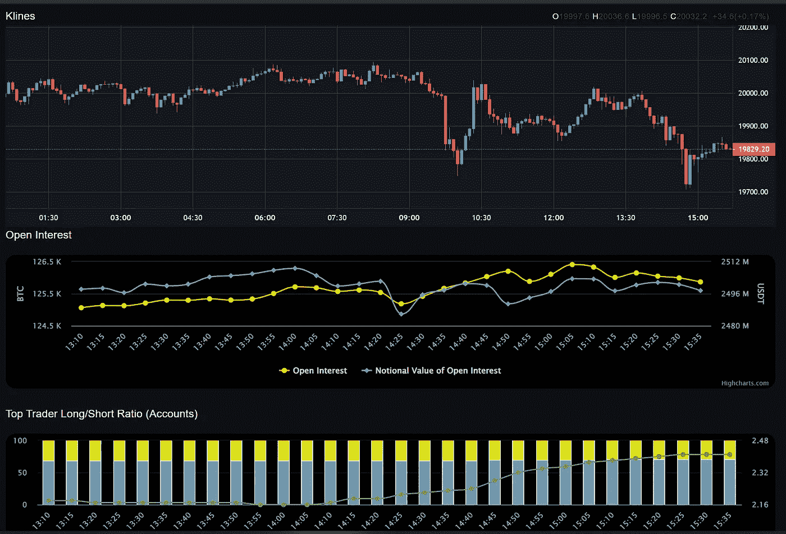

# 好数据，坏数据

> 原文：<https://medium.com/coinmonks/good-data-bad-data-fcee244a6b4b?source=collection_archive---------31----------------------->

## 2018 年 9 月全球市场分析

提醒#1，我们仍然处于#US10Y 和#US02Y 债券的#收益率#倒挂状态，这不会很快改变。

[https://www.tradingview.com/x/UweZFYmE/](https://www.tradingview.com/x/UweZFYmE/)

我仍然猜测 1%的加息(100 个基点)，但也可能是 0.75%，谁知道呢。很可能是这个数字，或者更大，因为我打赌美联储会想要更多的喘息空间。在某个时候，我会写一些关于通货膨胀和人们是如何误解它的，但现在不是时候。

不要忘记，你仍然有糟糕的影响者整天试图获得关注，告诉你我们还没有触底，因为他没有告诉人们如何销售。

there’s literally no reason to read this, I watched 2 minutes to save you all the views

@ cz _ 币安当然立即回答了一个重要的加密问题，在这一点上他没有错。他说最大的问题是加密钱包很糟糕。但是并没有真正存在的改进，因为这不是人们考虑的领域。

区块链矿商准备跟随市场。是的，不是领导，而是跟随。总的来说，这意味着更多的下降。

[https://www.tradingview.com/x/saStB7Jt/](https://www.tradingview.com/x/saStB7Jt/)

再说一遍，我的意思是向下。

[https://imgur.com/a/PUNF5zO](https://imgur.com/a/PUNF5zO)

因此，密码和股票明天下跌似乎是最有可能的，即使是短期的。话不多说。

> 交易新手？试试[密码交易机器人](/coinmonks/crypto-trading-bot-c2ffce8acb2a)或者[复制交易](/coinmonks/top-10-crypto-copy-trading-platforms-for-beginners-d0c37c7d698c)